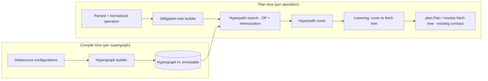

# Design: Federation Query Planner v2 -- Hypergraph-Based, Formally Specified

**Date:** 2026-07-13
**Status:** Approved (interactive brainstorm); pending adversarial review
**Branch:** `feat/planner-v2-hypergraph`

## 1. Problem & Motivation

The current federation query planner (`v2/pkg/engine/plan/`, ~24k lines, 39 files) is a
multi-pass visitor pipeline (collect nodes -> filter datasources -> node selection ->
abstract rewriting -> path building -> fetch configuration). Its correctness is
*emergent from pass ordering* rather than derived from a model. Symptoms:

- Federation-audit fixes land as special-case passes with hand-tuned gates
  (e.g. partial-union pruning gated on "members are not entities"; per-member field
  aliasing for child type mismatches), and a fix in one pass can regress an unrelated
  suite -- only catchable by full-audit diffing.
- No definition of what a *correct* plan is, so no way to test against the definition.
- No definition of what an *optimal* plan is, so plan quality is accidental.

Prior art converged on a different shape: Apollo Federation v2 and Hive Router (Rust)
model the supergraph as a graph in which planning = minimal-cost walk finding.
Behaviors we bolt on (partial unions) fall out of that model naturally.

## 2. Goals & Non-Goals

**Goals**
1. **Correct by construction**: a formal specification (definitions, invariants,
   cost semantics) that the implementation mirrors 1:1; property-based and
   differential tests enforce the correspondence; TLA+/Alloy model-checks the core
   search; a Lean formalization of the algorithmic kernel lands last.
2. **Optimal w.r.t. an explicit cost model** (the database-optimizer discipline):
   the emitted plan provably minimizes a defined cost function over all valid plans;
   brute-force enumeration cross-checks this on small instances.
3. **Performant on all four axes**: planning speed, plan quality (fewer/better
   fetches), memory, and predictability (polynomial worst case, empirically
   near-linear in operation size; no exponential cliffs on abstract-type nesting).
4. **Less brittle**: new federation behaviors are model extensions (new edge kinds /
   cost terms), not new passes.
5. **Educational**: every mathematical/CS term defined in a glossary with
   plain-English explanations and examples; docs in Markdown + Mermaid +
   GitHub-native LaTeX math (`$...$` / `$$...$$`). No LaTeX toolchain.

**Non-Goals**
- Replacing the resolver/execution engine (same output contract).
- Replacing the current planner immediately (it remains default; v2 is opt-in).
- Machine-checking the entire Go codebase (Lean covers the algorithmic kernel only).
- Row-cardinality-based cost estimation (v1 cost model is structural; the DB
  literature's lesson is that cardinality estimation is the main source of optimizer
  error, so we do not depend on it).

## 3. Decisions (from brainstorm)

| Decision | Choice |
|---|---|
| Formal rigor | All layers, staged: formal spec + property/differential tests (foundation, gates every merge) -> TLA+/Alloy model checking of core search (before Go implementation) -> Lean machine-checked kernel (final milestone, never blocks shipping) |
| Boundary | Same output contract: new package `v2/pkg/engine/planv2`, same inputs (parsed operation + datasource configurations) and outputs (`plan.Plan` / fetch tree) as `plan`; resolver, datasources, Cosmo unchanged; opt-in behind config |
| Feature staging | Core federation first (queries/mutations, GraphQL subgraphs, full directive set); subscriptions/@defer/non-GraphQL datasources later |
| Performance bar | All four: speed, plan quality, memory, predictability |
| Customer schemas | External env-var-gated harness ONLY (`PLANNER_V2_EXTERNAL_CORPUS` pointing at a local directory); skipped when unset; nothing derived from customer schemas is ever committed to this repository |
| Architecture | Weighted directed hypergraph + cost-based search (shortest B-hyperpath dynamic programming) |
| Execution | Subagent-driven development (parallel research agents; implementer/reviewer subagents per task); TDD throughout |

## 4. Milestones

**M0 -- Research & Formal Foundations** (no planner code)
Deep research (Apollo QP v2, Hive Router, Grafbase, System R/Selinger DP,
Volcano/Cascades, Gallo et al. 1993 hyperpaths, Ausiello et al.), then write
`v2/docs/planner-v2/`: `RESEARCH.md`, `FORMAL_SPEC.md`, `GLOSSARY.md`, `PROOFS.md`,
plus a TLA+ (or Alloy) model of the core search with checked invariants.

**M1 -- Core planner** (`v2/pkg/engine/planv2`)
Queries/mutations over GraphQL subgraphs; full federation directive set
(@key/@requires/@provides/@shareable/@external/@interfaceObject, unions/interfaces).
Correctness bar: **199/199** Guild federation gateway audit; differential parity vs
old planner on the existing plan-test corpus (where old planner is *wrong* --
the 12 known-failing audit cases -- v2 must be right, divergence documented);
property-based tests generated from the formal spec.

**M2 -- Performance & hardening**
Benchmark corpus = audit + synthetic generators + external harness. Bars: faster
planning than `plan` on the corpus; fetch count <= old planner on every corpus query;
lower allocations; published near-linear scaling curve.

**M3 -- Feature completion**
Subscriptions, @defer, non-GraphQL datasources (gRPC/ConnectRPC), cost/complexity
analysis -- each lands as a conservative extension of the formal model (spec first,
then code).

**M4 -- Machine-checked kernel (Lean)**
Formalize the kernel (hypergraph, walk validity, cover completeness, DP optimality)
and machine-check the M0 paper proofs.

## 5. Formal Model (summary; full treatment in `FORMAL_SPEC.md`)

**Compilation** (once per supergraph change) of datasource configurations into a
weighted directed hypergraph $H = (V, E)$:

- **Nodes** $V$: pairs $(T, s)$ -- type $T$ as seen by subgraph $s$ -- plus a synthetic
  root per operation type. One GraphQL type yields one node per subgraph that knows it.
- **Simple edges** (one tail -> one head):
  - *Field traversal*: $(T, s) \xrightarrow{f} (U, s)$ when subgraph $s$ can resolve
    field $f: T \to U$. `@provides` folds in as extra provided-field edges scoped to
    the providing traversal.
  - *Type moves*: abstract->concrete transitions for unions/interfaces, labeled with
    the member set **that subgraph knows** (partial-union correctness is a property of
    the model, not a bolted-on pass).
- **Hyperedges** (many tails -> one head): *entity jumps*
  $\{(T,s_1).k_1, \dots, (T,s_1).k_n\} \Rightarrow (T, s_2)$ -- traversable only when
  **all** fields of some key $K$ (plus any `@requires` selection) are already
  resolved. The AND-of-prerequisites is what makes $H$ a hypergraph and is exactly
  what plain-digraph planners special-case.
- **Weights**: cost vector per edge -- new-fetch cost (dominant), same-fetch field
  cost (small), sequential-depth penalty -- combined per the explicit cost model.

**Planning** (per operation): the client query is a tree of *resolution obligations*;
a plan is a **hyperpath cover** -- for every obligation, a valid walk from the root
through $H$ resolving it, hyperedge traversal requiring its tail obligations to be
scheduled first. The cover is then *lowered* to the existing fetch-tree contract.

**Invariants** (each gets a paper proof in `PROOFS.md`, model-checked where bounded,
property-tested always):
- **I1 Soundness**: every walk step corresponds to a field the target subgraph
  resolves -> generated subgraph queries always validate against subgraph schemas.
- **I2 Completeness**: if any valid cover exists, the search finds one.
- **I3 Optimality**: the returned cover minimizes total cost over all valid covers
  (cross-checked by brute-force enumeration on small instances).
- **I4 Response-shape preservation**: lowering preserves the client selection tree
  exactly (field aliasing for cross-subgraph type conflicts becomes a lemma).

**Search**: dynamic programming over $H$ (shortest B-hyperpath, Gallo et al.),
memoized per (node, obligation): polynomial in $|V| \cdot |Q|$. Where fetch-merging
makes costs non-additive, branch-and-bound with an admissible lower bound keeps the
search exact; any heuristic fallback must carry a proven suboptimality bound and is
off by default.

## 6. Architecture

Packages (all under `v2/pkg/engine/planv2/`):
- `hypergraph/` -- graph representation + builder from `plan.DataSourceConfiguration`.
  Immutable after build; safe for concurrent planning.
- `obligation/` -- operation -> obligation tree (uses existing `ast`/`astvisitor`).
- `search/` -- the DP/B-hyperpath search. **This is the algorithmic kernel** that the
  TLA+ model and Lean formalization cover. Pure functions, no I/O, no AST types --
  operates only on hypergraph + obligation IDs so it is small and provable.
- `lower/` -- cover -> existing plan output; owns aliasing, fetch merging, input
  templates (representations), response-shape mapping.
- `planv2.go` -- facade implementing the same entry-point shape as `plan.Planner`.

Unit boundaries chosen so each is independently testable and the provable core
(`search/`) is isolated from GraphQL plumbing.

## 7. Testing Strategy (TDD)

1. **Spec-first tests**: each invariant I1-I4 becomes a property-based test
   (rapid/gopter) over generated supergraphs + operations.
2. **Audit suite**: the-guild-org/graphql-federation-gateway-audit as an in-repo
   plan-level corpus (schemas + operations + expected responses), plus end-to-end
   gated runs against a real router build. Bar: 199/199.
   *(Scope reconciliation: M1 asserts 199/199 at PLAN level; router-level end-to-end runs are
   the M1.5 harness -- see the M1 plan, Task 11.)*
3. **Differential tests**: same (schema, operation) through `plan` and `planv2`;
   compare plan shape/fetch count/response via the existing datasource test harness.
   Documented-divergence list for cases where the old planner is wrong.
4. **Optimality cross-check**: brute-force enumerator for small instances asserts
   the DP result is minimal (I3).
5. **External harness**: env-var-gated (`PLANNER_V2_EXTERNAL_CORPUS`) differential +
   benchmark runs against private schema corpora; skipped when unset; CI-safe.
6. **Model checking**: TLA+/Alloy spec of `search/` invariants on bounded instances,
   run in CI (bounded, fast configuration) and deeply on demand.
7. **Benchmarks**: `testing.B` corpus with fixed baselines; regression gate in CI.

## 8. Error Handling

- Planning failures are typed: `ErrNoValidPlan{Obligation, Reason}` distinguishes
  "schema cannot satisfy query" (completeness says: provably impossible, with the
  unsatisfiable obligation named) from internal invariant violations (bugs), which
  panic in tests and return wrapped errors in production.
- Search resource guard: a hard cap on explored states (defense in depth; the
  polynomial bound should make it unreachable) returns a typed error, never hangs.

## 9. Documentation

All in `v2/docs/planner-v2/`, Markdown + Mermaid + GitHub-native math:
- `RESEARCH.md` -- prior-art survey with citations; what each system gets right/wrong.
- `FORMAL_SPEC.md` -- the model: definitions, notation, cost model, invariants,
  worked examples (the audit's partial-union case as the running example).
- `GLOSSARY.md` -- every term (hypergraph, B-hyperpath, DP, admissible heuristic,
  fixpoint, partial order, ...): plain-English definition + tiny example + why it
  matters here. Written for learning, not just reference.
- `PROOFS.md` -- paper proofs of I1-I4 and the complexity bound.
- `tla/` -- the TLA+/Alloy model + how to run it.
- `ARCHITECTURE.md` -- package map, data flow, how spec sections map to Go files.

## 10. Risks & Mitigations

- **Model doesn't capture some federation corner** (e.g. @interfaceObject nuances):
  audit suite + differential tests surface it early; the fix is a spec change first,
  reviewed against invariants, then code.
- **DP state space blowup on huge schemas**: memoization keyed to reachable
  (node, obligation) pairs only; benchmark gate on a deliberately huge synthetic
  schema; hard state cap as backstop.
- **Lowering complexity** (fetch merging, representations) becomes a second planner:
  keep lowering rule-based and covered by I4 property tests; fetch merging expressed
  in the cost model so the search, not the lowering, makes merge decisions.
- **Scope creep in M1**: anything not exercised by the audit or existing plan tests
  is out of M1 by definition.
