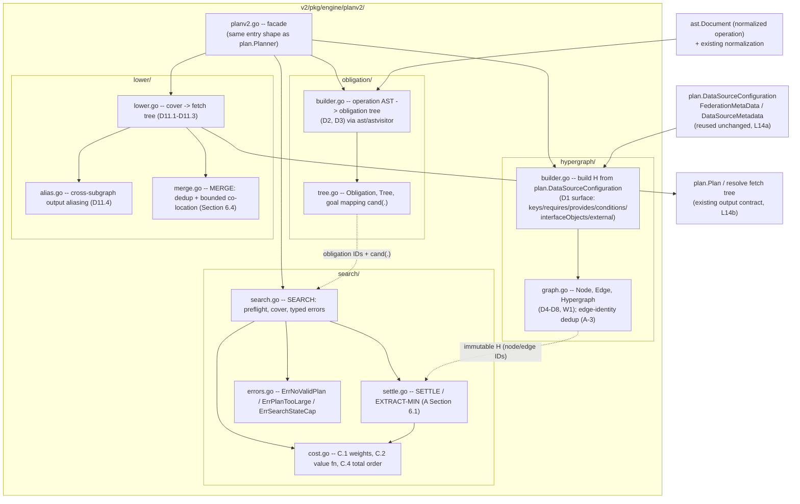
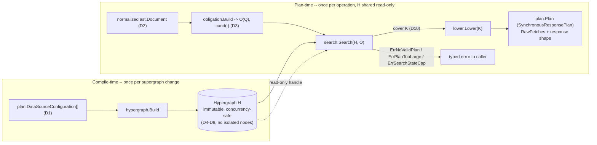
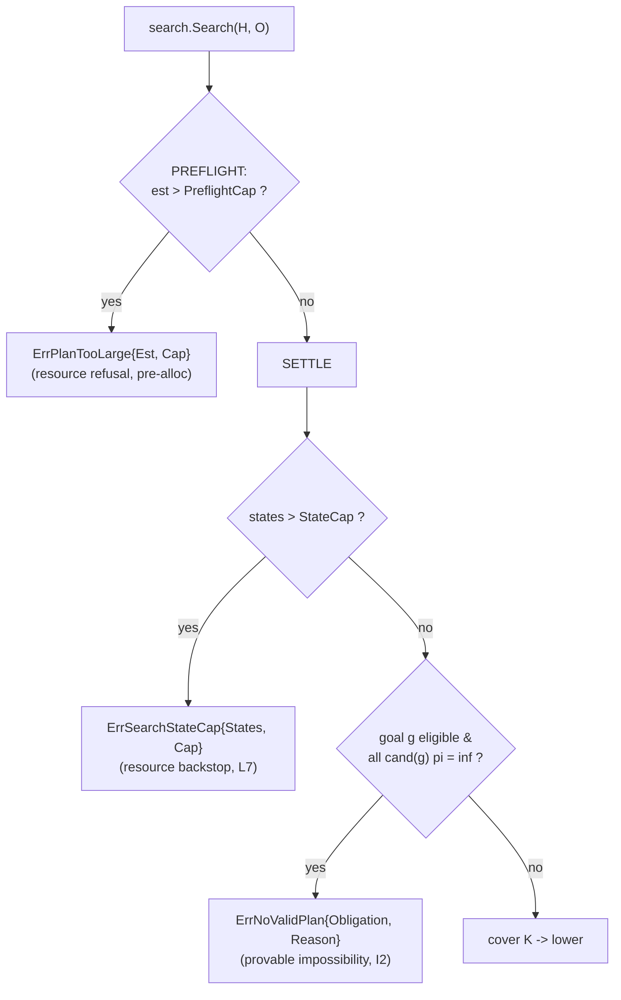

# Architecture -- Federation Query Planner v2 (`planv2`)

**Status:** M0 task 7. This document is the bridge between the formal model
(`FORMAL_SPEC.md`, `PROOFS.md`, `tla/`) and the Go implementation delivered in M1. It fixes
the package layout of `v2/pkg/engine/planv2/`, the data flow, the concurrency model, the error
taxonomy, and -- in the conformance table -- the exact correspondence *Go file <-> spec definition
<-> proof theorem <-> TLA+ name* that every M1 task must preserve. **Branch:**
`feat/planner-v2-hypergraph`.

Terminology follows `GLOSSARY.md`; the first use of a glossary term is in *bold*. This document
adds no new glossary entries (the `docscheck` bold-term test scans `FORMAL_SPEC.md`, `PROOFS.md`,
and `RESEARCH.md` only -- see `v2/internal/docscheck/docscheck_test.go` -- so the convention here is
for reader consistency, not a checked obligation).

The per-directive normative semantics of federation *query planning* -- what a correct plan is,
construct by construct, with three-way authority classification -- live in `FEDERATION_SEMANTICS.md`
(propositions `FS-*`).

> **Reading order.** Section 1 states the design invariant (why the packages are split the way they are);
> Section 2 is the package map; Section 3 the compile-time/plan-time data flow; Section 4 the search-kernel purity rule;
> Section 5 concurrency; Section 6 the error taxonomy; Section 7 the conformance table (the normative artifact -- every
> spec item mapped to a file); Section 8 how the layers are tested; Section 9 what M1 does and does not deliver.

---

## 1. The one design invariant

The planner is split into four packages plus a facade so that the **provable kernel** -- the
Shortest B-Tree search of algorithm `A` -- is physically isolated from every GraphQL-specific
concern. This is not stylistic: the `TLA+` model (`tla/PlannerSearch.tla`) and the future Lean
formalization bind to `search/` *only*, and they can bind to it only because `search/` never
imports `ast`, `plan`, or any datasource type. Everything the search reasons about is reduced to
integer node/edge identifiers over an immutable **hypergraph** and an **obligation tree** before
the search runs, and nothing GraphQL-shaped is reconstructed until *after* it returns a cover.

```
        GraphQL plumbing            provable kernel            GraphQL plumbing
   +-----------------------+   +--------------------+   +-----------------------+
   | hypergraph/ obligation/| -> |       search/      | -> |        lower/          |
   |  (build IDs from AST/  |   |  (pure: IDs only,  |   |  (IDs back to fetch    |
   |   datasource config)   |   |   no AST, no I/O)  |   |   tree + response)     |
   +-----------------------+   +--------------------+   +-----------------------+
```

If a change would make `search/` need an `ast` or `plan` type, the change is modelled wrong: the
missing information belongs in a node label, an edge weight, or the obligation tree, computed at
build/obligation time -- never read live inside the search. This invariant is what keeps the
optimality proof (`PROOFS.md` T3) about the code that actually runs.

---

## 2. Package map

All packages live under `v2/pkg/engine/planv2/`.



**Dependency direction.** `hypergraph/` and `obligation/` depend on `plan`/`ast`; `search/`
depends on *neither* (it imports only its own `cost.go`/`errors.go` and the identifier types
re-exported by `hypergraph/`+`obligation/` as plain integers/structs with no AST content);
`lower/` depends on `plan`/`ast`/`resolve` and on the cover type returned by `search/`. The facade
wires them. There is no cycle, and `search/` sits at the sink of the acyclic import graph on the
kernel side.

| Package | Responsibility | Spec items | May import |
|---|---|---|---|
| `hypergraph/` | Compile the `D1` supergraph config into the immutable weighted `H`; edge taxonomy + identity dedup | `D4`-`D8`, `W1`, `A-3` | `plan`, `ast` |
| `obligation/` | Re-express the normalized operation as the `D3` obligation tree with goal mapping `cand(.)` | `D2`, `D3` | `plan`, `ast`, `astvisitor` |
| `search/` | The kernel: `SETTLE`/`EXTRACT-MIN`, `PREFLIGHT`, cover assembly, typed errors -- **pure, IDs only** | `C.1`-`C.4`, `A` (Section 6.1-6.3), `W1`/`W2`, `I1`-`I3` | `hypergraph`, `obligation` (ID/label types only; kernel-internal otherwise) |
| `lower/` | Cover -> fetch tree, representations, `D11` aliasing, `MERGE` dedup + co-location, `D11.5` transport attach | `D9`-`D11`, `Section 6.4`, `I4` | `plan`, `ast`, `resolve` |
| `planv2.go` + `transport.go` | Facade with the same entry shape as `plan.Planner`; derives the transport table | -- | all of the above, `graphql_datasource` |

**Transport lowering (`D11.5`, M1.5).** A shape-correct fetch tree is not yet *executable*: the resolve
loader needs a `FetchConfiguration.DataSource` (the HTTP `resolve.DataSource`) and an `Input` envelope
carrying `url`/`method`/`header`, which v1 obtains inside the datasource planner's `ConfigureFetch`.
planv2 does not run that planner, and `plan.Configuration` is consumed by `hypergraph.Build` and not
otherwise retained -- so the facade derives a **per-subgraph transport table** at `NewPlanner`
(`planv2/transport.go`): for each graphql datasource it reads the fetch `URL`/`Method`/`Header` off the
exported `graphql_datasource.Configuration.FetchConfiguration()` accessor and builds the subgraph's
`resolve.DataSource` through the sanctioned `graphql_datasource.NewSource` constructor (no HTTP client
reimplemented). `lower` threads this table (`lower.TransportTable`, keyed by subgraph name ==
`DataSourceIdentifier`) into `buildFetches` and attaches it on **every** fetch -- root and entity --
setting `DataSource` and splicing the wire fields as leading top-level keys of the `Input` (the entity
envelope's `$$0$$` representations template is not valid JSON, so a string splice, not a JSON setter,
preserves it byte-for-byte). The table is OPTIONAL: `lower.Lower` (nil table) stays transport-free and
byte-identical, so the plan-level audit/differential harnesses are unaffected; `lower.LowerExecutable`
(the planv2.Plan entrypoint) attaches transport. The datasource's configured `http.Client` lives in the
`graphql_datasource` Factory, unreachable from the `plan.DataSource` interface without editing the v1
`plan` package (out of scope), so Sources are built on `http.DefaultClient` -- behaviorally exact for
localhost subgraphs; threading a configured client is an M2 follow-up.

---

## 3. Data flow: compile-time vs plan-time

The model's central efficiency claim -- one hypergraph compilation amortized over all operations --
is realized as a hard split between work done **once per supergraph** and work done **per
operation**.



- **Compile-time** (`hypergraph.Build`): reads every subgraph's `RootNodes`/`ChildNodes`, `Keys`,
  `Requires`, `Provides`, `Conditions`, `EntityInterfaces`, `InterfaceObjects`, and per-subgraph
  abstract-member sets `Mem_s(U)` (from `UpstreamSchema()`), emits `D4` nodes and `D5`-`D8` edges,
  **deduplicates edges by identity tuple** (`A-3`), and prunes isolated nodes (so `|V| =
  O(size(H))`, `PROOFS.md` T5/G2). The result `H` is frozen. No operation is involved.
- **Plan-time** (`search.Search` composed with `lower.Lower`): the only per-operation work. `H` is
  passed as a read-only handle; the search allocates its own `pi`/`back` tables (Section 5). The obligation
  tree and cover are per-operation and discarded after lowering.

The AST is consumed exactly twice -- in `obligation.Build` (to produce goal IDs) and in
`lower.Lower` (to reproduce the response shape). It is never touched inside `search/`.

---

## 4. The search-kernel purity rule (normative)

`search/` is the artifact the proofs and the model checker are *about*, so it carries a hard
constraint that M1 review enforces on every task touching it:

1. **No GraphQL types.** `search/` imports neither `ast`, `astvisitor`, `plan`, `resolve`, nor any
   datasource package. Its inputs are the `hypergraph.Hypergraph` (node/edge IDs, weights, tail
   sets) and the `obligation.Tree` (obligation IDs, `cand(g)` as candidate node-ID sets). Its
   output is a `search.Cover` (an edge-ID set + per-goal selected candidate) or a typed error.
2. **Pure and deterministic.** No I/O, no clock, no goroutines, no global state, no map-iteration
   order dependence. Given `(H, O, (+), weights)` it returns byte-identical results every call -- the
   determinism the `C.4` total order guarantees (`PROOFS.md` L5) and the permutation harness tests.
3. **The queue key is `f(e)`.** `EXTRACT-MIN` orders ready edges by the tentative head value
   `f(e) = w(e) + (+)_{t in T(e)} pi[t]` (`C.4` step 1, assumption `A-2`), *not* by `w(e)`, minimum tail
   `pi`, or the head's current `pi`. This is the single most implementation-sensitive line in the
   whole design (`PROOFS.md` T3.1, gap G1): any other key silently loses optimality. It is called
   out in the M1 plan as its own failing-test-first obligation.
4. **Overflow-safe counters from day one.** `states`, `need[e]`, and cost accumulators use
   overflow-safe representations (lesson L7).

Because the kernel speaks only in IDs, one `SETTLE` run settles `pi` for *all* nodes and serves
*every* obligation (the `(node, obligation)` memo product collapses to per-node state, since `D7`
conditions are static -- `FORMAL_SPEC.md` Section 6). Traceback folds shared sub-hyperpaths once via a
shared `visited` set (`W2`).

---

## 5. Concurrency

Two objects, two lifetimes, one rule each:

- **Hypergraph `H` -- immutable after `Build`, shared, read-only.** Once `hypergraph.Build` returns,
  no field of `H` is mutated. Any number of goroutines may plan concurrently against the same `H`
  with no locking, because the search never writes to it. This is the concurrency dividend of the
  compile-time/plan-time split (Section 3): the expensive shared structure is frozen, so it needs no
  synchronization. Builder-side construction is single-threaded (or, if parallelized per subgraph,
  each worker returns its own partial result and a single-threaded merge assembles `H` -- the L14d
  "don't mutate shared state mid-walk, structurally" rule); the freeze happens before any planner
  sees `H`.
- **Search state -- per-plan, never shared.** `search.Search` allocates fresh `pi`, `back`, `need`,
  the ready priority queue, `visited`, and the `states` counter per call. None of it escapes the
  call. There is no cross-operation cache in M1 (the model's efficiency comes from `H` reuse, not
  from memoizing operations). Two concurrent plans share `H` (read) and share nothing else.

The facade holds `H` and the immutable configuration; `Planner.Plan` is safe for concurrent use to
the same degree `plan.Planner` is, and the immutability of `H` makes that a structural fact rather
than a documented promise.

---

## 6. Error taxonomy

All planning failures are typed (`search/errors.go`), per `FORMAL_SPEC.md` Section 6.3. There are exactly
three, and they are *distinct*: two are resource refusals, one is a genuine impossibility
diagnosis. None is a silent non-optimal fallback (lesson L7).



| Error | When | Meaning | Spec / proof |
|---|---|---|---|
| `ErrPlanTooLarge{Est, Cap}` | `PREFLIGHT` structural bound exceeds `PreflightCap`, before any allocation | Operation too large to plan; a typed refusal, not "impossible" | Section 6.3 pre-flight (L19); `PROOFS.md` A-5 / gap G5 |
| `ErrSearchStateCap{States, Cap}` | `states` counter exceeds `StateCap` during `SETTLE` | In-search backstop; the polynomial bound (Section 6.2) should make this unreachable -- tripping it is a metric/bug, never a degraded plan | Section 6.3 in-search (L7); `PROOFS.md` T5 |
| `ErrNoValidPlan{Obligation, Reason}` | Some eligible goal has *every* candidate at `pi = inf` after a completed `SETTLE` | No valid cover exists; names the specific unsatisfiable obligation (requirement cycles surface here too, no cycle checker) | `I2`; `FORMAL_SPEC.md` `D7` Section 6.3; `PROOFS.md` T2, L3.1 |

`ErrNoValidPlan` is the only one that asserts "the schema cannot satisfy this query." The two
resource guards are why `I2`/T2 are proved *modulo* assumption `A-5`: on a plannable input the
planner may still return a typed resource refusal by design -- but never `ErrNoValidPlan`, and never
a silent give-up. Internal invariant violations (bugs -- e.g. a settled node with no back-edge) are
a separate class: they `panic` in tests and return a wrapped internal error in production (design
Section 8).

---

## 7. Conformance table

This extends `FORMAL_SPEC.md` Section 8 with concrete Go file paths and the `PROOFS.md` / `TLA+`
anchors. It is the normative map: every M1 task cites the row(s) it implements, and the row's
proof/TLA columns name the obligations that task's tests must discharge. Paths are relative to
`v2/pkg/engine/planv2/` unless noted.

This table is also the **single home for the spec cross-references**. The code comments are written
in plain English for a maintainer who has not read the spec, and carry at most one `Spec:` pointer
per file; the fine-grained `Dn`/`Ln`/`Tn`/`Section ` correspondence lives here, not inline. To go from a
piece of code to its formal definition, find its file in the Go-file column below.

| Spec item | Go file | PROOFS theorem/lemma | TLA+ name |
|---|---|---|---|
| `D1` supergraph config | *(reuse)* `plan.DataSourceConfiguration`, `FederationMetaData`, `DataSourceMetadata` | A-0 (finiteness) | -- |
| `D2` normalized operation | *(reuse)* `ast` + existing normalization | -- | -- |
| `D3` obligation tree, `cand(.)` | `obligation/tree.go`, `obligation/builder.go` | (goal set `G(O)`, T2 def.) | -- |
| `D4` nodes (two sorts + roots) | `hypergraph/graph.go` | L2(1) taxonomy invariant | `Nodes`, `Roots` (`PlannerSearch.tla`) |
| `D5` field/descent edges | `hypergraph/builder.go` | L2(1) | `Edges` (kind `Field`/`Descent`) |
| `D6` type-move edges | `hypergraph/builder.go` | T1(4) | -- (not modelled) |
| `D6` member-narrowing rule | `obligation/narrow.go` (`Exempt`/`ClassifyNarrowing`); consumed by `search/search.go`'s goal loop | T1(4), T2 exemption def. | -- (not modelled) |
| `D7` entity-jump B-hyperedges | `hypergraph/builder.go` | L2(1), L3.1 (cycles) | `Edges` (multi-tail) |
| `D8` provided-field scoping | `hypergraph/builder.go` | L6 monotone extension | -- (not modelled) |
| Edge identity + dedup | `hypergraph/graph.go` | A-3, L5 (gap G6) | -- |
| `W1` single-head | `hypergraph/graph.go` (type forbids multi-head) | L1, T5 (polynomiality) | (structural: `head` is one node) |
| `W2` folded accounting | `search/search.go` (`FOLD`/`visited`) | L4, P1 | -- (no traceback in model) |
| `C.1` edge weights | `search/cost.go` | A-1 (non-neg) | `Weight` |
| `C.2` value function `(+)` | `search/cost.go` | L1 (superior), T3.1 | `TentF`, `COMBINE` |
| `C.3` folded plan cost `C(K)` | `search/cost.go` (`CoverCost`) | P1 (folded <= tree) | -- |
| `C.4` total order / tie-break | `search/cost.go` (`Less`) | L5 (totality -> determinism) | tie-break left to TLC |
| `A` `PREFLIGHT` | `search/search.go` | T2 (A-5), T5 | -- (no cap in model) |
| `A` `SETTLE`/`EXTRACT-MIN` | `search/settle.go` | L2, L3, T3.1 | `Settle` action; `SoundnessInv`, `OptimalityInv` |
| `A` `SEARCH`/cover/traceback | `search/search.go` | L4, T1, T2, T3.2 | `EventuallyPlans` (liveness) |
| Section 6.3 typed errors | `search/errors.go` | T2, T5 | -- |
| `D7` conditioned-edge applicability (search-time edge mask) | `search/search.go` (`disabledConditionEdges`), `search/settle.go` (`settleMasked`) | I1 (soundness preserved) | -- (mask is search-time, not modelled) |
| `D9` walk validity | `search/settle.go` (Horn/forward-chain) | L3, L4 | `SoundnessInv` |
| `D10` hyperpath cover | `search/search.go` (`Cover` type) | T1(2), T2 | `Goals  subseteq  settled` |
| `D10` path-consistency: own-root pinning | `search/search.go` (`buildRootTables`, per-goal fallback) | T1/T2 (route validity; completeness-preserving) | -- |
| `D10` path-consistency: per-field scoped walks `kappa(g)` | `search/scope.go` (`scopedWalks`, `scopeMask`, `chainCoords`) | L4 (folded routes), T4 (lowering input) | -- |
| `D11.1-.3` lowering -> fetch tree | `lower/lower.go` | T4 (A-6) | -- |
| `D11.4` cross-subgraph aliasing | `lower/alias.go` | T4 aliasing lemma | -- |
| `D6pp` position-possible member sets (dead/distributed member verdicts) | `obligation/narrow.go` (`ClassifyNarrowing`, `positionSet`/`gatePosSet`/`memberPossible`, `composedInfo`); promotion gate in `obligation/tree.go` (`promoteExemptTerminalGoals`, `exemptDead`) | T1(4)/T2 exemption def. (classification-only; kernel untouched) | -- (not modelled) |
| `D6ppp` position-scoping of the capable set P | `obligation/narrow.go` (`positionSubgraphs`, `fieldChainAbove` -- encoding wave code, reachability-gaps wave spec form); witnesses `FS-ABS-4/abstract-narrowing/route-scoped-ghost` (conformance), `partial-union-complex/case-04` (executed) | classification-only refinement of `D6p` (per-level fallback; kernel untouched) | -- (not modelled) |
| `D11.7` member-qualified position keys + fragment materialization | `lower/obligation_driven.go` (`posKey`/`chainSeg.gates`, `walkSpine`, `emitFields` member ancestry, `injectKeys` marker navigation, weak `__typename`) | T4 (placement only; consumes `kappa`/`O(Q)`) | -- |
| `D11.8` sibling member variants (postprocess-owned fold) | `lower/lower.go` (`renderFields`, merge retired); oracle union in `audit/runner.go` (`planFieldsByKey`) | T4 / I4 (v1-parity shape) | -- |
| `D7p` entity-interface interface-node jump heads | `hypergraph/builder.go` (`jumpHeadTypes`); `hypergraph/jump_heads_test.go` | L2(1) (pure edge addition; T2/T3 extend additively) | -- (not modelled) |
| `D3io` interface-object member-flattening candidates (refined AND bare concrete positions -- the concrete-position clause) | `obligation/tree.go` (`expandInterfaceObjectFlattening`, `entityJumpHeadObjects`); witness `FS-IFO-1/interface-object/contributed-field-concrete` (conformance) | T2 (conditional cand augmentation; kernel untouched) | -- (not modelled) |
| `D3pppp` abstract-position member expansion | `obligation/expand.go` (`expandAbstractPositionMembers`, `expansionDecisions`, `rewriteWithExpansions`); `obligation/expand_corpus_test.go` | T2/T3 unaffected (O(Q) rewrite ahead of goal resolution; H untouched) | -- (not modelled) |
| `D10` chain-layered consistent trace (+ `Cover.Spines`) | `search/consistent.go` (`consistentTrace`, `walkChainConsistent`, `buildLayeredIndex`); hook in `search/scope.go` (`scopedWalks`); record filter in `search/search.go` | L4 (per-goal trace refinement; settle tables/cost accounting untouched; conditional -- consistent walks byte-identical) | -- (not modelled) |
| `D11.9` flattened member placement | `lower/obligation_driven.go` (`flattenedOb`, `emitFields` hostSel, `trimTrailingMembers`, spine-driven `walkSpineFromSpine`); witnesses in `lower/classc_witness_test.go` | T4 (placement only) | -- |
| `D7pp` requires-scoped resolution (scope nodes; plain jumps key-only; per-requires scoped jumps incl. same-subgraph; distributed requirement tails) | `hypergraph/builder.go` (`requiresScopes`, `emitFieldEdges` scope re-root, `emitEntityJumps`, `requiresTailAssignments`/`crossReqFields`/`reqCoordChoices`, fragment-aware `parseFields`; `D7pp(4)` AX-REQ-COND rendering clause -- `filterConditionalRequires`, MG-2 closed); `hypergraph/requires_scope_test.go`, `hypergraph/requires_conditional_test.go`, `hypergraph/testdata/requires_chain.go` | L2/L6 (compile-level edge set change; kernel/SETTLE/cost untouched -- oracle instance class already covers jump-tail chains); deliberately NON-MONOTONE (input-less requires routes removed) | -- (not modelled) |
| `D11.10` requires-input pipeline (placement follows production; branch gather groups; argument-conflict aliased gather positions) | `lower/obligation_driven.go` (`materializeRequiresPipelines`, `placeReqNodes`, `groupForObject`, `reqHostSel`, `insertReqField`, `sourceParent`/`pipeDeps`, fragment-aware `parseReqSelectionSet`/`mergeRequiresIntoTrie`) | T4 (placement/deps only; byte-identical parent-doc render when source-local) | -- |
| Assertion-7 requires-mechanism positions | `audit/response_path.go` (`requiresPathRoots`, `walkRequiresMechanism`, `reqMechanismFieldName`) | oracle extension (sound direction: a gather fetch may attach ONLY along a declared Requires-fragment path) | -- |
| `D10` provable-non-resolvability narrowing (fall-back suppression on schema-level proof) | `search/nonresolvable.go` (`provablyNonResolvable`, shared guard at both firing sites in `search/search.go`/`search/scope.go`); key-head metadata in `hypergraph/graph.go` (`MarkKeyHead`, `OnlyNonResolvableKeys`) + `hypergraph/builder.go` (Build metadata pass over `jumpHeadTypes`) | T2 narrowing (fail-loud only where NO cover can ever exist -- completeness preserved for every modellable shape; conservative: proof over ALL candidates, else byte-identical) | -- (metadata only; nodes/edges/costs untouched) |
| `D7ppp` distributed @key (per-assignment key tails; explicit path tails; target excluded; gated to no-full-supplier keys; `Edge.KeySelection`/`KeyDistributed`) | `hypergraph/builder.go` (`keyFullySupplied`/`sourceCarriesKey` gate, `emitDistributedKeyJumps`, `distKeyAssignments`/`distCoordChoices`); `hypergraph/distributed_key_test.go`, `hypergraph/testdata/distributed_key.go` | L2/L6 (compile-level edge addition, gated -- single-source keys byte-identical; kernel/SETTLE/cost untouched, oracle instance class already covers cross-feeding jumps) | -- (not modelled) |
| `D10` chain-layered tail-reachability retry tier (realizes `D7ppp` at trace level) | `search/scope.go` (unmasked-table retry after a failed masked `consistentTrace`; mask still constrains the spine) | L4 (fires only where the goal would otherwise be fallback-served -- can only convert a fall-back into a chain-consistent route) | -- (not modelled) |
| `D11.11` key-input pipeline (key placement follows production; pre-jump anchor positions; position-aware insertion; Key fragment from `KeySelection`) | `lower/obligation_driven.go` (`placeKeyPipeline`/`placeKeyNodes`, `keyHostSel`, `keyAnchorPath` + `groupForObject` anchor-path extension, `usesKeyPipeline`/`keyViaPipeline`) | T4 (placement/deps only; `injectKeys`/`tailFieldPath` byte-identical for every single-source jump) | -- |
| `D11.12` subscription lowering (trigger/response split; single-root precondition; subscription keyword; trigger transport) | `lower/subscription.go` (`lowerSubscription`, `ErrSubscriptionSingleRootField`), shared parts in `lower/obligation_driven.go` (`lowerObligationDrivenParts`, `buildFetches` opType), trigger envelope in `lower/transport.go` (`SubscriptionTransport`, `wrapTriggerInput`); facade wiring `planv2.go` + `transport.go` (`perStartSubscriptionSource`); tests `lower/subscription_test.go`, `planv2_test.go`, differential `subscriptionCases` + `CompareSubscriptionPlans` | T4 / I4 per event (D3-D10 and the kernel untouched -- lowering-only split; FS-SUB-1..6 realized) | -- (not modelled) |
| `D11.12` root scoping (subscription roots participate only in subscription operations) | `search/search.go` (`maskForeignSubscriptionRoots`, filtered `rootEntry`), `obligation/narrow.go` (`reachableFor`, kind-scoped `optimisticReachable`), `obligation/builder.go` (`selectedOperationType` -> `Tree.opKind`), memo slots `hypergraph/graph.go`; regression `subscription_scope_test.go` (with/without-Subscription byte-identity of plans AND RouteFallbacks) | I1-I3 untouched (mask-only; graphs without a subscription root byte-identical) | -- (not modelled) |
| `D5pp` reverse direction -- DUAL-ROLE subscription root (data routing unconditional; additive kind-masked anchor edges aimed by per-subgraph operation-root identity) | `hypergraph/builder.go` (`subscriptionAnchorNames`, anchor emission in `emitFieldEdges`; the roots map carries query/mutation only); fixtures `hypergraph/testdata/subscription_renamed_root.go` + `subscription_data_type.go`; tests `subscription_scope_test.go` (merged billing+realtime ground-truth shape, rootNodes-only shape, twin-rename equality, renamed-root plans, metadata-only pinned fail-loud) | L2 (anchor edges are additive; anchor-free builds byte-identical; data edges = pre-wave routing) | -- (not modelled) |
| `D11.13` `@defer` partitioning (defer scope on obligations; scope-variant fetch grouping; root re-walk / entity re-entry anchoring with keys in the parent scope; v1 `DeferResponsePlan`/`DeferDescriptor` encoding; `__internal_typename` exclusion) | `obligation/builder.go`+`tree.go` (`Obligation.DeferID`, `Tree.Defers`, query-only gate), `lower/obligation_driven.go` (`obGroupKey.deferID`, `variant`, `posScope`, `ancestrySuffixBelowEntry`, `buildFetches` DeferID + single-entity `_entities.0`), `lower/lower.go` (`LowerDeferExecutable`, `DeferField` stamps, `internalTypenameKey` skip), facade routing `planv2.go`; tests `obligation/defer_test.go`, `planv2_defer_test.go`, differential `deferCases` + `CompareDeferPlans` + executed-truth `exec_defer_test.go` (frames == v1 through postprocess+resolve) | T4 / I4 over the union of payloads (D3-D10 and the kernel untouched -- FS-DEF-6 routing invariance; FS-DEF-1..7 realized; scope-0 paths byte-identical) | -- (not modelled) |
| Section 6.4 `MERGE` (dedup + co-location) | `lower/merge.go` | L7 (preserves I1, <= C(K)) | -- |
| `I1` soundness | property tests over `search/`+`lower/` | T1 | `SoundnessInv` (structural core) |
| `I2` completeness | property tests: cover-exists => plan; else `ErrNoValidPlan` | T2 | `EventuallyPlans` under `WF_vars(Settle)` |
| `I3` optimality (tree) | brute-force enumerator cross-check | T3.1, T3.2, P1 | `OptimalityInv` (esp. `PlannerSearchCompeting.cfg`) |
| `I4` response-shape preservation | differential harness + response-shape oracle (L17) | T4 | -- (outside model) |
| determinism (`C.4`) | permutation harness (extend `datasourcetesting`, L14c) | L5 | `OptimalityInv` order-independence |
| conformance generator (FEDERATION_SEMANTICS `FS-*` propositions as executable, seeded scenario families) | `conformance/` -- 98-proposition coverage table (`coverage.go`, GEN/EXEC/COMP/FREE classes pinned by test), scenario families (`families_*.go`, incl. the earmarked war-story shapes), proposition oracles (`oracles.go`: representation contents, field-source assignment, member-fragment placement, twin-plan equality, permutation determinism), triage register (`triage.go`), export leg (`export_test.go`) | FEDERATION_SEMANTICS.md Section 0.4 five-oracle contract + the per-disposition Stage-2 assertions of FEDERATION_SEMANTICS_FORMAL.md (AX-REP-1/2, AX-IFO-1, the AX-REQ-COND probe); baseline = the audit runner's seven assertions | -- (plan-level surface) |
| facade | `planv2.go` | -- | -- |

The three committed TLA+ instances are `PlannerSearch.cfg` (the Section 7.1 partial-union instance),
`PlannerSearchEntityJump.cfg` (the Section 7.2 nested-key + `@requires` instance; tree-pi 6019/6020), and
the load-bearing `PlannerSearchCompeting.cfg` (node `fx` reachable at `1001` direct vs `2012` via a
detour -- the instance that actually exercises `EXTRACT-MIN`'s min-guard).
Everything the model does *not* check -- the cover, `D6` narrowing, lowering, the error returns,
the counting bounds -- is discharged by the property tests named in `PROOFS.md`'s "What the property
tests check of this" paragraphs, which the M1 plan maps to concrete Go test names.

---

## 8. Testing topology (how the layers are exercised)

Per `FORMAL_SPEC.md` Section 7 and the design's testing strategy, tests attach to the layer that owns the
obligation:

- **`hypergraph/`** -- table-driven builder tests from small schemas; edge-identity/dedup tests
  (`A-3`); the Section 7.1/Section 7.2 worked-example fixtures whose settled node-`pi` numbers must match the spec
  and TLA (`1001/1002/6019/6020`, `fx = 1001`). The value `5009` is an *intermediate tail sum* --
  `Sum` of the five `EntityJump` tails, `5w_f + 9w_s` (the `tla/README.md` hand computation:
  `6019 = 1010 + 5009`) -- not a settled node-`pi` and not an `ExpectedPi` entry.
- **`obligation/`** -- tree-shape tests mapping selections to `<T.f>` / `<U |> C>` obligations and
  `cand(.)`.
- **`search/`** -- the property-test heartland: `I1` (walk-replay + subgraph-op validation), `I2`
  (seeded-cover => plan; severed-edge => `ErrNoValidPlan` naming the right obligation), `I3` (against
  a brute-force irredundant-derivation enumerator on generated small instances, plus the
  tree-vs-folded gap *measurement*), determinism/permutation invariance (`C.4`), and
  instrumented-counter bounds (`push/extract <= |E|`, `states <= |E|`, T5).
- **`lower/`** -- `I4` shape tests, `D11.4` aliasing property (colliding same-response-key selections
  across subgraphs), `MERGE` guard (dedup removes only identical fetches; co-location applied only
  when it *strictly reduces* `C(K)`).
- **facade + corpus** -- differential harness vs the old planner extending the `datasourcetesting`
  permutation pattern: `permutations.Generate` over datasource orderings feeding a dual-planner
  loop (`plan.NewPlanner` vs `planv2.NewPlanner`) compared by a response-shape semantic oracle
  (L17) with a documented-divergence allow-list (`RunWithPermutations` itself hardcodes
  `plan.NewPlanner` and plan-text equality, so it is the *pattern* that is reused, not the
  function); the in-repo `federation-gateway-audit` plan-level corpus (partial-union + entity-jump
  first, then the broader set); and the env-gated external-corpus harness
  (`PLANNER_V2_EXTERNAL_CORPUS`, skipped when unset -- nothing derived from customer schemas is ever
  committed).

---

## 9. M1 scope boundary

**M1 delivers:** queries and mutations over GraphQL subgraphs; the full federation directive set
the model covers (`@key`/`@requires`/`@provides`/`@shareable`/`@external`/`@interfaceObject`,
unions/interfaces); `SETTLE`-based search with `(+) = Sum`; syntactic `MERGE` + the bounded co-location
pass; lowering to the existing fetch-tree contract. Correctness bars: **199/199** audit at plan
level was the TARGET; M1 as closed delivers **111/133 in-scope plan-level passes** with all 22
residual gaps classified and 66 cases skipped behind the argument-lowering feature gap -- see
`SCOREBOARD.md` (the authoritative delivered numbers) and the M1 Residual Register in
`DIVERGENCES.md`; fetch count <= old planner with the co-location pass on (verified at parity,
`BENCHMARKS.md`); differential parity with a documented-divergence list.

**M1 does not deliver** (later milestones): non-GraphQL datasources (`M3`) --
subscriptions, deferred here at M1, LANDED in the M3 subscriptions wave (`D11.12`
trigger/response split; subscription filters and pubsub trigger datasources remain deferred);
`@defer`, deferred here at M1, LANDED in the M3 defer wave (`D11.13` scope-variant partitioning in
v1's `DeferResponsePlan` encoding; the deferx`@requires` input-placement and deferxdistributed-key
intersections are registered residuals); `(+) = max` as anything but a parameter the kernel already admits; any optimizing cross-branch
`MERGE` (stays the NP-hard side, off by default, `FORMAL_SPEC.md` Section 6.4); the Lean kernel (`M4`);
router-level end-to-end audit runs (a separate harness -- the M1 audit bar is at *plan* level).

The M1 task-by-task plan is
`docs/superpowers/plans/2026-07-14-planner-v2-m1-core.md`.
