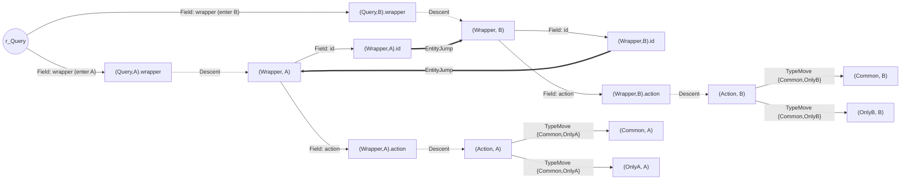
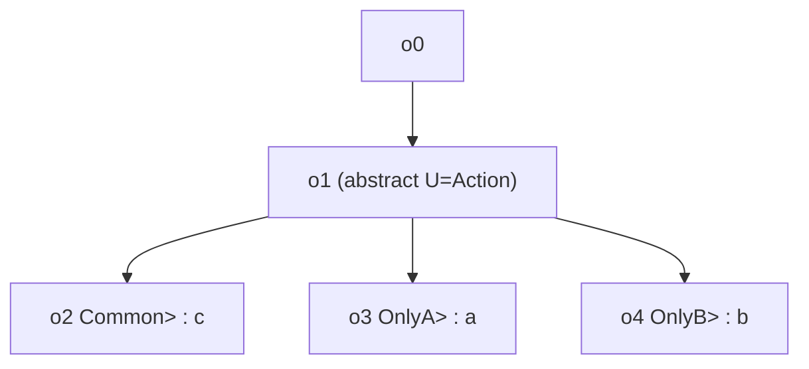
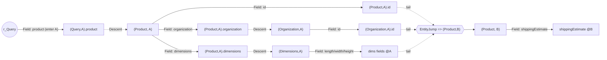

# Formal Specification -- Federation Query Planner v2

**Status:** normative. This document states the planner-v2 model's *current* semantics -- the
canonical reference for `PROOFS.md`, the TLA+ model, and the Go implementation. It states what the
semantics *are*, never when they landed: the amendment chronology (wave records, defect narratives,
measured counts, commit references) is preserved verbatim in `SPEC_HISTORY.md`, and live divergence
adjudications plus the residual register live in `DIVERGENCES.md`.

This document defines the planner-v2 model precisely enough to be proven against and implemented
1:1. It is written *for* the correctness effort: every numbered definition `D`*n*, the cost model
`C`, the invariants `I1`-`I4`, and the algorithm `A` are the fixed vocabulary that the paper proofs
and the model checker check, and that Go packages and tests map back to (section 8). Numbered items
are referenced by number everywhere.

Each design decision cites the `RESEARCH.md` lesson(s) that motivate it (e.g. "per L18, every
hyperedge has one head"). Terminology follows `GLOSSARY.md`: the first use of a glossary term is in
*bold*.

> **Reading order.** Section 1 fixes the input; section 2 compiles it into a **hypergraph**; section
> 3 weights that hypergraph; section 4 says what a plan *is*; section 5 states the four correctness
> **invariant**s; section 6 gives the algorithm; section 7 works two examples end to end; section 8
> maps everything to code.

---

## 0. Notation and the tractability boundary

We write a **directed hypergraph** as $H=(V,E)$ with **node** set $V$ and **hyperedge** set $E$. For
$e\in E$, $T(e)\subseteq V$ is its *tail* (inputs) and $H(e)\subseteq V$ is its *head* (outputs); an
ordinary **edge** is the case $|T(e)|=|H(e)|=1$. A **B-hyperedge** is a hyperedge with $|H(e)|=1$ and
$|T(e)|\ge 1$ -- "all tails together produce the one head", the **AND/OR graph** AND-shape and exactly
a **Horn clause** (body $=T(e)$, head $=H(e)$). $\mathrm{size}(H)=\sum_{e\in E}(|T(e)|+1)$.

The whole document is organized around one structural fact -- the **tractability boundary** (L1, L2):

$$
\underbrace{\text{cheapest way to satisfy \textit{one} obligation}}_{\text{shortest B-hyperpath: polynomial, Shortest B-Tree}}
\quad\Big|\quad
\underbrace{\text{cheapest \textit{shared} plan across all branches}}_{\text{multi-terminal cover / Directed Steiner Tree: NP-hard}}
$$

planner-v2 claims exact **optimality** (I3) only on the left; the right -- cross-branch **fetch
merging** -- is a separate, bounded, explicitly signalled phase (Section 6.4). This split is load-bearing and
appears again in every section.

Two conventions used throughout, both forced by the theory:

- **W1 (single-head, per L18).** *Every* hyperedge in $E$ is a B-hyperedge: $|H(e)|=1$. A fetch that
  makes several nodes available is modelled as one B-hyperedge *per* produced node (they share a
  tail), never as one multi-head edge. Encoding OR-fan-out as an **F-hyperedge** would move the
  search from the polynomial Shortest B-Tree class into an NP-hard class even on acyclic input; W1
  keeps the optimality proof alive as a *modelling* choice, not an implementation detail.
- **W2 (folded accounting, per L4).** The *realized* cost of an emitted plan is defined over the
  *set* of edges used (a **folded DAG**), so a sub-hyperpath shared by two obligations contributes
  its **weight** once to the reported plan cost (`C.3`), and traceback computes each shared
  subproblem once -- never re-traced per occurrence. The per-obligation *search objective*, by
  contrast, is the tree-shaped value-function recurrence of Gallo et al. (`C.2`) -- that is the
  semantics under which per-obligation minimization is polynomial; `C.3` states the folded <= tree
  inequality relating the two. Minimizing the folded cost *directly* is the NP-hard side of the
  boundary and is not attempted (see I3's scope).

`W1`/`W2` are *model well-formedness conditions*: they constrain Definitions `D4`-`D8` and the cost
model `C`. They are distinct from the correctness invariants `I1`-`I4` (Section 5), which are properties of
the planner's *output*.

---

## 1. Inputs

The planner consumes the existing datasource-configuration contract unchanged (L14a: it already
covers nearly the whole Federation v2 directive surface). Definition `D1` is faithful to the Go types
in `v2/pkg/engine/plan/datasource_configuration.go` and `federation_metadata.go`; the parenthetical
Go names are normative anchors.

### D1 -- Supergraph configuration

A **supergraph** configuration is a finite set $\mathcal{S}$ of **subgraph**s. Each subgraph $s\in
\mathcal{S}$ (`DataSourceConfiguration`, keyed by `DSHash`) provides:

1. *Root capabilities* $\mathrm{Root}_s$ (`DataSourceMetadata.RootNodes`, a `TypeFields`): a set of
   type/field pairs $(T,f)$ the subgraph can resolve *as an entry point* -- root operation-type fields
   and entity fields. Each field carries an `external` flag (`ExternalFieldNames`) and a
   fetch-reason flag (`FetchReasonFields`).
2. *Child capabilities* $\mathrm{Child}_s$ (`DataSourceMetadata.ChildNodes`): type/field pairs the
   subgraph resolves only when reached from a parent it already owns (non-entity and interface
   fields). Unions appear in neither set by contract.
3. *Federation metadata* (`FederationMetaData`):
   - *Keys* $K_s$ (`Keys`, a `FederationFieldConfigurations`): for entity type $T$, a set of key
     selection sets. Each key $k$ carries `SelectionSet` (parsed lazily to `parsedSelectionSet`), a
     resolvability flag $\mathrm{res}(k)$ (`DisableEntityResolver`: `true` means "cannot enter this
     subgraph via this key", i.e. `@key(resolvable: false)`), and optional `Conditions`
     (`[]KeyCondition`, implicit keys available only under stated field coordinates).
   - *Requires* $R_s$ (`Requires`): for a field $(T,f)$, a `SelectionSet` of sibling fields that
     must be resolved *before* $f$ can be, plus `RequiredFieldArguments` (`[]RequiredFieldArgumentInfo`,
     the `@requires` argument-value bindings).
   - *Provides* $P_s$ (`Provides`): for a field $(T,f)$ whose value is an entity, a `SelectionSet`
     that $s$ can resolve inline without a further **entity jump**.
   - *Entity interfaces / interface objects* (`EntityInterfaces`, `InterfaceObjects`, each an
     `EntityInterfaceConfiguration{InterfaceTypeName, ConcreteTypeNames}`).
4. *Per-subgraph abstract-type membership* $\mathrm{Mem}_s(U)$: for an abstract type $U$ (union or
   interface), the set of concrete member/implementer types **that this subgraph's own schema
   declares** for $U$. This is read from $s$'s upstream schema (`UpstreamSchema()`); it is per
   subgraph and may differ across subgraphs (the *partial union* case, Section 7.1). Making $\mathrm{Mem}_s$
   a first-class input -- a single source of truth consumed by both selection and lowering -- is the
   L8 fix for the decoupled member-coverage hazard in the current planner.

A *field coordinate* is a pair $(T,f)$ (`FieldCoordinate`). Argument bindings on requires/keys are
carried per `RequiredFieldArgumentInfo{TypeName,Path,Value}`; two configurations *conflict* when they
bind the same `(TypeName,Path)` to different `Value`s (`HasArgumentConflictWith`), which the model
uses in `D7` and Section 6.4.

*Contract fields not consumed by the model* (present in `D1`'s Go types, unrelated to search):
`Directives`/`DirectiveConfigurations` (per-datasource directive/type renaming) -- `D4` node identity
uses canonical composed-schema type/field names; renames apply during lowering's fetch-document
printing. `DataSourcePlanningBehavior` flags (`MergeAliasedRootNodes`, `AllowPlanningTypeName`,
`AlwaysFlattenFragments`) -- per-datasource lowering/printing concerns with no hypergraph effect.
`RemappedPaths` -- a lowering-time response-path rewrite. `CostConfig` (IBM static cost) -- post-hoc
cost estimation of finished plans, unrelated to the cost model `C`.

### D2 -- Normalized operation

A *normalized operation* $Q$ is a client operation after the existing normalization passes
(fragment inlining/flattening, `@skip`/`@include` resolution, alias assignment), represented as its
selection tree. Each selection is a field with a response key, a parent type, a target type, arguments,
and -- for selections on an abstract type -- a set of inline refinements $\{\,\ldots\text{on }C_i\,\}$.
`D2` does not include how the response is *shaped*; that is preserved separately by lowering (`D11`,
I4).

### D3 -- Obligation tree

The **obligation tree** $O(Q)$ (glossary: *obligation tree*) re-expresses $Q$ as a tree of **resolution
obligation**s. Each node $o\in O(Q)$ is one of:

- a *field obligation* $\langle T.f \rangle$ -- "field $f$ on an instance of type $T$ must be
  resolved" -- for every selected field, parented by the obligation of the field it nests under;
- an *abstract-refinement obligation* $\langle U \triangleright C \rangle$ -- "under the abstract type
  $U$, resolve the members selected for concrete type $C$" -- one per inline refinement in `D2`.

Edges of $O(Q)$ are the nesting (parent-resolved-before-child) relation. $G(O)$ denotes the set of
*goal* obligations: the leaves plus each abstract-refinement node's selected leaves. Prerequisite
selections (key fields for an entity jump, `@requires` selections) are *not* obligations and nothing
is attached to $O(Q)$ at plan time: they are represented *statically* in $H$ as `EntityJump` tails
(`D7`), fixed at hypergraph-compile time. There is consequently no fixpoint re-walk and no iteration
cap anywhere in planning (L13); requirement cycles surface through the search itself (`D7`, Section 6.3).

**Goal mapping.** A field obligation $g=\langle T.f\rangle$ maps to the *candidate node set*

$$ \mathrm{cand}(g) \;=\; \{\, (T,s).f \in V \,:\, s \text{ resolves } f \text{ on } T \,\}, $$

one field-resolution node (`D4`) per candidate subgraph. The goal test (`D10`, `A`) is satisfied when
*some* $v\in\mathrm{cand}(g)$ is covered; `A` selects the `C.4`-minimal candidate. An
abstract-refinement obligation $\langle U\triangleright C\rangle$ maps through the `TypeMove` head
$(C,s)$ to the candidate field nodes of its selected members.

$O(Q)$ is the goal-node set for the **hyperpath cover** (`D10`); the raw AST is not used past this
point, isolating the pure search from GraphQL plumbing.

**D3p -- typename-terminal goals.** The *goal* set $G(O)$ counts a field obligation
$\langle T.f\rangle$ as a goal iff it is a *resolution leaf*: it has no *field-obligation* descendant.
This generalizes the plain "leaves" of $G(O)$ above -- a field whose *only* descendants are `__typename`
meta-fields and/or abstract refinements with no resolvable field beneath (`{ union { __typename } }`,
`{ product { samePriceProduct { __typename } } }`, `{ node { ... on X { __typename } } }`) is a
resolution leaf too: the router must still resolve $f$ to produce its `__typename`, even though no
descendant carries a goal, so the composite must be covered and selected by some fetch. The rule is a
pure *addition* to $G(O)$ relative to the plain-leaf reading -- disjoint from the plain leaf goals (a
plain leaf field already has no children, hence no field descendant), so every plain-leaf goal is
preserved and only the typename-terminal composites are added. $\mathrm{cand}$ resolves such a goal to $f$'s own field nodes
$(T,s).f$ exactly as for a leaf field; lowering (`D11`) emits `f { __typename }` at its position (a
`__typename` obligation is response-shape bookkeeping that rides with its enclosing object into whatever
fetch resolves it). Because it only *adds* goals, `T2`/`T3` are monotone (more goals => more derivations)
and the search kernel/`SETTLE`/cost are untouched.

**D3ppp -- interface-refinement member fallback.** For a field obligation
$g=\langle U.f\rangle$ whose owner type $U$ is an *abstract mixin* (an interface/union the operation
selects `f` on via `... on U`, but which is never returned directly, so every object node $(U,s)$ is an
orphan in $H$), the candidate set

$$ \mathrm{cand}(g) \;=\; \{\, (U,s).f \,\} $$

can be *entirely unreachable* -- settle leaves every $(U,s).f$ at $\pi=\infty$ -- while the concrete
member the parent instance actually *is* (an entity, reachable via its `D7` jump) declares $f$. Under
`D3` alone such a goal is a hard `ErrNoValidPlan` (shape: *field on an orphan abstract whose members
are entities*). `D3ppp` augments $\mathrm{cand}(g)$ with
the concrete members' reachable field nodes

$$ \mathrm{cand}(g)\;\mathrel{+}=\;\{\, (C,s).f \,:\, C\in\mathrm{Mem}(U)\ (\text{a }\mathsf{TypeMove}\text{ member of }U),\ (C,s).f\text{ reachable}\,\}, $$

so the goal is covered on the reachable member route. It is a *conditional* addition -- it fires *only*
when every primary $(U,s).f$ is unreachable, i.e. on a goal that would otherwise fail. A goal whose
$(U,s).f$ is reachable keeps $\mathrm{cand}(g)$ unchanged, so the
`C.4` candidate selection and realized cost of every working plan are untouched -- the containment an
*unconditional* expansion would violate. Because the trigger is a
reachability predicate over $H$ (an over-approximation of the settle route: optimistically-unreachable
$\Rightarrow$ $\pi=\infty$), the fall-back is realized at obligation-build time, with the search
kernel/`SETTLE`/cost
*literally unchanged* -- `A` merely reads a larger $\mathrm{cand}(g)$ for the failing goal. Fires only for
a non-exempt goal (an exempt goal is a `D6` response-only null, not a routing gap). *Scope:* the fallback
covers the reachable member(s); a genuinely *distributed* abstract whose list mixes several concrete
members each in a different subgraph is outside `D3ppp`'s scope (that is the per-member expansion
machinery: `D3pppp`, `D6pp` verdict 3, `D11.7`) -- `D3ppp` covers the single-reachable-member "the concrete
type the parent already is" case.

**D3pp -- exempt-terminal composite goals.** $G(O)$ additionally counts a composite
field obligation $\langle T.f\rangle$ as a goal when its *entire* field-subtree is `D6` member-narrowed
away -- i.e. it has no field-obligation descendant that is *both* a goal and not $\mathrm{exempt}$.
This generalizes `D3p` from "no field descendant" to "no non-exempt field descendant": a composite
whose only selected members are all value-type members *outside* the intersection (e.g. `{ wrapper {
actions { __typename ... on OnlyB { b } } } }` where `OnlyB` is narrowed out, witness
`partial-union-complex/case-03`) has every leaf goal exempt, yet the router must still resolve the
composite to produce the surviving
members' `__typename`. The rule adds $\langle T.f\rangle$ with $\mathrm{cand}$ = $f$'s own field
nodes (typename-terminal, exactly `D3p`); lowering emits `f { __typename }`, and the narrowed members
render as response-only nulls (`D6`, `I4`). **Safety gate.** A goal is exempt-terminal *only* when its
narrowing is a genuine value-type `D6` intersection null -- every exempt descendant has a *reachable*
candidate (it is narrowed *despite* being resolvable, which the reference gateway also nulls). A goal
exempt because its candidate is *unreachable* (an interface refinement whose abstract node is orphan --
the distributed interface-refinement class, witness `union-interface-distributed/case-05`) is *not*
exempt-terminal: covering it as `{ __typename }` would drop the field (a false plan-level pass with
wrong data), so it is excluded and left as its true gap. (`D6pp` verdict 1 extends this gate: a
*dead-member* exemption is admitted unconditionally, since the member never occurs at the position.)
This keeps the rule a *pure addition* of
provably-correct-null composites; because it only adds goals, `T2`/`T3` stay monotone and the search
kernel/`SETTLE`/cost are untouched.

**D3pppp -- abstract-position member expansion (type explosion at abstract positions).** A field
obligation $g=\langle U.f\rangle$ whose owner $U$ is abstract can be *locally
unresolvable at its position*: no subgraph that can supply the position's parent instances declares
$f$ on $U$, while the position's concrete members -- entities, each with its `D7` jump -- declare $f$ in
another subgraph (`abstract-types`: `products { reviews }`, where `products` yields the interface
`Product` whose `reviews` lives only on `Book`/`Magazine` in the reviews subgraph). Under `D3` alone
the goal's only reachable candidate is a foreign-root route (the `D10` fall-back class), because no
single walk can serve an interface position whose instances must be *fanned out per concrete member*
to move subgraphs -- the reference routers plan this by **member expansion** (Apollo's type explosion;
v1's abstract-selection rewrite). `D3pppp` performs that expansion on $O(Q)$ itself, keeping the "no AST
past $O(Q)$" isolation: when the trigger below holds, the obligation subtree rooted at
$\langle U.f\rangle$ is replaced by one abstract-refinement obligation $\langle U\triangleright
C\rangle$ per expansion member $C$, each containing a copy of the whole $\langle U.f\rangle$ subtree
with owner types rewritten at the top ($\langle C.f\rangle$; descendants keep their own owner types).
The expanded tree is then classified (`D6pp`), goal-resolved, and lowered exactly as if the client had
written the member fragments (`D11.7` member-qualified placement, `D11.8` sibling response variants --
the class-D machinery this construction deliberately reuses).

Trigger -- ALL of, evaluated per position over the `D6pp` position machinery (P = the route-scoped,
intervening-gated capable subgraphs of the parent field; $\mathrm{pos}_s$ = the position-possible
member sets):

1. $U$ is abstract in the composed schema and $f$ is not `__typename`;
2. *no* $s\in P$ has the field node $(U,s).f$ in $H$ (some capable supplier resolving $f$ locally
   keeps the standing `D6` local-resolution route -- current behavior, untouched);
3. every $\mathrm{pos}_s$ is a *known* set (no $\top$): an `@interfaceObject`-shaped position supplies
   instances whose concrete types the source subgraph cannot name, so member expansion there would
   emit representations the source cannot type -- that configuration is `D3io`/`D7p` territory, never
   expansion;
4. the expansion member set $M=\bigcup_{s\in P}\mathrm{pos}_s$ is non-empty and every $C\in M$ has a
   *reachable* field node $(C,s').f$ in $H$ (optimistic reachability, as `D3ppp`): if any member's copy
   would be unroutable the expansion is skipped whole, leaving the pre-amendment behavior rather than
   trading a plannable (if fallback-served) shape for a hard error.

Monotonicity and scope. The transform is a pure tree rewrite ahead of goal resolution: the goal SET
changes (one goal per member copy replaces each goal of the original subtree), but every prior
derivation in $H$ remains valid -- $H$, the kernel, `SETTLE`, and the cost model are untouched, so
`T2`/`T3` are unaffected (they quantify over $H$, not $O(Q)$). Response shape: the member copies are
member-gated variants of ONE client field, exactly the `D11.8` sibling-variant form (presence-union
equals the client tree; the postprocess fold assembles the runtime response), so `I4` is preserved in
the variant-union reading `D11.8` already established. Honest scope: a MIXED position -- some capable
supplier resolves $f$ locally, others do not -- keeps the local-resolution route (trigger 2) and is
NOT expanded; no corpus case exercises the mixed shape, and it is registered rather than guessed at.

**D3io -- @interfaceObject member-flattening candidates.** The reverse direction of
the same class: a field obligation $g=\langle C.f\rangle$ whose owner $C$ is a *concrete object
type in the composed schema* -- selected under a refinement `... on C`, **or bare at a
concrete-typed position** (`D3io` concrete-position clause, reachability-gaps wave) -- where $f$
lives ONLY on an `@interfaceObject` subgraph: the subgraph declares an interface $I$ (with $C$ among
its composed implementers) as a plain object and serves $f$ for ALL implementers without knowing the
concrete types (`simple-interface-object`: `users { ... on User { username } }`, `username` declared
only on the interface-object `NodeWithName` in subgraph b; the bare-position twin is the conformance
case `FS-IFO-1/interface-object/contributed-field-concrete`: `usersConcrete: [User]` selecting the
contributed field with no fragment at all -- composition adds $f$ to every implementer, so the
selection is legal client GraphQL and FS-IFO-1 makes no abstractness distinction).
$\mathrm{cand}(g)=\{(C,s).f\}$ contains
only orphan propagated nodes (the interface-object subgraph has no producing route to a *concrete*
$(C,s)$ -- its instances are interface-typed, and the propagated concrete node metadata gives $(C,s)$
no producing edge), so the goal is a hard `ErrNoValidPlan`. `D3io` augments
the candidate set with the interface-flattened field nodes

$$ \mathrm{cand}(g)\;\mathrel{+}=\;\{\, (I,s).f \,:\, C\in\mathrm{impl}(I)\ (\text{composed}),\ (I,s).f\in V,\ (I,s)\ \text{is an } \mathsf{EntityJump}\ \text{head},\ (I,s).f\ \text{reachable}\,\}, $$

so the goal is covered on the interface-object route -- the member selection *flattens* onto the
interface type, which is exactly the `@interfaceObject` wire contract (the subgraph resolves $f$ for
whatever implementer the instance is). Like `D3ppp` it is *conditional* -- it fires only when every
primary $(C,s).f$ is unreachable, so no working concrete route is ever displaced -- and *additive*
(more candidates => more derivations; kernel/`SETTLE`/cost untouched). The jump-head gate ("$(I,s)$ is
an `EntityJump` head") is what distinguishes a genuinely flattenable interface-object/entity-interface
node (enterable via its key) from a plain interface node another subgraph merely declares. Lowering
realizes the flattened placement per `D11.9`; the response tree keeps the member gate (`OnTypeNames`),
so the flattening is invisible to the client shape. Honest scope: the runtime member DISCRIMINATOR --
a flattened member gate needs the position's concrete `__typename` from a subgraph with member
knowledge, which the interface-object subgraph cannot supply -- is NOT synthesized as an extra goal by
this amendment; the plan carries the gate and any client-selected `__typename` rides the ordinary
mechanism, and the discriminator-jump synthesis is a registered residual (DIVERGENCES register,
class C-disc).

Argument carry. A field obligation $\langle T.f\rangle$ additionally records the field's
*rendered arguments* and the *operation variables* those arguments reference -- data, not AST refs, so
the "no AST past $O(Q)$" isolation holds. Because `D2` normalizes with variable extraction, every
argument value is a variable reference, and the recorded form is the argument body ready for `D11`
rendering plus the variable-name set the covering fetch must declare and forward. Arguments are carried
for lowering only: they are *invisible to the search* -- $\mathrm{cand}(g)$, the goal test, and cost are
all argument-independent, because the subgraph that resolves $f$ on $T$ is the same whatever value $f$'s
argument takes. `@skip`/`@include` need no carry: `D2` resolves them (a literal- or default-`false`
`@include`, or `true` `@skip`, deletes the selection before $O(Q)$ is built), so a conditionally-excluded
field is simply absent from $O(Q)$.

---

## 2. The planning hypergraph

Compilation happens once per supergraph change (not per operation) and yields an immutable weighted
$H=(V,E)$. Definitions `D4`-`D8` are the edge taxonomy; by `W1` every member of $E$ is a B-hyperedge.
The taxonomy is deliberately small: only *simple edges* (`D5`, `D6`) and *entity-jump B-hyperedges*
(`D7`), with `@provides` folded in by `D8`.

**Edge identity.** An edge *is* the tuple (kind, field/member label, full head-node identifier, the
sorted list of full tail-node identifiers, and the `D8` provided-scope tag if any). $E$ is a *set* keyed
by this tuple: the builder deduplicates, so $E$ contains no two distinct edges with equal tuples (e.g. the
same implicit key discovered via two `D1` config routes denotes one edge, not two). This pins the object
identity that `C.4`'s totality argument relies on (two distinct edges differ in one tuple component), so
`C.4` is a total order over edge *objects*, not merely over tuples (see PROOFS A-3, gap G6).

### D4 -- Nodes (two sorts)

$$ V \;=\; \underbrace{\{\, (T,s) \,\}}_{\text{object nodes}} \;\cup\; \underbrace{\{\, (T,s).f \,\}}_{\text{field-resolution nodes}} \;\cup\; \{\, r_{\mathrm{op}} : \mathrm{op}\in\{\text{Query},\text{Mutation},\text{Subscription}\} \,\} $$

There are two sorts of nodes plus the synthetic roots:

- An **object node** $(T,s)$ -- one per pair of type $T$ and **subgraph** $s$ whose schema names $T$ --
  reads "an instance of GraphQL type $T$, as seen by subgraph $s$".
- A **field-resolution node** $(T,s).f$ -- one for *every* field $f$ that $s$ can resolve on $T$, i.e.
  $(T,f)\in\mathrm{Root}_s\cup\mathrm{Child}_s$ -- reads "field $f$ resolved on such an instance by
  $s$". Scalars are thereby distinguishable: $(Product,s).id$ and $(Product,s).name$ are distinct
  nodes, and obligations, `D7` tails, and goal tests all refer to these well-defined field nodes.

One GraphQL type yields nodes *per subgraph that knows it* -- the same type in two subgraphs is two
object nodes (with their own field nodes), because the same field can be resolvable from either at
different *cost* and the planner must distinguish them. Node identity uses *canonical*
composed-schema type/field names (per-datasource renaming is a lowering concern, `D1` note). The
synthetic roots $r_{\mathrm{op}}$ are the sources of every **B-hyperpath** (`D9`).

### D5 -- Field-traversal and descent edges

For each subgraph $s$ and each capability $(T,f)\in \mathrm{Root}_s\cup\mathrm{Child}_s$ with output
type $U$, there are:

$$ (T,s)\ \xrightarrow{\ f\ }\ (T,s).f \quad (\text{kind } \mathsf{Field}); \qquad\quad (T,s).f\ \longrightarrow\ (U,s) \quad (\text{kind } \mathsf{Descent},\ \text{only if } U \text{ is composite}). $$

A `Field` edge resolves the field (object node in, field node out); a `Descent` edge steps from a
resolved composite-typed field into its output object node so that sub-selection can continue.
Descent edges carry weight $0$, explicitly: the selection cost was already charged by the `Field`
edge, and a scalar field has no descent at all. Tail and head are always in the *same* subgraph:
resolving a field never changes subgraph on its own. Root-operation fields have a synthetic root as
tail: $r_{\mathrm{op}}\xrightarrow{f}(Q_{\mathrm{op}},s).f$ for each root capability, where
$Q_{\mathrm{op}}$ is the operation root type -- these are the *subgraph-entering* `Field` edges
(weight $w_f$, `C.1`). External capabilities (`HasExternalRootNode`/`HasExternalChildNode`) emit *no*
edge -- an `@external` field is a key/requires input another subgraph owns, never a resolvable head
here.

**D5p -- `@external` key-field carry (key-tail float).** The "external emits no edge" rule
has one exception: an `@external` field $(T,f)$ that is a *key field* of $T$ in subgraph $s$
(i.e. $f$ appears -- at any nesting depth -- in some `@key` `SelectionSet` declared on $T$ in $s$) is
nonetheless *locally producible*, and emits the ordinary in-subgraph `Field` edge
$(T,s)\xrightarrow{f}(T,s).f$ (weight $w_s$), together with its `Descent` when $f$'s output is
composite (nested keys). Justification: when $s$ resolves any $(T,s)$ object, its resolver returns
the entity's *key* in the representation -- the key value *rides with the object node* -- even though
$s$ does not own the field's canonical definition (that is what `@external` marks). This is the
model-native form of Apollo keeping the `@external` key node alive precisely so a `KeyResolution`
edge's condition can reference it (`build_query_graph.rs:573-583`; the recursive-condition semantics
of `handle_key:1320-1345`). An `@external` field that is *not* a key field (a pure
`@requires`/`@provides` input another subgraph owns) still emits no edge. Consequence for `D7`: the
key-field tail $(T,s_1).f_i$ of an `EntityJump` out of $s_1$ is reachable *from $s_1$* whenever
$s_1$ can produce the entity object, rather than pinned at $\pi=\infty$; the jump can fire, and
a covering route exists for `@external` extension keys (the class-A1 shape). This is a *pure
addition* to $E$ (new `Field` edges on nodes that were
otherwise $\pi=\infty$): it can only create derivations, never remove one, so every `T2`/`T3`
monotonicity argument extends additively (see `PROOFS.md`, D5p note) and no other route or cost
decreases spuriously.

**D5pp -- renamed root operation types (root-field descent).** Node identity uses *canonical
composed-schema* names, including the operation root type $Q_{\mathrm{op}}$
(`Query`/`Mutation`/`Subscription`) -- so
a root capability $(Q_{\mathrm{op}},f)$ is listed under the composed name in
$\mathrm{Root}_s\cup\mathrm{Child}_s$. But the field's output type $U$ (which decides whether a
`Descent` edge exists, D5) is read from subgraph $s$'s *own upstream SDL*, and a federation subgraph
may rename its root operation types via a `schema { query: ... }` definition (e.g. its query root is
`AcmeQuery`, not `Query`) -- under such a rename the SDL has no type named $Q_{\mathrm{op}}$, so a
lookup under the *composed* name would drop the root field's `Descent` into $(U,s)$ and orphan at
$\pi=\infty$ every composite $(U,s)$ reachable *only* through that root field
(the whole selection under a root-returned type would be unplannable). D5 therefore resolves a root
field's output type under $s$'s real root operation type name: let $\rho_s(Q_{\mathrm{op}})$ be the
name $s$'s SDL binds to the same operation kind (query/mutation/subscription) as the composed root
$Q_{\mathrm{op}}$ -- read from $s$'s `schema { ... }` root-operation-type definitions, defaulting to
$Q_{\mathrm{op}}$ itself when $s$ declares none (the standard names). The field's output type is
$U=\mathrm{outputType}_s(\rho_s(Q_{\mathrm{op}}),f)$; the emitted node $(U,s)$ keeps the composed
output type name (per-datasource renaming remains a lowering concern, D1 note). Non-root capabilities
are unaffected ($\rho_s$ is identity off the root types). For the SUBSCRIPTION root the rule also
runs in the REVERSE direction (root recognition, per subgraph) -- with DUAL-ROLE semantics: the
subscription root is an ANCHOR, never a classification of a type. A type's field edges are ALWAYS
emitted in their data role -- object-tailed on $(T,s)$, weight `Field`, for every operation kind --
exactly as a graph without a subscription root would emit them; a composed type may be
SIMULTANEOUSLY the subscription operation root and a data object referenced by payload fields (the
verified production shape: a billing subgraph whose SDL declares `schema { ... subscription:
Subscription }` AND returns the same type from payload fields, merged with another subgraph's
genuine realtime root field), and either/or classification cannot represent that. The subgraph's
declared operation-root IDENTITY decides only where the ADDITIVE anchor edges point (head = the
root field's node, tail = $r_{\mathrm{subscription}}$, weight `Fetch`): an explicit SDL
`schema { ... }` block with a subscription binding anchors that binding's name and the composed
default name (metadata may list root fields under either, per the forward convention above); an
explicit block WITHOUT a subscription binding anchors nothing in that subgraph; no block anchors
the composed default name (GraphQL default naming). Config rootNodes membership is NOT
operation-root evidence in either direction (the config generator files data types named like
operation roots into rootNodes by name). Anchor edges are what the `D11.12` operation-kind root
scoping masks for query/mutation operations -- data routing can never be severed by it. A
requires-scoped field gets no anchor (an unscoped entry would reintroduce the `D7pp` requires
bypass). Query/mutation renames stay on the composed-name direction alone (their corpus behavior
is pinned). This is a
lookup rule, not a model
extension: the `Descent` D5 mandates exists whenever the root field's output is composite, and
$\rho_s$ only fixes the name under which that output type is resolved. Relative to the composed-name
lookup it is a *pure addition* to $E$ (new `Descent`
edges into nodes otherwise $\pi=\infty$), so every `T2`/`T3` monotonicity argument extends additively
(see `PROOFS.md`, D5pp note); no other route or cost changes.

Edge identity carries no arguments (A-3). A `Field` edge's identity tuple (Section Edge
identity) is (kind, label, head, tails) -- it does not include the field's client arguments. Two
selections of the same field with different arguments -- `price(currency: X)` from the client and a
`@requires(fields: "price(currency: \"USD\")")` obligation, or two client `price(currency:)` at
different response positions -- denote the *same* `Field` edge and reach the *same* node. This is the
deliberate answer to the A-3 identity question: arguments do not partition reachability or cost (the
resolving subgraph is argument-independent), so distinguishing them at edge identity would only bloat
$H$ without changing any route. Where two argument bindings of one coordinate genuinely must coexist in
one emitted document -- the `requires-with-argument-conflict` oracle, `shippingEstimate` requiring
`price(currency: "USD")` while `shippingEstimateEUR` requires `price(currency: "EUR")` -- the split is a
*lowering* concern (D11 representation injection splits the requiring fields across separate entity
fetches), not an edge-identity one; the hypergraph stays argument-blind.

**D5-EDFS -- event-source root entrances (`@edfs__*` pub/sub roots).** An EDFS event source is a
subgraph $s$ whose declared root capabilities are backed by a message-broker event stream
(Kafka/NATS) rather than an HTTP subgraph server -- the WunderGraph EDFS directives
`@edfs__natsSubscribe`/`@edfs__kafkaSubscribe` (subscription roots), and
`@edfs__natsPublish`/`@edfs__kafkaPublish`/`@edfs__natsRequest` (mutation/query publish-or-request
roots). Such a subgraph carries an **event source** configuration in place of an HTTP `Fetch`
configuration and, in the production config, no per-subgraph upstream SDL of its own: the composed
supergraph is the sole authority for the event root field's output type and payload shape. This
amendment makes such a field a first-class root entrance, resolving the two build-time facts D5
needs -- the entrance edge and its output type -- from EDFS evidence and the composed schema rather
than from an HTTP upstream. It is the sole model-extension slice of the EDFS capability (PARITY.md
class (c); it retires the metadata-only-subscription-root residual for the EDFS-evidenced case,
`DIVERGENCES.md`).

- **Entrance edge (unchanged form).** For an event root capability $(Q_{\mathrm{op}},f)\in
  \mathrm{Root}_s$ the subgraph-entering `Field` edge $r_{\mathrm{op}}\xrightarrow{f}(Q_{\mathrm{op}},s).f$
  is emitted exactly as D5 emits any root entrance -- same kind (`Field`), same tail
  ($r_{\mathrm{op}}$), same weight ($w_f=$ `Fetch`). At the search layer an event-source entrance and
  an HTTP entrance are indistinguishable; the difference is entirely a *lowering* transport concern
  (`D11.12-EDFS`). For a subscription root the D5pp anchor edge is emitted in addition, unchanged.
- **Output type from the composed schema.** D5's descent $(Q_{\mathrm{op}},s).f\longrightarrow(U,s)$
  needs the field's output type $U$. When $s$ has no upstream SDL binding $f$ (the event stream owns
  no SDL), $U=\mathrm{outputType}_G(Q_{\mathrm{op}},f)$ is read from the composed supergraph schema
  $G$ -- the authority for what an event payload conforms to -- rather than from
  $\mathrm{outputType}_s$. The payload object node $(U,s)$ and its descent are emitted as usual; the
  payload's *fields* route by the ordinary D5/D6/D7 machinery (locally when $s$ also declares the
  payload type -- EDFS subgraphs typically declare their entities with a `@key` so the payload
  resolves via entity jumps -- otherwise across subgraphs), so nothing below the entrance is special.
- **EDFS evidence gate (no silent drift).** The composed-schema output-type fallback fires ONLY under
  positive EDFS evidence: an event source configuration on $s$ naming $(Q_{\mathrm{op}},f)$ as an
  event root. A metadata-declared root field with NO EDFS evidence and no SDL-resolvable output type
  stays unplannable (`FS-PLAN-6`, typed loud) -- ordinary schema drift is a composition bug, not an
  event source, and must not be silently rescued (`TestPlanner_SubscriptionMetadataOnlyFailsLoud`
  keeps its fail-loud pin for the no-evidence case).
- **Additivity / invariant applicability.** Relative to the pre-amendment graph this is a *pure
  addition* to $E$: new `Field`/`Descent` edges (and, for subscription roots, the D5pp anchor) on an
  entrance that was otherwise absent or orphaned at $\pi=\infty$. It introduces no new edge KIND, no
  new cost, and no tie-break input, so the search kernel, its cost model, and the enumerated-instance
  optimality oracle are untouched; every `T2`/`T3` monotonicity argument extends additively exactly
  as the D5p/D5pp notes establish (`PROOFS.md`, D5-EDFS note). I1-I4 hold for an event-source root
  exactly as for any HTTP root; the only new obligation is the transport binding at lowering
  (`D11.12-EDFS`), which is shape-neutral.

Argument-in-`@requires` RENDERING (the DV-006 contract; see `DIVERGENCES.md`). Two rules, both
argument-blind at the search layer: (1) the D7 selection tokenizer
(`parseSelection`) skips a field's argument group `(...)` whole, so `price(currency: "USD")` parses to
the bare coordinate `Product.price`; (2) the literal argument values, which the argument-blind `Tails`
cannot carry, are recorded on the `EntityJump` edge (`Edge.Requires`, outside the A-3 identity tuple)
and re-rendered at lowering (D11) into both the source document and the entity fetch's `Requires`
fragment (`price(currency: "USD")`). The same-coordinate CONFLICT split
(`requires-with-argument-conflict`, DV-007): one entity representation cannot carry both a
USD and a EUR `price`, so -- mirroring v1's `HasArgumentConflictWith` -- lowering PARTITIONS the requiring
fields across separate `_entities` fetches. Four components, all argument-blind at the search layer:
(a) the requiring-field name rides parallel to each requires selection on the jump edge (`Edge.RequiresBy`,
outside the A-3 tuple); (b) the conflict group-split; (c) source-document aliasing so both bindings
coexist in one valid upstream document (`_planv2req_price_1: price(currency: "EUR")`); (d) a
representation value-path indirection so the aliased-binding fetch reads its value from the aliased
response key while presenting the field by its real name. See DIVERGENCES DV-006/007.

### D6 -- Type-move edges with per-subgraph member sets

For an abstract type $U$ resolvable in subgraph $s$ and each concrete member $C\in\mathrm{Mem}_s(U)$
(from `D1`), there is a simple edge

$$ (U,s)\ \xrightarrow{\ C\ }\ (C,s), \qquad \text{kind } \mathsf{TypeMove}, \qquad \text{labelled with } \mathrm{Mem}_s(U). $$

A type move is the abstract->concrete refinement (union member selection, interface downcast). The
member set on the edge is *per subgraph* and is the whole content of the partial-union behavior:
subgraph $s$ can refine $U$ only to members in $\mathrm{Mem}_s(U)$, so a member $C\notin
\mathrm{Mem}_s(U)$ has *no* type-move edge in $s$. This makes partial-union correctness a property of
$H$ (which edges exist), consumed identically by search and by lowering, rather than a bolted-on pass
that two subsystems must agree on (L8). By `W1` each `TypeMove` is a separate single-head edge -- never
one edge fanning to all members -- which is what keeps the model out of the NP-hard **F-hyperedge**
class (L18); full **type explosion** is therefore a last resort, never the default (L8).

> **Member-narrowing rule for value-type abstracts (definitional; enforced by `D10`'s goal test,
> used in Section 7.1).** When $U$'s members are *value types* (non-entities -- no key, hence no `D7` edge to
> reconcile them across subgraphs), a refinement obligation $\langle U\triangleright C\rangle$ is
> coverable on a parent path only if $C$ lies in the intersection
> $\bigcap_{s\in P}\mathrm{Mem}_s(U)$ over the set $P$ of subgraphs that can resolve the parent field
> yielding $U$. This rule is *definitional*, encoding canonical federation semantics -- the behavior
> the federation audit expects, and the model-native counterpart of Hive Router's
> `narrow_partial_union_paths` intersection -- under the standing assumption that *an abstract field
> is resolved locally on whichever subgraph supplies each parent instance*. That assumption is what
> makes the intersection necessary: with mixed-origin parents (e.g. list items whose `Wrapper`
> instances are resolved via different subgraphs), one static member set must be valid for every
> origin. It is *not* the only I1-sound behavior -- Section 7.1 discusses an I1-sound alternative
> (commit every parent to one subgraph) that the model rejects as non-canonical and cost-dominated.
> Members outside the intersection are left uncovered and lowered to response-only nulls (I4). If
> instead the members are *entities*, each has a `D7` edge and is individually reachable, so no
> intersection narrowing applies -- the entity/value distinction the current planner special-cases
> falls out of "does a `D7` edge exist".

> **Nested refinements (P restricted through intervening member sets).** The rule above defines
> $P$ for a refinement whose parent chain reaches its yielding field directly. When the chain
> passes through intervening refinements $\langle U_i\triangleright C_i\rangle$ before the nearest
> enclosing field obligation $\langle T.f\rangle$ (abstract-in-abstract nesting, e.g. an interface
> refinement inside an interface refinement), $P$ is additionally filtered by each intervening
> context: $s\in P$ iff $s$ resolves $T.f$ *and* $C_i\in\mathrm{Mem}_s(U_i)$ for every intervening
> refinement -- applied at every nesting depth (each intervening refinement filters $P$). A subgraph
> that resolves $T.f$ but cannot locally produce an enclosing concrete context supplies no parent
> instances at the inner refinement, so intersecting against its member set would over-narrow: the
> local-resolution standing assumption quantifies only over subgraphs that can actually originate
> the inner refinement's parents.

> **D6p -- route-scoping of $P$ (reachability filter).** $P$ ranges
> only over subgraphs that can *actually supply a parent instance* on some route -- not every subgraph
> whose SDL merely *names* $T.f$. Formally, $s\in P$ additionally requires the field-resolution node
> $(T,s).f$ to be *reachable* in $H$: there is an optimistic (condition-blind) hyperpath from a root
> to $(T,s).f$. A subgraph that declares $T.f$ but whose $(T,s)$ has no producing edge -- no root
> reaches it and it is not an entity target (no `D7` jump lands on it) -- can never originate a parent
> instance, so folding its (typically *narrower*) $\mathrm{Mem}_s(U)$ into
> $\bigcap_{s\in P}\mathrm{Mem}_s(U)$ over-narrows: it nulls a member the *only* real route resolves
> (`partial-union/case-02`: `Response` is `@shareable` in a rootless, keyless subgraph $B$ whose
> $\mathrm{Mem}_B=\{$Alpha$\}$, wrongly excluding Beta/Gamma that the single reachable producer $A$
> supplies). Optimistic reachability is an *over-approximation* of the per-operation route, so the
> filter is sound in the safe direction: it removes only subgraphs with **no** producing path at all,
> never one some route could reach, so it can only *reduce* spurious exemptions -- never introduce a
> wrong null. It is a static property of $H$ (no search/settle/cost involvement), computed once at
> classification time. $P$ is route-scoped, not schema-scoped.

> **D6pp -- position-possible member sets: dead-member exemption and distributed-member routing.**
> The narrowing rule above tests a refinement's concrete type $C$ against the
> *name* sets $\mathrm{Mem}_s(U)$, and refuses to narrow at all when any member of $U$ is an entity.
> Both simplifications are wrong on distributed abstract types (the class-D shape).
> `D6pp` replaces the membership test with a *position-local possibility* judgment.
>
> For the parent field $\langle T.f\rangle$ of a refinement and a capable subgraph $s\in P$ (`D6p`
> route-scoped, intervening-refinement filtered), define the **position-possible member set**
> $\mathrm{pos}_s(T.f)$ -- the concrete runtime types an instance at this position can *be* when $s$
> supplies it:
>
> - $X_s = $ the `Descent` target type of $(T,s).f$ in $H$ ($s$'s own output type for the field --
>   the child-type-mismatch case makes this genuinely per-subgraph: `Viewer.book` is `Book` in one
>   subgraph and `ViewerMedia` in another);
> - if $X_s$ is an *object type in the composed schema*: $\mathrm{pos}_s = \{X_s\}$ (a concrete
>   position can only ever be that type);
> - if $X_s$ is abstract in the composed schema and $s$ has `TypeMove` edges for $X_s$:
>   $\mathrm{pos}_s = \mathrm{Mem}_s(X_s)$;
> - otherwise $\mathrm{pos}_s = \top$ (*unknown* -- $s$ models the position without local member
>   knowledge; the `@interfaceObject` / entity-interface configurations land here, where the
>   subgraph's instances can be concrete members its own schema never names, so assuming any
>   restriction would be unsound). An intervening refinement `... on C_i` narrows
>   $\mathrm{pos}_s$ through its gate ($C_i$ concrete $\Rightarrow \{C_i\}$; $C_i$ abstract
>   $\Rightarrow \mathrm{pos}_s \cap \mathrm{impl}(C_i)$; $\top$ absorbs except under a concrete gate).
>
> A refinement type $C$ is **possible at the position in $s$** iff ($C$ concrete and
> $C\in\mathrm{pos}_s$) or ($C$ abstract and $\mathrm{impl}(C)\cap\mathrm{pos}_s\neq\emptyset$),
> where $\mathrm{impl}(C)$ is $C$'s composed-schema implementer/member set and $\top$ makes every
> $C$ possible. The abstract-$C$ clause is what admits `... on Store` under a union
> whose members implement `Store`: the *name* `Store` is not a member name, but the position can
> produce implementers of it, so narrowing it out would null data the route resolves (witnesses:
> `union-interface-distributed/case-05`; the federationtesting `histories` scenario).
>
> Three member-narrowing verdicts follow, in order:
>
> 1. **Dead member.** $C$ possible in *no* $s\in P$ (with $P\neq\emptyset$): the position can never
>    produce a $C$ on any route, so every goal under the refinement is *exempt* (`D10` cover
>    exemption; response-only absence per `D11` clause 3) -- *regardless of entity-ness*. The
>    entity gate's rationale ("an entity member is individually reachable via `D7`") does not apply:
>    a `D7` jump transports an *existing* instance between subgraphs; it cannot manufacture a parent
>    instance of a type the position cannot produce. Witnesses: `... on Oven` under `Query.nodes`
>    where only subgraph a (whose `Node` is `{Toaster}`) resolves `nodes`
>    (`union-interface-distributed/case-02/08`); `... on Movie` under `Viewer.aMedia`/`Viewer.song`
>    resolvable only in a subgraph whose member set lacks `Movie` (`union-intersection/case-04/08/11/12`).
>    A dead-member-only composite is coverable via the `D3pp` exempt-terminal promotion, whose gate
>    admits dead-member exemptions *unconditionally*: the member never occurs at the position, so a
>    `{ __typename }` cover is exact regardless of whether the member's own candidates are reachable
>    anywhere (witness: `override-type-interface/case-02`, whose expected response is `[{}, {}]`);
>    value-type intersection narrowings keep the reachable-candidate requirement exactly as `D3pp`
>    states it.
> 2. **Value-type intersection (`D6` unchanged, possibility-tested).** When no member of $U$ at the
>    position is an entity, the original intersection rule applies with "possible" replacing "named
>    member": exempt iff $C$ is impossible in *some* capable $s$.
> 3. **Distributed member.** $C$ possible in a *non-empty, proper subset* of $P$ and entity members
>    present: NOT exempt. The goal must be covered -- and its covering walk must reach $C$ *through a
>    subgraph where $C$ is possible at the position* (the member-declaring-subgraph routing
>    constraint). Realized by `D11.7` member-qualified placement -- the member's fragment is emitted
>    only into a fetch whose subgraph declares it at that position, re-entering a shared root in the
>    declaring subgraph or riding a `D7` jump out of it -- with the `D10` member-scoped $\kappa$ mask
>    specified below (realization status noted there). This is the distributed abstract-member
>    expansion the class-D register entry names.
>
> `D6pp` is a *classification* change over static properties of $H$ and the composed schema -- the
> search kernel, `SETTLE`, and the cost model are untouched (an exempt goal is skipped exactly as
> `D6` exempts always are; a distributed goal's candidate set is unchanged). Soundness direction:
> verdict 1 only *adds* exemptions, and only for goals no route can serve path-consistently (a
> route that emits the member's fragment against a subgraph that does not declare it is a wrong
> plan, which the subgraph rejects -- not a route); verdict 2 only *removes* exemptions (strictly
> safer: a member wrongly nulled is instead fetched); verdict 3 changes nothing at classification.

> **D6ppp -- position-scoping of $P$ (the route must reach *this* position).** `D6p` filters $P$ by
> *global* reachability of $(T,s).f$ -- a hyperpath from *any* root. That is still too wide, in both
> directions: a subgraph whose only producing route to $(T,s)$ enters through an **unrequested root
> field at a different position** can never supply a parent instance *at the refinement's
> position*, yet its member set still folds into $\bigcap_{s\in P}\mathrm{Mem}_s(U)$ and
> over-narrows -- in the limit the requested position collapses to `{ __typename }` and silently
> nulls members every real parent-capable subgraph resolves (the L7 silent-degrade class; witness:
> the conformance case `FS-ABS-4/abstract-narrowing/route-scoped-ghost`, where a `ghost` subgraph's
> only route to `Wrapper` is `Query.ghostEntry`, its `Wrapper` key is `resolvable: false`, and the
> requested position is `Query.wrapper`); symmetrically, a position reachable only through ONE
> subgraph's private descent (`rootA.bWrapper.actions`, `bWrapper` resolvable only in $b$) must be
> judged against *that* subgraph's members -- folding in the other declarers of the field
> intersected a distributed member away (a response-only null where the executed truth has data;
> witness `partial-union-complex/case-04`, executed). Position-scoping is also what `D10` path
> consistency already asserts for *covering* walks -- a goal's route may enter the roots only
> through its own root field -- so a capability judgment quantifying over other-root routes was
> judging capability the search itself refuses to use.
>
> `D6ppp` therefore scopes $P$ to the *position*, by walking the refinement's **ancestor field
> chain** $\langle Q.f_0\rangle,\langle T_1.f_1\rangle,\dots,\langle T.f\rangle$ (the `Field`
> obligations from the operation root down to the parent field) as a chain of per-level capable
> sets over *subgraphs*: at level 0 the set is the `D6p`-scoped resolvers of the root field; at
> each deeper level $\langle T_i.f_i\rangle$, a subgraph $s$ is capable iff it resolves $f_i$
> (`D6p`-reachable node) AND the enclosing instance can *be* in $s$ -- $s$ was capable at the
> previous level (local descent), or an `EntityJump` transports the enclosing type $T_i$ into $s$
> (originally condition-BLIND head presence; since `D6pppp` below, admission is condition-AWARE --
> the jump's key tails must be obtainable at the position -- which removed the false-ADDITION
> direction Honest scope 2 recorded while keeping every subgraph a real route could supply).
> Intervening refinement gates are *not* applied to the walk (skipping them only widens the sets --
> the never-narrow-on-ignorance direction); they still gate the position-possible sets per `D6pp`.
> A level that comes out *empty* (a shape the transport over-approximation does not model --
> `D3`-family candidate expansion, hand-assembled trees) falls back to that level's field-global
> `D6p` set: `D6ppp` only ever *refines* the verdict input where it can prove position knowledge and
> never invents narrowing from a failed walk. $P$ is the final level's set. A member possible only
> in position-incapable subgraphs thereby becomes a `D6pp` verdict-1 *dead member* (fetched
> nowhere, response-only absence) -- the correct outcome for the ghost's exclusive member -- while
> the verdict-2 intersection ranges over the subgraphs that can actually supply the position's
> parents. Classification-only, like `D6pp`: $H$, the kernel, `SETTLE`, and costs are untouched.
> *Honest scope:* `D3pppp`'s expansion trigger keeps `D6p` route-scoping for its $P$ (its gates are
> existence/possibility judgments where the wider $P$ errs toward *not* expanding -- the
> conservative direction there); unifying it onto `D6ppp` is registered follow-up, not silently
> assumed. *Honest scope 2 (M3 final review I-1 -- the transport direction; CLOSED by `D6pppp`
> below):* the condition-blind transport admission guaranteed only *no false removal*; it did NOT
> guarantee no false ADDITION. A subgraph whose sole admitting jump carries a `resolvable: true`
> key that is *unobtainable at the requested position* (no position-capable subgraph produces the
> key's fields, so no real route can enter it there) was still admitted into that level's set,
> and -- $P$ feeding the verdict-2 *intersection* -- its smaller member set narrowed a real value
> member to a response-only null with zero fallbacks (witness: the conformance case
> `FS-ABS-4/abstract-narrowing/unobtainable-key-ghost`, registered as a `planv2-gap` until the
> `D6pppp` closure). Entity members were unaffected (the verdict-level entity gate); verdict-1
> dead-member classification was unaffected (over-approximating $P$ errs toward *not* declaring
> members dead).

> **D6pppp -- condition-aware transport (key-obtainability admission).** Closes `D6ppp`'s Honest
> scope 2 (the M3 final-review I-1 residual). Transport admission into a level of the `D6ppp`
> ancestor-chain walk is no longer head-presence alone: at level $\langle T_i.f_i\rangle$, the
> set of subgraphs that can HOLD a $T_i$ instance at the position is the LEAST FIXPOINT of the
> previous level's capable set under the graph's entity jumps on $T_i$, where a jump admits its
> head subgraph iff EVERY subgraph its **key tails** live in is already a holder -- the key values
> must be *obtainable at the position* before the jump can fire there. A subgraph then joins the
> level iff it resolves $f_i$ AND is a holder. The fixpoint keeps multi-hop relays admitted
> ($a \to b$ via $k_1$, then $b \to c$ via $k_2$ -- witness the conformance case
> `abstract-narrowing/two-hop-narrower`, whose two-hop-capable subgraph must still narrow per
> `FS-ABS-4`), while a ghost whose admitting key no position-holder produces never enters --
> including the CHAINED shape where the ghost pair is globally reachable through an unrequested
> root but position-unobtainable (`abstract-narrowing/double-ghost`) and the PARTIALLY obtainable
> composite key (`abstract-narrowing/partial-composite-key-ghost`: the position's real origin
> carries one coordinate of `id org` but not the other; partial obtainability must not admit).
> Only the jump's `@key` tails participate (`Edge.KeyTails`; a hand-assembled jump without them
> falls back to all tails, and a tail-less jump admits unconditionally): `@requires` tails are
> gathering inputs, judged leniently -- the never-narrow-on-ignorance direction. Jump CONDITIONS
> remain ignored, exactly as `D6p`'s optimistic reachability ignores them. *Honest scope:*
> obtainability is judged at SUBGRAPH granularity -- a key-tail subgraph that holds the instance
> is assumed able to render the key's fields into a representation (the jump's build-time
> premise: the source carries every key coordinate); a source whose copy of the key fields is
> `@external` and fed only under a key it was not itself admitted by can still be over-admitted.
> Strictly tighter than the condition-blind admission (never admits more, provably: the blind
> rule is the same fixpoint with the obtainability test replaced by *true*), still an
> over-approximation in the lenient direction; a level that comes out empty keeps the `D6ppp`
> field-global fall-back, and verdict-1 deadness continues to err toward *not* declaring members
> dead. Determinism: the least fixpoint is order-independent, so no map iteration order reaches
> the verdict. Classification-only, like `D6pp`/`D6ppp`: $H$, the kernel, `SETTLE`, and costs are
> untouched. Realization: `obligation/narrow.go` (`jumpTransports` in `ClassifyNarrowing`,
> the holder fixpoint in `positionSubgraphs`).

### D7 -- Entity-jump B-hyperedges

Entity jumps are the only genuine (multi-tail) B-hyperedges. For an entity type $T$, a source
subgraph $s_1$, a target subgraph $s_2$, and a key $k\in K_{s_2}$ with $\mathrm{res}(k)=\text{true}$
(i.e. $s_2$ *can* be entered by $k$; `DisableEntityResolver=false`), let the key fields be
$k=\{f_1,\dots,f_m\}$ (parsed from `SelectionSet`; composite and *nested* keys give $m>1$ and nested
field coordinates). There is a B-hyperedge

$$ \{\,(T,s_1).f_1,\ \dots,\ (T,s_1).f_m\,\}\ \cup\ \Phi_{\mathrm{req}}\ \Longrightarrow\ (T,s_2), \qquad \text{kind } \mathsf{EntityJump}, $$

whose single head (per `W1`) is the object node $(T,s_2)$ and whose tail is the AND of *all*
prerequisites, each a well-defined field-resolution node (`D4`):

- the key-field nodes $(T,s_1).f_i$ -- an AND-prerequisite a plain **directed graph** cannot express,
  and the hypergraph models directly. A *nested* key coordinate maps to the field node of the nested
  type: for `@key(fields: "id organization { id }")` the tails are $(T,s_1).id$ and
  $(\mathit{Organization},s_1).id$;
- $\Phi_{\mathrm{req}}$: for any field $(T,f)$ resolved in $s_2$ carrying `@requires` $R_{s_2}$, the
  field nodes of the required selection, resolved in the source subgraph.

**Conditions are fully static (L6, satisfied structurally).** Every `EntityJump` edge, including its
$\Phi_{\mathrm{req}}$ tails, exists in $E$ at hypergraph-compile time; the tails are ordinary nodes
of $H$. A nested `@requires` -- a required selection itself reachable only via another jump -- is
therefore handled *automatically* by AND-relaxation ordering in `A` (the inner jump's head settles
before the outer jump's `need` counter reaches zero); condition-of-condition chains need no recursive
sub-search machinery. A genuinely *cyclic* requirement (a key/requires chain depending on its own
head) manifests as edges whose `need` counters never reach zero: the affected heads stay at
$\pi=\infty$ and surface as `ErrNoValidPlan` (I2, Section 6.3). No explicit cycle checker exists in `A` --
the cycle guard Hive implements imperatively (`RequirementCycleChecker`) is subsumed by the
relaxation semantics.

Availability conditions on `D7`:

- If every $k\in K_{s_2}$ has $\mathrm{res}(k)=\text{false}$, there is **no** `EntityJump` into
  $(T,s_2)$ (the entity is unresolvable from outside -- `@key(resolvable:false)`).
- A key with `Conditions` (implicit key) emits its `EntityJump` only along paths matching those field
  coordinates (`KeyCondition`). Mechanism: the edge exists statically in $E$ and its path-scoped
  availability is realized as a *search-time applicability filter* -- the `KeyCondition` predicate is
  evaluated per candidate path during the settle (`A`), not by splitting the graph (contrast the
  `D8` scope-node construction).
- If two required fields on the intended target fetch bind the same argument path to different values
  (`HasArgumentConflictWith`, `D1`), they cannot share one `EntityJump` head; the model represents
  them as two edges to two head occurrences, deferred to lowering/merging (Section 6.4). This replaces the
  current planner's late `continue` with a first-class modelled property (L6, postmortem).
- Entity-interface and `@interfaceObject` configurations (`D1`) specialize `D7`: an interface-object
  jump produces the interface node and relies on `D6` to reach concrete members; an entity-interface
  key jumps to each concrete implementer. These are `EntityJump` variants, not new kinds (preserving
  the small taxonomy).

**D7p -- entity-interface interface-node jump heads.** Concrete-implementer jump heads alone -- the
entity-interface variant above emitting jumps *only* to each $(C,s_2)$ -- are correct when the source
knows the concrete type, but unusable from a source position that only knows the interface: an
`@interfaceObject` subgraph's instances are interface-typed (it cannot name concrete members), so a
field of the interface itself resolvable only in the interface-declaring subgraph has no usable
concrete-head jump (witness `simple-interface-object/case-01`: `anotherUsers { name }`, `name` on
`interface NodeWithName @key`
in subgraph a, position supplied by b's interface-object). The Fed 2.3 entity-interface contract makes the interface itself an
`_entities` target in its declaring subgraph (a representation typed on $I$ resolves the interface
entity), so `D7p` adds, for a key on an entity interface $I$ in target $s_2$, the interface-node head
alongside the concrete heads:

$$ \{\,(I,s_1).f_1,\dots\,\}\ \Longrightarrow\ (I,s_2) \qquad \text{in addition to each } (C,s_2),\ C\in\mathrm{impl}_{s_2}(I). $$

Pure edge addition (new `EntityJump` edges onto nodes that otherwise have no jump-in): every `T2`/`T3`
monotonicity argument extends additively, no other route or cost decreases, and the concrete-head
jumps are untouched. Lowering needs no new mechanism: the jump's head type IS the interface, so the
entity fetch's entry fragment (`... on NodeWithName { ... }`) and representation
(`fragment Key on NodeWithName`) are typed on the interface -- valid in the declaring subgraph, where
the interface's implementers populate `_Entity`.

**D7pp -- requires-scoped resolution.** The naive `@requires` model -- ride-along conditions -- is
doubly wrong, and `D7pp` replaces it. Under ride-along conditions every `EntityJump` into $(T,s_2)$
would carry $\Phi_{\mathrm{req}}$ for *all* of $T$'s `@requires` fields in $s_2$, each resolved in
the single source subgraph $s_1$: a target whose several requires draw inputs from *different*
subgraphs then has *no jump at all* (witness `requires-requires`: `price` lives in a, `hasDiscount`
in b -- no single source supplies both, so $(Product,c)$ is unreachable outright), and a requires
selection spanning two subgraphs (distributed `@requires`, witnesses `requires-with-argument/02-05`,
`requires-circular`) is likewise unreachable. And with the requires-bearing field itself an ordinary
`D5` `Field` edge on the plain $(T,s_2)$ -- the *requires-bypass* -- *any* route reaching $(T,s_2)$,
including a local root descent, resolves $f$ *without its inputs* (silent wrong data).

`D7pp` is *deliberately non-monotone*: routes that would resolve a requires-bearing
field from an input-less position do not exist; every other clause is additive.

1. **Scope construction (`D8` style).** For each subgraph $s_2$ and each field $f$ on entity type $T$
   carrying `@requires` $R_f$ in $s_2$, the `D5` `Field` edge for $f$ is re-rooted: its tail is the
   **Requires Scope** node $(T,s_2\!\mid\!\mathrm{req}{:}T.f)$ -- an object node whose only in-edges
   are the requires-scoped jumps of (3) -- never the plain $(T,s_2)$. The field *node* $(T,s_2).f$ is
   unchanged (`cand`/tail identity is preserved; downstream `Descent` edges still hang off it).
2. **Plain jumps carry keys only.** The `D7` `EntityJump` into the plain $(T,s_2)$ has tails = the
   key fields in $s_1$ and *no* $\Phi_{\mathrm{req}}$. Weakening a tail set is monotone-increasing
   for the non-requires capabilities: a target's plain fields are no longer held hostage by an
   unrelated field's unsatisfiable requires.
3. **Requires-scoped jumps.** Per key $k$ on $T$ in $s_2$, per requires field $f$, per source $s_1$ --
   **including $s_1 = s_2$**, the relay re-entry v1 plans as the b->a->b shape -- there is an edge
   $$ \{\text{key tails in } s_1\}\ \cup\ \Phi_{\mathrm{req}}(f)\ \Longrightarrow\ (T,s_2\!\mid\!\mathrm{req}{:}T.f), \qquad \text{kind } \mathsf{EntityJump}, $$
   with `Edge.Requires`/`RequiresBy` = $(R_f, f)$ and `KeyTails` the key subset (both outside the A-3
   identity tuple, as before).
4. **Distributed requirement tails ($\Phi_{\mathrm{req}}$ generalization).** A leaf coordinate of
   $R_f$ that $s_1$ *resolves* (non-`@external`, or an external key field per `D5p`) contributes its
   source-local tail, exactly as before. A leaf $s_1$ does *not* resolve contributes, per subgraph
   $s_r$ that does resolve it, the foreign tail $(U,s_r).f_{\mathrm{leaf}}$ -- one edge per complete
   assignment vector (deduped, deterministic order, bounded). A *composite path* coordinate of $R_f$
   contributes a tail $(U,s_x).p$ for a resolving subgraph $s_x$ when $s_1$ does not resolve the path
   itself, which forces the gathering walk through a fetch that can actually select the path; a
   source-resolvable path contributes no tail (byte-identical to base `D7` on the source-local
   configurations). Reachability of a foreign tail is the ordinary AND-relaxation over that
   subgraph's own edges and jumps -- `L6` (conditions fully static) is *preserved*: the edge set is
   still fixed at hypergraph-compile time, a nested requires chain settles by relaxation order alone,
   and a genuinely cyclic requirement still surfaces as `ErrNoValidPlan` with no cycle checker.

   *Fragment-conditioned coordinates (AX-REQ-COND, adopted -- MG-2 closure).* A coordinate of $R_f$
   under an inline fragment `... on B` is a **conditional input**: it contributes *no* static
   AND-tail ($\Phi_{\mathrm{req}}(f)$ ranges over the *unconditional* coordinates of $R_f$ only --
   requiring it statically would make every member-conditioned requires unplannable for a mixed
   population), the jump is never gated on its availability, and its value rides the
   representation exactly when the instance's runtime type is $B$ and a gather route produced it.
   Rendering is subordinate to document validity (FS-PLAN-1 dominates the axiom's rendering
   clause): the gathering document renders the conditioned branch *only where its coordinates are
   resolvable* -- in particular a conditioned coordinate resolvable *nowhere* renders *nowhere*
   (`Edge.Requires` carries the selection with such branches pruned; an unconditional composite
   left childless by pruning renders `{ __typename }`, keeping the document valid and the
   enclosing object riding the representation). The residual under the conditional reading -- a
   $B$-typed instance may reach the resolver without the conditioned value when no gather route
   produced it -- is AX-REQ-COND's stated residual, unchanged. Witness (probe):
   `FS-REQ-9/requires-conditional/probe-unresolvable` -- plans, and the gathering document is
   valid. *Honest scope:* pruning is realized for the resolvable-NOWHERE case (a global, per-edge
   judgment); a branch resolvable *somewhere* renders as before, which is valid on every corpus
   shape (a host-side-unresolvable-but-elsewhere-resolvable render would already have been an
   invalid document today; no witness exists -- registered wording, not silently assumed).
5. **Kernel scope note.** `D7pp` changes which nodes and edges the builder *compiles* -- SETTLE, the
   cost model `C`, and the trace machinery are untouched, and the brute-force oracle's instance class
   (arbitrary acyclic multi-tail `EntityJump` structures over synthetic nodes) already contains
   requires-dependency shapes: a jump edge whose tail is a field node headed only by another jump IS
   the scope-node configuration, so `I1`-`I3` coverage extends to the new graphs without a generator
   change. Lowering realizes the gathered inputs per `D11.10`.

**D7ppp -- distributed @key.** Base `D7` (and `D7pp`(2,3)) emits a jump into
$(T,s_2)$ via key $k$ only from a source $s_1$ that carries *every* coordinate of $k$ (the `keyTails`
premise). A composite key *no single source supplies* -- `complex-entity-call`:
`ProductList @key(fields: "products{id pid category{id tag}} selected{id}")` where `pid` lives only
in link/list and `category` only in products/price -- therefore emits *no* jump at all, and the
target's fields are unreachable outright (`ErrNoValidPlan`). `D7ppp` generalizes the `D7pp`(4)
per-assignment tail machinery from requirement coordinates to the key coordinates themselves. A
**Distributed Key** is a key $k \in K_{s_2}$ with $\mathrm{res}(k)=\text{true}$ such that *no*
subgraph $s_1 \neq s_2$ satisfies the `keyTails` premise for $k$. For each such key there are edges

$$ \{\,\text{assigned coordinate tails of } k\,\}\ \Longrightarrow\ (T,s_2), \qquad \text{kind } \mathsf{EntityJump}, $$

one per complete assignment vector, under these clauses:

1. **Gate (zero drift).** The construction applies *only* to distributed keys. A key any single
   foreign source supplies keeps exactly the base `D7`/`D7pp` edges -- on a supergraph with no
   distributed key the compiled graph is byte-identical.
2. **No source; explicit path tails.** There is no meaningful source subgraph, so *every* coordinate
   of $k$ -- composite path coordinates *included* -- contributes an explicit tail in its assigned
   subgraph: a path coordinate $(U,s_x).p$ forces the gathering walk through a fetch that can
   actually select the path (contrast `keyTails`, where a source-local path contributes no tail).
   Assignment is *path-coherent*: a coordinate nested under a path assigned to $s_x$ is assigned to
   $s_x$ when $s_x$ resolves it (single choice -- the analogue of `D7pp`(4)'s source-local preference,
   and the same completeness-favoring approximation: a resolving-but-unreachable context subgraph is
   not re-assigned), and otherwise, per resolving subgraph, to a foreign subgraph. Top-level
   coordinates have no context and range over every resolving subgraph. `resolvesField` is `D7pp`(4)'s
   (non-`@external` listing, or external key field per `D5p`).
3. **Target excluded (circularity).** No coordinate of $k$ is ever assigned to $s_2$ itself: an edge
   into $(T,s_2)$ whose tail must be produced by $(T,s_2)$ can never fire (its `need` counter
   requires its own head), and admitting it would only widen the assignment product. A coordinate
   resolvable *only* in $s_2$ makes the key unsatisfiable from outside -- no edge, honest
   `ErrNoValidPlan` (`I2` preserved: no valid cover exists through that key).
4. **Assignment product is bounded and deterministic** (`maxRequiresAssignments`, subgraph
   declaration order), exactly as `D7pp`(4); truncation is a completeness-affecting resource guard of
   the same class as the Section 6.3 caps and is similarly deliberate.
5. **`Edge.KeySelection` records the raw key.** The tails of a distributed jump span subgraphs, so
   the tail-up-walk lowering uses to reconstruct a plain jump's key paths (`tailFieldPath`) is
   undefined for them. The builder records the key's raw selection set on the edge -- on *every*
   `D7`-family jump, since the pre-jump anchor path derivation of `D11.11` needs it for plain jumps
   consumed as gather producers too -- together with the `KeyDistributed` marker that gates all new
   lowering behavior (outside the A-3 identity tuple, like `KeyTails`/`Requires`). Lowering realizes
   the gathered key inputs per `D11.11` (the **Key-input Pipeline**).
6. **Requires composition.** A `@requires` field on a distributed-key target gets its `D7pp`(3)
   scoped jumps with the key part = each `D7ppp` assignment vector and the requirement part =
   `D7pp`(4) assignments *with no source* (every requirement coordinate foreign-assigned, target
   excluded), product-bounded as above.
7. **Kernel scope note.** Like `D7pp`, `D7ppp` changes only which edges the builder compiles; SETTLE,
   the cost model, and the trace machinery are untouched, and the oracle's instance class (arbitrary
   acyclic multi-tail `EntityJump` structures) already contains cross-feeding jump shapes, so
   `I1`-`I3` coverage extends without a generator change. The *chain-layered consistent trace* gains
   the tail-reachability retry tier (see the `D10` chain-layered amendment) -- a trace-input change,
   not a kernel change.

### D8 -- Provided-field scoping (`@provides`)

A `@provides` on field $(T,f)$ in subgraph $s$ (with $f:T\to U$, $U$ an entity, and provided
selection $\sigma\subseteq P_s$) means $s$ can resolve $\sigma$ on the resulting $U$ *inline*, with
no entity jump. Model this build-time (following Apollo's structural approach) as a *provided-scope*
node $(U,s\!\mid\!f)$ -- an object node with its own `D5` field nodes and descents -- and, for each
provided field $g\in\sigma$, a `D5`-style edge $(U,s\!\mid\!f)\xrightarrow{g}(U,s\!\mid\!f).g$
reachable *only* via the descent of the specific providing traversal $(T,s).f$. Scoping to the
providing traversal is essential: the same $U$ reached another way does not
get $\sigma$ for free. Provided-scope edges are ordinary single-head edges (`W1`); they only *add*
cheap alternatives, so they never remove a plan the un-provided graph had (monotone extension --
proof obligation for `PROOFS.md`).

### Worked hypergraph (partial-union schema, built in Section 7.1)

Subgraphs $A,B$; entity `Wrapper @key(id)` in both; shareable field `Wrapper.action: Action` in both;
`union Action = Common | OnlyA` in $A$ and `Action = Common | OnlyB` in $B$; `Common {c}`, `OnlyA
{a}`, `OnlyB {b}` are value types.



(Leaf field nodes `(Common,A).c`, `(OnlyA,A).a`, `(Common,B).c`, `(OnlyB,B).b` and their `Field`
edges are omitted for space.) Note the value types (`Common/OnlyA/OnlyB`) have **no** `EntityJump`
between $A$ and $B$ -- only `Wrapper` does. That absence means no key-based reconciliation of member
values exists across $A$ and $B$, which is exactly the setting where `D6`'s member-narrowing rule
applies (Section 7.1).

---

## 3. Cost model C

`C` weights $H$ so that "cheapest plan" reduces to "minimum-cost B-hyperpath". It is structural and
statistics-free -- defined only over quantities exact at plan time (L11); no **cardinality
estimation** enters, which structurally removes the dominant DB-optimizer failure class.

### C.1 -- Edge weight vector

Each edge $e$ has a weight built from three tunable scalars:

- $w_f$ -- *new-fetch* cost, charged by an `EntityJump` (`D7`) and by a root subgraph-entering
  `Field` edge (each is a new network round trip). Dominant term.
- $w_s$ -- *in-fetch field* cost, charged by a `Field` (`D5`) or `TypeMove` (`D6`) edge that stays
  within an already-entered subgraph (marginal selection cost). Smallest term.
- $w_d$ -- *sequential-depth* penalty: a static, edge-local component of *every* `EntityJump`'s
  weight ("per jump"), folded into each entity jump's $w(e)$ below, capturing waterfall depth (more
  entity jumps => more $w_d$).

$$ w(e)=\begin{cases} w_f+w_d & e\ \text{is } \mathsf{EntityJump}\ (\text{new fetch } w_f\ \text{plus the static per-jump depth } w_d)\\ w_f & e\ \text{is a subgraph-entering } \mathsf{Field}\\ w_s & e\ \text{is an in-subgraph } \mathsf{Field}\ \text{or } \mathsf{TypeMove}\\ 0 & e\ \text{is } \mathsf{Descent}\ (\text{cost already charged by its } \mathsf{Field}\ \text{edge, D5}) \end{cases} $$

$w(e)$ is thus fully edge-local; the depth penalty $w_d$ is a fixed part of each `EntityJump`'s
weight, so the realized plan cost stays exactly $\sum_{e\in K}w(e)$ (`C.3`).

Defaults satisfy $w_f \gg w_d \gg w_s$ (e.g. $1000,10,1$), so the model minimizes fetches first,
then waterfall depth, then selected fields -- matching the intent of every surveyed planner's hand
cost function (Apollo `fetchCost=1000`, Hive edge cost `1000`), but here as declared config, not a
constant baked into the search. Weights are config-tunable; the *ordering* of magnitudes is the
default, not a hard requirement of the proofs.

### C.2 -- Search objective: the value-function (tree) recurrence

Cost propagates along a B-hyperpath by the **superior value function** $\oplus$:

$$ \pi(h(e)) \;=\; w(e)\ +\ \bigoplus_{t\in T(e)} \pi(t), \qquad \pi(r_{\mathrm{op}})=0, \qquad \oplus\in\{\textstyle\sum,\max\}. $$

**This recurrence -- not `C.3` -- is the search objective of `A`.** It is precisely the value-function
semantics of Gallo et al.'s Shortest B-Tree, the setting in which per-obligation minimization is
polynomial and exact. Note its *tree* character under $\oplus=\sum$: a tail shared by two branches of
one obligation's derivation contributes its $\pi$ once *per occurrence* in the recurrence -- $\pi$ is
the cost of the unfolded derivation tree, not of the folded edge set (that is `C.3`, the *realized*
cost). Under $\oplus=\max$ the distinction largely vanishes, because $\max$ over a multiset equals
$\max$ over its underlying set -- duplicated sub-derivations do not inflate the combined value -- so
tree and folded semantics coincide much more closely; $\oplus=\sum$ nonetheless remains the
default.

The default is $\oplus = \sum$ (*sum-cost*: total round-trips / resource use). The alternative $\oplus=\max$
(*max-cost*: critical-path latency under parallelism) is also admissible and the search is
parameterized over $\oplus$; both are **superior value function**s (monotone, order-preserving over
non-negative weights), which is the precondition `PROOFS.md` must discharge for Shortest B-Tree
correctness (L3). No cost term that breaks monotonicity may be introduced -- that would invalidate the
optimality proof, not merely slow the search (open question 1 of `RESEARCH.md` is resolved here in
favor of *sum-cost default, parameterized over the superior family*).

### C.3 -- Realized plan cost (folded, per W2)

For a plan expressed as its *set* of edges $K$ (`D10`), the *realized* (reported) plan cost is

$$ C(K)\;=\;\sum_{e\in K} w(e), $$

the sum over the *set* $K$ -- each distinct edge once, even if two obligations use it (**folded
DAG**, W2, L4). The depth penalty $w_d$ is a static, edge-local component of each `EntityJump`'s
weight (`C.1`), so it is summed once per distinct `EntityJump` edge in $K$ like any other edge
weight -- keeping plan cost exactly $\sum_{e\in K}w(e)$. This is the formal statement of "shared sub-hyperpaths cost once" as an *accounting*
rule; lowering physically merges shared edges, so the realized cost is what the plan actually costs.

**Relationship to the search objective (the folded <= tree inequality).** For $\oplus=\sum$ and
non-negative weights, the realized folded cost of the walk selected for a goal $g$ never exceeds its
tree objective:

$$ C\big(\mathrm{edges}(\mathrm{walk}_g)\big) \;\le\; \pi\big(v^*_g\big), $$

where $v^*_g\in\mathrm{cand}(g)$ is the `C.4`-selected best candidate node for goal $g$ (`D3` goal
mapping, chosen by `A`), with equality iff no sub-hyperpath is shared within the derivation (the tree recurrence re-counts
shared tails per occurrence; the edge set counts them once). Folding *across* obligations only widens
the gap. `A` minimizes $\pi$ per obligation (`C.2`); $C(K)$ is what the emitted plan is reported to
cost. Minimizing $C(K)$ directly is *not* the search objective -- that is the NP-hard cross-branch
problem; see I3's scope. Section 7.2 shows both numbers on a concrete instance, and the small-instance
brute-force harness (Section 8) measures the tree-vs-folded gap empirically.

### C.4 -- Deterministic tie-break (total order)

To make plans deterministic across semantically-equal inputs (a property the current planner lacks --
the reason its permutation harness exists), edges and candidate plans are compared by a *total*
order:

1. by cost $\pi$ (or $C$) ascending -- for a *queued ready edge* $e$ in `SETTLE`'s `EXTRACT-MIN`, this
   key is its *tentative head value* $f(e)=w(e)+\bigoplus_{t\in T(e)}\pi[t]$ (well-defined and computable
   at push time, since every tail is settled when $e$ is pushed), *not* $w(e)$ alone, the minimum tail
   $\pi$, nor the head's current $\pi$. Steps 2-5 below break exact ties on $f(e)$. This precise reading
   is load-bearing: T3.1's lower-bound step (label exactness) fails under any other queue key, so
   optimality is silently lost if the implementation keys the queue differently (see PROOFS A-2, gap G1);
2. ties broken by **subgraph** name of $H(e)$, lexicographically ascending;
3. remaining ties by edge *kind* in the fixed order $\mathsf{Field} < \mathsf{Descent} <
   \mathsf{TypeMove} < \mathsf{EntityJump}$;
4. remaining ties by the edge's field/member label, lexicographically ascending;
5. remaining ties by the *full* head-node identifier -- the triple (canonical type name, subgraph,
   field label or $\varepsilon$, provided-scope tag or $\varepsilon$) of `D4`/`D8` -- then by the
   lexicographically sorted list of full tail-node identifiers.

Steps 1-5 form a genuinely *total* order on $E$: two distinct edges must differ in kind, label, head
node, or tail set, and full node identifiers are unique by construction (`D4`). Hence the argmin in
`A` is unique and the emitted plan is a deterministic function of $(\mathcal{S},Q)$. `PROOFS.md` uses
this for a determinism lemma; the permutation harness (Section 8) tests it.

---

## 4. Plans

### D9 -- Walk validity

A *walk* is a finite sequence of edges $\langle e_1,\dots,e_n\rangle$ from $E$. It is *valid* iff
it is a **B-hyperpath** from the roots: for every $e_i$, each tail node $t\in T(e_i)$ is either some
$r_{\mathrm{op}}$ or the head $H(e_j)$ of an earlier $e_j$ ($j<i$). Equivalently (Horn/minimal-model,
L1): the set of heads is derivable by forward chaining from $\{r_{\mathrm{op}}\}$ over the
clause set $E$. Validity is a purely structural, decidable property -- the basis of the soundness and
completeness proofs by well-founded induction on derivation height.

### D10 -- Hyperpath cover

A **hyperpath cover** $K$ for operation $Q$ is a set of edges $K\subseteq E$ such that for every goal
obligation $g\in G(O(Q))$ there is a valid walk (`D9`) contained in $K$ whose head lies in
$\mathrm{cand}(g)$ (`D3` goal mapping: a field-resolution node $(T,s).f$ for a field obligation; via
the `TypeMove` head for an abstract-refinement obligation, subject to the `D6` member-narrowing
rule). A goal *narrowed out* by the `D6` member-narrowing rule is *exempt* from this cover
requirement: it carries no covering walk by construction and lowers to a response-only null (`D11`,
I4), so I2's contrapositive (no valid cover => `ErrNoValidPlan`) does not fire for it. $K$ is a *set*
(folded, W2), so walks for different goals sharing a prefix share those edges. The planning problem is: *find the minimum-$C$
valid cover* -- a minimum-cost multi-terminal structure. Per the **tractability boundary**, planner-v2
computes each per-obligation walk exactly (I3) and folds them; it does *not* search the exponential
space of cross-branch sharings (that is the NP-hard **Directed Steiner Tree** / cover problem, Section 6.4).

**Path-consistency (the walk tree mirrors the obligation tree).** The cover requirement above ("some
valid walk in $K$ whose head lies in $\mathrm{cand}(g)$") is, alone, too weak: a `D9`-valid walk from
the roots need not be consistent with the goal's *own* obligation path. Because object nodes are keyed
only by $(T,s)$ (`D4`) -- one node per type-and-subgraph, shared by *every* data path that reaches type
$T$ in subgraph $s$ -- a single settled walk to $(T,s)$ can enter through a root-operation field the
goal's obligation lineage never traverses. Concretely, for `products { ... on Node { id } }` the goal
$\langle\text{Node.id}\rangle$ nested under `Query.products` and the same field reached under
`Query.node` settle the *same* node $(\mathit{Oven},s).id$; the globally-cheapest derivation may enter
via `Query.node`, so an unconstrained cover can emit a fetch selecting a root field the client never
requested -- silently wrong data on argument-free schemas, and a broken fetch when the unrequested root
takes a required argument. We therefore require **path-consistency**: a goal $g$'s covering walk must
*factor through* the covering walk of its parent obligation -- the walk tree mirrors the obligation
tree, each child goal's walk extending its parent's walk rather than being an independent root walk.
Equivalently at the granularity enforced here: $g$'s covering walk may enter the roots only through the
root-operation `Field` edge of $g$'s *root-ancestor obligation* (the top of its `D2`/`D3` parent
chain), and never through any *other* root-operation `Field` edge; a goal that *is* a root obligation
selects its own root and is unconstrained. `Descent` and `EntityJump` edges are path-neutral (they step
into a composite or change subgraph without consuming an obligation-path step), and a `D7`
key/`@requires` requirement sub-walk folds back into the entity object already on $g$'s path, so the
constraint restricts only the single root entry each covering walk has. This is a definitional
tightening of the cover -- per goal, remove from $E$ the root-entering `Field` edges through a foreign
root-operation field, then ask for the cheapest `D9`-valid walk in what remains -- *not* a new search.
When the operation is single-root, or $g$'s own root-ancestor field is not itself a root-entering
`Field` edge of $H$ (an abstract instance with no modelled root field), the removed set is empty and
the requirement is vacuous: the cover is exactly the un-tightened one, so Section 7.1/Section 7.2 and every
single-root instance are unaffected.

> **Honest scope 1 (preference, not guarantee -- the fall-back).** The shipping realization applies
> path-consistency as a *completeness-preserving preference*, NOT a hard cover requirement: a goal
> uses its masked (path-consistent) route **only when the masked graph still reaches some candidate**;
> when it does not -- the candidate is reachable *solely* through a foreign root, because the model
> lacks the edges the consistent route needs (a missing entity jump into the requested root's
> subgraph, an `@external`-key it cannot resolve, an interface-on-union member expansion it does not
> perform) -- the planner **falls back to the unmasked route and admits the path-inconsistent
> foreign-root walk** rather than firing `ErrNoValidPlan`. Consequently it is NOT true that a goal's
> walk never enters a foreign root, and NOT true that every emitted fetch selects only client-requested
> root fields: emitted plans can and do
> contain foreign-root fetches wherever no consistent route exists in $H$. These residuals are a
> *registered model-gap class* (tracked per case in the audit corpus as `GAP`s under the
> root-entry oracle assertion; live figures in the `DIVERGENCES.md` D10 register entry), not a
> soundness guarantee of this clause; each one marks a missing model edge, and the fall-back is
> scheduled to be deleted -- restoring the strict reading above -- once no goal needs it (the
> retirement gate, stated in the typed-loud amendment below). The fall-back never *creates* a wrong
> route -- it re-admits exactly the route the strict rule cannot serve -- so path-consistency strictly
> reduces the wrong-route surface, and I2 (completeness) is preserved bit-for-bit.

> **D10 amendment -- typed-loud fall-back (the fall-back's observability contract).** Honest scope 1
> is the *semantics* of the fall-back; this clause is its *observability contract* (the L7
> no-silent-degrade principle: the fall-back must never fire silently). Every firing is a typed
> **route fallback** event on the search output: `Result.RouteFallbacks` records, per event, the goal
> (its obligation coordinate `T.f` and the root field it is anchored to), which of the two realization
> branches fired -- *root-pin*, the goal loop's pinned-table reversion in `search/search.go`, or
> *scoped-walk*, the per-field $\kappa$ masked-trace reversion in `search/scope.go` -- and the serving
> node, its subgraph, and the path-inconsistent route actually taken. Fallback events are part of the
> planner's Result contract: a plan produced via fallback is still sound (I1) and complete (I2) --
> recording changes no route selection -- but the plan is *flagged*, never silent. The facade surfaces
> one Warn-level diagnostic per
> event by default (`planv2.PlanWithDiagnostics`; `Diagnostics.RouteFallbacks` is the typed record,
> `Diagnostics.Warnings` the loud rendering).
>
> *Two-tier semantics.* A fallback event is a SEARCH-LEVEL
> observation: it reports that a goal's covering walk $\kappa(g)$ is not path-consistent -- NOT that
> the emitted plan is wrong. Lowering places selections by
> walking $O(Q)$ (`D11`), so a path-inconsistent walk does not necessarily reach the wire; the audit
> corpus holds witnesses whose search falls back yet whose emitted plans are correct (named in the
> DIVERGENCES.md D10 register entry). Plan-level correctness therefore stays governed by the
> plan-level assertions (fetch validity, root-entry honesty, leaf coverage /
> path correspondence, response paths), and the audit gate on fallbacks is two-tier: any plan-level
> defect keeps failing through those assertions, while a committed register test FREEZES the exact
> set of passing cases with any search-level fallback (a new firing fails loud; a witness dropping
> out is recorded deliberately by shrinking the frozen set in the same commit) and PINS the
> audit-corpus distinct-goal count, so drift is visible in both directions (the measured figures and
> the frozen set live in the DIVERGENCES.md D10 register entry). Retirement gate (the scheduled
> end-state of Honest scope 1): when the audit-corpus distinct-goal count AND the customer-corpus
> fallback count are both zero -- the A2/B/C/D model-gap classes closed -- delete the fall-back in
> that same commit and let unroutable goals fail loud (`ErrNoValidPlan`), restoring the strict
> path-consistency reading above.

> **Honest scope 2 (enforced granularity) and the per-parent cover requirement.** The search-side
> mask enforces path-consistency only at *root-entry* granularity: it does not disambiguate
> two sibling selections that reach the same $(T,s)$ by different intermediate fields *under the same
> root* (both enter the correct root, so both are admitted onto the one shared node with one
> back-derivation) -- the *sibling-conflation* shape. Canonical instance:
> `order { buyer { rating } seller { rating } }`, where `buyer` and `seller` are the same `User`
> entity at two sibling response positions and both goals settle onto $(\mathit{User},b).rating$; the
> class is common (`from/to`, `author/assignee`, self-referential `friends { ... }`, or any `id` beside
> a sibling object of a repeated type), not a corner case. The full cover requirement is therefore
> per-*parent*, not per-root: a child goal $g$'s covering walk must factor through *its parent
> obligation's CHOSEN terminal* -- the specific object instance the parent obligation resolves to -- not
> merely reach $\mathrm{cand}(g)$ nor merely enter the correct root.
>
> **Cover as a FUNCTION, not a set.** The object the planner produces is accordingly not a single
> edge set $K$ but a *function*
> $\kappa : G(O) \to \mathcal{P}(E)$ mapping each goal obligation to its own *scoped* covering walk,
> with the *walk-tree-consistency* constraint that a child goal's walk *factors through* its parent
> obligation's walk: $\kappa(g)$ extends $\kappa(\mathrm{parent}(g))$ rather than being an independent
> root walk. The edge set is recovered as
> $K = \bigcup_{g} \kappa(g)$; **one edge may appear in $\kappa(g)$ for several $g$** (the same
> `EntityJump` reused at `order.buyer` and `order.seller`), which is exactly what a set representation
> cannot express: printing fetch documents by a *structural walk* of the set $K$ from each object node
> cannot place the same edge at two distinct response positions (the shared $(T,s)$ object is one
> node), and on a repeated or self-referential shape (`friends { friends { ... } }`) such a walk
> terminates *wrongly* -- the deepest goal settles onto the shared node by the SHORTEST derivation, so
> the walk collapses the whole nesting.
>
> **Realization (division of labor).** The per-goal scoped walks $\kappa(g)$ the search produces are
> path-consistent per subgraph as-is; the per-parent factoring is realized in LOWERING, which walks
> the obligation tree $O(Q)$ -- the client's response shape, carrying each response position distinctly
> and finite (bounded by query depth, so self-reference terminates *by construction* on query depth,
> not on graph structure) -- and consults $\kappa(g)$ per obligation position, assigning each fetch a
> `ResponsePath` and instantiating one entity fetch per response position, the way v1 does (the `D11`
> obligation-driven placement; kernel `settle` is untouched). A search-side *per-parent mask* -- the
> traceback of $g$'s C.4-selected candidate over $H \setminus \mathrm{siblingEdges}(g)$, where
> $\mathrm{siblingEdges}(g)$ removes, in addition to foreign root-entering `Field` edges (the per-root
> mask), every `Field`/`Descent` edge that reaches $g$'s parent object type by a path *other than*
> $g$'s own parent obligation -- is an admissible strengthening (masking still only *removes*
> derivations, so T2/T3.2's masked-graph framing and soundness/monotonicity carry) but is not required
> by the shipping realization. The path-scoped-object-node alternative (splitting $(T,s)$ per entry
> context, `D8`-style) is rejected: it enlarges $V$/$E$ and perturbs every cost figure, and it still
> would not by itself give lowering the per-position response paths it needs.
>
> **W2 / C.3 folded accounting is UNCHANGED.** The costed object stays the **edge set under the
> function**, $K=\bigcup_g \kappa(g)$: $C(K)$ (`C.3`) is $\sum_{e\in K} w(e)$ (or its $\oplus$
> generalization), each distinct edge counted once regardless of how many goals reuse it -- W2 folding is
> the statement that the union deduplicates shared edges, and it applies to $\bigcup_g \kappa(g)$
> verbatim. So $\kappa$ changes only which derivations enter the union (the sibling walks a bare set
> cover would drop), never how the union is priced; the P1 folded $\le$ tree inequality and I3's
> realized-cost clause are unaffected in form. A conflated cover repaired by $\kappa$ gains exactly
> the sibling edges it was missing, so its $C(K)$ is the honest value; no single-position instance
> moves.

> **D10 amendment -- member-scoped $\kappa$ masks.** The per-goal scoped-walk mask
> (`scopeMask`) constrains entry into the *ancestor object types on the goal's obligation chain* -- but
> a goal under an abstract refinement `... on C` has a second family of inconsistent entries the chain
> types never name: `Field` edges whose `Descent` produces the *member type* $C$ (or the goal's owner
> type) *directly*, bypassing the abstract position entirely. Concretely, `Book.title` selected under
> `viewer.media`'s `... on Book` settles through the sibling field `Viewer.book` (whose subgraph-local
> output type is `Book`), so the traced walk enters the wrong field of the right parent -- unflagged,
> because `Book` is not an object type the chain's fields descend into on this goal's chain. The mask
> therefore additionally constrains, for a member-scoped goal, every *owner-candidate type* (the goal
> obligation's own type, each `Refine` ancestor's concrete type, and each `D3ppp`-expanded member
> candidate's type): a `Field` edge descending into a constrained type is masked unless its coordinate
> is on the goal's own chain -- `TypeMove` and `EntityJump` edges are never masked, so the *only*
> admitted refinement route is through the position's abstract node (or a jump out of it), which is
> the member-declaring-subgraph routing constraint of `D6pp` realized at search level. Same containment
> as every kappa mask: masking only removes derivations (`T2`/`T3` monotonicity carries; kernel/`SETTLE`/
> cost untouched; `Cover.Selected`/`Cost` unchanged since selection precedes route scoping), and the
> completeness fall-back (Honest scope 1) still re-admits the unmasked route -- typed and loud -- when
> the member has no consistent route in $H$.
>
> *Realization status (SPECIFIED, deferred).* The shipping realization serves the class through
> `D6pp` classification + `D11.7` placement alone; the mask is specified but deliberately not
> enforced -- enforcing it grows the frozen typed-loud register for plans that are correct either way
> (the measurements behind that adjudication are recorded in `SPEC_HISTORY.md`). Interim honesty
> under the deferral: a member-scoped goal whose settled walk is a sneak route is *not recorded*
> by `D11.7` (walk/obligation label mismatch) and inherits its parent position's group -- correct
> whenever the member is possible there, which `D6pp` guarantees for every non-distributed member; a
> DISTRIBUTED member served by a sneak route into a subgraph where it is impossible remains a
> theoretical hole no corpus or executed case currently exercises (registered residual).

> **D10 amendment -- chain-layered consistent trace.** The per-goal scoped
> walk $\kappa(g)$ is a traceback over a masked settle's back-edge table -- ONE derivation per node,
> object nodes keyed by $(T,s)$ only. When a goal's obligation chain *revisits* a type it already
> passed (a `D3pppp`-expanded member position `products.~Book.reviews.product` whose `product` is the
> same abstract type the chain started on), the cheapest derivation of the shared node serves the
> SHALLOW position and the traced walk collapses: its `Field`-edge labels no longer spell the chain,
> lowering cannot attribute the goal's positions, and the subtree falls through to a parent group in
> the wrong subgraph (the nested class-C signature). The rule: when -- and only when -- a goal's
> default $\kappa(g)$ is not *chain-consistent* (its spine's `Field` labels do not spell the goal's
> obligation-chain fields exactly), re-trace it over the **chain-layered product** of the goal's
> masked graph with its obligation chain: states $(v, i)$ where $i$ counts chain fields consumed
> root->leaf. A `Field` edge advances $i$ iff its label is the chain's next field (off-chain `Field`
> edges are never spine steps -- they enter walks only as jump-tail sub-walks); `Descent`/`TypeMove`
> keep $i$; an `EntityJump` keeps $i$, steps from a pre-jump object of the edge (the enclosing object
> of a key tail) to its head, and is usable iff every tail is reachable on the goal's masked table
> (tail sub-walks are traced from that table, exactly as the default trace). On the layered graph the
> depth aliasing disappears -- the same node at two chain depths is two states -- so the minimum-cost
> chain-consistent walk to a candidate is found *exactly* when one exists; the `C.4`-minimal
> candidate reachable at layer $D$ is selected (the consistent route may end on a *different*,
> position-local candidate than the unlayered `C.4` choice -- the selection is repaired to the node
> the walk actually serves). The search records the ordered root->leaf SPINE alongside the walk
> (`Cover.Spines`): a walk is an edge set keyed by head node and cannot express which jump enters at
> which obligation depth once nodes repeat; the spine preserves that order, and lowering derives the
> jump chain, entry depths, and pre-jump source types from it directly (recording during search what
> lowering needs -- never re-deriving routing downstream). Containment: the refinement is
> *conditional* -- a goal whose default walk is chain-consistent is untouched, so every
> already-consistent plan is byte-identical; a goal with no chain-consistent route keeps the default behavior
> (typed-loud fall-back / phantom fall-through) unchanged; the kernel, `SETTLE`, the settle tables,
> and `Cover.Edges`/`Cost` accounting are untouched (the goal loop's costed object stands; a repaired
> goal's stale route edges may remain in the union -- an over-approximation the costed-object doc
> already permits, and the honest direction). A repaired goal is genuinely path-consistent, not
> fallback-served -- it contributes no typed-loud fall-back record.
>
> *Tail-reachability retry tier (realizes `D7ppp`).* The layered trace judges
> a jump usable iff every tail is reachable on the goal's MASKED settle table. A `D7ppp` distributed
> jump's tails are gathering inputs that legitimately live on *sibling* coordinates of the goal's own
> chain -- `first.id`'s consistent route needs the `(ProductList,price)` jump whose key tails sit
> under the sibling field `products`, and the goal's kappa mask (correctly, for spine purposes) removes
> the sibling `Field` edges into the chain's object types, making those tails unreachable and the
> jump unusable. The retry tier: when -- and only when -- the masked-table layered trace finds no
> chain-consistent route, it is re-run with the goal's *unmasked* settle table for jump-tail
> reachability and tail sub-walk tracing, the mask still constraining the SPINE edges (the layered
> product itself already forces the spine to spell the chain, which is the property the mask
> approximates). Containment: a goal repaired on the masked table is byte-identical; the retry fires
> only where the goal would otherwise be fallback-served or phantom, so it can only convert a
> fall-back into a chain-consistent route, never disturb one.

> **D10 amendment -- provable-non-resolvability narrowing.**
> Honest scope 1's fall-back is a COMPLETENESS device: it re-admits a foreign-root route only where
> the consistent route is missing from the MODEL -- the class-A/B gap premise that a better model
> would serve the goal. That premise is refutable from the schema itself for one shape: a goal whose
> every candidate sits behind `@key(resolvable: false)`. This clause NARROWS the fall-back -- it
> must not fire for a *provably non-resolvable* goal, defined conservatively as: every candidate
> serving node $v \in \mathrm{cand}(g)$ is a plain (unscoped) field node $(T,s).f$ such that
>
> 1. *Schema-level jump prohibition.* At least one `@key` declaration heads $T$ in $s$ (per the `D7`
>    jump-head mapping, so entity-interface and `@interfaceObject` heads carry the same verdict as
>    the jumps they would head), and EVERY declaration heading $T$ in $s$ carries
>    `resolvable: false` -- the subgraph declares it cannot resolve entity references for $T$, so no
>    entity jump into $(T,s)$ may ever be modelled, by this or any future model amendment. This is
>    what separates PROVEN non-resolvability from the class-A/B missing-jump gaps (a resolvable key
>    the model failed to use, or no key declared at all -- both keep the fall-back).
> 2. *Structural root-only entry.* In $H$, every incoming `Field` edge of $v$ enters from the plain
>    object node $(T,s)$, and every incoming edge of $(T,s)$ is a `Descent` edge from a field node
>    whose every derivation enters through an operation-root node -- $(T,s)$ is reachable exclusively
>    through $s$'s OWN root-operation fields (no `TypeMove`, no `EntityJump`, no descent from a
>    non-root field). So every rescue route the fall-back could take is a foreign-root entry into a
>    subgraph the goal's own root can never consistently reach (per 1, not even via a future jump);
>    a candidate additionally reachable through non-root structure (a parent descent an eventual
>    jump could feed, an abstract `TypeMove`) is NOT proven and keeps the fall-back.
>
> When 1  AND  2 hold and either fall-back branch would fire (root-pin, `search/search.go`;
> scoped-walk, `search/scope.go` -- one shared guard), the fall-back is SUPPRESSED and planning fails
> loud with `ErrNoValidPlan` (reason `provably non-resolvable`) -- the honest outcome; the reference
> gateway cannot fetch the field either (witness: `non-resolvable-interface-object/case-02`, an
> expected-errors audit case). CONSERVATISM (the customer-safety direction):
> suppression requires PROOF over ALL candidates -- any candidate that is scoped, non-field, keyless,
> headed by ANY resolvable key, or reachable through any non-root structure leaves the fall-back
> untouched, byte-identical; when in doubt, the fall-back stays. Goals whose routes are consistent
> never reach the guard (it runs only at the two firing sites). This is a NARROWING of Honest
> scope 1, not its retirement: the retirement gate (audit-corpus distinct-goal count AND
> customer-corpus fallback count both zero) stands unchanged, and the measured reliance figures the
> retirement is gated on live in the DIVERGENCES.md D10 register entry.

> **D10 amendment -- mutation-root subgraph pin (single-execution).** Path-consistency pins a goal's
> root ENTRY to its root-ancestor FIELD; it says nothing about which SUBGRAPH's copy of that field
> the entry uses. For queries that freedom is harmless -- reads are idempotent, and the per-goal
> cheapest route may legitimately split one shareable root field's selection across two subgraphs'
> root fetches. For a MUTATION root field it is not: each root fetch selecting the field EXECUTES
> its resolver, so a split executes the side effect once per participating subgraph while the merged
> data can come out byte-correct (silent wrong EFFECT -- the real-audit `mutations_3` class, where a
> `@shareable` mutation root field's subtree split across both declaring subgraphs and the mutation
> applied twice). GraphQL Section 6.2.2 executes each top-level mutation field exactly once;
> `FEDERATION_SEMANTICS.md` `FS-ROOT-6` states the planning obligation. The rule: on a mutation
> operation, for each root field $rf$ with root-entering `Field` edges in two or more subgraphs,
> the cover must route EVERY goal anchored to $rf$ through ONE subgraph $\sigma(rf)$'s root
> entrance; entity jumps off the payload remain free (dependent `_entities` fetches are `query`
> operations -- re-entry is a read, not a re-execution).
>
> $\sigma(rf)$ is a JOINT per-root-field choice, not a per-goal one: over the candidate subgraphs
> declaring $rf$ (in subgraph-name order, then id -- the `C.4` discipline), each candidate $s$ is
> judged on the mask that keeps $rf$'s entrance in $s$ only and removes every OTHER mutation root
> entrance (a foreign MUTATION root can never serve as a side entrance -- routing through it would
> execute that mutation as a side channel; query-root edges stay open, matching the plain-table
> tier's read-only cross-participation). $s$ is *viable* iff every non-exempt goal under $rf$
> reaches some candidate on that mask; $\sigma(rf)$ is the viable $s$ minimizing the SUM of the
> goals' best-candidate settle values, ties to the first in candidate order. Because the per-goal
> minimum over the union table lower-bounds every single-subgraph sum, an operation the unpinned
> search already served through one subgraph keeps that subgraph as a minimizer. Realization: the
> pin extends the BASE mask (`search/mutationpin.go`), so the plain, root-pinned, scoped, and
> chain-layered tables all inherit it and NO fall-back tier can re-admit a second entrance for
> $rf$ -- unlike the root-FIELD pin, this constraint is a hard cover requirement, not a preference.
>
> NO FALL-BACK (the L7 direction): when no single candidate subgraph is viable, any executable
> cover splits $rf$ and re-executes its side effect, so if every goal under $rf$ is reachable on
> the unpinned table planning fails loud (`ErrNoValidPlan`, reason `mutation root field not
> single-subgraph servable`) -- single-execution dominates completeness for side effects. When some
> goal is unreachable even unpinned, $rf$ is left unpinned and the ordinary per-goal "unreachable"
> diagnosis owns the failure (the pre-existing honest error class; the pin never converts an
> unplannable operation into a differently-classified error). Containment: queries, subscriptions,
> hand-assembled trees (operation kind unknown), and mutation root fields with a single declaring
> subgraph are byte-identical -- the pin computes nothing for them; the kernel, `SETTLE`, and the
> cost model are untouched (the pin is a mask derivation, `D10`-definitional like the root-field
> pin). I3 is judged per goal against the pinned mask's table, exactly as the root-field pin
> already scopes it; the joint choice is oracle-checked by enumeration over the committed
> mutation-root instances (`search/mutationpin_test.go`). Operation-scoped mode: the decision is
> reproduced over the scoped domain -- S1 (every derivation of every goal candidate lies in the
> scope) gives viability equivalence, S2 gives value equality on every in-scope candidate, so
> $\sigma$ and the resulting masks agree between modes; the dual-mode equality gates enforce it
> per committed case.

A cover is the **logical plan**; it says which edges in what dependency order, not how many HTTP
requests.

### D11 -- Lowering to a fetch tree

**Lowering** maps the cover function $\kappa$ (`D10`) and the obligation tree $O(Q)$ to the existing
output contract: a **fetch tree** (`resolve` fetch tree
via the flat `RawFetches` + postprocess layering, L14b) plus the response-shape tree. Lowering is
*obligation-driven*: it walks $O(Q)$ -- the client's response shape, which carries each response
position distinctly and is finite -- and, at each obligation, consults $\kappa$ to place selections.

1. **Grouping (obligation-driven).** Fetch groups are keyed by *obligation position*
   (member-qualified per `D11.7`), never by cover edge alone. Walking $O(Q)$, each obligation
   contributes its scoped walk $\kappa(g)$ into the group of its enclosing subgraph boundary:
   maximal sub-walks that stay in one subgraph between two `EntityJump`/root edges become one
   *fetch* against that subgraph, and an `EntityJump` reached from an obligation opens a child fetch
   *for that obligation position*, keyed by the jump's tail key fields (the representation/input
   template) -- so one hypergraph edge reused at two response positions yields two fetches
   (`order.buyer`, `order.seller`), and termination is by construction on the finite $O(Q)$, even
   for self-referential types. (A legacy node-keyed grouping -- partitioning the edge set $K$ by
   structural walk from each object node -- survives behind
   `lower.LowerConfig{LegacyNodeKeyedGrouping}` as an emergency escape hatch, exercised only by its
   guard test; it carries the sibling/path-conflation defect the obligation-driven grouping exists
   to prevent (`D10` Honest scope 2) and is scheduled for removal.)
2. **Ordering.** Fetch $u$ precedes fetch $v$ iff an edge in $v$'s group has a tail resolved by $u$'s
   group; independent fetches are siblings (parallelizable). This is the **physical plan** shaping,
   kept separate from search (L12).
3. **Response shape and response paths.** The response tree is the client selection tree of `D2`
   *exactly* (I4) -- by construction, because lowering walks $O(Q)$ itself; response keys, aliases,
   and `__typename` gates (`OnTypeNames`) are preserved. Each fetch is emitted at the `ResponsePath`
   of the obligation position it serves; an entity fetch serving response position $p$ (e.g.
   `order.seller`) carries `ResponsePath = p` and a representation drawn from the entity instance
   *at that position*, mirroring how v1 sets `FetchItem.ResponsePath` / representation input paths
   in `graphql_datasource` (plural positions of one entity => plural fetches, or one fetch with
   multiple representation paths, matching what postprocess/resolve support). An obligation in
   $O(Q)$ with no covering walk (e.g. a value-type exclusive member narrowed out by `D6`) is
   emitted as a *response-only null*: the selection stays in the response shape, gated on its
   concrete `__typename`, with no fetch producing it.
4. **Cross-subgraph output-type aliasing (definition, not afterthought).** If two edges in $K$ resolve
   the *same response key* under *different concrete types* from *different subgraphs* such that their
   subgraph field selections would collide in one fetch document, lowering assigns each a distinct
   internal alias in the subgraph query and maps both back to the one client response key. Formally:
   for response key $\rho$ with covering edges $e,e'$ where $\mathrm{subgraph}(e)\neq
   \mathrm{subgraph}(e')$ or the concrete parent types differ, emit aliases $\alpha(e),\alpha(e')$
   with $\alpha$ injective within a fetch document, and record $\alpha(e)\mapsto\rho$,
   $\alpha(e')\mapsto\rho$ in the response mapping. This is the mechanism behind the I4 aliasing lemma
   (it generalizes the current planner's ad-hoc `@requires`-alias machinery to abstract-type member
   disambiguation, which the postmortem found *absent*).

5. **Argument rendering.** When a field obligation carries arguments (`D3` argument carry), the
   printer emits `field(args)` in the subgraph document, verbatim from the recorded body. A shared
   root field whose children split across subgraphs (a `@shareable` root re-materialized into a
   sibling subgraph's root document) prints its arguments in *every* document it appears in, so no
   required argument is silently dropped.
6. **Per-document variable set.** A fetch declares, in its operation header
   (`query($v: T, ...)` / `mutation($v: T, ...)`), exactly the variables its own selections reference --
   no more -- with each variable's type read from the operation's variable definitions. Values are
   forwarded by a `ContextVariable` at the variable's name (the v1 `graphql_datasource` contract),
   rendered as a `$$N$$` Input segment: for a root fetch the segments start at index 0; for an
   entity fetch index 0 is the representations object and client variables follow at 1.... This holds
   the L14b postprocess Input contract (resolve_input_templates).
7. **Operation type.** A mutation operation lowers its root fetch with the `mutation` keyword; a
   subscription operation lowers its root position as a subscription **trigger** document with the
   `subscription` keyword (`D11.12`); entity (`_entities`) fetches stay `query` regardless of the
   operation type (entity resolution is always a query).
8. **JSON string escaping.** Fetch documents embed into the JSON
   Input at `"query": ...`. Because D2 extracts literals into variables, a normalized document's
   argument values are variable references and carry no embedded quotes -- so the common case embeds
   verbatim. A document that *does* carry a string/enum literal (a
   `@requires` literal argument, or a non-extracted literal) is JSON-encoded so its
   quotes/backslashes escape correctly. The escaping obligation is discharged at Input assembly,
   where documents become JSON.

Search invariants are untouched by clauses 5-8: arguments are lowering-only (`D3`), and the
hypergraph is argument-blind (`D5`, A-3 note). Aliasing (clause 4) is derived over the actual
document composition (`D11.4` on `Edge.OutputType`), and the W2/C.3 costing is independent of
placement (the priced object stays $\bigcup_g\kappa(g)$, `D10`). Argument-in-`@requires` rendering
follows the `D5` DV-006 contract (the literal requires-argument values ride `Edge.Requires` and are
re-rendered into the source document and the entity fetch's `Requires` fragment); the
same-coordinate conflict split (DV-007) PARTITIONS the conflicting requiring fields across separate
`_entities` fetches (v1 `HasArgumentConflictWith`) -- per-field requires association
(`Edge.RequiresBy`), source-document aliasing, and a representation value-path indirection
(`repNode.readAs`); `MERGE`'s `argsConflict` enforces the same rule on the legacy path. Distributed
`@requires` -- a requires selection spanning two subgraphs -- is the province of `D7pp`/`D11.10`, not
of argument rendering.

> **D11.5 -- TRANSPORT attach.** Lowering produces the *shape* of the
> fetch tree (documents, representations, response object, dependency order); D11.5 makes it
> *executable*. For each fetch (root and entity) lower attaches the two facts the resolve loader needs
> and that v1 obtains inside the datasource planner's `ConfigureFetch`: the `FetchConfiguration.DataSource`
> (the HTTP `resolve.DataSource` that performs the round-trip) and the `Input` wire fields
> `url`/`method`/`header`. These come from a per-subgraph transport table the facade derives from
> `plan.Configuration` at `NewPlanner` (`plan.Configuration` is otherwise consumed by `hypergraph.Build`
> and not retained): the `DataSource` via `graphql_datasource.NewSource`, the URL/method/header via the
> exported `graphql_datasource.Configuration.FetchConfiguration()` accessor, keyed by subgraph name
> (== `DataSourceIdentifier`). The wire fields are spliced as leading top-level keys of the `Input`
> envelope by string composition -- the entity envelope's `$$0$$` representations template is not valid
> JSON, so a JSON setter cannot round-trip it; the body (representations included) stays byte-identical,
> holding the L14b postprocess `resolve_input_templates` contract. The table is OPTIONAL: a nil table
> (`lower.Lower`) attaches nothing and the output is byte-identical to the unattached form, so
> plan-level parity is
> untouched; `lower.LowerExecutable` (planv2.Plan) attaches it. Not modelled by search (transport is
> lowering-only, like arguments).

> **D11.6 -- BATCH entity fetch under array positions.** An `EntityJump`
> whose landing objects are *array items* must lower to a *batch* entity fetch, not a single one.
> This is the v1 `requiresEntityBatchFetch` semantics (`graphql_datasource`,
> `PlannerPathType != PlannerPathObject`): when the entity-fetch attachment path crosses a **list
> boundary** -- the parent that carries the entity keys is itself a list item, or nested anywhere under
> a list -- the loader must gather *one representation per array item* and send them as a single
> `_entities(representations: [$a, $b, ...])` call, then scatter each result back to its item. A single
> fetch (one representation) would resolve only the *first* array element, dropping every sibling
> item's data.
>
> - **Batch condition (1).** An entity fetch (`jumpEdge != NoEdge`) is a BATCH fetch iff *any* hop in
>   its response-attachment path is list-typed (`attachHop.array`), including the *top-level* field
>   (a root-type list, e.g. `Query.topProducts: [Product]`): list
>   detection is computed from the *actual* enclosing type even at the root hop, whose recorded
>   enclosing type stays suppressed to `""` for the `__typename`-gate. A
>   fetch whose whole attachment path is object-typed stays a single entity fetch. This mirrors v1
>   exactly: object parent => `EntityFetch`, list-crossing parent => `BatchEntityFetch`.
> - **Emission (2).** A batch fetch sets `FetchConfiguration.RequiresEntityBatchFetch` (and
>   `SetTemplateOutputToNullOnVariableNull`, so a null sibling item renders a null representation the
>   batcher skips) instead of `RequiresEntityFetch`; postprocess `createConcreteSingleFetchTypes`
>   then builds a `resolve.BatchEntityFetch` (Header / per-item ResolvableObject / Footer split at the
>   `$$0$$` representations segment, `SkipNullItems`/`SkipEmptyObjectItems`/`SkipErrItems`) rather than
>   an `EntityFetch`. The fetch document, representation fragments, and dependency order are otherwise
>   identical -- batching is a per-item *input assembly* + *result scatter* concern, not a shape change
>   to the query.
> - **Array marker (3).** The attachment path emits an `@` array marker (dotted `ResponsePath`) and an
>   `Array`-kind `FetchPath` element at each list hop (v1 `pushResponsePath`), so the loader iterates
>   the array and merges each `_entities` result into the correct item. A trailing `@` is dropped from
>   the dotted string (validated by field sequence alone), matching v1's `responsePath()`.
> - **`__typename` on concrete key parents (4).** The parent selection that produces the array items
>   must select `__typename` so each item yields a typed representation -- injected for a concrete
>   entity-key parent (the common list-of-entities shape) as well as for an abstract entry position,
>   alongside its `@key` fields.
>
> Search invariants are untouched: batching is lowering-only (D11), the hypergraph is list-blind. The
> response-path oracle (audit assertion 7) validates BATCH fetches as well as single entity
> fetches, so a mis-attached array-landing fetch is caught at plan level.

> **D11.7 -- MEMBER-QUALIFIED position keys.** Response paths alone -- the dotted client response
> keys -- cannot key the obligation-driven grouping (clause 1): `Refine` obligations contribute *no*
> response segment, so every concrete member
> of one abstract position would share one key (the `wallet` under `... on Purchase` and the
> `product` under `... on Sale` both attributed at `me.history....`), with three consequences, all
> class D: a
> member leaf cannot be attributed to its own resolving group without stealing the shared position
> from sibling members (a member leaf inheriting the parent's group emits a member fragment
> into a subgraph document that may not declare the member -- the class-D wire signature); a re-rooted
> ancestor chain is materialized without its member fragment wrappers (`me { history { product ... } }`
> with `product` selected *directly on the union type*); and key injection navigating the parent
> document by response segments only lands representation keys outside their `... on Member` scope.
> `D11.7` splits the two path vocabularies:
>
> - The **member-qualified position key** interleaves each `Refine` gate crossed on the obligation
>   chain into the position key (a marker segment per gate, e.g. `me.history.~Sale.product`). Fetch
>   groups (`obGroupKey.entryPath`), the position->group attribution (`posGroup`), and the ancestry
>   materialization all use member-qualified keys, so distinct members of one position are distinct
>   positions for grouping -- a member leaf whose scoped walk `kappa(g)` is path-consistent is recorded to
>   its own resolving group exactly like any other leaf. A member leaf whose walk fell back (`D10`) is not recorded -- a fall-back route
>   does not exist under the client's path -- and inherits its parent's group.
> - **Fragment materialization.** Emission through a `Refine` extends the current position key and the
>   ancestry with the gate; materializing an ancestor chain in a sibling root group reproduces each
>   gate as an inline fragment (`viewer { media { __typename ... on Movie { title } } }`), selecting
>   `__typename` at the abstract position it refines. Key injection navigates marker segments through
>   the member fragment (`history { __typename ... on Sale { product { __typename upc } } }`), typing
>   the descent by the gate's concrete type.
> - **Wire paths are unchanged.** `ResponsePath`/`FetchPath`/attach hops remain derived from the
>   response-key segments only -- member markers are a grouping vocabulary, never a wire path (the
>   response has no member segments; an entity fetch at a member position is gated by its typed
>   representation, exactly as before). Two member jumps at one response position yield two fetches at
>   the same `ResponsePath` gated by different representation types, which resolve/postprocess already
>   support.
> - **Discriminator placement (weak `__typename`).** The `Refine` emission marks the abstract
>   position's `__typename` *weakly*: it prints only if the document actually carries content at that
>   position (member fragments, fields, or injected keys). Under `D11.7` a position's members can *all*
>   re-root into other groups, and a strong mark would leave an invalid residue
>   (`me { history { __typename } }`
>   against a subgraph that does not declare `history`); each group that materializes the position
>   selects the discriminator strongly itself. A covered typename-terminal composite goal (`D3p`/`D3pp`)
>   always prints `{ __typename }`, whether or not the client selected a `__typename` sibling (an
>   empty selection is never emitted for it).
>
> Search is untouched (this consumes `kappa` and `O(Q)`; it changes *placement*, not routes or cost).
> Output is byte-identical wherever no member-scoped leaf resolves outside its parent position's group
> -- the delta set is exactly the distributed-member class plus the invalid residues above.

> **D11.8 -- same-key member variants stay SIBLING fields (v1-parity merge deferral).** Clause 3
> preserves `__typename` gates on the response tree. A response key selected both
> ungated (interface-level) and under member refinements (`someObject { a }` plus
> `... on SomeType1 { someObject { b } }`) must NOT have its gated variants *merged into* the ungated
> field at lowering: merging propagates the member gate onto the folded children at the child's own
> depth --
> where the resolver evaluates a gate against the *enclosing object's* runtime `__typename`
> (`SomeObject`, not the discriminating parent `SomeType1`) -- so every folded member field silently
> drops. Instead, lowering emits the variants as *sibling fields of one response key with their own gates*
> -- exactly v1's visitor output -- and the existing postprocess `merge_fields` stage (which both
> engines always run) performs the depth-correct fold: it propagates gates onto children as
> `ParentOnTypeNames` records carrying the *depth* of the discriminating ancestor, then merges
> ungated-over-gated. Lowering owns faithful shape; postprocess owns merge -- the same division v1
> ships. Plan-level oracles that index response fields by key treat same-key siblings as one
> presence-union (they are one client field's variants), which the audit runner's shape oracle
> implements.

> **D11.9 -- flattened member placement (@interfaceObject).** A member-refined goal
> covered via a `D3io` interface-flattened candidate -- its serving node is $(I,s).f$, typed on the
> INTERFACE, not on the member $C$ the client's fragment names -- must not print inside
> `... on C { ... }`: the interface-object subgraph does not declare $C$, so the member fragment is an
> invalid document there. `D11.9` places such a field at the
> *interface level* of the document that resolves it, while the RESPONSE tree keeps the member gate
> (`OnTypeNames: [C]`) -- flattening is a fetch-document concern, invisible to the client shape:
>
> - **Jump-group placement (free case).** When the flattened goal re-roots into an entity-fetch group
>   (the jump lands on the interface-object node, `D7` interface-object variant / `D7p`), the existing
>   `D11.7` re-rooting already emits it flat at the entity entry (`_entities { ... on NodeWithName {
>   username } }`) -- a jump group never reproduces member wrappers at its entry. No new mechanism.
> - **Same-document placement.** When the flattened goal resolves in the SAME group as its parent
>   position (the root fetch already sits on the interface-object subgraph:
>   `anotherUsers { ... on User { username } }` planned against b), the member fragment emission is
>   suppressed for exactly the goals whose covering node type equals the refined position's abstract
>   type: the field prints as a direct selection of the interface-typed position
>   (`anotherUsers { username }`). Goals under the same refinement covered by CONCRETE nodes keep
>   their fragment (mixed refinements split: `age` stays under `... on User` in the concrete-knowing
>   fetch, `username` prints flat in the interface-object fetch).
> - **Position keys are unchanged.** The member-qualified position key (`D11.7`) still carries the
>   `~C` gate for grouping/attribution -- flattening changes where the field PRINTS, never which group
>   resolves it or the wire paths.
>
> The discriminator caveat of `D3io` applies: the flattened document's own `__typename` at the
> position (when selected) is the interface-object's type name, not the concrete member -- the
> member-knowing discriminator jump is the registered class C-disc residual.

> **D11.10 -- requires-input pipeline (realizes `D7pp`).** Rendering a
> jump's whole `@requires` selection into the jump's PARENT (source) document is correct only when
> the
> source subgraph resolves every required coordinate locally, and silently wrong otherwise (the
> selection either fails document validation or resolves without *its* inputs -- the wire-level
> bypass). Under `D7pp` the search output already contains the truth: every requires tail of a used
> jump is settled through the edges that actually produce it, and `Traceback` folds those tail routes
> into the goal's walk. `D11.10` materializes them as the **Requires-input Pipeline**:
>
> - **Branch groups.** Every `EntityJump` edge in a goal's walk that is NOT on the goal's spine (it
>   feeds a requires tail of a consuming jump) gets its own fetch group. Its entry position is the
>   consuming jump's entry position extended by the requires path segments between the consumed
>   entity and the branch's pre-jump object (read off the walk's `Field` edges); its dependencies are
>   the groups producing its own tails; recursion handles a nested chain (a required field that is
>   itself `@requires`-dependent) with no new mechanism.
> - **Placement follows production.** Each coordinate of a group's `@requires` selection is rendered
>   (with its literal arguments, per the DV-006 contract) into the document of the group that the
>   walk says PRODUCES it -- the parent group when the source resolves it locally (the plain
>   parent-document render in that case), a branch group otherwise. The consuming group depends on every producing group.
> - **Representation unchanged.** The entity fetch's `Requires` fragment still renders the whole
>   selection (`mergeRequiresIntoTrie`); at runtime the representation reads the *merged response
>   object* at the position, which the pipeline's fetches populated -- v1's relay semantics
>   (b->a->b: root ids, gather hop, `_entities` back with the gathered representation).
> - **Scoped/unscoped twins.** A requires-scoped jump and a plain jump into the same subgraph at the
>   same position are distinct groups by construction (distinct opening edges). Merging them into one
>   fetch when the requires inputs are available before the plain group runs is a lowering-level
>   co-location OPTIMIZATION (v1 merges them); deferring it costs an extra valid fetch, never
>   correctness. Registered as a residual where not yet realized.

> **D11.11 -- key-input pipeline (realizes `D7ppp`).** A single-source jump
> group's @key selection is injected into its ONE source parent's document (`injectKeys`, paths
> recovered by the
> tail up-walk) -- a rule that is undefined for a `D7ppp` distributed jump, whose key tails span
> subgraphs and whose
> tail up-walk crosses other jumps. `D11.11` places the key selection the way `D11.10` places
> requirement coordinates -- each coordinate rendered into the document of the group that PRODUCES it --
> with three key-specific rules:
>
> - **Structure from `Edge.KeySelection`, not the tail walk.** The raw key selection is walked
>   top-down; each coordinate instance is matched to its assignment tail by (type, field), preferring
>   the enclosing path's assigned subgraph (the `D7ppp`(2) path-coherence realized at placement -- a
>   repeated coordinate under two paths reads its own path's tail). A coordinate whose tail lives in
>   the *inheriting host's own subgraph* stays in that host (the source-local analogue); only a
>   genuinely foreign tail resolves a producer group (branch groups minted as in `D11.10`, with
>   dependency edges). The consuming fetch's `Key` fragment renders from `KeySelection` directly.
> - **Pre-jump anchor positions.** A producing jump consumed at a position ABOVE its own entry (the
>   `products{id pid}`-keyed `ProductList` jump whose pre-jump `Product` objects live one response
>   level below the entity) resolves its branch parent at the position the KEY structure denotes: the
>   pre-jump object's position is the consuming position extended by the key-selection path from the
>   key's anchor type to the pre-jump object's type (read off `KeySelection` -- recorded by the
>   builder precisely because lowering must not re-derive it from the ambiguous cross-goal producer
>   union). With the anchor path, an existing goal-attributed group at the deeper position is found
>   and reused; without it, position bookkeeping would mint a second, mis-positioned group whose own
>   key placement cascades.
> - **Placement is position-aware.** A key coordinate whose response position lies at-or-above a
>   host group's entry is not re-selected in that host's document (the host's document is rooted AT
>   its entry; the coordinate's children land at the document root) -- the case where a gather
>   producer's entry sits BELOW the consuming jump's entry, impossible under single-source keys and
>   routine under `D7ppp`.
>
> The representation VALUE for a list-valued key path (`products { id pid }` under a `[Product!]!`)
> is built with the same name-keyed object builder as `D11.10`'s requires values; its list-nesting
> realization is an executed-truth residual of the same registered class as the requires-fragment
> representation value (plan-level oracles are unaffected; the `Key` fragment and the gather
> placement are exact).

> **D11.12 -- subscription lowering (trigger/response split at the root position).** A subscription
> operation plans exactly as a query does through `D3`-`D10` -- the obligation tree covers the FULL
> selection (root field included), goals resolve against field nodes on the composed `Subscription`
> root type (a third operation root $r_{\mathrm{subscription}}$ per `D4`; `D5pp` covers renamed
> subscription roots), and the search selects one cover over the whole tree. Only lowering differs,
> and only at the root position. (Federation-level semantics and their authority classification:
> `FEDERATION_SEMANTICS.md` Section 14, `FS-SUB-1`-`FS-SUB-6`; this definition realizes them.)
>
> - **Operation-type semantics.** The root field of a subscription is not fetched: it is a
>   long-lived event source. The subgraph owning the root field is addressed once, over the
>   subscription transport (WebSocket or SSE), with a `subscription` document; each event it emits
>   is a payload of the root field's type. Everything BELOW the root field is per-event response
>   resolution: entity jumps under the root position lower to ordinary `_entities` fetches
>   (`D11.1`-`D11.11` verbatim, `query` keyword per clause 7) that the resolver runs against each
>   event payload.
> - **Single-root-field precondition.** The operation carries exactly one top-level field
>   obligation and no top-level refinement or `__typename` obligation (GraphQL spec Section 5.2.3.1,
>   single root field; the operation root type is concrete, so a top-level refinement cannot
>   occur in a valid operation). The upstream operation validator enforces the rule
>   (`astvalidation` `SubscriptionSingleRootField`); lowering re-checks it and rejects a violating
>   tree with a typed error rather than mis-lowering a multi-root subscription (no silent degrade,
>   Section 6.3). Consequently the lowered plan has exactly one root fetch group.
> - **Trigger/response split.** The single root fetch group lowers to the plan's **subscription
>   trigger** instead of a fetch: its printed document (with the `subscription` keyword and the
>   per-document variable set, clauses 5-6), its forwarded `ContextVariable`s (indices from 0 --
>   there is no representations object), and its transport envelope. Every other group lowers
>   unchanged and keeps its fetch id and dependency indices; the trigger occupies the root group's
>   fetch-id slot, so an entity fetch directly under the root depends on the trigger's id --
>   the id the existing postprocess/resolve contract already tolerates for subscription plans
>   (v1 assigns ids the same way). The response tree is the client selection tree of `D2` exactly,
>   root field included.
> - **Trigger transport (extends `D11.5`).** The trigger's envelope carries the subscription wire
>   fields -- `url`, `header`, `use_sse`, `sse_method_post`, `ws_sub_protocol`, forwarded-client-
>   header names/expressions -- read from the datasource's subscription configuration through an
>   exported read-only accessor (the `D11.5` mechanism; `method` is an HTTP-fetch field and never
>   appears). The trigger's data source is the subscription source (graphql-transport-ws / SSE
>   client), not the HTTP source. A nil transport table lowers the trigger shape-only (body-only
>   envelope, no source), byte-identical modulo the split itself -- plan-level harnesses stay
>   transport-free.
> - **Root scoping (operation-kind participation).** The subscription root $r_{\mathrm{subscription}}$
>   participates ONLY in subscription operations: for a query/mutation operation, every ANCHOR edge
>   departing it (`D5pp` reverse direction -- anchors are additive entry edges; a type's data-role
>   field edges are never affected) is excluded from every settle table (plain, root-pinned,
>   scope-masked, and the chain-layered trace), from the root-entry index the name-keyed pinning
>   machinery reads, and from the optimistic-reachability seed that drives `D6p` route-scoping, the
>   `D3ppp`/`D3io` expansion gates, and exempt-terminal promotion. Consequently a schema that merely
>   DECLARES a `Subscription` type yields query/mutation plans AND `D10` route-fallback records
>   byte-identical to the same schema without it -- the anchor region reduces to an unreachable
>   island while the type's data role routes unconditionally.
>   A subscription operation seeds every root: its nested goals share the legacy any-root `D10`
>   fall-back semantics that query goals have across the query/mutation roots (that pre-existing
>   query<->mutation cross-participation is deliberately unchanged -- it is baked into the fall-back
>   corpus figures).
> - **Invariant applicability (I1-I4).** `D3`-`D10` and the cost model are untouched: I1
>   (soundness), I2 (completeness modulo guards), and I3 (tree-cost optimality) hold for
>   subscription operations exactly as for queries -- the invariants quantify over covers, which do
>   not see the trigger/response split. I4 (response-shape preservation) holds for the PER-EVENT
>   response: the response tree mirrors the client selection with the root field at its top; the
>   trigger contributes the payload the tree is resolved against. The split itself is
>   shape-neutral: it moves the root group's document out of the fetch list, never alters it.
>
> Honest scope: the trigger addresses the subgraph that owns the root field's cover edge; a root
> field resolvable in several subgraphs picks the cover's choice (C.4 determinism), matching v1's
> single-trigger contract. Subscription *filters* (`@openfed__subscriptionFilter`) remain
> milestone-deferred. Pub/sub (EDFS) trigger datasources are lowered by `D11.12-EDFS` below.

> **D11.12-EDFS -- pub/sub (EDFS) trigger transport.** When the trigger subgraph is an EDFS event
> source (`D5-EDFS`), the trigger/response split of `D11.12` is unchanged -- the same single root
> group becomes the trigger, the same per-event `query` fetches hang below it -- but the trigger's
> transport is the event-stream binding, not a WebSocket/SSE GraphQL subscription. The trigger
> envelope is the pub/sub event configuration the router's pubsub datasource consumes at `Start`:
> the provider id, the event type (`PUBLISH`/`SUBSCRIBE`/`REQUEST`), and the Kafka `topics` or NATS
> `subjects` (with client arguments templated into subjects/topics per clauses 5-6, the same
> `$$N$$` `ContextVariable` mechanism the HTTP body uses), read from the datasource's event source
> configuration through the same exported read-only accessor `D11.5`/`D11.12` use for HTTP and
> subscription fields. The trigger's data source is the pub/sub source
> (`resolve.SubscriptionDataSource`, hookable via `resolve.HookablePubsubDatasource` -- the
> `SubscriptionOnCreate` rewrite of the event configuration is the pub/sub-specific hook), not the
> HTTP subscription source. As with `D11.12`, a nil transport table lowers the trigger shape-only
> (the body envelope, no source), so plan-level harnesses stay transport-free and byte-identical
> modulo the split. Publish/request roots (`@edfs__*Publish`/`@edfs__natsRequest`) on the mutation
> (or query) root are the mutation/query analogue: the root fetch publishes-or-requests over the
> same event binding instead of an HTTP POST, single-execution per `FS-ROOT-6` preserved
> (one root fetch, one publish). This is a lowering-only concern: `D3`-`D10`, the cost model, and
> `D11.12`'s trigger/response split are untouched. (Semantics and authority:
> `FEDERATION_SEMANTICS.md` `FS-EDFS-1`-`FS-EDFS-5`.)


> **D11.13 -- `@defer` partitioning (primary + increment lowering).** A query operation carrying
> `@defer` fragments plans exactly as its undeferred counterpart does through `D3`-`D10`, and only
> lowering differs -- routing invariance is normative (`FEDERATION_SEMANTICS.md` Section 15 `FS-DEF-6`:
> deferral never re-plans *where* data comes from, only *when* fetches run). The engine's
> normalization contract is the input (`docs/defer/design.md` Phase 1): each `@defer` fragment is
> rewritten away and every field under it is stamped `@__defer_internal(id, parentDeferId?,
> label?)`, ids sequential from 1 in document order, id 0 meaning "not deferred"; a selection set
> whose children are all deferred carries an engine-internal `__internal_typename: __typename`
> placeholder in the enclosing field's scope. (Semantics and authority: `FS-DEF-1`-`FS-DEF-7`;
> this definition realizes a defer-honoring plan -- `FS-DEF-1` licenses not deferring, but this
> planner defers exactly what v1 defers, fetch-boundary rounding included per `FS-DEF-5`.)
>
> - **Defer scope on obligations (`D3` carry).** Each field obligation carries the **defer scope**
>   $d(o) \in \{0,1,2,\dots\}$ read from its `@__defer_internal` id (0 when absent; a field with no
>   stamp under a stamped ancestor inherits the nearest stamped ancestor's scope). The scope is
>   recorded ONLY for query operations: a mutation is never deferred (serial execution) and a
>   subscription MUST NOT honor `@defer` (`FS-DEF-7`) -- on both, every scope is 0 and the plan is
>   the undeferred plan (conforming per `FS-DEF-1`). Goals, candidates, narrowing, and the search
>   are scope-blind: $O(Q)$, $\kappa$, and $C$ are computed exactly as for the undeferred
>   operation (this IS `FS-DEF-6`).
> - **Defer descriptors.** Per distinct id $d$ the tree records the **defer descriptor**
>   $(d, \mathrm{parent}(d), \mathrm{label}(d), \mathrm{mount}(d))$ where $\mathrm{mount}(d)$ is
>   the response path of the enclosing selection set (the field-obligation response keys from the
>   root to the deferred field's parent, member refinements contributing no segment) -- the
>   `pending.path` of the incremental-delivery wire contract and the anchor the resolver's
>   anchor-survival gate reads. Lowering re-encodes the descriptors verbatim as
>   `resolve.DeferDescriptor{ID, ParentID, Label, Path}`.
> - **Scope-variant grouping (extends `D11.1`).** The fetch-group key gains the defer scope:
>   $(\mathrm{entryPath}, \mathrm{subgraph}, \mathrm{jump}, \mathrm{split}, d)$. A field obligation
>   with scope $d$ is emitted into the **scope variant** $(B, d)$ of the base group $B$ that
>   `D11.1`/`D11.7` position attribution assigns it -- same entry position, same jump edge, same
>   subgraph, separate fetch document. Scope 0 is the base group itself, so an operation with no
>   `@defer` lowers byte-identically to before this definition. This reproduces v1's
>   planner-per-(datasource, deferID) partition and discharges `FS-DEF-2`: no fetch in the initial
>   set exists solely to serve deferred selections, because deferred selections are never emitted
>   into a scope-0 group.
> - **Anchoring (root re-walk / entity re-entry).** A scope variant of a ROOT group re-selects the
>   ancestor field chain from the operation root down to the deferred fields (arguments included,
>   clause 5) -- v1's "defer parent" re-walk; the re-selected transit fields merge idempotently into
>   the shared response buffer at their own positions. A scope variant of a JUMP group re-enters
>   through the same `_entities` jump with the same representation (key selection, `D11.2`
>   ordering); when the defer boundary sits BELOW the jump's entry position, the ancestor chain
>   between entry and boundary is re-selected inside the entity fragment. The variant's key
>   producer is the base group's source parent taken in the scope of the ENTRY position's enclosing
>   field ($d_{\mathrm{entry}}$, usually 0): `@key` fields are fetched in the parent scope -- they
>   must exist before the deferred fetch runs (`FS-DEF-6`'s worked example) -- so the initial set
>   grows by exactly the key/`__typename` selections, never by deferred client fields.
> - **Plan encoding (v1 contract, resolve machinery unchanged).** When any scope is non-zero the
>   plan is a `plan.DeferResponsePlan` wrapping `resolve.GraphQLDeferResponse`: the response tree is
>   the FULL client selection tree of `D2` (I4 -- deferred fields included, each stamped
>   `resolve.DeferField{DeferID}`; the renderer, not the shape, skips them in the initial
>   response); every fetch carries `FetchDependencies.DeferID` = its group's scope; descriptors as
>   above. The existing postprocess partition (`extract_defer_fetches` on `DeferID`, per-tree
>   organization, `build_defer_tree` from descriptors) and the resolve incremental-delivery
>   machinery execute the plan without modification. The engine-internal `__internal_typename`
>   response key is excluded from the client response shape (v1 `skipFieldRefs` parity); its
>   selection rides the owning scope's document so no fetch document goes empty and the enclosing
>   object still materializes as `{}` in the initial response.
> - **Invariant applicability (I1-I4).** I1-I3 are untouched: they quantify over covers, and the
>   cover is scope-blind (`FS-DEF-6`). I4 holds for the UNION of initial and incremental payloads
>   (`FS-DEF-4`): the response tree is the client selection tree exactly, and the defer stamps
>   partition its *delivery*, never its shape. Within one scope, dependency ordering (clause 2)
>   holds inside the scope's fetch group; across scopes, ordering is structural -- the primary tree
>   completes before any deferred group runs, and a child descriptor's group runs after its
>   parent's (`DeferTree` sequencing) -- so a deferred fetch may cite an initial-set fetch id in
>   `DependsOnFetchIDs` as metadata without joining its tree.
>
> Honest scope (registered residuals, DIVERGENCES.md): (i) a deferred field whose serving jump
> carries `@requires` keeps the `D11.10` pipeline's scope-0 placement -- its requires-INPUT fetches
> land in the initial set, an `FS-DEF-2` tension for input-only fetches (v1 places them in the
> requesting field's scope); (ii) the `D11.11` distributed-key pipeline and `D11.7` member-fragment
> re-materialization inside deferred scopes follow the base machinery and are exercised only by the
> classes the defer test corpus covers; (iii) `@defer(if:)` and label plumbing are normalization
> concerns (resolved before planning) and carry no planner obligation.

---

## 5. Invariants

The four invariants are the deliverable checked by `PROOFS.md` (paper proof), the TLA+ model
(bounded), and property-based tests (always). Each is quantified over *all* supergraph
configurations $\mathcal{S}$ (`D1`) and all normalized operations $Q$ (`D2`). "The planner" denotes
algorithm `A` (Section 6) composed with lowering `D11`.

### I1 -- Soundness

For every $\mathcal{S},Q$: every fetch the planner emits selects only fields the target subgraph
resolves, and every walk step corresponds to an existing edge of $H$ (`D5`-`D8`). Consequently every
generated subgraph operation validates against that subgraph's schema, and the plan returns valid data
for *every* runtime instance the supergraph admits. Formally: the head of every edge in the emitted
cover is in the minimal model of $E$ from $\{r_{\mathrm{op}}\}$ (`D9`), and no refinement obligation is
covered in violation of the `D6` member-narrowing rule. (Soundness is the safety-critical invariant: a fast,
optimal, but unsound planner is strictly worse than a slow one.)

### I2 -- Completeness

For every $\mathcal{S},Q$: if any valid cover (`D10`) exists, the planner returns one -- completeness holds
*modulo the Section 6.3 resource guards*: on a plannable input `PREFLIGHT` may still return `ErrPlanTooLarge` or
the in-search backstop `ErrSearchStateCap` by design, and these are typed resource refusals, never a
silent give-up (PROOFS A-5, gap G5). `ErrNoValidPlan` in particular is emitted only when no valid cover
exists. Contrapositive:
the planner reports `ErrNoValidPlan{Obligation, Reason}` (Section 6.3) only when *no* valid cover exists, and
names the specific unsatisfiable obligation -- a provable-impossibility diagnosis, not a heuristic
give-up (L13). Proof route: Shortest B-Tree settles every node reachable by forward chaining (L1); an
obligation is unreachable iff its node is unreachable, which the search detects exactly.

### I3 -- Optimality (scoped to the tractable side of the tractability boundary)

For every $\mathcal{S},Q$: for *each* goal obligation $g\in G(O(Q))$ independently, `A` returns a
walk minimizing the *tree-cost* objective $\pi$ (`C.2`) over all valid B-hyperpaths to
$\mathrm{cand}(g)$ -- the exact Shortest B-Tree optimum under the **superior value function** $\oplus$,
by Gallo et al. (L1). The emitted plan's *reported* cost is the realized folded cost $C(K)$ (`C.3`,
W2) of the union of these per-obligation optima after the bounded merge phase (Section 6.4), and satisfies
$C(K)\le\sum_g \pi(v^*_g)$ (for $\oplus=\sum$; `C.3` scopes this) (`C.3`, where $v^*_g$ is the
`C.4`-selected candidate for $g$).

**Folded-cost minimality is NOT claimed.** Neither per obligation -- `A` selects the walk with minimal
tree-$\pi$ even when a different valid walk would have lower *realized folded* cost through internal
sharing -- nor jointly across obligations: minimizing the folded cost of a multi-goal cover is exactly
the cross-branch sharing problem, the NP-hard multi-terminal **Directed Steiner Tree** problem
(L1, L2), and adjacent directed-hypergraph problems are "NP-hard or #P-hard" in general. Optimizing
folded cost would cross planner-v2's own tractability boundary; the honest claim is tree-optimality.

**Scope, stated explicitly (L1, L2).** I3 covers only what is inside the polynomial Shortest B-Tree
class. Section 6.4 defines **fetch merging** as a separate, bounded phase and states its
exactness/approximation status; any future optimizing merge must carry a stated approximation factor
and an explicit signal (L7, L15) -- never a silent degrade. I3 is cross-checked by brute-force
enumeration on small instances, which asserts tree-optimality exactly and measures the tree-vs-folded
gap empirically (Section 8).

### I4 -- Response-shape preservation

For every $\mathcal{S},Q$: lowering (`D11`) preserves the client selection tree of $Q$ exactly -- same
response keys, same nesting, same aliases, `__typename` gates intact. Cross-subgraph output-type
conflicts are resolved by the aliasing rule (`D11.4`) with the client response key preserved
(the aliasing *lemma*). Obligations left uncovered by the `D6` member-narrowing rule appear as
response-only nulls, not as missing keys or altered shape.

---

## 6. Algorithm A

`A` is the Shortest B-Tree search as a **dynamic programming** over $H$ whose **memoization** state
is the per-node $(\pi,\mathrm{back})$ table: because conditions are fully static (`D7` -- every
obligation's candidates and every jump's prerequisites are plain nodes of $H$), the nominal
$(\text{node},\text{obligation})$ memo product collapses to per-node state, one `SETTLE` run serves
all obligations, and traceback folds each shared sub-hyperpath once (W2, L4). `@key`/`@requires`
conditions are resolved by the *same* AND-relaxation with no separate sub-search (L6, `D7`). Two-layer
resource guards (L19, L7) and a separate bounded merge phase (L2, Section 6.4) complete the algorithm.

Two lesson reconciliations, recorded here once: per L5, planner-v2 uses SBT rather than
**DPhyp**-style csg-cmp enumeration for the per-obligation search -- L1's B-hyperpath framing
supersedes join-set enumeration for this problem shape; DPhyp remains the reference algorithm should
`MERGE` (Section 6.4) ever be upgraded to a true cross-branch optimizer. Per L10, **dominance pruning**
and admissible-lower-bound pruning are *unnecessary* in `A` -- the settle loop is polynomial (Section 6.2)
with no exponential term to prune -- and are noted as future optimizations that would not affect the
proofs.

### 6.1 -- Pseudocode (<= 60 lines)

```
Algorithm A  (per-obligation shortest B-hyperpath cover; SBT / DP)
Input : H=(V,E,w)  [D4-D8, C];  obligation tree O with goal mapping cand(.)  [D3]
        value fn (+) in {sum, max}  [C.2 -- the TREE objective]
Output: cover K  subseteq  E  [D10]   OR   a typed error  [6.3]
State : pi[v], back[v] -- one settled tree-cost / back-edge per node (the DP memo);
        conditions are static (D7), so per-node state serves every obligation  (W2, L4)

PREFLIGHT(O,H):                                    # L19: cheap structural bound, before any alloc
  est <- Sum_{g in G(O)} |cand(g)| * maxFanIn(H)       # structural upper bound on touched edges
  if est > PreflightCap: return Err ErrPlanTooLarge{est, PreflightCap}

SETTLE(H,(+)):                                       # one SBT run settles pi for all reachable nodes
  for v in V: pi[v] <- inf ; back[v] <- nil
  for r in Roots(H): pi[r] <- 0
  need[e] <- |T(e) \ Roots(H)|  for all e in E       # unsettled non-root tails (roots are pre-settled;
                                                   #   taxonomy invariant: no edge mixes root/non-root tails)
  ready <- min-PQ ordered by TIEBREAK  [C.4]        # holds edges whose every tail is settled;
                                                   #   key = tentative head value f(e)=w(e)+(+)_{t in T(e)}pi[t]  (C.4 step 1)
  for e with T(e)  subseteq  Roots(H): push(ready,e)
  states <- 0 ; settled <- Roots(H)
  while ready != {}:
    states <- states+1
    if states > StateCap: return Err ErrSearchStateCap{states, StateCap}   # L7 backstop
    e <- EXTRACT-MIN(ready)                         # unique argmin by total order C.4
    h <- head(e)
    if h in settled: continue
    pi[h] <- w(e) + COMBINE((+), { pi[t] : t in T(e) })  # C.2 tree relaxation
    back[h] <- e ; settled <- settled  union  {h}
    for e' in E with h in T(e'):                     # AND-relaxation: decrement, fire when zero
      need[e'] <- need[e']-1                         # a cyclic requirement never reaches zero:
      if need[e']=0: push(ready,e')                 #   its head stays pi=inf  -> ErrNoValidPlan (D7)
  return (pi, back)

SEARCH(H,O,(+)):
  PREFLIGHT(O,H)
  (pi,back) <- SETTLE(H,(+))                            # D7 key/requires tails are ordinary nodes
  K <- {} ; visited <- {}
  for g in G(O):                                    # goal obligations (D3)
    if g is a value-type refinement <U |> C> and C not in Intersect_{s in P(g)} Mem_s(U):
        continue                                    # D6 member narrowing -> response-only null
    (pi_g, back_g) <- SETTLE(H \ foreignRoots(g), (+))  # D10 path-consistency: mask root-entering Field
                                                    #   edges whose head field != g's root-ancestor
                                                    #   field; vacuous (== pi,back) when single-root or
                                                    #   g's own root is not a modelled root edge
    if for all v in cand(g): pi_g[v] = inf:                   # no PATH-CONSISTENT route exists in H:
        (pi_g, back_g) <- (pi, back)                   #   FALL BACK to the unmasked tables (D10 honest
                                                    #   scope 1) -- the pre-amendment, possibly
                                                    #   foreign-root route; a registered model-gap
                                                    #   residual, never a NEW failure
    if for all v in cand(g): pi_g[v] = inf:
        return Err ErrNoValidPlan{Obligation:g, Reason:unreachable}                  # I2
    v* <- argmin_{v in cand(g), pi_g[v]<inf} (pi_g[v], C.4)  # deterministic best candidate # I3
    K <- K  union  FOLD(traceback(back_g, v*, visited))    # fold shared edges once (W2), on g's table
  return MERGE(K)                                   # bounded phase 2, Section 6.4
```

The `SETTLE(H \ foreignRoots(g), (+))` per goal is the `D10` path-consistency masking: it re-settles
over $H$ with the goal's *foreign* root-entering `Field` edges removed (those whose head field differs
from $g$'s root-ancestor obligation field). The masked settle is memoized per distinct root-ancestor
field -- one masked run serves every goal sharing that root -- so the added work is $O(|\text{roots}(Q)|)$
settle passes, each removing edges only (hence $\le$ the unmasked settle's states, preserving the T5
bounds). The unmasked $(\pi,\mathrm{back})$ is still computed and returned (`MERGE`'s co-location
lower-bounds read it); a goal whose mask is empty uses it directly. The **fall-back line is
load-bearing for honesty** (D10 honest scope 1): when the masked graph reaches *no* candidate of $g$,
`SEARCH` reverts $g$ to the unmasked tables and covers it through whatever route exists -- including a
foreign-root entry. `ErrNoValidPlan` therefore still means "unreachable even in the FULL graph",
exactly as before the amendment (I2 preserved bit-for-bit), and the emitted plan is only guaranteed
path-consistent *per goal where a consistent route exists*. Foreign-root fetches in emitted plans are
possible and observed (the audit's foreign-root `GAP` class); they mark missing model edges, not a
violated invariant of `A`.

`traceback` follows `back[*]` from $v^\*$ to the roots -- for a goal *served by* its masked table, the
masked `back_g[*]` (`D10`), so that walk cannot exit through a foreign root (a fallen-back goal traces
the unmasked table and can); at an
`EntityJump` it recurses into *every*
tail node -- key fields and $\Phi_{\mathrm{req}}$ alike, with no separate condition machinery (`D7`).
`FOLD` deduplicates through the shared `visited` set, so each node's sub-hyperpath is traced once
across *all* goals and each shared edge enters the set $K$ once (W2). A requirement cycle leaves
`need[e] > 0` forever for every edge on the cycle, so the affected heads stay $\pi=\infty$ and
surface as `ErrNoValidPlan` -- there is no explicit cycle checker in `A`. Determinism is guaranteed by
the total order `C.4` used in `EXTRACT-MIN` and in the goal-candidate argmin.

### 6.2 -- Complexity (derivation sketch)

Let $n=|V|$, $\mathrm{size}(H)=\sum_e(|T(e)|+1)$, and $|O|$ the number of goal obligations. `SETTLE`
is Shortest B-Tree: the `need[e]` counters absorb $\sum_e|T(e)|$ decrements in total over the whole
run; each edge is pushed to the priority queue at most once (when its last tail settles) and
extracted at most once, so there are at most $|E|$ heap pushes and $|E|$ extractions, each
$O(\log|E|)$ with a binary heap over *edges*. Hence

$$ \textsf{SETTLE} \;=\; O\big(\mathrm{size}(H) + |E|\log|E|\big). $$

Note that $\mathrm{size}(H)=\sum_e(|T(e)|+1)$ counts only edge slots and so *excludes* any isolated node
(one incident to zero edges); the $\pi/\mathrm{back}$ initialization is $\Theta(|V|)$, so `SETTLE`'s honest
bound carries a $+|V|$ term, $O(|V|+\mathrm{size}(H)+|E|\log|E|)$. The builder guarantees $H$ has *no
isolated nodes* -- every `D4` node participates in $\ge 1$ edge of `D5`-`D8` (isolated nodes are pruned at
build) -- so every node occupies at least one tail-or-head slot counted by $\mathrm{size}(H)$; hence
$|V|=O(\mathrm{size}(H))$ and the $+|V|$ term is absorbed, making the stated bound hold as written (see
PROOFS T5, gap G2).

Goal covering reuses the single settled $(\pi,\mathrm{back})$: the shared `visited` set means
traceback touches each node at most once *across all goals*, adding $O(\mathrm{size}(H))$ total, and
candidate selection adds $O\big(\sum_g |\mathrm{cand}(g)|\big)\le O(|O|\cdot|\mathcal{S}|)$. Overall

$$ \textsf{A} \;=\; O\big(\mathrm{size}(H) + |E|\log|E| + |O|\cdot|\mathcal{S}|\big), $$

polynomial in $|V|,|E|,|O|$ -- an $O(|E|\,|O|\log|V|)$-style bound with no exponential term: `W1`
keeps the graph in the B-hyperpath class (else NP-hard by L18), `C.2` keeps $\oplus$ superior (else
Shortest B-Tree's settle-order argument fails), and merging's exponential space is excluded from `A`
and handled bounded in Section 6.4. This bound covers `SEARCH` up to and including traceback but *excludes* the
`MERGE` post-pass that `SEARCH` returns (Section 6.4); `MERGE`'s cost is bounded separately in PROOFS T5 (gap G3)
-- under its per-move evaluation cost model (one traceback plus one folded-cost diff, each
$O(\mathrm{size}(H))$, per considered co-location move) the dedup and single-pass co-location add
$O\big(F\cdot L + |O|\cdot|\mathcal{S}|\cdot\mathrm{size}(H)\big)$, keeping the whole planner polynomial.
`PROOFS.md` carries the tight bound; this is the derivation sketch.

### 6.3 -- Resource guards and typed errors (no silent degrade, L7/L19)

Two layers, both surfacing typed errors -- never a silent non-optimal fallback (the failure mode L7
targets):

- **Pre-flight (L19):** `PREFLIGHT` computes a cheap structural upper bound `est` on candidate edges
  before any allocation and returns `ErrPlanTooLarge{est, PreflightCap}` if exceeded. Rejects
  pathological operations before the search starts.
- **In-search backstop (L7):** a hard cap on settled `states` returns `ErrSearchStateCap{states,
  StateCap}`. The polynomial bound (Section 6.2) should make this unreachable; it is defense in depth, and
  tripping it is an error/metric, not a degraded plan.
- **Unsatisfiable (I2):** `ErrNoValidPlan{Obligation, Reason}` names the specific obligation whose
  node is unreachable (L13) -- a real composition-time diagnostic, distinguished from the two guards
  above (which are resource limits, not "schema cannot satisfy query").

All counts use overflow-safe representations from day one (L7).

### 6.4 -- Fetch merging: separate, bounded phase (exactness stated, L1/L2)

`MERGE(K)` is *not* part of the exact search. Per the **tractability boundary**, joint cross-branch
**fetch merging** -- the NP-hard **Directed Steiner Tree** problem; the spec therefore defines it as a
distinct phase with an explicitly stated status:

- **Commitment (resolves `RESEARCH.md` open question 2, option a):** `MERGE` is a *syntactic*
  dedup pass over the already-computed folded cover $K$. Two fetches merge iff they target the same
  subgraph, share the same entity representation key-set, and have no argument conflict
  (`HasArgumentConflictWith`, `D1`). This relation is polynomial and the merge is **exact for that
  relation** (it removes only provably redundant identical fetches; it never invents new sharing).
- **Co-location risk, acknowledged.** Purely per-obligation routing can split sibling fields across
  subgraphs where the old planner co-locates them: two goals with tied (or near-tied) tree costs may
  resolve to *different* candidate subgraphs, yielding two fetches where one suffices. This is a real
  risk for the "fetch count <= old planner" bar, and dedup alone does not close it (the two fetches
  are not identical).
- **Bounded co-location improvement pass.** `MERGE` therefore includes one bounded pass over the goal
  obligations in `C.4` order: for each goal $g$, if re-routing $g$'s resolution to an alternative
  candidate $v'\in\mathrm{cand}(g)$ with $\pi[v']<\infty$ whose subgraph is already fetched by a
  sibling *strictly reduces* $C(K)$ (which, under the default $w_f\gg w_s$ ordering, coincides with
  reducing the realized folded fetch count) while preserving I1 (the
  alternative walk is valid by construction -- it is a settled B-hyperpath) and I4, the move is
  applied. The pass is a *heuristic improvement*: it never worsens $C(K)$, it terminates (a single
  pass, each goal considered once), and *no exactness is claimed for it* -- it lives on the NP-hard
  side of the boundary and is bounded, not optimal.
- **What is *not* claimed:** `MERGE` does *not* reshape fetches to create sharing across
  differently-keyed branches -- that is the NP-hard side and planner-v2 asserts **no** optimality
  there. Any future optimizing merge is a conservative model extension that MUST (i) carry a stated
  approximation bound (e.g. the quasi-polynomial $O(\log^2 k/\log\log k)$ Directed-Steiner factor) and
  (ii) emit an explicit signal when engaged (L7, L15). It is off by default.
- **Evaluation note:** the "fetch count <= old planner on every corpus query" bar is evaluated
  with the co-location pass ON.

Because `MERGE` only removes redundant fetches or applies strictly-improving co-location moves to a
cover that is already sound (I1) and per-obligation tree-optimal (I3), it preserves I1 and never
increases $C(K)$ -- a proof obligation for `PROOFS.md`, not an assumption.

### 6.5 -- Operation-scoped settle domain (S-scope amendment)

`SETTLE` as stated runs over *all* of $H$, independent of the operation -- a deliberate design
simplification whose per-plan cost is $O(|V|+\mathrm{size}(H)+|E|\log|E|)$ regardless of how few
nodes the operation touches (BENCHMARKS.md Section 5.3: the residual whole-hypergraph cost at scale).
This amendment defines the **operation-scoped domain** $S(Q)\subseteq H$ and a second, runtime-
selectable execution mode of `A` in which every settle (main, root-pinned, and per-goal $\kappa$
masked) runs over $S(Q)$ instead of $H$. The mode is a *domain restriction only*: the `SETTLE`
algorithm, the cost model `C`, the `D10` masking/fall-back semantics, and the traceback are the
verbatim Section 6.1 machinery -- only their input graph shrinks. Both modes ship; the unscoped mode
remains the default this wave.

**Definition (S-scope).** For operation $Q$ with goal set $G(O(Q))$, let $S(Q)=(V_S,E_S)$ be the
least pair such that:

1. *(seeds)* $\mathrm{cand}(g)\subseteq V_S$ for every $g\in G(O(Q))$ (all candidates of all goals,
   exempt or not);
2. *(backward closure)* if $v\in V_S$ then every $e\in E$ with $H(e)=v$ is in $E_S$, and
   $T(e)\subseteq V_S$;
3. *(jump pre-object widening)* if $e\in E_S$ is an `EntityJump`, then for every key tail
   $t\in T_{\mathrm{key}}(e)$ the plain (unscoped-`D8`) object node $(\mathrm{type}(t),
   \mathrm{sg}(t))$, when it exists in $V$, is in $V_S$.

Rules 1-2 make $V_S$ **backward-closed**: every node of $V_S$ carries *all* of its incoming edges
into $E_S$. Rule 3 exists solely for the chain-layered consistent trace (the `D10` chain-layered
amendment), whose synthetic pre-jump-object step relaxes from an object node that is *not* a graph
tail of the jump; widening it into the closure keeps the layered product's reachable states
identical on $S(Q)$ (see S3 below). Roots enter $V_S$ as tails of root-entering `Field` edges of
closure nodes; a root no derivation of any candidate touches is irrelevant and legitimately absent.

**S1 -- Containment (the soundness obligation).** *Every derivation (`D9`-valid sub-hyperpath from
the roots) of every node $v\in V_S$ -- in particular of every candidate of every goal -- lies
entirely within $E_S$.* Proof: induction on derivation height. The final edge $e$ has $H(e)=v\in
V_S$, so $e\in E_S$ and $T(e)\subseteq V_S$ (rule 2); each tail's sub-derivation is a derivation of
a $V_S$ node of smaller height. $\square$ Hence no walk any goal's cover, root-pinned table, or $\kappa$
mask could ever select uses an edge outside $E_S$ -- the over-approximation the mode's correctness
rests on. S1 is *proven* (it is two lines above); the agreement statements S2/S3 below are proven
in sketch (PROOFS.md Section 8) and additionally *enforced by test*: the dual-mode brute-force oracle, the
audit-corpus and conformance plan-equality gates, and the differential mode-equality pass assert
byte-identical plans mode-vs-mode.

**S2 -- Table agreement.** For every mask $M\subseteq E$ (the conditioned-jump filter, subscription-
root scoping, root pinning, and $\kappa$ scope masks are all masks), `SETTLE` over $S(Q)$ with mask
$M\cap E_S$ agrees with `SETTLE` over $H$ with mask $M$ at every $v\in V_S$: same $\pi[v]$, same
$\mathrm{back}[v]$. Argument: by S1, every derivation of $v\in V_S$ under the masked graph lies in
$E_S\setminus M$; edges outside $E_S$ can head only non-$V_S$ nodes (backward closure), so their
settling never changes a $V_S$ node's cost, readiness, or the relative `C.4` order of $E_S$ edges
(the `C.4` total order is *content-based* -- subgraph names, kinds, labels, node identities -- never
numeric ids, so the order restricted to $E_S$ is preserved verbatim under the order-preserving
index remap). The masks themselves are computed from whole-graph indexes in both modes (the scoped
runtime memoizes the pure-graph parts per graph), so the *semantic* mask is identical and its
restriction to $E_S$ is what the scoped settle sees.

**S3 -- Layered-trace agreement.** The chain-layered product over $S(Q)$ agrees with the product
over $H$ at every state $(v,i)$ with $v\in V_S$. Sketch: a relaxation into $(v,i)$, $v\in V_S$,
travels an edge heading $v$ -- an $E_S$ edge by closure -- from a state whose node is a tail of that
edge (in $V_S$) or, for a jump, the pre-jump object (in $V_S$ by rule 3); jump usability reads tail
reachability off the goal's table, identical on $V_S$ tails by S2, and a jump with any tail outside
$V_S$ has its head outside $V_S$ (closure), so its pruning under the scoped table (those tails read
$\pi=\infty$) removes no state a returned spine could use. The tie-break on layered states is
numeric on the state index; the remap is order-preserving, so relative order among $V_S$ states is
unchanged. This is the argued-and-tested part of the amendment: the pre-object widening (rule 3)
plus the equality gates carry it.

**What may legitimately differ between modes.** Resource guards, not semantics: `PREFLIGHT` is
evaluated on the *full* $H$ in both modes (identical `ErrPlanTooLarge` behavior), but the scoped
mode settles strictly fewer states, so an instance that trips `StateCap` unscoped can plan scoped
-- the guard is a resource limit (Section 6.3), mode-dependent by design. `SettleStats` counters shrink
accordingly. Plans, costs, selections, walks, spines, `Nulls`, typed errors of the semantic kind
(`ErrNoValidPlan` with its named obligation), and the `D10` fall-back register (`RouteFallback`
events, verbatim) are asserted mode-identical.

**Realization.** `search.Config.OperationScoped` selects the mode; the planv2 facade exposes it as
`planv2.Config{OperationScopedSearch}` (`NewPlannerWithConfig`). The scoped runtime computes
$S(Q)$ per plan (worklist over the incoming-edge index, $O(|S(Q)|)$ with per-graph memoized
support indexes), induces an order-preserving sub-hypergraph, runs the *unchanged* Section 6.1 kernel on
it, and translates the result (covers, walks, spines, fall-back records, and the $\pi/\mathrm{back}$
tables `MERGE` reads) back to whole-graph ids. Retirement of the unscoped path is explicitly out
of scope; it remains the default pending an owner-approved soak.

---

## 7. Worked examples

### 7.1 -- Partial union with value-type members (the running example)

*Schema* (as in Section 2). Query:

```graphql
{ wrapper { action { __typename ... on Common { c } ... on OnlyA { a } ... on OnlyB { b } } } }
```

**Obligation tree** $O(Q)$ (`D3`):



$G(O)=\{o2,o3,o4\}$ (the refinement leaves) plus `__typename`.

*Search trace* (`A`, sum-cost, defaults $w_f{=}1000,w_d{=}10,w_s{=}1$). `SETTLE` from
$r_{\text{Query}}$ ($\pi{=}0$):

| step | settle | via edge | $\pi$ |
|---|---|---|---|
| 1 | $(Query,A).wrapper$ | `Field wrapper` (enter $A$) | $1000$ |
| 1' | $(Query,B).wrapper$ | `Field wrapper` (enter $B$) | $1000$ |
| 2 | $(Wrapper,A)$ | `Descent` (weight $0$) | $1000$ |
| 2' | $(Wrapper,B)$ | `Descent` (weight $0$) | $1000$ |
| 3 | $(Wrapper,A).action$ | `Field action` in $A$ | $1001$ |
| 3' | $(Wrapper,B).action$ | `Field action` in $B$ | $1001$ |
| 4 | $(Action,A)$ | `Descent` (weight $0$) | $1001$ |
| 4' | $(Action,B)$ | `Descent` (weight $0$) | $1001$ |
| 5 | $(Common,A),(OnlyA,A)$ | `TypeMove {Common,OnlyA}` | $1002$ |
| 5' | $(Common,B),(OnlyB,B)$ | `TypeMove {Common,OnlyB}` | $1002$ |
| 6 | $(Common,A).c,(OnlyA,A).a$ | `Field c` / `Field a` in $A$ | $1003$ |
| 6' | $(Common,B).c,(OnlyB,B).b$ | `Field c` / `Field b` in $B$ | $1003$ |

Both subgraphs can resolve the parent field `action`: the parent-capable set is $P=\{A,B\}$. Now the
cover step for each goal:

- **$o2$ (Common.c).** $Common\in\mathrm{Mem}_A(Action)\cap\mathrm{Mem}_B(Action)=\{Common\}$ -- in the
  intersection, hence soundly coverable. Covered via the cheapest side. Walk: `Field wrapper (enter A)
  -> Descent -> Field action -> Descent -> TypeMove Common -> Field c`, reaching the goal leaf node
  $(Common,A).c$ at $\pi{=}1003$. Both subgraphs settle a $(Common,\cdot).c$ node at $1003$; tie-break
  `C.4` picks subgraph `A` (lexicographically before `B`).
- **$o3$ (OnlyA.a).** $OnlyA$ is a *value type* (no `D7` edge -- see Section 2 diagram). By the `D6`
  member-narrowing rule, $o3$ is coverable only if $OnlyA\in\bigcap_{s\in P}\mathrm{Mem}_s(Action)$.
  But $OnlyA\notin\mathrm{Mem}_B(Action)$, so $OnlyA\notin\{Common\}$. **Uncovered.**
- **$o4$ (OnlyB.b).** Symmetric: $OnlyB\notin\mathrm{Mem}_A(Action)$. **Uncovered.**

**Why the intersection, not "commit to A and grab `OnlyA`".** A cost search would happily settle
`OnlyA@A` (it did, at step 5, with `(OnlyA,A).a` at step 6), and committing all of `action` to $A$ *looks* cheaper and would
additionally return `a`. The `D6` member-narrowing rule narrows $o3$/$o4$ out anyway, and the reason
is *definitional*, not a soundness contradiction: `D6` encodes the canonical federation semantics the
audit expects, under its standing assumption that an abstract field is resolved *locally* on whichever
parent-capable subgraph supplies each `Wrapper` instance. With mixed-origin parents -- a list whose
`Wrapper` items are resolved via different subgraphs -- one static response shape for `action` must be
valid for *every* origin, and because the members are value types there is *no* `D7` key edge to
reconcile "which concrete member" across $A$ and $B$. The members valid under *every* parent-capable
origin are exactly those in $\bigcap_{s\in P}\mathrm{Mem}_s = \{Common\}$; `OnlyA`/`OnlyB` are left
uncovered and lowered to response-only nulls (I4).

Committing every `Wrapper` parent to a *single* chosen subgraph instead -- routing each parent through
its `D7` entity jump (since `Wrapper` *is* an entity) and resolving the whole `action` union there -- is
a genuinely *I1-sound* alternative: it returns valid data for every instance. The model rejects it not
on soundness but because it is (i) *non-canonical* -- which members resolve then depends on a
planner-chosen routing rather than on the audit's local-resolution semantics -- and (ii) *cost-dominated*
under default weights: it pays an extra $w_f$ entity jump per parent instance versus resolving `action`
in place. The intersection is thus both the canonical *and* the cheaper behavior; the claim is *not*
that committing is unsound. This is the model-native form of Hive's `narrow_partial_union_paths`
intersection and the current planner's decoupled member-drop -- but here it is one rule (`D6`) consumed
identically by search and lowering (L8), not two subsystems that must agree.

*Cover* $K$: `{ Field wrapper->(Query,A).wrapper, Descent->(Wrapper,A), Field action->(Wrapper,A).action,
Descent->(Action,A), TypeMove->(Common,A), Field c->(Common,A).c }` -- a single subgraph, single fetch (the
two `Descent` edges carry weight $0$).

**Lowering** (`D11`) and the response-only null. The subgraph query to $A$ is:

```graphql
{ wrapper { action { __typename ... on Common { c } } } }
```

`OnlyA`/`OnlyB` refinements are *not* sent (narrowed out). But I4 preserves the client selection
tree exactly, so the response shape still contains `a` under an `OnlyA` `__typename` gate and `b` under
`OnlyB`. With no covering walk, lowering emits them as *response-only nulls*: for any returned
instance the concrete type is `Common` (the only sound member), the `OnlyA`/`OnlyB` gates never match,
and `a`/`b` are correctly absent-as-null. `OnlyA.a` is thus a response-only null -- requested, shape
preserved (I4), never fetched, exactly as the federation audit expects. **Contrast:** had `OnlyA` been
an *entity*, it would have a `D7` edge, be individually reachable, and be covered -- the
entity/value-type gate the current planner special-cases here falls out of "does a `D7` edge exist for
the member".

### 7.2 -- Entity jump requiring `@requires` with a nested key

**Schema.** `Product` is an entity with a *nested* key `@key(fields: "id organization { id }")`.

- Subgraph $A$: `type Product @key(fields:"id organization { id }") { id organization { id } dimensions { length width height } }` -- resolves the key fields and `dimensions`.
- Subgraph $B$: `type Product @key(fields:"id organization { id }") { shippingEstimate @requires(fields:"dimensions { length width height }") }` -- resolves `shippingEstimate`, which `@requires` `dimensions`.

Query: `{ product { shippingEstimate } }` (`product` is a root field in $A$).

**Hypergraph fragment.** The `EntityJump` into $(Product,B)$ (`D7`) has a *multi-node tail* combining
the nested key *and* the `@requires` selection -- all AND-prerequisites:



**Search + cost.** `SETTLE`:

1. Enter $A$: $(Product,A)$ at $w_f=1000$.
2. In $A$ (each $w_s=1$): `id` ($1001$), `organization`->`organization.id` ($1002$), `dimensions`->
   length/width/height ($1002$, i.e. $w_f+2w_s$). These are the `EntityJump` tail nodes.
3. The `EntityJump` into $(Product,B)$ fires only when *all* five tails are settled (AND-relaxation):
   the nested-key field nodes $(Product,A).id$ and $(Organization,A).id$ *and* the `@requires` field
   nodes $(Dimensions,A).length,\,.width,\,.height$. Its own weight is $w_f$ (new fetch) $+\,w_d$ (the
   static per-jump depth component, `C.1`) $=1010$.
4. In $B$: the goal node $(Product,B).shippingEstimate$ via a `Field` edge at $+w_s$.

**Tree-$\pi$ (the search objective, `C.2`) vs realized folded cost (`C.3`) -- computed by hand under
defaults $w_f{=}1000,\,w_s{=}1,\,w_d{=}10$, $\oplus{=}\sum$.** The value-function recurrence re-counts
every shared tail *per occurrence*. All five `EntityJump` tails sit above the *same* `enter-A` fetch,
so its $w_f$ is counted once *per tail*: with $\pi((Product,A)){=}w_f$, the tails are
$\pi((Product,A).id){=}w_f{+}w_s$ and $\pi((Organization,A).id){=}\pi((Dimensions,A).\{l,w,h\}){=}w_f{+}2w_s$,
summing to $5w_f{+}9w_s$. Hence

$$ \pi\big((Product,B)\big)=(w_f+w_d)+\big(5w_f+9w_s\big)=6w_f+9w_s+w_d, \qquad
\pi\big((Product,B).shippingEstimate\big)=6w_f+10w_s+w_d=\mathbf{6020}. $$

That $\approx 6000+w_d$ figure is the **tree-$\pi$** the search minimizes; `A` returns this walk because
no cheaper B-hyperpath to `shippingEstimate` exists. The *realized folded cost* (`C.3`) instead sums
each *distinct* edge of the emitted cover once -- the `enter-A` fetch and the shared `dimensions`
descent counted a single time:

$$ C(K)=\underbrace{w_f}_{\text{enter }A}+\underbrace{7w_s}_{\text{id, organization, org.id, dimensions, }l,w,h}+\underbrace{(w_f+w_d)}_{\text{EntityJump}}+\underbrace{w_s}_{\text{shippingEstimate}}=2w_f+8w_s+w_d=\mathbf{2018}. $$

The two numbers obey the `C.3` inequality $C(K)=2018\le\pi=6020$; the $6020-2018=4w_f+2w_s=4002$ gap is
exactly the `enter-A` fetch re-counted across four extra `EntityJump` tails plus the `dimensions`
field edge (a `Field` edge; the intervening `Descent`s are weight $0$) re-counted twice ($2w_s$) -- a
concrete instance of *folded $\le$ tree*. `A` minimizes the tree-$\pi$
(left number); the emitted plan is *reported* to cost the folded $C(K)$ (right number).

**Conditions are fully static (`D7`).** The `@requires` selection needs *no* separate sub-search: its
field nodes are ordinary tails of the one `EntityJump` edge, present in $E$ at hypergraph-compile time,
and settle under the *same* AND-relaxation as the key fields. Were `dimensions` itself reachable only
via a further jump, that inner jump's head would simply settle before this jump's `need` counter
reaches zero -- a condition-of-condition chain handled automatically, not attached at plan time; a
genuinely cyclic requirement would leave `need[e]>0` forever and surface as `ErrNoValidPlan` (`D7`,
Section 6.3). There is no `RESOLVE-CONDITION` step and no acyclicity re-walk (`D3`).

**Lowering.** Two fetches: fetch-1 to $A$ for `{ id organization { id } dimensions { length width
height } }`; fetch-2 to $B$, `_entities` keyed by the representation `{ __typename id organization {
id } }` with variable `dimensions` supplied from fetch-1's result, selecting `{ shippingEstimate }`.
The nested key becomes the representation input template; the `@requires` fields ride along as fetch-2
inputs (not client-visible). Response shape (I4) is just `{ product { shippingEstimate } }`.

---

## 8. Conformance

How the Go packages and tests map to this document's numbered items. Packages under
`v2/pkg/engine/planv2/`.

| Spec item | Go package / test | Notes |
|---|---|---|
| `D1` supergraph config | reuse `plan.DataSourceConfiguration`, `FederationMetaData`, `DataSourceMetadata` | kept unchanged (L14a); `hypergraph/` builder reads them |
| `D2` normalized operation | reuse `ast` + existing normalization | input to `obligation/` |
| `D3` obligation tree | `obligation/` (uses `astvisitor`) | pure; no search logic |
| `D4`-`D8` hypergraph, `W1`/`W2` | `hypergraph/` | immutable after build; concurrency-safe |
| `C` cost model (`C.1`-`C.4`) | `search/cost.go` | weights config-tunable; `C.4` total order |
| `A` search (Section 6.1-6.3) | `search/` -- the algorithmic kernel | pure functions, no AST/IO; TLA+ + Lean target |
| Section 6.4 `MERGE` | `lower/merge.go` | syntactic dedup + bounded co-location pass (Section 6.4) |
| `D9`-`D11` plans + lowering, aliasing | `lower/` | owns fetch tree, representations, response mapping |
| facade | `planv2.go` | same entry shape as `plan.Planner` |
| I1 Soundness | property test: generated subgraph ops validate; `search/` state invariant | + TLA+ no-unsound-state |
| I2 Completeness | property test: valid cover exists => plan returned; else `ErrNoValidPlan` | model-checked bounded |
| I3 Optimality | brute-force enumerator cross-check on small instances | asserts tree-optimality (`C.2`) exactly, per obligation (Section 5); same harness measures the tree-vs-folded gap (`C.3`) empirically |
| I4 Response-shape preservation | differential test vs `plan`; response-shape oracle (L17) | aliasing lemma (`D11.4`) |
| determinism (`C.4`) | extend `datasourcetesting` permutation harness (L14c) | field/fragment orderings too |
| audit corpus | in-repo plan-level corpus; gated router run | plan-level target 199/199; the live headline lives in `SCOREBOARD.md` and the residuals in the Residual Register in `DIVERGENCES.md`; router-level end-to-end via the execution harness |

Where the old planner is wrong (the known-failing audit cases, e.g. Section 7.1 partial union), planner-v2
must be right and the divergence is documented (differential-test allow-list, L17).

---

## Appendix: definition / invariant index

Defined exactly once, referenced by number throughout: `D1` supergraph config * `D2` normalized
operation * `D3` obligation tree (`D3p` typename-terminal goals * `D3pp` exempt-terminal composites *
`D3ppp` interface-refinement member fallback * `D3pppp` abstract-position member expansion * `D3io`
interface-object member-flattening candidates * argument carry) * `D4` nodes * `D5` field-traversal
edges (`D5p` external key-field carry * `D5pp` renamed root operation types * A-3 argument-blind edge
identity) * `D6` type-move edges (+ member-narrowing rule * `D6p` route-scoping of P * `D6pp`
position-possible member sets * `D6ppp` position-scoping of P * `D6pppp` condition-aware
transport) * `D7` entity-jump B-hyperedges (`D7p` entity-interface
interface-node jump heads * `D7pp` requires-scoped resolution * `D7ppp` distributed @key) * `D8`
provided-field scoping * `D9` walk validity * `D10` hyperpath cover (path-consistency * Honest
scope 1 * Honest scope 2 + the cover function kappa * typed-loud fall-back * member-scoped kappa masks *
chain-layered consistent trace * provable-non-resolvability narrowing * mutation-root subgraph
pin) * `D11` lowering
(obligation-driven grouping/ordering/response paths, clauses 1-3 * `D11.4` aliasing * clauses 5-8
arguments/variables/operation type/escaping * `D11.5` transport attach * `D11.6` batch entity
fetches * `D11.7` member-qualified position keys * `D11.8` sibling member variants * `D11.9`
flattened member placement * `D11.10` requires-input pipeline * `D11.11` key-input pipeline *
`D11.12` subscription lowering -- trigger/response split * `D11.13` `@defer` partitioning --
scope-variant grouping, primary + increment encoding).
Well-formedness: `W1` single-head
* `W2` folded accounting. Cost model `C` (`C.1` weight vector * `C.2` node cost / value function *
`C.3` folded plan cost * `C.4` tie-break). Invariants `I1` soundness * `I2` completeness * `I3`
optimality (scoped) * `I4` response-shape preservation. Algorithm `A` (Section 6; `Section 6.5` operation-scoped
settle domain -- S-scope, containment S1-S3). Amendment chronology and
original amendment records: `SPEC_HISTORY.md`.
