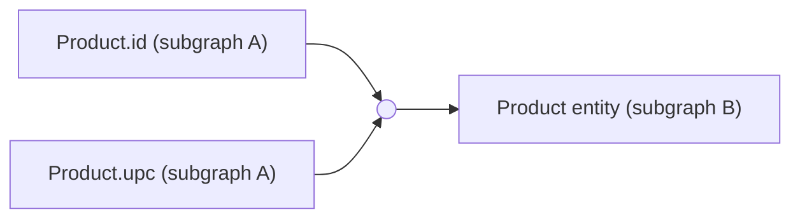

# Glossary

## How to read this glossary

This glossary supports the planner-v2 design documents (`FORMAL_SPEC.md`, `PROOFS.md`, `RESEARCH.md`). It assumes no background in graph theory -- every term is explained in plain English before any formalism is introduced.

If you are new to this material, read these eight terms in order before anything else: **graph** -> **directed graph** -> **hypergraph** -> **directed hypergraph** -> **hyperedge** -> **B-hyperedge** -> **hyperpath** -> **B-hyperpath**. Everything else in the planner-v2 spec is built on those eight ideas. Once you have them, jump to whatever term you're stuck on -- entries below are alphabetical and cross-reference each other by name.

Each entry has three parts:

- **Plain English** -- explains the idea without assuming you already know it, and without defining it in terms of itself.
- **Example** -- a tiny, concrete instance. For planner-relevant terms this is usually a GraphQL Federation scenario, since that's the domain planner-v2 operates in.
- **Why it matters here** -- connects the idea back to the actual design of the planner.

Terms are ordered alphabetically. Every term in this glossary exists because it is used, in bold on first use, somewhere in a planner-v2 document.

---

### A* Search

*Plain English*: A* is a pathfinding algorithm that finds the cheapest path between two points in a graph, similar to Dijkstra's algorithm, but it uses an extra piece of information -- a heuristic, a guess at "how much farther is left" -- to avoid exploring paths that can't possibly be the best. At every step it picks the frontier node whose (cost-so-far + estimated-cost-to-go) is lowest, so it tends to explore far fewer nodes than blind search while still guaranteeing the optimal answer, as long as the heuristic never overestimates (see admissible heuristic).

*Example*: Route-finding software uses A* to find the fastest driving route: the "cost so far" is time already driven, and the heuristic is straight-line distance to the destination divided by top speed -- an underestimate, since roads are never straighter or faster than that.

*Why it matters here*: planner-v2 frames query planning as a shortest path (technically shortest hyperpath) problem over a directed hypergraph of subgraphs and fields. A* with an admissible cost-underestimate heuristic is one of the candidate search strategies for keeping planning fast on large supergraphs, instead of exhaustively enumerating every hyperpath.

### Admissible Heuristic

*Plain English*: A heuristic is admissible if it never overestimates the true remaining cost to the goal. Underestimating is fine -- it just makes the search look at a few extra options -- but overestimating can cause an algorithm like A* search to skip over the actual best path, silently returning a wrong answer.

*Example*: Straight-line distance is an admissible heuristic for driving distance, because a real road route can never be shorter than a straight line. "Half the straight-line distance" is also admissible (it stays under the true cost), but "twice the straight-line distance" is not, since it can overestimate on very direct routes.

*Why it matters here*: Any A*-style search planner-v2 uses to prune the query-planning search space must use a heuristic proven admissible, or the optimality guarantee proved in PROOFS.md doesn't hold -- the planner could return a valid-but-not-cheapest plan without raising any error.

### AND/OR Graph

*Plain English*: An AND/OR graph represents problems where reaching a goal sometimes means solving one of several alternative sub-goals (an OR -- pick any one), and sometimes means solving all of several sub-goals together (an AND -- need every one). It generalizes an ordinary graph, where every edge is implicitly an OR-choice between alternatives.

*Example*: "Resolve the `reviews` field on `Product`" might be an OR node if two different subgraphs can each resolve it independently (pick either), while "resolve `Product` by its `@key(fields: "id upc")`" is an AND node, since satisfying that composite key requires fetching both `id` and `upc`, not just one.

*Why it matters here*: A directed hypergraph is one formalization of an AND/OR graph -- a B-hyperedge is exactly an AND-node's set of prerequisites collapsing into one outcome. planner-v2 models the "resolve this field, which may need several other fields resolved first" structure of federation as an AND/OR graph, i.e. a directed hypergraph.

### Asymptotic Complexity

*Plain English*: Asymptotic complexity describes how an algorithm's running time or memory use grows as the input gets arbitrarily large, ignoring constant factors and small-input behavior. It answers "if I double the input size, roughly how much slower does this get?" rather than "how many milliseconds does it take on my laptop."

*Example*: Checking every pair of fields in an operation with $n$ fields takes on the order of $n^2$ comparisons -- doubling $n$ roughly quadruples the work -- regardless of whether each comparison takes a nanosecond or a microsecond.

*Why it matters here*: PROOFS.md states the planner's running-time bounds asymptotically (see big-O notation) so the claims hold across hardware and across supergraphs of any size, not just the benchmark fixtures.

### B-hyperedge

*Plain English*: A B-hyperedge is a directed hyperedge with exactly one node as its head (its single output) but any number of nodes as its tail (its set of inputs), all of which must be available before the head becomes available. It's the "AND" shape: many prerequisites converging on one outcome, in contrast to an ordinary directed edge, which always has exactly one input and one output.

*Example*: A B-hyperedge with tail $\{\texttt{Product.id (subgraph A)}, \texttt{Product.upc (subgraph A)}\}$ and head $\texttt{Product entity (subgraph B)}$ says: "once you have both `id` and `upc` for a product from subgraph A, subgraph B can resolve the rest of that `Product` entity."

*Why it matters here*: B-hyperedges are the core building block of planner-v2's hypergraph model -- every "fetch this field/entity, given these prerequisites are already resolved" step in a federation query plan is represented as one B-hyperedge. The planner searches for the cheapest combination of B-hyperedges (a B-hyperpath) that resolves the whole operation.

### B-hyperpath

*Plain English*: A B-hyperpath is a hyperpath built entirely out of B-hyperedges: starting from some set of source nodes, you reach the goal node by following a sequence of B-hyperedges where every tail node is either a source or was already produced by an earlier B-hyperedge in the path. It's the hypergraph generalization of "a path from start to finish," except a single step can require several inputs at once, not just one.

*Example*: To resolve `Product.reviews` in a federated query, a B-hyperpath might be: (1) fetch `Product.id` from subgraph A, (2) fetch `Product.upc` from subgraph A, (3) apply the B-hyperedge `{id, upc} -> Product entity (subgraph B)`, (4) apply the B-hyperedge `{Product entity} -> reviews (subgraph B)`.

*Why it matters here*: A federation query plan *is* a B-hyperpath. planner-v2's central claim is that "find the cheapest valid query plan" is equivalent to "find the minimum-cost B-hyperpath from the available root fields to the requested fields" in the hypergraph model -- everything else in FORMAL_SPEC.md exists to make that equivalence precise and provable.

### Backward-closed

*Plain English*: A node set is backward-closed when, for every node in the set, every edge that can produce that node (every incoming edge) is included too -- along with all of that edge's input nodes. Nothing that could ever derive a member of the set is left outside it.

*Example*: Start from the field node `User.name (subgraph B)` and repeatedly collect every edge heading a collected node plus that edge's tails: the `User` object in B, the entity jump into it, the jump's key fields in A, their producing fields, and so on back to the operation roots. The collected set is the backward closure of `User.name (subgraph B)`.

*Why it matters here*: The operation-scoped settle domain (FORMAL_SPEC Section 6.5) is the backward closure of the operation's candidate nodes. Backward-closedness is exactly what makes the containment statement (PROOFS S1) a two-line induction -- every derivation of a scoped node lies inside the scope -- so settling only the scope provably changes no plan.

### Big-O Notation

*Plain English*: Big-O notation, written $O(f(n))$, is the standard shorthand for asymptotic complexity: it says a quantity grows no faster than $f(n)$ as $n$ gets large, ignoring constant multipliers. $O(n)$ means "roughly proportional to $n$"; $O(n^2)$ means "roughly proportional to $n$ squared"; $O(2^n)$ means it doubles with every additional unit of input -- usually a sign an algorithm is impractical for large inputs.

*Example*: Naively enumerating every possible query plan for an operation with $n$ resolvable fields, where each field might come from up to $k$ subgraphs, takes $O(k^n)$ time -- exponential, which is why the planner needs dynamic programming rather than brute force.

*Why it matters here*: Every complexity claim in PROOFS.md (for example, "the memoized planner runs in polynomial time in the size of the supergraph and the operation") is stated in big-O notation, and the proofs derive those bounds from the algorithm's structure rather than from measurement.

### Branch and Bound

*Plain English*: Branch and bound is a search strategy for optimization problems: explore the space of candidate solutions ("branch"), but as soon as you can prove a partial candidate can never beat the best complete solution found so far, stop exploring it ("bound") -- you don't need to finish building it to know it can't win.

*Example*: While planning a query, if a partially built plan X already costs more than a complete plan Y found earlier, the planner discards X immediately rather than finishing it, because adding more subgraph fetches can only make X's cost go up further.

*Why it matters here*: Branch and bound, together with dominance pruning, is one of planner-v2's two main techniques for keeping the hyperpath search tractable on large supergraphs -- it lets the planner skip large swaths of the search space without missing the optimal plan.

### Cardinality Estimation

*Plain English*: Cardinality estimation is the practice of predicting how many rows or items an operation will produce before actually running it, so a planner can choose cheaper strategies for operations expected to touch more data.

*Example*: A database query planner estimates that `WHERE country = 'US'` will match roughly 40% of rows based on stored statistics, and picks a full table scan over an index lookup because at that scale an index wouldn't save any work.

*Why it matters here*: planner-v2 borrows the concept from database query optimization: knowing that a field like `Product.reviews` typically resolves to hundreds of items (versus `Product.name`, always one) lets the cost function penalize fetch trees that put expensive-to-expand fields early, the same way a database planner avoids nested-loop joins over huge inputs.

### Completeness

*Plain English*: A search algorithm is complete if it is guaranteed to find a solution whenever one exists, rather than possibly giving up or looping forever on a solvable problem. Completeness says nothing about whether the solution found is any good -- only that the algorithm won't wrongly report "impossible."

*Example*: Depth-first search on a graph with cycles can be incomplete if it doesn't track visited nodes -- it may loop forever instead of finding a perfectly reachable goal. Adding a visited-set makes it complete.

*Why it matters here*: PROOFS.md proves the planner is complete: if a valid query plan exists for a given operation against a given supergraph, the planner is guaranteed to find *some* plan for it. Completeness is proved separately from optimality (finding the *best* plan) and soundness (every plan it returns is *valid*).

### Conditional Input

*Plain English*: A conditional input is a piece of data a computation would *use if it exists* but does not *require to run* -- its absence changes the result for the cases it would have covered, not whether the computation can happen at all. Contrast a hard input, whose absence blocks the computation outright.

*Example*: A `@requires(fields: "media { ... on Book { title } }")` field: `title` only exists when the instance's `media` is actually a `Book`. For a magazine-media product there is no title to gather -- the requiring field must still be resolvable, with the resolver seeing an absent optional value.

*Why it matters here*: AX-REQ-COND (FEDERATION_SEMANTICS_FORMAL Section 1.2) fixes fragment-conditioned `@requires` coordinates as conditional inputs: they contribute no static AND-tail to the D7pp requires-scoped jumps (a hard reading would make every member-conditioned requires unplannable for mixed populations), and D7pp(4) adds the rendering half -- the gathering document renders a conditioned branch only where it is resolvable, so a coordinate resolvable nowhere renders nowhere instead of producing an invalid fetch document.

### Cost Function

*Plain English*: A cost function is the specific formula that assigns a number to a candidate solution, used to compare candidates and pick the cheapest. It's the concrete implementation of a cost model -- the cost model says what factors matter, the cost function says exactly how they combine into one number.

*Example*: `cost(fetch) = latency_ms(fetch) + 0.01 * expected_response_bytes(fetch) + 100 * num_round_trips(fetch)` is one possible cost function: it converts three different kinds of cost into a single comparable number.

*Why it matters here*: planner-v2 assigns each B-hyperedge a weight computed by a cost function, and the weight of a B-hyperpath is (by definition, proven in PROOFS.md) the combination of its edges' weights -- this is what lets "cheapest query plan" reduce to "minimum-weight B-hyperpath," a well-studied hypergraph problem.

### Cost Model

*Plain English*: A cost model is the set of assumptions about what makes one solution more expensive than another -- which factors matter (time? data size? number of network calls?) and roughly how they combine -- before those assumptions are turned into an exact formula (a cost function).

*Example*: "Fewer subgraph round trips is better, and among plans with equal round trips, less total response payload is better" is a cost model; it doesn't yet specify a formula, just a priority ordering of concerns.

*Why it matters here*: planner-v2 needs an explicit, documented cost model so "optimal plan" has an agreed meaning -- without one, two engineers could disagree about which of two valid query plans is actually better, and the optimality proofs in PROOFS.md would have no fixed target to be proofs about.

### Dead Member

*Plain English*: A dead member is a concrete type option under an abstract-typed field position that no subgraph able to supply that position can ever actually produce -- the client asked "and if this thing is a `C`, give me..." at a position where the answer can never be a `C`.

*Example*: `nodes { ... on Oven { id } }` where the only subgraph resolving `Query.nodes` declares `Node`'s implementers as `{Toaster}`: whatever comes back from `nodes` is never an `Oven`, so the `... on Oven` branch is dead at this position -- even though `Oven` exists (and is an entity) in another subgraph.

*Why it matters here*: FORMAL_SPEC D6pp exempts a dead member's goals from the hyperpath cover regardless of entity-ness -- an entity jump can move an existing instance between subgraphs but cannot manufacture a parent instance of a type the position cannot produce. Before D6pp these goals were served through D10 fall-back routes that emitted the member's fragment against a subgraph that does not declare it, which the subgraph rejects (the class-D live-422 signature).

### Defer Descriptor

*Plain English*: A defer descriptor is the bookkeeping record the plan keeps for one `@defer` fragment: its numeric id, the id of the `@defer` fragment it is nested inside (0 for a top-level one), the client's optional label, and the response path where the fragment is mounted. It is how the executor knows what to announce as `pending`, where each incremental payload inserts, and which parent must be delivered before which child.

*Example*: For `query { user { name ... @defer { title } } }` the single descriptor is `(id=1, parent=0, label="", path=["user"])`: the initial response announces `{"id":"1","path":["user"]}` as pending, and the increment delivering `title` inserts at `user` and completes id 1.

*Why it matters here*: FORMAL_SPEC D11.13 has the obligation layer record descriptors while reading the normalized operation's `@__defer_internal` stamps, and lowering re-encodes them verbatim as `resolve.DeferDescriptor` -- the structure v1's postprocess `build_defer_tree` and the resolver's incremental delivery already consume, so the resolve machinery runs planner-v2 defer plans unchanged.

### Defer Scope

*Plain English*: The defer scope of a field is the numeric id of the `@defer` fragment it belongs to, with 0 meaning "not deferred -- deliver in the initial response". Every field in an operation has exactly one scope, and the scope decides *when* the field's data is delivered, never *where* it is fetched from.

*Example*: In `query { user { name ... @defer { title } } }`, `user` and `name` have scope 0 (initial response) and `title` has scope 1 (delivered later as an incremental payload). A nested `@defer` inside the fragment would open scope 2 with parent scope 1.

*Why it matters here*: FORMAL_SPEC D11.13 carries the scope on each field obligation and keys fetch groups by it (see scope variant), so deferred selections partition into their own fetches while the search stays scope-blind -- routing is identical to the undeferred operation, which is exactly the FS-DEF-6 obligation.

### Differential Testing

*Plain English*: Differential testing checks a program for bugs by running two or more independent implementations of supposedly-the-same behavior on the same inputs and comparing their outputs -- any disagreement is a bug in at least one of them, even without knowing the "correct" answer in advance.

*Example*: Running the same GraphQL operation through both the existing (v1) query planner and the new hypergraph-based (v2) planner, then asserting they produce plans with equivalent results, catches regressions that neither planner's own unit tests would have covered.

*Why it matters here*: Because a from-scratch planner rewrite risks silently changing behavior on real-world queries no test suite anticipated, planner-v2's validation strategy leans on differential testing against the existing planner and against reference subgraph execution, not just hand-written unit tests.

### Dijkstra's Algorithm

*Plain English*: Dijkstra's algorithm finds the cheapest path from a start node to every other node in a graph with non-negative edge weights, by repeatedly picking the closest not-yet-finalized node, finalizing its shortest known distance, and using it to possibly shorten the estimated distance to its neighbors. It's the classical baseline algorithm for the shortest path problem.

*Example*: Finding the cheapest sequence of flight connections from city A to city Z, where each flight has a price, is exactly Dijkstra's algorithm run on a graph where cities are nodes and flights are weighted edges.

*Why it matters here*: Dijkstra's algorithm doesn't directly apply to hypergraphs -- its "relax an edge" step assumes one input and one output -- but planner-v2's hyperpath search algorithm is a generalization of it to B-hyperedges, and PROOFS.md leans on Dijkstra's original correctness argument as the template for proving the generalized version correct.

### Directed Graph

*Plain English*: A directed graph is a graph where edges have a direction -- an edge from A to B is not the same as an edge from B to A, the same way a one-way street can be walked in one direction but not the other.

*Example*: "Subgraph A can resolve `Product.id`" and "resolving `Product.id` from subgraph A enables resolving the `Product` entity in subgraph B" are naturally directed relationships -- you can go from having the id to having the entity, not the reverse.

*Why it matters here*: Federation dependencies are inherently directed (you resolve prerequisite fields before dependent ones), so planner-v2 builds on a directed hypergraph rather than an undirected one -- undirected structures can't represent "A enables B" without also implying "B enables A."

### Directed Hypergraph

*Plain English*: A directed hypergraph generalizes a directed graph the same way a hypergraph generalizes a graph: instead of edges connecting exactly one source to one target, hyperedges connect a *set* of source nodes to a *set* (or, for the B-hyperedge restriction planner-v2 uses, exactly one) target node, with direction going from tail (inputs) to head (output).

*Example*: The federation dependency "resolving the `Product` entity needs both `Product.id` and `Product.upc` already resolved" cannot be expressed as two ordinary directed edges without losing the "needs both together" constraint -- it needs one directed hyperedge with a two-node tail.

*Why it matters here*: This is the central data structure of planner-v2. The whole supergraph -- subgraphs, fields, entity keys, and how they enable resolving each other -- is modeled as one directed hypergraph, and query planning becomes the well-studied problem of finding a minimum-cost hyperpath through it.

### Directed Steiner Tree

*Plain English*: The Directed Steiner Tree problem asks for the cheapest set of directed edges that connects a single root to a given set of target nodes, where intermediate ("Steiner") nodes may be used freely to share cost between targets. It is NP-hard, and even approximating it well is hard: no polynomial-time algorithm is known that gets within a small factor of optimal, and the best known result is only a quasi-polynomial approximation.

*Example*: Choosing the cheapest set of shared subgraph fetches that together resolve five different leaf fields -- where two leaves might reuse one common upstream fetch -- is a Directed Steiner Tree over the fetch dependency hypergraph: the shared fetch is a Steiner node whose cost should be paid once but benefits several targets.

*Why it matters here*: This is the exact problem planner-v2 hits the moment it tries to jointly optimize fetch sharing across sibling branches or a whole operation (see hyperpath cover). It sits on the NP-hard side of the tractability boundary, so planner-v2 claims exact optimality only per resolution obligation and treats cross-branch fetch merging as a separately bounded, explicitly signalled, approximate pass -- never as an unqualified "the planner finds the jointly optimal shared plan."

### Distributed Member

*Plain English*: A distributed member is a concrete type option under an abstract-typed field position that only *some* of the subgraphs able to supply that position can produce -- the abstract type's members are spread across different subgraphs, so which members are even possible depends on which subgraph answers.

*Example*: `viewer { media { ... on Movie { title } } }` where `Viewer.media` is shareable between subgraph a (whose `ViewerMedia` is `Book | Song`) and subgraph b (`Book | Movie`): `Movie` is a distributed member -- possible via b, impossible via a -- so its selection must ride a route through b.

*Why it matters here*: This is the class-D shape (distributed abstract-member expansion). FORMAL_SPEC D6pp keeps a distributed member's goals in the cover but constrains their covering walks to a member-declaring subgraph (the D10 member-scoped kappa mask), and D11.7 places the member's fragment only into fetches whose subgraph declares it at that position -- closing the audit's `union-interface-distributed` / `union-intersection` gaps and the router-verified 422 class.

### Dominance Pruning

*Plain English*: Dominance pruning discards a candidate solution once another candidate is found that is at least as good in every way that matters and reaches the same state -- the dominated candidate can never end up in the final optimal answer, so there's no need to keep exploring from it.

*Example*: If two partial query plans both resolve exactly the fields `{id, name}` on `Product`, but plan X does it with one subgraph round trip and plan Y needs two, plan Y is dominated by plan X (assuming fewer round trips is never worse) and can be dropped immediately.

*Why it matters here*: This is the second of planner-v2's two main pruning techniques, alongside branch and bound. It's borrowed from the "memo" structure used in database query optimizers like Cascades: group candidate plans by the state they produce, and keep only the non-dominated ones per group.

### DPhyp

*Plain English*: DPhyp (Moerkotte & Neumann, 2008) is a dynamic-programming algorithm for choosing the best join order over a hypergraph of join predicates. Instead of enumerating the full powerset of relations, it enumerates only connected subgraphs paired with their connected complements (the "csg-cmp" pairs), which are exactly the combinations that correspond to valid joins. It generalizes the earlier DPccp algorithm, which only handled ordinary (pairwise-edge) join graphs.

*Example*: For a supergraph whose entity dependencies form a sparse chain or star, DPhyp visits only the handful of connected fetch groupings that can actually be composed, rather than every conceivable subset of subgraph fetches -- its cost is driven by the number of connected subgraphs in the real dependency graph, not by 2 raised to the field count.

*Why it matters here*: Because planner-v2's model is already a directed hypergraph, DPhyp is close to the literal enumeration algorithm to reuse for the search core. It gives completeness (every optimal plan is considered) while staying output-sensitive on the typically sparse federation dependency graph, and it backs the memoized dynamic-programming core rather than a bespoke enumeration scheme.

### Dynamic Programming

*Plain English*: Dynamic programming solves a large problem by breaking it into overlapping smaller subproblems, solving each subproblem exactly once, and reusing (memoization) that stored result whenever the same subproblem shows up again -- instead of recomputing it from scratch each time.

*Example*: Computing the cheapest way to resolve `Product.reviews.author.name` involves resolving `Product.reviews.author` as a subproblem, which may be needed again for `Product.reviews.author.email` in the same operation -- dynamic programming solves it once and reuses the answer for both.

*Why it matters here*: planner-v2's core algorithm is a dynamic program over the directed hypergraph: because the same field-resolution "subproblem" recurs across different branches of a query, memoizing the cheapest way to resolve each node avoids the exponential blowup of a naive recursive search.

### EDFS

*Plain English*: EDFS (Event-Driven Federated Subscriptions) is WunderGraph/Cosmo's mechanism for backing a GraphQL root field with a message-broker event stream -- Kafka or NATS -- instead of an HTTP subgraph. Composition marks such fields with the `@edfs__natsSubscribe`, `@edfs__kafkaSubscribe`, `@edfs__natsPublish`, `@edfs__kafkaPublish`, and `@edfs__natsRequest` directives.

*Example*: `type Subscription { productUpdated(id: ID!): Product @edfs__natsSubscribe(subjects: ["products.{{ args.id }}"]) }` makes `productUpdated` deliver an event each time a message lands on the NATS subject `products.<id>`, with the payload shaped as the composed `Product` type.

*Why it matters here*: An EDFS root is a first-class root entrance whose datasource owns no HTTP endpoint and, in the router config, no SDL of its own -- so the composed schema is the sole authority for its payload type (FORMAL_SPEC.md D5-EDFS), and its trigger transport is a broker binding rather than WebSocket/SSE (D11.12-EDFS). It is the datasource-kind analogue of an ordinary subscription and the sole capability-model extension of the EDFS wave.

### Edge

*Plain English*: An edge is a connection between two nodes in a graph, representing some relationship between them -- "these two things are linked" in the simplest, undirected case, or "this leads to that" in a directed graph.

*Example*: In a graph of subgraphs, an edge between subgraph A and subgraph B might represent "these two subgraphs share an entity type."

*Why it matters here*: An edge is the special case of a hyperedge whose tail and head each contain exactly one node; understanding ordinary edges first makes the jump to hyperedges, which can have many-node tails, much easier.

### Entity

*Plain English*: In GraphQL Federation, an entity is a type that can be resolved and extended across multiple subgraphs, identified by one or more `@key` fields that let different subgraphs agree they're talking about "the same" object even though each subgraph only knows part of it.

*Example*: A `Product` type might be an entity with `@key(fields: "id")`: subgraph A defines its `id`, `name`, and `price`, while subgraph B independently defines `id` and `reviews` for the same `Product` -- the router stitches the two together using the shared `id`.

*Why it matters here*: Entities are why federation query planning needs a hypergraph in the first place -- resolving an entity's fields from a second subgraph requires *all* of its key fields as prerequisites (a B-hyperedge with a multi-node tail when the key is composite), which an ordinary graph edge cannot represent.

### Entity Jump

*Plain English*: An entity jump is the act of moving from resolving fields on an entity in one subgraph to resolving further fields on that same entity in a different subgraph, using the entity's key to "jump" the resolution across the subgraph boundary.

*Example*: Having resolved `Product.id` and `Product.name` from subgraph A, an entity jump to subgraph B (which requires only `id`) lets the planner also resolve `Product.reviews` from B for the same `Product` object, without re-fetching anything already known.

*Why it matters here*: Every entity jump in the query plan corresponds to a B-hyperedge in planner-v2's hypergraph whose tail is the entity's key fields and whose head is "this entity, resolvable in the target subgraph." Counting and costing entity jumps, since each is generally a network round trip, is a major factor in the cost function.

### Event Source

*Plain English*: An event source is the datasource behind an EDFS root field: a Kafka/NATS provider configuration (a provider id, an event type -- publish, subscribe, or request -- and the topics or subjects to bind) that resolves events from a message broker rather than issuing HTTP requests to a subgraph server.

*Example*: An event source for `productUpdated` might be "NATS provider `default`, SUBSCRIBE, subject `products.{{ args.id }}`" -- at request time the client's `id` argument is templated into the subject and the router opens a subscription on that subject.

*Why it matters here*: An event source has no upstream SDL of its own, so the hypergraph builder resolves its root field's output type from the composed schema (FORMAL_SPEC.md D5-EDFS) and lowering binds the pub/sub trigger transport (D11.12-EDFS) instead of an HTTP subscription. At the search layer an event-source root entrance is indistinguishable from an HTTP one -- the difference is entirely a transport concern.

### F-hyperedge

*Plain English*: An F-hyperedge (also called an F-arc) is the mirror image of a B-hyperedge: it has exactly one input node (its tail) but any number of output nodes (its head set), read as "this single thing produces all of these outcomes as one unit." Although F- and B-hyperedges are formal transposes of one another, the tractability does not carry over: finding a shortest hyperpath in a hypergraph built from F-hyperedges is NP-hard even when the hypergraph is acyclic, whereas the B-hyperedge case is polynomial.

*Example*: Modeling "one subgraph fetch returns `Product.name`, `Product.price`, and `Product.brand` as a single unit with one joint cost, and the planner chooses among them downstream" as one edge with three head nodes is an F-hyperedge. Modeling the same fetch as three separate B-hyperedges -- one per produced field, each sharing the same tail -- captures the same capability while staying in the tractable class.

*Why it matters here*: planner-v2's model definition forbids multi-head hyperedges: every "fetch produces several results" case is decomposed into independent B-hyperedges per produced node. Encoding OR-fan-out as a first-class F-hyperedge would silently move the planner from the polynomial Shortest B-Tree class into NP-hard territory -- a modeling choice, not an implementation detail, is what keeps the optimality proof alive.

### Fetch Merging

*Plain English*: Fetch merging is the optional post-search step that takes a plan's chosen fetches and combines ones that could be issued as a single subgraph call -- for example two fetches to the same subgraph, for the same entity, with compatible inputs -- so the router makes fewer round trips. Doing this *optimally* across an entire operation (deciding which of many sibling fetches to share) is the NP-hard Directed Steiner Tree problem; doing it *conservatively* (merge only fetches that are already textually identical) is cheap and exact.

*Example*: Two sibling fields both jump to the `reviews` subgraph for the same `Product` by its `id`. A syntactic fetch merge collapses the two identical `_entities` calls into one; a hypothetical *optimizing* merge that reshaped fetches to invent new sharing across differently-keyed branches would be solving a Steiner-tree instance.

*Why it matters here*: planner-v2 draws its tractability boundary here. The per-resolution-obligation Shortest B-Tree search is exact and polynomial, but joint cross-branch fetch merging is NP-hard, so FORMAL_SPEC.md makes fetch merging a *separate, explicitly bounded* phase after the search -- conservative syntactic dedup in M0 (exact for that relation), with any future optimizing merge required to carry a stated approximation bound and an explicit signal, never a silent degrade.

### Fetch Tree

*Plain English*: A fetch tree is the executable, ordered structure a query planner ultimately hands to the router: a tree of "fetch this data from this subgraph, using this input" steps, with parent-child edges representing "must happen before" dependencies, ready to be executed against real subgraphs.

*Example*: A fetch tree for a `Product` query might have a root fetch to subgraph A for `{id, name}`, with a child fetch to subgraph B for `{reviews}` keyed by the `id` returned from the root.

*Why it matters here*: A fetch tree is the physical plan planner-v2 produces at the end of planning -- it's what you get after choosing one B-hyperpath through the hypergraph and lowering it into an executable, ordered structure. The hyperpath is the *what, conceptually*; the fetch tree is *what to literally send over the network, and when*.

### Field-resolution Node

*Plain English*: A field-resolution node is the second of planner-v2's two node sorts: it stands for "field *f* resolved on an instance of type *T* by subgraph *s*" -- written *(T,s).f*. Where an object node says "we are positioned at a *T*," a field-resolution node says "and *f* has now been produced here, by this subgraph."

*Example*: `(Product, A).id` is the field-resolution node for `Product.id` in subgraph A. A `Field` edge `(Product, A) --id--> (Product, A).id` produces it; an entity jump keyed on `id` then names `(Product, A).id` among its tail prerequisites, and `(Product, A).name` is a *separate* node with its own cost.

*Why it matters here*: FORMAL_SPEC.md's D4 makes these first-class so that obligations, entity-jump key/`@requires` tails (D7), and the goal test all refer to well-defined nodes rather than to bare types. It is what makes distinct scalars individually addressable and lets the same field resolved by two subgraphs carry two different costs -- the precision the single-node-sort model lacked.

### Fixpoint

*Plain English*: A fixpoint of a function is a value that the function maps to itself: $f(x) = x$. In algorithms that repeatedly apply some update rule, reaching a fixpoint means applying the rule again produces no further change, which is often how you know an iterative computation is finished.

*Example*: Repeatedly applying "add any field reachable from an already-resolved field" to a set of resolvable fields eventually stops growing the set -- that stable set is the fixpoint, and it represents everything that operation can possibly resolve.

*Why it matters here*: Some of planner-v2's reachability analyses, such as "which fields can ever be resolved, given the supergraph's hyperedges," are naturally expressed as computing a fixpoint of a monotonic "expand the resolvable set" function, and PROOFS.md uses fixpoint arguments to show these computations terminate and are correct.

### Folded DAG

*Plain English*: A folded DAG is what you get when a tree with repeated identical subtrees is collapsed so each distinct sub-structure is stored once and pointed to by every place that uses it -- turning a tree into a directed acyclic graph with shared, reconvergent nodes. Costs must then be computed over the folded structure, counting each shared piece a single time, rather than over the unfolded tree, which would count it once per occurrence.

*Example*: Two sibling fields whose plans both depend on the same upstream `Product` entity fetch share that fetch. On the unfolded tree the fetch appears twice; on the folded DAG it is one node with two parents, and its cost is added to the total exactly once.

*Why it matters here*: The Martelli-Montanari "additive AND/OR graph" caveat says naive tree-sum cost accounting silently over-counts shared sub-hyperpaths, producing wrong costs and suboptimal plan choices -- a correctness bug, not just a slowdown. planner-v2 defines B-hyperpath weight over the folded DAG with per-node memoization, and states "each shared sub-hyperpath contributes its weight once" as an explicit invariant.

### Graph

*Plain English*: A graph is a collection of nodes (also called vertices) and edges connecting pairs of them. It's the simplest way to represent "things and the relationships between exactly two things at a time" -- friendships, road connections, wiring diagrams.

*Example*: A graph of GraphQL types could have a node for `Product` and a node for `Review`, connected by an edge representing the `Product.reviews` field.

*Why it matters here*: Graph is the base concept everything else in this glossary builds on. planner-v2 does *not* use plain graphs for its core model -- it needs hypergraphs, because federation dependencies often involve more than two things at once -- but graph vocabulary (node, edge, path) carries over directly.

### Horn Clause

*Plain English*: A Horn clause is a logical rule of the form "if all of these facts hold, then this one new fact holds" -- any number of conditions in the body, but exactly one conclusion in the head. A set of Horn clauses plus some starting facts has a unique minimal model: the smallest set of facts you can derive by repeatedly firing rules whose bodies are already satisfied (forward chaining).

*Example*: "If `Product.id` and `Product.upc` are resolved, then the `Product` entity is resolvable in subgraph B" is a Horn clause. Its body is the two key fields; its head is the resolvable entity. A federation plan is valid exactly when the "response fully resolved" fact is in the minimal model of all such fetch clauses given the root fields as starting facts.

*Why it matters here*: A B-hyperedge is exactly a Horn clause (tail = body, single head = conclusion), so a B-hypergraph is a Horn theory. This lets planner-v2 state "this plan is valid" as "the target atom is in the minimal model" and "this is the cheapest valid plan" as "this is the minimum-cost derivation," borrowing decades of soundness/completeness proof machinery for forward chaining instead of reinventing it.

### Hyperedge

*Plain English*: A hyperedge generalizes an ordinary edge by allowing it to connect *any number* of nodes at once, not just exactly two. An ordinary edge is a hyperedge with exactly two nodes.

*Example*: A hyperedge $\{A, B, C\}$ could represent "these three subgraphs jointly define overlapping fields on the same entity" -- a three-way relationship an ordinary edge, which always has exactly two nodes, cannot express.

*Why it matters here*: Hyperedge is the general concept; planner-v2 uses a directed, restricted form of it (the B-hyperedge) as its fundamental unit, because federation dependencies are naturally "several things together enable one outcome," not just pairwise.

### Hypergraph

*Plain English*: A hypergraph generalizes a graph by allowing each hyperedge to connect any number of nodes, instead of restricting every edge to exactly two. It's the right structure whenever relationships naturally involve groups of things at once, not just pairs.

*Example*: In a hypergraph over GraphQL fields, a hyperedge might connect `{Product.id, Product.upc}` together to represent "these two fields, together, are the composite key needed to resolve this entity elsewhere" -- a relationship a plain graph can't capture in one edge.

*Why it matters here*: This is the reason planner-v2 exists in its current form: earlier planner designs modeled federation dependencies as an ordinary graph and had to work around cases (composite keys, multi-field requirements) that don't fit a graph naturally. Moving to a hypergraph lets those cases be represented directly instead of as special-cased workarounds.

### Hyperpath

*Plain English*: A hyperpath is the hypergraph generalization of a path: a sequence of hyperedges that gets you from a set of starting nodes to a goal node, where each hyperedge in the sequence can only be used once all of the nodes it needs are already reachable -- from earlier steps in the hyperpath, or from the starting set.

*Example*: Reaching `Review.author.name` might require a hyperpath: first reach `Review.authorId` (a starting node), then use one hyperedge to reach the `User` entity via that id, then another hyperedge to reach `User.name`.

*Why it matters here*: A hyperpath is the general form; planner-v2 restricts attention to B-hyperpaths (hyperpaths built from B-hyperedges specifically), because those correspond exactly to valid, executable federation query plans.

### Hyperpath Cover

*Plain English*: A hyperpath cover for a set of goal nodes is a collection of hyperpaths that, together, reach every node in that goal set -- it's what you need when a single hyperpath, which has one target, isn't enough because you're trying to resolve several different requested fields at once.

*Example*: A GraphQL operation requesting both `Product.name` and `Product.reviews` needs a hyperpath cover of two hyperpaths, one per requested field, which may however share earlier steps, like resolving `Product.id` once and reusing it for both.

*Why it matters here*: A real GraphQL operation almost always requests multiple fields, so planner-v2's actual planning problem is "find the minimum-cost hyperpath cover for the operation's requested fields," not just a single hyperpath -- and the shared-prefix reuse in the example above is exactly what dynamic programming's memoization is exploiting.

### Induction Hypothesis

*Plain English*: In a proof by induction, the induction hypothesis is the assumption -- made temporarily, while proving the inductive step -- that the statement being proved already holds for all smaller cases. The proof's remaining job is to show the statement must then also hold for the next larger case; the base case plus that step covers everything.

*Example*: Proving "every settled node's cost label is exact" by induction on the order nodes settle, the induction hypothesis at step $k$ is "the first $k-1$ settled nodes all carry exact labels," and the inductive step shows node $k$'s label must then be exact as well.

*Why it matters here*: Nearly every proof in PROOFS.md -- walk validity, label exactness, termination, response-shape preservation -- is an induction over settle order, derivation height, or selection-tree structure, and each proof names its induction hypothesis explicitly so a reader can check exactly what is assumed and where it is used.

### Invariant

*Plain English*: An invariant is a property that stays true throughout some process, no matter which path the process takes through its steps -- it's a fact you can rely on at every point, not just at the start or the end.

*Example*: "The set of resolved fields only ever grows, never shrinks" is an invariant of the planning algorithm -- true before the first step, true after every step, true at the end.

*Why it matters here*: PROOFS.md establishes soundness and completeness by identifying invariants the planning algorithm maintains at every step, such as "every partial plan produced is executable given what's been resolved so far," and showing they still hold at termination, which is what makes the final answer trustworthy.

### Lattice

*Plain English*: A lattice is a partial order in which every pair of elements has both a well-defined "least upper bound" (a smallest element that is $\ge$ both of them) and a well-defined "greatest lower bound" (a largest element that is $\le$ both). It's a partial order with enough extra structure that "combine these two things" always has a sensible, unique answer.

*Example*: For sets ordered by "is a subset of," the least upper bound of two sets is their union, and the greatest lower bound is their intersection -- always well-defined, which makes subsets-under- subseteq  a lattice.

*Why it matters here*: The set of "fields resolved so far" during planning, ordered by subset, forms a lattice; combining the results of two independent sub-searches (union of what each resolved) is well-defined because of that lattice structure, which PROOFS.md relies on when arguing that merging partial plans is safe.

### Lemma

*Plain English*: A lemma is a small proven fact used as a stepping stone toward proving a bigger, more interesting theorem -- usually not important on its own, but the main proof would be too large or unclear without breaking it out separately.

*Example*: Before proving "the planner always finds the optimal plan" (a theorem), PROOFS.md might first prove a lemma like "merging two non-dominated partial plans never discards the optimal one," and then use that lemma directly inside the bigger proof.

*Why it matters here*: PROOFS.md is structured as a sequence of lemmas building up to the main soundness, completeness, and optimality theorems -- reading the lemmas in order is the intended way to verify the planner's correctness claims without re-deriving everything from scratch each time.

### Logical Plan

*Plain English*: A logical plan describes *what* needs to happen to answer a query -- which data needs to come from where, and in what dependency order -- without committing to exactly *how* it will be executed, such as batching, request format, or connection reuse. It's an abstract, implementation-independent description.

*Example*: "Resolve `Product` from subgraph A, then resolve `reviews` on it from subgraph B" is a logical plan; it doesn't say whether that's one HTTP request or ten, or whether reviews for multiple products get batched into a single subgraph call.

*Why it matters here*: planner-v2's hyperpath *is* the logical plan -- it says which B-hyperedges get used and in what dependency order, but the actual network-level execution details are decided afterward, during lowering into a physical plan, the fetch tree.

### Loop Invariant

*Plain English*: A loop invariant is a property that is true before a loop starts and is preserved by every single iteration, so it is guaranteed to still be true when the loop exits. It is the standard tool for proving something about what an iterative algorithm has computed by the time it stops: establish the invariant once, show each iteration keeps it, then read the conclusion off at termination.

*Example*: "Every edge in the ready queue has all of its tail nodes already settled" is a loop invariant of the settle loop -- true initially, because only edges whose tails are all roots get enqueued, and preserved by each iteration, because an edge is enqueued only at the moment its last outstanding tail settles.

*Why it matters here*: PROOFS.md proves the exactness of SETTLE's cost labels by maintaining a three-part loop invariant across iterations of the settle loop; the optimality theorem at loop exit is that invariant read off at termination, exactly as in Dijkstra-style correctness arguments.

### Lowering

*Plain English*: Lowering is the process of translating a more abstract representation of a computation into a more concrete, closer-to-execution one, typically making implementation choices, like batching or request shape, that the abstract version deliberately left open.

*Example*: A compiler "lowers" a high-level `for` loop into low-level machine instructions; similarly, a query planner "lowers" an abstract logical plan into the exact HTTP requests that will be sent to each subgraph.

*Why it matters here*: planner-v2 separates hyperpath search, finding the abstract cheapest logical plan, from lowering, turning that hyperpath into the concrete fetch tree the router executes. Keeping these separate is what lets the correctness proofs in PROOFS.md stay about the abstract hyperpath, without getting entangled in transport-level details.

### Memo (Cascades)

*Plain English*: In the Cascades-style query optimization architecture used by many database engines, a memo is a data structure that stores all the different ways discovered so far to compute the same logical result, grouped together, so that equivalent sub-plans are only explored once and dominance pruning can compare candidates within the same group directly.

*Example*: A database memo might group together three different join orders that all compute "customers who ordered in 2024," so the optimizer can compare their costs and discard the two more expensive ones without re-deriving that they compute the same thing.

*Why it matters here*: planner-v2's memoization table, used by its dynamic programming algorithm, plays exactly the Cascades memo's role: it groups all discovered ways to resolve the same hypergraph node, so dominance pruning and reuse work the same way a mature database optimizer's would.

### Memoization

*Plain English*: Memoization is the technique of caching the result of a computation the first time it's done, keyed by its inputs, so that any later call with the same inputs can return the stored result instead of recomputing it.

*Example*: If resolving `Product.id -> Product entity in subgraph B` has already been computed and costed once, a memoized planner looks up that stored result the next time the same subproblem appears, instead of redoing the search.

*Why it matters here*: Memoization is what turns planner-v2's dynamic programming recursion from exponential to polynomial time -- it's the mechanism, while dynamic programming is the overall strategy that relies on it.

### Member-qualified Position Key

*Plain English*: A member-qualified position key is a fetch-grouping identifier for a response position that includes not only the dotted response path but also which `... on Member` fragments the selection sits under -- so the same response path selected under two different concrete members counts as two distinct positions for grouping purposes.

*Example*: In `me { history { ... on Purchase { wallet { currency } } ... on Sale { product { upc } } } }`, the response path of both member subtrees passes through `me.history`, but their member-qualified keys differ (`me.history.~Purchase.wallet` vs `me.history.~Sale.product`), so each member's fields can be attributed to the fetch group that actually resolves them.

*Why it matters here*: FORMAL_SPEC D11.7 -- lowering keys fetch groups and position attributions by member-qualified keys, which is what lets a distributed member's leaves re-root into the member-declaring subgraph's fetch with correct `... on Member` wrapping, while wire-level `ResponsePath`/`FetchPath` values stay plain response paths (the response itself has no member segments).

### Model Checking

*Plain English*: Model checking is an automated technique for verifying that a system satisfies a given property by exhaustively, or near-exhaustively, exploring its possible states, rather than by hand-written proof -- a tool checks every reachable state instead of a human reasoning about all of them.

*Example*: A model checker could exhaustively simulate every possible ordering of subgraph responses arriving, to check that a query plan's result-merging logic never produces a malformed response across all interleavings, not just the ones a test happened to try.

*Why it matters here*: Alongside hand-written proofs in PROOFS.md, planner-v2's verification strategy uses model checking, via TLA+, on a small, abstracted version of the planning algorithm to catch correctness issues, such as ordering bugs, that are easy to miss in a manual proof but cheap for a tool to exhaustively check.

### Monotonicity

*Plain English*: Monotonicity is the property of only ever moving in one direction: for a function, making an input larger never makes the output smaller; for a process, a growing set only ever grows. A monotone rule can be relied on not to "undo" progress when its inputs change in one direction.

*Example*: The cost-combination rules sum and max are both monotone -- raising any prerequisite's cost can only raise, never lower, the combined cost of the thing that depends on it. A rule like "cost drops when two prerequisites happen to batch together" is not monotone.

*Why it matters here*: Monotonicity is the load-bearing half of the superior value function precondition: SETTLE's greedy settle-in-cost-order argument, and with it the optimality proof in PROOFS.md, is valid only because the cost of a head can never drop when a tail gets more expensive.

### Node

*Plain English*: A node, also called a vertex, is one of the basic "things" in a graph or hypergraph -- edges and hyperedges connect nodes together, but a node by itself is just a single labeled point.

*Example*: In planner-v2's hypergraph, a node typically represents a single resolvable piece of data, like "`Product.id` as resolved by subgraph A" or "the `Product` entity as resolvable by subgraph B."

*Why it matters here*: Nodes are the vocabulary's smallest unit -- everything else (edge, hyperedge, hyperpath) is defined in terms of connections between nodes, so getting a precise picture of what a "node" represents in the planner-v2 model -- a resolvable field or entity in a specific subgraph, not just a GraphQL type -- is foundational to reading FORMAL_SPEC.md.

### NP-hard

*Plain English*: A problem is NP-hard if it's at least as hard as the hardest problems whose solutions can be quickly checked once found, even though finding them might take impractically long -- informally, "no known algorithm solves every instance efficiently." It doesn't mean every instance is slow, just that no algorithm is known, or believed to exist, that's fast on *all* instances.

*Example*: Finding the shortest route that visits every city in a list exactly once (the traveling salesman problem) is NP-hard: checking a proposed route's total length is fast, but finding the provably shortest one in the worst case is believed to require exploring an exponential number of possibilities.

*Why it matters here*: Some general versions of the hyperpath cover problem are NP-hard in the worst case, which is exactly why planner-v2 relies on dynamic programming, dominance pruning, and branch and bound rather than promising an always-fast exact algorithm -- PROOFS.md is explicit about which restricted cases stay in polynomial time and which don't.

### Object Node

*Plain English*: An object node is the first of planner-v2's two node sorts: it stands for "an instance of a GraphQL type *T*, as seen by one subgraph *s*" -- written *(T,s)*. On its own it carries no field; it just says "we are positioned at a *T*-shaped value inside subgraph *s*," the anchor you then sub-select fields from.

*Example*: `(Product, A)` is the object node for the `Product` type in subgraph A. Entering A's `product` root field, or jumping into A via a `Product` key, lands the search on `(Product, A)`; from there `Field` edges branch off to individual field-resolution nodes.

*Why it matters here*: FORMAL_SPEC.md's D4 fixes exactly two node sorts, and the object node is the one that represents *being at* a type instance rather than *having resolved* a field. Entity-jump heads (D7) are object nodes and descent edges (D5) land on them, so keeping object nodes distinct from field-resolution nodes is what lets the model say "resolve field *f* here" versus "we are now positioned at a *U*" without conflating the two.

### Obligation Tree

*Plain English*: An obligation tree is the client operation re-expressed as a tree of resolution obligations: one node per requested field (and per abstract-type refinement), parented by the field it is nested under, so that "resolve the whole operation" becomes "discharge every node of this tree." It mirrors the shape of the operation's selection set, but talks about *what must be resolved* rather than *how the response is shaped*.

*Example*: The operation `{ product { name reviews { author } } }` becomes an obligation tree rooted at `product`, with children `name` and `reviews`, and `reviews` having its own child `author` -- four resolution obligations arranged exactly as they nest in the query.

*Why it matters here*: planner-v2 plans against the obligation tree, not the raw AST: its leaves and abstract-refinement nodes are the goal-node set the hyperpath cover must reach, and its parent/child edges impose the ordering the search must respect (a child obligation can only be discharged once its parent's entity is resolved). Building it is a separate, testable stage (the `obligation/` package) that isolates the pure search from GraphQL AST plumbing.

### Operation-scoped Domain

*Plain English*: The operation-scoped domain is the slice of the planning hypergraph that one specific client operation could possibly use: the operation's candidate nodes plus everything that could ever derive them, and nothing else. Planning inside this slice instead of the whole graph makes per-request cost proportional to the query rather than to the schema.

*Example*: Against a 200-subgraph supergraph with ~64k edges, the operation `{ user { name } }` touches a few dozen nodes; its operation-scoped domain is the backward closure of the `User.name` candidates -- the user objects, the entity jumps into them, the jump keys, and the root fields -- a few hundred edges at most.

*Why it matters here*: FORMAL_SPEC Section 6.5 defines the domain (seeds, backward closure, jump pre-object widening) and PROOFS Section 8 argues it contains every walk any goal could use, so the settle kernel can run on the sub-graph unchanged and produce byte-identical plans. It is the runtime-selectable operation-scoped search mode's foundation.

### Optimality

*Plain English*: A solution is optimal if no other valid solution is strictly cheaper according to the chosen cost function. An algorithm has the optimality property if it's guaranteed to always return an optimal solution, not merely *a* valid one.

*Example*: Among all valid query plans that satisfy a given GraphQL operation, the one with the lowest total cost, by whatever cost function is in force, is the optimal plan; a planner with the optimality property never settles for a valid-but-more-expensive plan when a cheaper valid one exists.

*Why it matters here*: Optimality is the strongest of the three correctness properties PROOFS.md establishes, alongside soundness and completeness -- it's what justifies calling planner-v2 a genuine improvement over heuristic planners that only promise "a working plan," not "the cheapest working plan."

### Partial Order

*Plain English*: A partial order is a way of comparing elements ("this one is <= that one") that doesn't necessarily let you compare *every* pair -- some elements may simply be incomparable, unlike a normal numeric ordering where any two numbers can always be compared.

*Example*: Ordering sets of resolved fields by "is a subset of" is a partial order: $\{id\} \le \{id, name\}$, but $\{id\}$ and $\{name\}$ are incomparable -- neither is a subset of the other.

*Why it matters here*: Dominance pruning depends on a partial order over partial plans, "plan X is at least as good as plan Y in every relevant respect." Because it's only *partial*, two plans can be legitimately incomparable, and the planner must keep both rather than wrongly discarding one.

### Path-Consistency

*Plain English*: Path-consistency is the requirement that the route the planner picks to resolve a nested field must be reached by descending through the very field the client asked it under -- not through some unrelated entry point that happens to arrive at the same type. Without it, "type `Oven` in subgraph `a`" is one shared node no matter whether you got there via `Query.products` or `Query.node`, so the cheapest route to it can silently swap in a root field nobody requested.

*Example*: For `products { ... on Node { id } }`, the field `id` should be covered by a walk that enters through `Query.products`; a walk that enters through `Query.node` (a different, unrequested root field that reaches the same `Oven` node) is path-inconsistent and is rejected whenever a consistent alternative exists, even if the inconsistent one is globally cheaper.

*Why it matters here*: Because object nodes are keyed only by (type, subgraph) (`D4`), one settled node is shared across every data path reaching that type, and the globally-cheapest derivation can exit through a root the operation never selected -- emitting a broken fetch (when the foreign root needs an argument) or silently wrong data. Path-consistency (`D10`) restores the "walk tree mirrors the obligation tree" discipline: a goal's covering walk must factor through its parent obligation's walk, entering the roots only through its own root-ancestor field. In M1 it is applied as a completeness-preserving *preference*, not a hard guarantee: when the model has no consistent route at all (a missing entity jump, an unresolvable `@external` key, an unexpanded interface-on-union member), the planner falls back to the foreign-root route rather than failing -- those residual cases are registered as a model-gap `GAP` class in the audit scoreboard, and they shrink as the missing edges are modelled.

### Physical Plan

*Plain English*: A physical plan is the concrete, executable counterpart to a logical plan: it fixes every implementation detail the logical plan left open, such as exact request batching, network call ordering, and retries, so it can actually be run.

*Example*: The same logical plan ("resolve Product from A, then reviews from B") might lower into different physical plans depending on whether the router batches multiple products' review-fetches into one subgraph call or issues one per product.

*Why it matters here*: In planner-v2, the physical plan is the fetch tree produced by lowering a chosen hyperpath -- the distinction matters because cost is estimated and optimality is proved at the logical (hyperpath) level, while the physical plan is what actually executes and is measured in production.

### Polynomial Time

*Plain English*: An algorithm runs in polynomial time if its running time grows no faster than $n^k$ for some fixed power $k$, as the input size $n$ grows -- for example, proportional to $n$, $n^2$, or $n^3$. Polynomial-time algorithms are generally considered "efficient" or "tractable," in contrast to exponential-time algorithms, which become unusable long before an NP-hard problem's worst case actually appears.

*Example*: Sorting a list of $n$ items in $O(n \log n)$ time is polynomial; trying every possible ordering of $n$ items to find the best one, in $O(n!)$ time, is not.

*Why it matters here*: PROOFS.md's main practical claim is that planner-v2's dynamic programming algorithm runs in polynomial time in the size of the supergraph and operation -- despite the general hyperpath cover problem being NP-hard in the worst case -- because the restrictions planner-v2 imposes, such as bounded key arity and acyclic dependency structure, rule out the hard instances.

### Pub/Sub Trigger

*Plain English*: A pub/sub trigger is the subscription trigger of an EDFS root: instead of opening a WebSocket/SSE connection to a subgraph and sending a `subscription` document, the router subscribes to a message-broker topic/subject and treats each delivered message as one event payload. The trigger/response split is otherwise identical to an ordinary federated subscription -- everything below the root plans and executes per event exactly as a query would.

*Example*: For `subscription { productUpdated(id: "1") { name } }` against a NATS event source, the pub/sub trigger opens a NATS subscription on subject `products.1`; each message becomes a `Product` payload, and a dependent `_entities` query fetch resolves `name` per event from the HTTP subgraph that owns it.

*Why it matters here*: FORMAL_SPEC.md D11.12-EDFS lowers the trigger's transport as the broker binding (provider, event type, topics/subjects) rather than the graphql-transport-ws/SSE fields, reusing resolve.SubscriptionDataSource / resolve.HookablePubsubDatasource. The planning and search layers never see the difference -- it is a pure lowering-time transport concern.

### Position-possible Member Set

*Plain English*: The position-possible member set is, for one abstract-typed field position and one subgraph, the set of concrete types an instance at that position can actually turn out to be when that subgraph supplies it -- computed from the subgraph's own declared output type for the field, not from the composed schema's wider member list.

*Example*: For `Viewer.book` declared as `Book` in subgraph a but `ViewerMedia` (= `Book | Movie`) in subgraph b, the position-possible sets are `{Book}` via a and `{Book, Movie}` via b; a subgraph that models the position through `@interfaceObject` contributes an *unknown* (unrestricted) set, since its instances can be members its own schema never names.

*Why it matters here*: FORMAL_SPEC D6pp derives all three member-narrowing verdicts (dead member, value-type intersection, distributed member) from these sets, replacing the name-membership test that mis-narrowed interface refinements and the blanket entity gate that could not see position-impossible entity members.

### Proof by Induction

*Plain English*: Proof by induction proves a statement holds for every case in an infinite family (for example, "for every natural number $n$") by proving it for a base case ($n=0$) and then proving that *if* it holds for some case, it must also hold for the next one -- the two steps together cover every case without checking them individually.

*Example*: To prove "a hyperpath with $k$ edges resolves at most $k$ new nodes beyond its sources," you'd prove it for $k=0$ (trivially, zero new nodes), then show that adding one more edge to a hyperpath satisfying the claim keeps the claim true for $k+1$.

*Why it matters here*: Most of the structural claims in PROOFS.md about hyperpaths, fetch trees, and the planning algorithm's correctness are proved by induction on the number of hyperedges or steps involved, since these structures are built up one step at a time and induction is the natural tool for reasoning about that.

### Property-Based Testing

*Plain English*: Property-based testing checks code by generating many random, or systematically varied, inputs and asserting a general property holds for all of them -- "for any input satisfying X, the output must satisfy Y" -- instead of writing individual test cases with hand-picked inputs and expected outputs.

*Example*: Instead of writing a fixed unit test with one specific GraphQL operation, a property-based test might generate thousands of random valid operations against a random valid supergraph and assert "the planner's output is always a plan that, if executed, returns exactly the requested fields" for every one of them.

*Why it matters here*: Because hand-picked unit tests can miss edge cases nobody thought to write down, planner-v2's test strategy uses property-based testing to check the invariants proved in PROOFS.md, such as soundness and completeness, against a much wider space of generated supergraphs and operations than any manually authored test suite would cover.

### Refinement

*Plain English*: Refinement is the relationship between an abstract specification of a system and a more concrete implementation of it, where the concrete version is proven to satisfy every property the abstract version guaranteed -- the implementation is a faithful, more detailed copy of the spec, in the properties that matter.

*Example*: A TLA+ specification might abstractly say "the planner returns some valid plan"; the actual Go implementation is a refinement of that spec if every plan it can produce is one the abstract spec would have allowed.

*Why it matters here*: planner-v2's methodology moves from an abstract formal model, in FORMAL_SPEC.md, checked via TLA+ and proofs, down to actual Go code, and refinement is the precise notion used to argue that this step doesn't quietly introduce behavior, or drop guarantees, that the formal model didn't have.

### Resolution Obligation

*Plain English*: A resolution obligation is a requirement that a specific field or entity must end up resolved by the time the query plan finishes, because it was either explicitly requested by the client or needed as a prerequisite, like an entity key, for something else that was requested.

*Example*: A query requesting `Product.reviews` creates a direct resolution obligation for `reviews`, plus indirect ones for whatever key fields, such as `Product.id`, are needed to jump to the subgraph that resolves `reviews`.

*Why it matters here*: planner-v2 frames the overall planning problem as "discharge every resolution obligation with a minimum-cost hyperpath cover" -- the set of resolution obligations for an operation is exactly the goal-node set the hyperpath cover must reach.

### Route Fallback

*Plain English*: A route fallback is a recorded event saying "the planner wanted to serve this field through a route consistent with where the client asked for it, found that no such route exists in its model, and deliberately used the old, less-constrained route instead so the field still gets served." It is a fallback that trades route quality for completeness -- and it is *typed and loud*: every firing is recorded on the planner's output rather than happening silently.

*Example*: A client asks for `{ products { id } }`, but the planner's model has no edge chain that reaches `id` through `Query.products` -- the only known route enters through `Query.node`, a root field the client never requested. Rather than failing the whole plan, the planner serves `id` through the `node` route and emits a route fallback event naming the goal (`Item.id`), the branch that fired, and the foreign-root route it took.

*Why it matters here*: The D10 path-consistency rule is applied as a completeness-preserving preference (FORMAL_SPEC D10, Honest scope 1), so a fallback marks a missing model edge, not a planner bug -- but silent degradation is prohibited (the L7 principle). `Result.RouteFallbacks` makes each firing observable and the facade renders each one as a Warn diagnostic. A firing is a search-level observation, not proof the emitted plan is wrong -- the obligation-driven lowering can still place the fields correctly, and three audit witnesses do exactly that -- so the audit gate is two-tier: plan-level defects fail through the existing plan assertions, and a committed register test freezes the exact set of passing cases that fire one, so any new firing fails loud. When the fallback count reaches zero on both the audit and customer corpora, the fallback itself is deleted and unroutable goals fail loud.

### Search Space

*Plain English*: The search space of a problem is the full set of candidate solutions, or partial candidates, an algorithm could potentially consider while looking for an answer -- it's not what the algorithm *does* explore, but everything it *could* explore before any pruning.

*Example*: For a query with 5 fields each resolvable from 3 possible subgraphs, the naive search space of "which subgraph resolves each field" has $3^5 = 243$ combinations, before considering that many of those combinations aren't even valid plans.

*Why it matters here*: Understanding how large the raw search space gets, often exponential in the operation size, is what motivates every pruning technique in planner-v2 -- dynamic programming, dominance pruning, branch and bound -- each exists specifically to explore far less than the full search space while still finding the optimal answer.

### Shortest B-Tree

*Plain English*: Shortest B-Tree (SBT) is the algorithm, due to Gallo, Longo, Nguyen & Pallottino, that finds the minimum-cost B-hyperpath from a set of source nodes to a target in a directed hypergraph. It is Dijkstra's algorithm generalized from single-predecessor relaxation to AND relaxation: a B-hyperedge only becomes "ready to fire" once every node in its tail has a finalized cost, and the algorithm settles heads in non-decreasing cost order.

*Example*: Given fetches modeled as B-hyperedges, SBT settles "root fields" first, then any fetch all of whose prerequisite keys are settled, and so on, always expanding the cheapest ready fetch -- arriving at the minimum-cost way to resolve the requested response.

*Why it matters here*: SBT is the reason planning a single operation is tractable. It runs in polynomial time and returns a provably optimal B-hyperpath, provided the cost-combination rule is a superior value function over non-negative weights. planner-v2 reuses SBT (optionally with an admissible heuristic, giving a hyperpath A* search) as the exact, per-resolution-obligation search core, inheriting its 30-year-old correctness and complexity proofs.

### Scope Variant

*Plain English*: A scope variant is a copy of a fetch group that exists only to serve fields of one defer scope: same entry position in the response, same subgraph, same entity jump -- but its own fetch document, so its data can be fetched (and delivered) separately from the initial response. Scope 0's "variant" is the base group itself.

*Example*: For `query { user { firstName ... @defer { lastName } } }` with both fields on subgraph B behind a `User` entity jump, the base group fetches `firstName` via `_entities` in the initial response, and the scope-1 variant is a second `_entities` fetch to B -- same representation, selecting only `lastName` -- that runs after the initial response is flushed.

*Why it matters here*: FORMAL_SPEC D11.13 extends the fetch-group key with the defer scope, reproducing v1's planner-per-(datasource, deferID) partition inside the obligation-driven lowering: deferred selections never ride a scope-0 fetch (FS-DEF-2), and each variant's `FetchDependencies.DeferID` is what postprocess `extract_defer_fetches` partitions the fetch tree on.

### Shortest Path

*Plain English*: The shortest path problem asks for the minimum-total-weight path between two nodes in a weighted graph -- the sequence of edges, from start to end, whose weights add up to the smallest possible total.

*Example*: Finding the cheapest sequence of connecting flights from city A to city Z is a shortest path problem, where each flight is a weighted edge.

*Why it matters here*: planner-v2's core problem, finding the minimum-cost query plan, is the hypergraph generalization of the shortest path problem -- a minimum-cost B-hyperpath instead of a minimum-cost path -- and much of the algorithmic machinery, such as Dijkstra-style relaxation and A* heuristics, carries over from classical shortest-path algorithms with modifications for the hypergraph setting.

### Soundness

*Plain English*: An algorithm is sound if everything it outputs as a valid answer really is valid -- it never returns a wrong or broken result, even if it sometimes fails to find any answer at all. Soundness is about never lying; completeness, a separate property, is about never giving up.

*Example*: A query planner is sound if every plan it hands to the router, when executed, actually returns exactly the fields the client requested -- it may occasionally be unable to find a plan for a legitimately unplannable query, but it must never hand back a plan that produces the wrong shape of data.

*Why it matters here*: Soundness is the first and most safety-critical of the three properties PROOFS.md proves about planner-v2, alongside completeness and optimality -- a planner that's fast and optimal but not sound could silently corrupt production responses, which is strictly worse than a planner that's merely slow.

### State Space

*Plain English*: The state space of a system is the set of all distinct configurations, or "states," it could be in during execution, together with the transitions between them -- the same idea as search space but framed around a system's possible states over time, rather than a static set of candidate solutions.

*Example*: For the planning algorithm, one natural state is "the set of nodes resolved so far"; the state space is every distinct such set reachable by applying hyperedges in some order, and the transitions are individual hyperedge applications.

*Why it matters here*: Model checking with TLA+ operates directly on a state space: the tool explores every reachable state of an abstracted version of the planning algorithm to check that no state violates soundness or other invariants, which is only tractable because planner-v2 keeps that abstracted state space small and finite.

### Subgraph

*Plain English*: A subgraph, in GraphQL Federation, is one of the independent GraphQL services that together compose the supergraph -- each owns a piece of the overall schema and knows how to resolve the fields it defines, without needing to know about the other subgraphs' internals.

*Example*: An e-commerce federation might have a `products` subgraph owning `Product.name` and `Product.price`, and a separate `reviews` subgraph owning `Product.reviews`, joined together through the shared `Product` entity.

*Why it matters here*: Each node in planner-v2's hypergraph is implicitly scoped to a subgraph -- "resolve `Product.name`" really means "resolve `Product.name` *in the products subgraph*" -- because the same field name can, in principle, be resolvable from more than one subgraph with different costs, and the planner needs to distinguish and choose between them.

### Supergraph

*Plain English*: The supergraph is the single, composed GraphQL schema that results from combining all the subgraphs together -- it's what a client sees and queries against, even though behind the scenes it's actually served by many independent subgraphs cooperating.

*Example*: If a `products` subgraph and a `reviews` subgraph both contribute fields to the `Product` type, the supergraph schema exposes one unified `Product` type with fields from both, and clients query it without needing to know which subgraph owns which field.

*Why it matters here*: The supergraph, plus its subgraph and entity-key metadata, is the raw input planner-v2 compiles into a directed hypergraph before planning starts -- every node and B-hyperedge in the hypergraph is derived directly from information present in the supergraph's composed schema.

### Superior Value Function

*Plain English*: A superior (or "additive") value function is a rule for combining the costs of a hyperedge's inputs into the cost of its output that is monotone and order-preserving: if any input gets more expensive, the output never gets cheaper. Both "sum the input costs" and "take the maximum input cost" are superior; an arbitrary non-monotone combiner is not.

*Example*: Total-round-trips cost (sum of prerequisite fetch costs plus this fetch) and critical-path-latency cost (max of prerequisite readiness times plus this fetch) are both superior value functions. A rule like "cost drops if two prerequisites happen to batch together" is not monotone and would violate the property.

*Why it matters here*: The Shortest B-Tree procedure is correct and polynomial only when the cost-combination rule is superior -- this is the hypergraph analogue of the triangle inequality Dijkstra's algorithm relies on. planner-v2 must declare its cost function to be a superior value function (choosing sum-cost or max-cost) and carry that as a precondition invariant, because an ad-hoc cost that quietly breaks monotonicity would silently invalidate the optimality proof, not merely slow the search down.

### Temporal Logic

*Plain English*: Temporal logic extends ordinary logic with operators about *when* something is true over time -- not just "this is true," but "this is always true from now on," "this eventually becomes true," or "this stays true until that happens" -- which lets you formally state properties about a system's behavior across an entire execution, not just at one instant.

*Example*: "The planner eventually terminates" and "the set of resolved fields never shrinks" are both temporal-logic properties: the first talks about an eventual future state, the second about something holding across every point in time.

*Why it matters here*: TLA+ specifications are written in temporal logic specifically because query planning is a multi-step process, and the properties planner-v2 needs to guarantee -- eventual termination, monotonic progress, no state ever violating soundness -- are inherently about behavior over the whole execution, not a single snapshot.

### Theorem

*Plain English*: A theorem is a significant claim that has been fully, rigorously proved from agreed-upon starting assumptions, such as definitions and previously proved lemmas -- once proved, it can be relied on as fact within the system of assumptions it was proved under.

*Example*: "The planning algorithm always terminates and returns an optimal plan when one exists" is the kind of top-level theorem PROOFS.md is built to establish, resting on a chain of smaller lemmas.

*Why it matters here*: The theorems in PROOFS.md -- soundness, completeness, optimality, and the polynomial-time bound -- are the actual deliverable of the formal verification effort -- everything else, including definitions, lemmas, and the hypergraph model itself, exists in service of being able to state and prove these theorems precisely.

### TLA+

*Plain English*: TLA+ is a formal specification language for precisely describing how a system's state changes over time, paired with a model checker (TLC) that can exhaustively explore a specification's reachable states to check that no state violates a given property.

*Example*: A short TLA+ spec of the planning algorithm might define a state as "the set of resolved nodes so far," an action as "apply one available hyperedge," and then ask TLC to check that no reachable state ever has a resolved node whose prerequisites weren't already resolved.

*Why it matters here*: planner-v2 uses TLA+ to model-check a deliberately small, abstracted version of the planning algorithm -- small enough for exhaustive state-space exploration to finish in reasonable time -- as a cross-check against the hand-written proofs in PROOFS.md, since a proof and a model checker are prone to different kinds of mistakes.

### Total Order

*Plain English*: A total order is a way of comparing elements in which every pair is comparable -- for any two distinct elements, exactly one of them is smaller. Contrast a partial order, where some pairs may simply be incomparable and neither ranks above the other.

*Example*: Sorting words alphabetically is a total order: any two distinct words can always be ranked one before the other. Comparing sets by "is a subset of" is not total, since $\{a\}$ and $\{b\}$ are incomparable.

*Why it matters here*: The tie-break C.4 is a total order over hyperedges, which makes every argmin in algorithm A unique. PROOFS.md's determinism lemma turns that uniqueness into the guarantee that the emitted plan is a deterministic function of the supergraph and operation -- the property the permutation harness tests.

### Tractability Boundary

*Plain English*: The tractability boundary is the line planner-v2 draws between the part of query planning it can solve exactly and efficiently, and the part that is provably hard. On the easy side sits finding the cheapest way to satisfy each individual resolution obligation (a shortest B-hyperpath, polynomial time); on the hard side sits jointly optimizing how fetches are shared across the whole operation (an NP-hard Directed Steiner Tree problem). The planner claims exact optimality only on the easy side, and treats the hard side as an explicitly bounded, explicitly signalled, approximate concern.

*Example*: Finding the cheapest sequence of fetches to resolve `Product.reviews` on its own is on the tractable side. Deciding how five sibling fields should share upstream fetches to minimize the operation's *total* fetch count is on the intractable side -- the same structural problem as Directed Steiner Tree.

*Why it matters here*: Every prior federation planner surveyed in RESEARCH.md crosses this boundary silently and inherits an exponential worst case there. planner-v2's central scoping decision is to name the boundary explicitly: the Shortest B-Tree search is exact per obligation, and fetch merging across branches is a separate phase whose approximation status is stated, never assumed. The optimality invariant (I3) is scoped precisely to the tractable side of this line.

### Chain-layered Product

*Plain English*: The chain-layered product is a copy of the planning graph made depth-aware for one requested field: each graph node is paired with "how many of this field's ancestor steps have been consumed so far", so a walk can only reach the field's node after spelling out its whole ancestor chain in order. It is how the planner finds a route that genuinely follows the client's nesting when the plain graph would let two different depths collapse onto one node.

*Example*: For `products { reviews { product { id } } }`, the `product` position has the same type (and graph node) as the `products` position two levels up. On the plain graph the cheapest route to `id` answers the SHALLOW position; on the chain-layered product, `(Product, 1)` and `(Product, 3)` are different states, so the route to `(id, 4)` must pass through `reviews` and `product` -- including the entity jumps each level needs.

*Why it matters here*: FORMAL_SPEC's D10 chain-layered consistent trace re-traces exactly the goals whose default scoped walk does not spell their obligation chain (the nested class-C signature under member expansion). It is conditional -- consistent walks are untouched -- and exact: the minimum-cost chain-consistent walk is found whenever one exists, and its ordered spine is recorded for lowering (Cover.Spines).

### Member Expansion

*Plain English*: Member expansion is planner-v2's scoped form of type explosion: a single field selected on an interface or union position is rewritten into one branch per concrete member the position can actually produce, so each branch can travel to the subgraph that declares the field for that member. It fires only where the field is locally unresolvable at the position -- never as the default expansion strategy.

*Example*: `products { reviews }` where `products` returns the interface `Product` from a subgraph that has no `reviews`, while `Book.reviews` and `Magazine.reviews` live in the reviews subgraph: member expansion plans it as `products { ... on Book { reviews } ... on Magazine { reviews } }`, one entity jump per member.

*Why it matters here*: FORMAL_SPEC D3pppp realizes this on the obligation tree, gated by the D6pp position-possible member sets (only members the position can produce; skipped entirely at @interfaceObject-shaped positions, where the source cannot type per-member representations). It replaces the D10 foreign-root fall-back routes that previously served this class with wrong plans -- the abstract-types provider-split GAPs.

### Type Explosion

*Plain English*: Type explosion is what happens when a query on an abstract type (an interface or union) is expanded into one separate branch per concrete implementing type, so the number of alternatives the planner must consider multiplies by the number of implementations. It is the standard but combinatorially expensive way to handle "which concrete type is this really?" during planning.

*Example*: A field returning an interface with eight implementations, expanded by type explosion, becomes eight downcast branches -- and if two such fields appear together, the planner may face dozens of combinations even though a single subgraph might have been able to resolve the interface field directly for all types at once.

*Why it matters here*: Type explosion is Apollo's primary exponential-growth vector, because it expands first and prices the branches only afterward. planner-v2 instead represents "some subgraph resolves this abstract-type field directly, as one unit" as a first-class alternative B-hyperedge, so the common case never generates the exploded branch factor; full type explosion remains only a last-resort alternative, not the default expansion strategy.

### Weight

*Plain English*: A weight is the number attached to an edge or hyperedge representing its cost, used to compute the total cost of a path or hyperpath by combining, usually summing, the weights of every edge used.

*Example*: If the B-hyperedge for "resolve `Product` entity via `{id, upc}`" has weight 15 (estimated latency in milliseconds) and the B-hyperedge for "resolve `reviews`" has weight 40, a hyperpath using both has total weight 55.

*Why it matters here*: Weights are produced by the cost function and are the actual numbers the planning algorithm compares when deciding which B-hyperpath is cheapest -- everything downstream, including dynamic programming, dominance pruning, and the optimality proofs, is defined in terms of comparing and combining weights.

### Requires Scope

*Plain English*: A requires scope is a planner-v2 graph node that stands for "this entity, in this subgraph, entered WITH the inputs a specific @requires field needs". A field that declares @requires can only be resolved from its requires scope -- never from the plain entity node -- so a plan physically cannot select the field without having gathered its inputs first.

*Example*: In `requires-requires`, `Product.isExpensive` in subgraph c declares `@requires(fields: "price")`. Its field edge hangs off the scope node `(Product, c | req:Product.isExpensive)`, whose only in-edges are entity jumps carrying both the key `id` and `price`. A root fetch that happens to land on `(Product, c)` cannot reach `isExpensive` at all.

*Why it matters here*: FORMAL_SPEC D7pp uses requires scopes to remove the requires-bypass (a locally-descended parent resolving a @requires field without its inputs) and to decouple each requires field's inputs from every other's -- the change that makes nested (`requires-requires`) and distributed (`requires-with-argument/02-05`) requires chains plannable. It is the wave's deliberately non-monotone model change: input-less routes to @requires fields are removed, everything else is additive.

### Requires-input Pipeline

*Plain English*: The requires-input pipeline is the chain of extra fetches a plan runs to gather a @requires field's inputs before the fetch that resolves the field itself. Each hop fetches one piece of the required data from the subgraph that owns it, at the same response position, and the final entity fetch reads the assembled inputs out of the merged response object as its representation.

*Example*: For `requires-circular/case-01` (`byNovice` on b requires `author { yearsOfExperience }`, where `author` lives in b and `yearsOfExperience` in a), the pipeline is: root fetch in a (`feed { id }`), entity hop to b (`author { id }`), entity hop to a (`yearsOfExperience`), then the entity fetch back into b whose representation carries `{ id author { yearsOfExperience } }` and whose document selects `byNovice` -- v1's relay shape.

*Why it matters here*: FORMAL_SPEC D11.10 derives the pipeline from the search's own output -- every requires tail's route is already inside the goal's walk -- so lowering materializes branch fetch groups and dependency edges without re-deriving any routing, keeping the one-way layering intact.

### Distributed Key

*Plain English*: A distributed key is a federation @key whose fields no single other subgraph carries in full -- every potential source is missing at least one coordinate, so the entity reference can only be assembled by combining pieces gathered from several subgraphs.

*Example*: In `complex-entity-call`, the price subgraph declares `ProductList @key(fields: "products{id pid category{id tag}} selected{id}")`. The products subgraph has `products`, `id`, and `category{id tag}` but not `pid`; link and list have `pid` but not `category`; `selected` lives only in list. No single subgraph can hand price a complete reference, so under the single-source key rule the price subgraph's `ProductList` is unreachable outright.

*Why it matters here*: FORMAL_SPEC D7ppp models a distributed key as per-assignment entity-jump edges -- each coordinate of the key assigned to a subgraph that resolves it (the target itself excluded), one edge per complete assignment vector -- reusing the D7pp distributed-requires machinery. The raw key rides on the edge (`Edge.KeySelection`) because lowering cannot reconstruct the key's paths from tails that span subgraphs; the D11.11 key-input pipeline then places each coordinate in the fetch that produces it.

### Key-input Pipeline

*Plain English*: The key-input pipeline is the chain of extra fetches a plan runs to gather the pieces of a distributed key before the entity fetch that consumes them. Each hop fetches the coordinates one subgraph owns, at the response positions the key selection denotes, and the entity fetch's representation reads the assembled key out of the merged response object.

*Example*: For the `complex-entity-call` `ProductList` jump into price, the pipeline is: the root fetch in products (`products { id } category { id tag }` plus `__typename`), the link entity hop (`pid` per product), and a list entity hop gathering `selected { id }`; the price entity fetch then carries `fragment Key on ProductList { products { id pid category { id tag } } selected { id } }` and reads the merged object at `topProducts`.

*Why it matters here*: FORMAL_SPEC D11.11 places every key coordinate in the group the search's tail routes say produces it -- the same production-following rule as the D11.10 requires-input pipeline -- with position-aware navigation for producers whose entry sits below the consuming jump's entry (the pre-jump anchor path read off `Edge.KeySelection`). This is the per-goal positional bookkeeping whose absence made the first D7ppp prototype mint mis-positioned gather groups.

### Key Tails

*Plain English*: A jump edge's key tails are the tail nodes that carry the entity's @key fields -- the subset of the edge's prerequisites that IS the key, as opposed to ride-along @requires inputs. They record where the key's values come from: each key-tail node lives in the source subgraph that supplies that key field.

*Example*: For a jump into the price subgraph's `Product @key(fields: "id")` sourced from the products subgraph, the edge's tails include the `(Product, products).id` field node; that node is the jump's single key tail. A requires-scoped variant of the same jump adds `weight`/`price` gathering tails, which are NOT key tails.

*Why it matters here*: `Edge.KeyTails` is how downstream layers tell the key apart from the gathered extras without re-parsing selection strings: D11.11's key-input pipeline places each key coordinate in the fetch that produces it, the operation-scoped domain widens from pre-jump objects derived off key tails (Section 6.5 rule 3), and D6pppp's condition-aware transport admits a jump into a level's capable set only when every subgraph its key tails live in already holds the instance at the position -- the key-obtainability test that closed the unobtainable-key-ghost narrowing class.

### Trigger

*Plain English*: A trigger is the long-lived event source at the root of a subscription plan: the one connection the router opens to the subgraph that owns the subscription's root field, over which that subgraph pushes an event payload each time the subscribed value changes. It replaces the root fetch a query plan would have -- everything below the root field is resolved per event, against each payload.

*Example*: For `subscription { updateProductPrice(upc: "top-1") { upc name reviews { body } } }` the trigger is a graphql-transport-ws connection to the products subgraph carrying the document `subscription($upc: String!) { updateProductPrice(upc: $upc) { upc name } }`; each pushed payload is then extended by an ordinary `_entities` fetch to the reviews subgraph for `reviews { body }`.

*Why it matters here*: FORMAL_SPEC D11.12 lowers a subscription by splitting the plan at the root position -- the single root fetch group becomes the trigger, every other group stays an ordinary fetch in the per-event response tree. Search and obligation never see the split; it is purely a lowering re-expression, which is why I1-I3 carry over from the query case unchanged.

### Subscription Trigger

*Plain English*: See **Trigger** -- the resolve-engine name for the same object (`resolve.GraphQLSubscriptionTrigger`): the input envelope, forwarded variables, and subscription data source (WebSocket/SSE client) the resolver uses to open and identify the subscription's upstream connection.

*Example*: A trigger whose input is `{"url":"ws://products/graphql","body":{"query":"subscription($a: String!){updateProductPrice(upc: $a)}","variables":{"a":$$0$$}}}` plus a `ContextVariable` for `$a`; the resolver hashes the rendered input to deduplicate identical subscriptions onto one upstream connection.

*Why it matters here*: The trigger is the output contract half that distinguishes a `SubscriptionResponsePlan` from a `SynchronousResponsePlan`. planner-v2 fills it from the root fetch group's document plus the subscription transport table (D11.5 mechanism, D11.12 wire fields), and reuses the untouched postprocess step to compile the input template -- exactly the seam v1 fills from its datasource planner's `ConfigureSubscription`.

### Environment Axiom

*Plain English*: An environment axiom is a formally stated assumption about the world outside the planner -- what deployed subgraph servers resolve, what the `_entities` contract accepts on the wire, what clients tolerate -- that the planner's correctness consumes but cannot prove, because no amount of router-internal reasoning can establish a fact about the other side of an interface.

*Example*: AX-REP-2 (representation tolerance) states that a subgraph's `_entities` resolves a representation carrying extra data fields exactly as it would the minimal one, ignoring what it doesn't need. Nothing in the planning hypergraph can prove that; it is a fact about deployed subgraph libraries -- and it is the entire load-bearing foundation of the `@requires` transport.

*Why it matters here*: FEDERATION_SEMANTICS_FORMAL.md dispositions the 23 folklore propositions of FEDERATION_SEMANTICS.md, and the ones that cannot be derived from FORMAL_SPEC.md's definitions turn out to be precisely the environment axioms -- the implicit interoperability contract of federation, now named, stated over the model's objects, and annotated with what breaks if a router rejects each one.

### Policy Axiom

*Plain English*: A policy axiom is a formally stated choice the planner makes at a point where several behaviors would all be correct and no specification or decisive observation picks one. Unlike an environment axiom it is not a fact about the outside world -- it is a commitment, adopted deliberately and marked as revisable.

*Example*: AX-ABS-LOCAL commits to resolving an abstract-typed field locally on whichever subgraph supplies each parent instance -- the canonical federation semantics -- even though committing every parent to one subgraph via its entity key would also return sound data. The intersection-narrowing behavior of partial unions is a theorem given the axiom, and merely one option without it.

*Why it matters here*: The most valuable output of formalizing folklore is discovering the underdetermined cases -- behaviors the reference implementation does not actually pin. Each becomes a policy axiom (AX-ABS-LOCAL, AX-REQ-COND), which turns "we imitate what Apollo seems to do" into "we chose this reading, here is the forcing argument, here is the residual, and here is what a future spec revision should pin".

### Representation Projection

*Plain English*: The representation projection is the sub-object you get by reading a response object through a selection tree: keep exactly the fields the selection names, at the nesting the selection has, and drop everything else. It is the formal answer to "what exactly goes inside an entity representation?".

*Example*: For the key FieldSet `id organization { id }` and the merged response object `{"id": 7, "name": "x", "organization": {"id": 3, "tag": "y"}}`, the projection is `{"id": 7, "organization": {"id": 3}}` -- the representation then adds `__typename` on top.

*Why it matters here*: AX-REP-1 states the folklore wire shape of representations -- `__typename` plus the key FieldSet's projection of the merged response object, nested keys mirrored, never flattened -- as a single equation. D11.10/D11.11's name-keyed object builders are the implementation of this projection, and the @requires transport is the same projection applied to the requires FieldSet riding alongside.

### Defer Erasure

*Plain English*: The defer erasure is the operation transform that deletes every `@defer` directive from a client operation while keeping the fragment's selections in place. Planning the erased operation and delivering everything in one initial response is the "null" way to support `@defer` -- legitimate because the draft RFC defines deferral as advisory.

*Example*: `{ topProducts { name ... @defer { reviews } } }` erases to `{ topProducts { name reviews } }`; the plan is the ordinary two-fetch plan and the client receives one complete response with no incremental payloads.

*Why it matters here*: planner-v2's model contains no deferral construct -- the obligation tree is @defer-blind -- so the realized planner computes exactly the erasure realization. AX-DEF-ADV is the named axiom that makes this conforming, and FEDERATION_SEMANTICS_FORMAL.md derives the rest of the FS-DEF obligations (partition, union, routing invariance) as vacuous or closure properties under it.
