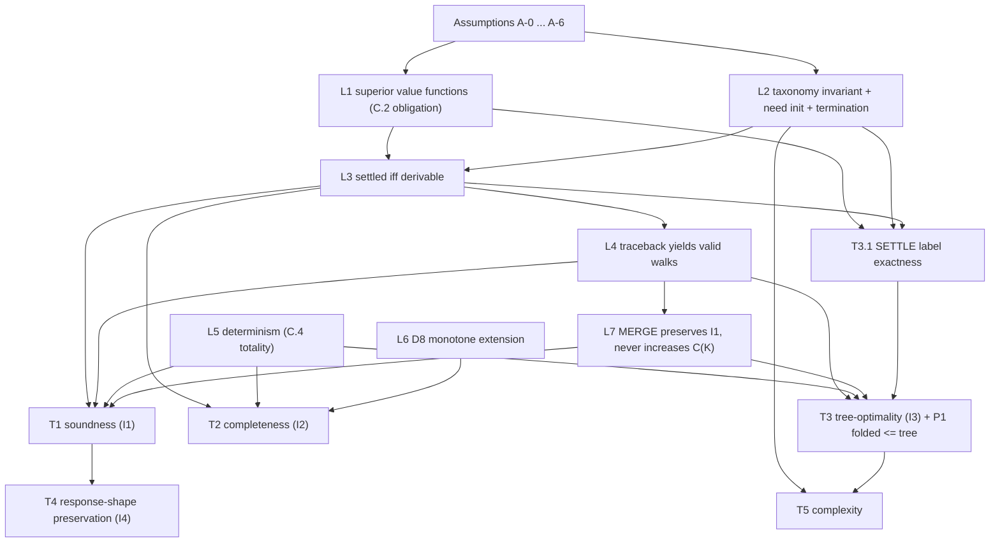

# Paper Proofs -- Federation Query Planner v2 (T1-T5)

**Status:** M0 task 5. Proves the four correctness invariants I1-I4 and the complexity bound of
`FORMAL_SPEC.md` (the ground truth for every definition cited here, as authored against commit
`4e741744`; its proof-obligation amendments G1-G6 subsequently landed at commit `e9578b8e`,
resolving the gaps recorded in [Section 7](#7-spec-gaps-found)), against
the theory foundation of `research-notes/hypergraph-theory.md` (Gallo-Longo-Nguyen-Pallottino
Shortest B-Tree, superior/additive value functions, the NP-hardness landscape).
**Branch:** `feat/planner-v2-hypergraph`.

Every numbered definition (`D1`-`D11`), well-formedness condition (`W1`/`W2`), cost-model item
(`C.1`-`C.4`), **invariant** (`I1`-`I4`), and the algorithm `A` (Section 6 of the spec) is cited by number
exactly as in `FORMAL_SPEC.md` and is *not* restated in full here. Where a proof needs more than the
spec provides, the proof is carried out under an explicitly stated additional assumption and the
shortfall is recorded in [Spec gaps found](#7-spec-gaps-found) -- the spec is never silently patched.

Each **theorem** below carries: the statement, its assumptions, a full paper proof, known
limitations, then *What the TLA+ model checks of this* and *What the property tests check of this*.

Proof-dependency map:

---

## 0. Preliminaries and standing assumptions

**Reference convention (L-namespace).** Bare symbols `L1`-`L7` (and `L3.1`) always denote the
**Lemmas** of [Section 1](#1-lemmas) of *this* file. Every reference to a `RESEARCH.md` design *lesson*
-- those run L1-L19 and share the numbers -- is written out in full as "lesson L*n* (`RESEARCH.md`)",
never bare. `D`*n*, `C.*`, `W*`, `I*`, `A-*`, `G*`, and `T*` are as numbered in `FORMAL_SPEC.md` and
this file.

Notation follows `FORMAL_SPEC.md` Section 0: $H=(V,E)$ is the planning **directed hypergraph** compiled by
`D4`-`D8`; by `W1` every element of $E$ is a **B-hyperedge** with head $H(e)$ (a single **node**) and
tail set $T(e)$; $\mathrm{Roots}(H)=\{r_{\mathrm{op}}\}$; $\mathrm{size}(H)=\sum_{e\in E}(|T(e)|+1)$;
$w(e)$ is the `C.1` **weight**; $\oplus\in\{\sum,\max\}$ is the `C.2` value-function combinator;
$\pi$ is the `C.2` tree objective; $C(K)$ is the `C.3` folded plan cost; $G(O)$ is the goal set of
the **obligation tree** `D3`.

**Derivations.** For $v\in V$, a *derivation* of $v$ is a finite rooted tree $D$ whose root is
labelled $v$; every node labelled $u\notin\mathrm{Roots}(H)$ carries one edge $e_u\in E$ with
$H(e_u)=u$ and has exactly the children $\{t : t\in T(e_u)\}$; every leaf is labelled by some
$r_{\mathrm{op}}$. Its value is defined bottom-up by the `C.2` recurrence:
$\mathrm{val}(\text{leaf})=0$ and $\mathrm{val}(u)=w(e_u)+\bigoplus_{t\in T(e_u)}\mathrm{val}(t)$.
Define $V^*(v)=\inf\{\mathrm{val}(D): D\text{ a derivation of }v\}$, with $V^*(v)=\infty$ if none
exists. A derivation is exactly the unfolded tree of a `D9`-valid walk ending at $v$ (Horn/forward-
chaining reading of `D9`): $v$ has a derivation iff $v$ is in the minimal Horn model of $E$ from
$\mathrm{Roots}(H)$ -- the **Horn clause** correspondence of the theory notes.

Standing assumptions, referenced by name:

- **A-0 (finiteness).** $\mathcal{S}$ (`D1`) and $Q$ (`D2`) are finite, hence $V$, $E$,
  $\mathrm{size}(H)$, and $O(Q)$ are finite. This is immediate from the `D4`-`D8` constructions.
- **A-1 (non-negative weights).** $w_f, w_s, w_d \ge 0$ (defaults $1000, 1, 10$), hence
  $w(e)\ge 0$ for every $e$ by `C.1` (`Descent` weight $0$ included). All proofs require this;
  none requires the default magnitude ordering $w_f \gg w_d \gg w_s$.
- **A-2 (ready-queue key).** The priority key of a *ready* edge $e$ in `SETTLE`'s `EXTRACT-MIN`
  is its tentative head value $f(e) = w(e) + \bigoplus_{t\in T(e)}\pi[t]$ (computable at push time,
  since every tail is settled), with `C.4` steps 2-5 breaking ties. `C.4` step 1 says "by cost
  $\pi$ (or $C$) ascending" without fixing this reading for queued edges; the exactness proof of T3
  *requires* it. Recorded as gap G1.
- **A-3 (edge identity).** $E$ is a set of edge identities (kind, label, full head identifier,
  sorted full tail identifiers); two constructions producing identical tuples denote the same edge.
  Needed for `C.4` totality (L5); recorded as gap G6.
- **A-4 (fixed configuration).** One fixed weight configuration $(w_f,w_s,w_d)$ and one fixed
  $\oplus$ per planning run (M0 default $\oplus=\sum$).
- **A-5 (guards not tripped).** For T2's forward direction only: `PREFLIGHT` does not return
  `ErrPlanTooLarge` and the state cap does not return `ErrSearchStateCap` (Section 6.3). Both are typed
  resource errors distinct from `ErrNoValidPlan`; recorded as gap G5 against I2's literal
  quantification.
- **A-6 (D11 conformance).** For T4 only: the **lowering** implementation satisfies `D11.1`-`D11.4`
  as stated. T4 proves that *any* `D11`-conformant lowering preserves shape; that the Go code is
  `D11`-conformant is an M1 test obligation (Section 8), not a paper-provable fact.

---

## 1. Lemmas

### L1 -- The default weights and $\oplus\in\{\sum,\max\}$ form superior value functions

*This discharges the proof obligation stated in `C.2` ("both are superior value functions ... the
precondition PROOFS.md must discharge").*

**Statement.** For every edge $e$ define
$F_e:[0,\infty]^{|T(e)|}\to[0,\infty]$, $F_e(x)=w(e)+\bigoplus_i x_i$. Under A-1, for
$\oplus\in\{\sum,\max\}$ every $F_e$ satisfies:

1. **Monotonicity**: $x\le x'$ pointwise $\Rightarrow F_e(x)\le F_e(x')$;
2. *Domination*: $F_e(x)\ge x_i$ for every argument $i$;
3. *Non-negativity and strictness at* $\infty$: $F_e(x)\ge w(e)\ge 0$, and $F_e(x)=\infty$ iff some
   $x_i=\infty$.

These three properties are precisely what the settle-order arguments of L3 and T3 use; they are the
**superior value function** conditions of Gallo et al. instantiated to `C.1`/`C.2`.

*Proof.* (1) Both $\sum$ and $\max$ are monotone non-decreasing in each argument over $[0,\infty]$,
and adding the constant $w(e)$ preserves monotonicity. (2) For $\oplus=\sum$:
$F_e(x)=w(e)+x_i+\sum_{j\ne i}x_j\ge x_i$ since $w(e)\ge0$ (A-1) and $x_j\ge 0$. For $\oplus=\max$:
$F_e(x)=w(e)+\max_j x_j\ge w(e)+x_i\ge x_i$. (3) Immediate: all terms are non-negative; the sum
(resp. max) of finitely many values is $\infty$ iff one of them is, and $w(e)$ is finite. $\square$

*Remark (what would break it).* Any cost term making $F_e$ non-monotone -- e.g. "cost drops when two
prerequisites batch" -- falsifies (1) and with it T3, exactly as `C.2` warns. The proofs below never
use the default magnitude ordering, only A-1 and (1)-(3), so weight *tuning* is proof-safe; weight
*semantics changes* are not.

### L2 -- Taxonomy root-tail invariant, `need` initialization, termination of SETTLE

*This discharges the `need[e]` initialization obligation (the Section 6.1 comment "taxonomy invariant: no
edge mixes root/non-root tails").*

**Statement.** In $H$ built by `D4`-`D8`:

1. *(Taxonomy invariant)* For every $e\in E$: either $T(e)\subseteq\mathrm{Roots}(H)$ or
   $T(e)\cap\mathrm{Roots}(H)=\emptyset$. Concretely, the only edges with a root tail are the
   subgraph-entering `Field` edges of `D5`, and their tail is exactly $\{r_{\mathrm{op}}\}$.
2. With $\mathrm{need}[e]\leftarrow|T(e)\setminus\mathrm{Roots}(H)|$, every edge is pushed to
   `ready` at most once, and it is pushed exactly when its last non-root tail settles (root-tailed
   edges: at initialization).
3. `SETTLE` terminates after at most $|E|$ iterations of the while-loop, settling each node at most
   once.

*Proof.* (1) Case analysis over the edge taxonomy. `D5` `Field`: the tail is a single node -- either
$r_{\mathrm{op}}$ (root capability) or an **object node**; a singleton cannot mix. `D5` `Descent`:
tail is one **field-resolution node**. `D6` `TypeMove`: tail is one object node $(U,s)$. `D7`
`EntityJump`: every tail is a field-resolution node by construction ("each a well-defined
field-resolution node (`D4`)"), and $r_{\mathrm{op}}$ is not a field-resolution node. `D8` edges are
"`D5`-style" with tails among provided-scope nodes. No edge kind has $r_{\mathrm{op}}$ as head
either, so roots are only ever tails of root-entering `Field` edges.

(2) By (1), $\mathrm{need}[e]=0$ at initialization iff $T(e)\subseteq\mathrm{Roots}(H)$; exactly
those edges are pushed in the init loop. Every other edge starts with
$\mathrm{need}[e]=|T(e)|\ge 1$. Decrements happen only when a node $h\notin\mathrm{Roots}(H)$
settles (heads are never roots), once per $(h,e')$ incidence, and each node settles at most once
(the `if h in settled: continue` guard); therefore $\mathrm{need}[e]$ decreases from $|T(e)|$ to $0$
monotonically and hits $0$ at most once -- at the settling of $e$'s last tail -- triggering exactly
one push. Root-entering edges are never decremented (their only tail never "settles" inside the
loop), so they are pushed only at initialization. Hence at most one push per edge.

*(Robustness remark.)* Even if a future edge kind violated (1), the convention
$\mathrm{need}[e]=|T(e)\setminus\mathrm{Roots}|$ would remain correct by the same argument -- the
edge fires when its last *non-root* tail settles, its root tails being pre-settled. The taxonomy
invariant is what makes this convention coincide with the naive $\mathrm{need}[e]=|T(e)|$ reading
for all non-root-entering edges; the spec's chosen convention is proved, and is additionally
future-proof.

(3) Each while-iteration extracts one edge; by (2) total pushes $\le|E|$, so iterations $\le|E|$.
Each iteration settles at most one new node. With A-0 everything is finite. $\square$

### L3 -- Settled iff derivable (reachability is exact)

**Statement.** Let $(\pi,\mathrm{back})$ be the state at `SETTLE` termination (guards not tripped,
A-5 for the "iff"; the => direction needs no guard assumption). For every $v\in V$:
$\pi[v]<\infty$ *iff* $v$ has a derivation from $\mathrm{Roots}(H)$, i.e. iff $v$ is in the minimal
Horn model of $E$ from the roots (`D9`).

*Proof.* (=>, label *soundness*) By strong induction over the settle sequence, with **induction
hypothesis** "every node settled before step $k$ has a derivation, and $\pi[\cdot]$ equals the value
of the derivation obtained by recursively expanding $\mathrm{back}[\cdot]$". Roots are pre-settled
with $\pi=0$ and are leaves (trivial derivations). At step $k$ a node $h$ is settled via
$e=\mathrm{back}[h]$, which was in `ready`, so every $t\in T(e)$ was settled earlier; by the
induction hypothesis each $t$ has a $\mathrm{back}$-derivation $D_t$ of value $\pi[t]$. The tree
with root $h$, edge $e$, and subtrees $D_t$ is a derivation of $h$ with value
$w(e)+\bigoplus_t\pi[t]=\pi[h]$ -- finite. The recursion is well-founded because every
$\mathrm{back}$-tail settled at a strictly smaller step index.

(<=, settle *completeness*) By strong induction on derivation height. Height 0: roots, pre-settled.
Suppose every node with a derivation of height $<k$ ends settled, and let $D$ derive $v$ with
height $k$, final edge $e$. Each $t\in T(e)$ has a sub-derivation of height $<k$, so each ends
settled. By L2(2), $e$ is pushed when its last non-root tail settles (or at init). A pushed edge is
eventually extracted: the loop runs until `ready` is empty and terminates (L2(3), guards not
tripped by A-5). At extraction of $e$, either $v$ was already settled or it is settled now; either
way $\pi[v]<\infty$ at termination. $\square$

*Corollary L3.1 (cyclic requirements).* A `D7` key/`@requires` chain depending on its own head has
no derivation of finite height for any node on the cycle whose only support is the cycle; by L3
those nodes end with $\pi=\infty$ -- the exact mechanism `D7`/Section 6.3 describe for surfacing
requirement cycles as `ErrNoValidPlan`, with no explicit cycle checker.

### L4 -- Traceback yields valid walks contained in K

**Statement.** For any settled $v^*$, `traceback(back, v*, visited)` returns a set of edges
$K_{v^*}\subseteq E$ such that the sequence of $K_{v^*}$'s edges ordered by the settle index of
their heads is a `D9`-valid walk whose final head is $v^*$. Moreover, with the shared `visited` set
across goals, the *union* $K=\bigcup_g K_{v^*_g}$ still contains, for every goal, a valid walk to
its selected candidate (`D10` requires only containment of a valid walk in $K$).

*Proof.* Traceback follows $\mathrm{back}[\cdot]$ from $v^*$, recursing into every tail of every
visited edge; every edge it emits is some $\mathrm{back}[u]$, hence an element of $E$ whose tails
all settled strictly before $u$ (L3's => argument). Order the emitted edges by head settle index:
for edge $e_i$ in this order, every $t\in T(e_i)$ is either a root or the head of an edge with a
strictly smaller settle index. That earlier edge is *in the emitted set*: traceback visits every
tail of every emitted edge, and either emits its back-edge now or finds the tail already in
`visited`, in which case that tail's back-edge was emitted by an earlier traceback into the same
shared set $K$ -- the tail's entire sub-hyperpath is already present (this is exactly the `FOLD`
sharing of `W2`). Hence the tail condition of `D9` holds edge by edge, and the last-settled emitted
edge is $\mathrm{back}[v^*]$ with head $v^*$. Termination: settle indices strictly decrease along
recursion; `visited` guarantees each node is expanded at most once globally. $\square$

### L5 -- Determinism (from C.4 totality)

*This discharges the determinism-lemma obligation of `C.4`.*

**Statement.** Under A-3 and A-4, `C.4` is a **total order** on $E$, and the emitted plan (cover,
fetch tree, and every typed error, including which obligation `ErrNoValidPlan` names) is a
deterministic function of $(\mathcal{S},Q)$.

*Proof.* *Totality.* `C.4` steps 1-5 compare, in order: key value, subgraph of the head, kind,
label, full head identifier, sorted full tail identifiers. Suppose edges $e\ne e'$ compare equal on
all steps. Equality at steps 3-5 means equal kind, label, head identity, and tail identities -- by
A-3 that *is* edge identity, so $e=e'$, a contradiction. Full node identifiers are unique by
construction (`D4`, including the provided-scope tag of `D8`), so step 5 is well-defined.
Antisymmetry and transitivity are inherited from lexicographic composition of total orders on each
component.

*Determinism.* By induction over loop iterations with **loop invariant** "the entire `SETTLE` state
$(\pi,\mathrm{back},\mathrm{need},\mathrm{ready},\mathrm{settled})$ is uniquely determined":
initialization is deterministic; each iteration's `EXTRACT-MIN` has a *unique* minimum because
`C.4` is total; the state update is a function of the extracted edge. Hence $(\pi,\mathrm{back})$
is unique. The per-goal $v^*=\arg\min$ is unique (same total order over candidates), goals are
visited in the fixed $G(O)$ order derived from the normalized $Q$ (`D2`/`D3` are deterministic
passes), traceback is a deterministic recursion over $\mathrm{back}$, and `MERGE`'s single pass
runs in `C.4` order applying moves gated by a strict inequality evaluated on deterministic state
(Section 6.4). Every branch of `SEARCH`, including error returns, is therefore a function of
$(\mathcal{S},Q)$ under A-4. $\square$

### L6 -- D8 provided-field scoping is a monotone extension

*This discharges the `D8` obligation ("they only add cheap alternatives, so they never remove a
plan the un-provided graph had -- monotone extension").*

**Statement.** Let $H_0=(V_0,E_0)$ be the hypergraph built by `D4`-`D7` alone and $H=(V,E)$ the
result of adding `D8` provided-scope nodes and edges. Then:

1. $V_0\subseteq V$, $E_0\subseteq E$, and every edge in $E\setminus E_0$ has its head in
   $V\setminus V_0$ (provided-scope nodes are fresh: $(U,s{\mid}f)$ and its field nodes carry the
   scope tag, which no `D4` node carries);
2. every `D9`-valid walk in $H_0$ is valid in $H$, and every `D10` cover in $H_0$ is a cover in $H$
   (no plan is removed);
3. for every $v\in V_0$: $V^*_H(v)=V^*_{H_0}(v)$ -- old nodes get neither cheaper nor more
   expensive; the extension only *adds* new candidate nodes (scope field nodes entering
   $\mathrm{cand}(g)$ via the `D3` goal mapping), i.e. new, possibly cheaper, alternatives.

*Proof.* (1) is the `D8` construction: scope object node, its "`D5`-style" field edges, and its
descents all have heads carrying the scope tag $s{\mid}f$; the only edge from an unscoped node into
the scope is the descent of the providing traversal $(T,s).f$, whose head $(U,s{\mid}f)$ is fresh.
(2) `D9` validity is monotone in $E$ ($T(e_i)$-support can only be easier to establish in a
superset), and $\mathrm{cand}(g)$ is monotone in $V$, so every covering walk survives. (3)
$\le$ would follow from (2) alone; for equality, take any $H$-derivation $D$ of $v\in V_0$. Its
final edge has head $v\in V_0$, hence lies in $E_0$ by (1); its tails are then $E_0$-tails, which
are in $V_0$ (all `D4`-`D7` edges have unscoped tails), and by induction on derivation height the
whole of $D$ lies in $H_0$. So the derivation sets coincide on $V_0$ and the infima are equal.
$\square$

*Consequence.* Adding `@provides` metadata can only preserve or improve reachability (I2 never
gets worse) and can only preserve or lower every goal's optimal cost (new candidates enter the
`C.4` argmin); it can never invalidate a previously optimal walk's optimality *certificate* for the
un-provided candidates, because those candidates' $V^*$ values are unchanged.

### L6p -- D5p `@external` key-field carry is a sound, additive extension

*This discharges the `D5p` obligation ("the new key-carry `Field` edges only ADD derivations --
T2/T3 arguments extend monotonic-additively").*

**Statement.** Let $H_0=(V_0,E_0)$ be the hypergraph built without `D5p` and $H=(V_0,E)$ the result
of adding, for every `@external` key field $(T,f)$ of $T$ in subgraph $s$, the in-subgraph `Field`
edge $(T,s)\xrightarrow{f}(T,s).f$ (weight $w_s$) and its `Descent` when composite. Then:

1. $V=V_0$ and $E_0\subseteq E$: `D5p` adds no new nodes (the head $(T,s).f$ and any nested object
   node already exist by `D4`/`D7` -- they are exactly the `EntityJump` key-field tails, which were
   present but $\pi=\infty$) and only new edges, each into an existing node;
2. every `D9`-valid walk and every `D10` cover in $H_0$ survives in $H$ (superset of $E$, monotone
   `D9`/$\mathrm{cand}$ -- as in L6(2)), so *no plan is removed* (I2 preserved: T2 extends);
3. for every $v$: $V^*_H(v)\le V^*_{H_0}(v)$ -- an added edge can only lower an infimum, never raise
   it; the strict decreases are exactly the class-A1 key nodes that were $\infty$ and are now finite,
   plus any node whose cheapest derivation newly routes through one. `SETTLE` computes the exact
   infimum over $E$ (L3, T3.1) for *any* edge set, so tree-optimality (T3) holds verbatim on $H$.

**Soundness (I1) of the added edges.** The edge asserts $(T,s).f$ is resolvable wherever $(T,s)$ is
resolvable. This is a federation invariant, not a heuristic: a subgraph that exposes entity $T$ must
return $T$'s `@key` fields in every representation it produces (otherwise $T$ could never be
entity-resolved), so the key value is genuinely available on every $(T,s)$ object -- the `@external`
marker records only that $s$ does not *own* the field's canonical definition, not that $s$ lacks the
value. Hence T1 (I1) is preserved: no wrong data is introduced, and the 7-assertion audit run plus
the differential MATCH oracle are the mechanical guard confirming no new UNEXPLAINED/foreign route
arises from these edges. $\square$

### L6pp -- D5pp renamed-root-type descent is a sound, additive correction

*This discharges the `D5pp` obligation ("emitting the previously-dropped root-field `Descent` only ADDS
derivations -- T2/T3 extend monotonic-additively").*

**Statement.** Let $H_0=(V_0,E_0)$ be the hypergraph built resolving a root field's output type under
the *composed* root name $Q_{\mathrm{op}}$, and $H$ the result of resolving it under $s$'s real root
operation type name $\rho_s(Q_{\mathrm{op}})$ (D5pp). $H$ differs from $H_0$ only for subgraphs that
rename a root operation type; for each such $s$ and each root field $(Q_{\mathrm{op}},f)$ whose SDL
output type $U=\mathrm{outputType}_s(\rho_s(Q_{\mathrm{op}}),f)$ is composite, $H$ adds the `Descent`
$(Q_{\mathrm{op}},s).f \to (U,s)$ (weight $0$). Then:

1. $V=V_0$ and $E_0\subseteq E$: the head object node $(U,s)$ already exists by `D4`/`D5` (it is the
   node the subgraph's own fields on $U$ descend into / hang off -- present but, absent this `Descent`,
   reachable only through non-root producers or $\pi=\infty$); D5pp adds only new `Descent` edges, each
   into an existing node, and no nodes;
2. every `D9`-valid walk and every `D10` cover in $H_0$ survives in $H$ (superset of $E$, monotone
   `D9`/$\mathrm{cand}$ -- as in L6(2)/L6p(2)), so no plan is removed (I2 preserved: T2 extends);
3. for every $v$: $V^*_H(v)\le V^*_{H_0}(v)$ -- an added zero-weight edge can only lower an infimum;
   the strict decreases are the composite object nodes reachable *only* via a renamed root field
   (previously $\infty$) and their descendants. `SETTLE` computes the exact infimum over $E$ for any
   edge set (L3, T3.1), so tree-optimality (T3) holds verbatim on $H$.

**Soundness (I1) of the added edges.** The `Descent` asserts that a root field returning composite
type $U$ can be sub-selected -- the defining meaning of a composite return type, true by construction
in $s$'s own SDL (the field's declared output IS $U$). The rename is purely nominal: $\rho_s$ maps the
composed operation-root name to the identical operation kind's name in $s$'s `schema { ... }` block, so
$\mathrm{outputType}_s(\rho_s(Q_{\mathrm{op}}),f)$ is exactly the type the router already resolves this
field to (v1's node metadata carries the same field under the composed root name). No wrong data is
introduced; T1 (I1) is preserved, with the 7-assertion audit run plus the differential MATCH oracle as
the mechanical guard. $\square$

### L6ppp -- D3p typename-terminal goals are a sound, additive extension of $G(O)$

*This discharges the `D3p` obligation ("adding typename-terminal composites to $G(O)$ only ADDS goals --
T2/T3 extend monotonic-additively; the hypergraph, `SETTLE`, and cost are untouched").*

**Statement.** Let $G_0(O)$ be the goal set under the plain-leaf rule (a field obligation is a goal iff
it has no children) and $G(O)$ the set under `D3p` (a field obligation is a goal iff it has no
*field-obligation* descendant). Then $G_0(O)\subseteq G(O)$, and $G(O)\setminus G_0(O)$ is exactly the
set of field obligations that have children but no field-obligation descendant -- the typename-terminal
composites. $H$, $\mathrm{cand}$, `SETTLE`, and the cost function are identical under both. Then:

1. *(additivity)* a plain-leaf field obligation has no children, hence no field descendant, so it is in
   $G(O)$: $G_0\subseteq G$. The added goals are disjoint from $G_0$ (each has children). $H$ is
   unchanged, and each added goal $g=\langle T.f\rangle$ maps through the *same* `D3` goal mapping to the
   existing field nodes $\{(T,s).f\}$, so no node or edge is created;
2. *(no plan removed -- I2/T2 extends)* every cover of $G_0(O)$ still covers $G_0(O)$; the search now
   additionally requires each added goal to be covered, and each is coverable exactly when the operation
   is well-formed (the field $f$ on $T$ has at least one resolution node reachable on the client's path --
   the same condition the router meets to return the composite's `__typename`). No previously-plannable
   operation becomes unplannable *for a reason internal to the added goal*: an added goal that cannot be
   covered denotes a genuinely unresolvable position (which the plain-leaf rule silently dropped from the
   fetch -- a leaf-coverage defect, not a valid plan);
3. *(tree-optimality -- T3 verbatim)* `SETTLE` computes the exact per-node infimum over the unchanged
   $E$ (L3, T3.1) irrespective of $G(O)$; the goal loop's per-goal candidate selection (`C.4`) is
   applied to each goal independently, so adding goals leaves every existing goal's chosen candidate and
   cost unchanged and simply selects candidates for the new goals.

**Soundness (I1).** An added goal introduces no new *field* into any fetch beyond $f$ itself, which the
client requested; lowering emits `f { __typename }` at $f$'s response position, and `__typename` is
requested there (the very `__typename` obligation that made the subtree typename-terminal). No
un-requested data is selected; T1 (I1) is preserved, with the 7-assertion audit (assertion 6
leaf-coverage in both directions) as the mechanical guard -- the M1.5 gaps wave flipped 10 audit cases
(`typename/*`, `circular-reference-interface`, `requires-with-fragments`, `corrupted-supergraph-node-id`)
GAP -> PASS with zero new FAIL/INVALID. $\square$

### L6pppp -- D6p route-scoping, D3pp exempt-terminal promotion, D3ppp member fallback (IR+D6 wave)

*Discharges the three IR+D6-wave amendments jointly; each is an independent, additive change to the
obligation layer with $H$, `SETTLE`, and cost untouched.*

**(a) D6p route-scoping only removes exemptions (safe direction).** $P_{D6p}(g)\subseteq P_{D6}(g)$
(the reachability filter only removes subgraphs), so $\bigcap_{s\in P_{D6p}}\mathrm{Mem}_s(U)
\supseteq \bigcap_{s\in P_{D6}}\mathrm{Mem}_s(U)$: fewer members fall outside the intersection, so
$\mathrm{exempt}_{D6p}\subseteq\mathrm{exempt}_{D6}$. An exemption is the *removal* of a cover
requirement (a response-only null); removing exemptions therefore only *adds* cover requirements --
strictly the T2-monotone direction -- and can never null data a route resolves. The removed subgraphs
are exactly those whose parent field node has *no* producing hyperpath (optimistic reachability is an
over-approximation of every settle route: if no condition-blind path exists, $\pi=\infty$ under any
mask), so no subgraph that could *ever* originate a parent instance leaves $P$: the standing
local-resolution assumption's quantifier is preserved on every realizable route. Determinism: the
reachability fixpoint is a monotone boolean iteration over the fixed edge set -- order-independent.

**(b) D3pp is a pure goal addition (L6ppp applies verbatim).** The promoted composite goals are disjoint
from $G(O)$ (each has field descendants, hence was not a goal) and map through the same `D3` goal
mapping to existing field nodes -- clauses 1-3 of L6ppp carry over with "typename-terminal" replaced by
"exempt-terminal". The safety gate (every exempt descendant has a *reachable* candidate) restricts
promotion to composites whose narrowing is a genuine `D6` value-type null -- the reference gateway
also nulls those members, so covering the composite as `f { __typename }` renders exactly the
surviving members' discriminator and no un-requested field (I1/T4 clause 3 unchanged).

**(c) D3ppp is a pure cand addition on failing goals.** For a goal $g$ with every primary candidate
unreachable, $\mathrm{cand}(g)$ gains member field nodes; for every other goal $\mathrm{cand}$ is
untouched. Since the trigger requires all primary candidates optimistically unreachable -- hence at
$\pi=\infty$ under every mask (over-approximation, as in (a)) -- any previously-*succeeding* search is
byte-identical: `C.4` argmin never saw a reachable primary candidate change, and no new goal or edge
exists. A previously-*failing* search either finds a reachable member candidate (a plan where none
existed -- pure I2 gain) or fails as before. I1: the member node $(C,s).f$ resolves the same client
field $f$ the refinement requested, on a concrete type the runtime instance must be for the
refinement to apply (`... on U` matched by an instance of member $C$); the lowering gate expansion
(refinementGate) renders $f$ under exactly the concrete implementers of $U$, which is the GraphQL
semantics of the client's fragment. Guards (refinement context required, $U$ non-entity, non-exempt)
keep the fallback off the `@interfaceObject`/entity-interface machinery, whose correct outcome can be
an honest error. $\square$

### L7 -- MERGE preserves I1 and never increases C(K)

*This discharges the Section 6.4 obligation ("preserves I1 and never increases $C(K)$ -- a proof
obligation for PROOFS.md, not an assumption").*

**Statement.** Let $K$ be the folded cover produced by the goal loop of `SEARCH`. `MERGE(K)`
terminates and returns a plan such that (a) every non-exempt goal retains a valid covering walk
over edges of $E$ (the I1 cover conditions), and (b) the realized cost never increases:
$C(K_{\mathrm{after}})\le C(K)$.

*Proof.* `MERGE` consists of two step kinds (Section 6.4); we show each preserves (a) and (b), and that
finitely many steps occur.

*Syntactic dedup.* Dedup acts on *fetches* -- the `D11.1` grouping artifacts -- not on the edge set:
two fetches merge only if they target the same subgraph, share the same entity representation
key-set, and have no argument conflict (`HasArgumentConflictWith`, `D1`). The cover $K$ is
unchanged, so $C(K)$ is unchanged and every covering walk is untouched -- (a) and (b) hold
trivially at the logical-plan level. At the physical level, the merged fetch document is the union
of two selection sets each individually valid against the same subgraph schema on the same entity
representation; the no-argument-conflict precondition rules out same-coordinate/different-argument
collisions, and any residual response-key collision inside the merged document is resolved by the
`D11.4` alias injection $\alpha$ (injective within a fetch document). Hence the merged operation
still validates -- the I1 clause "every generated subgraph operation validates" is preserved.

*Co-location move.* A move re-routes one goal $g$ from its selected candidate $v^*$ to an
alternative $v'\in\mathrm{cand}(g)$ with $\pi[v']<\infty$, replacing $g$'s walk by the traceback
walk of $v'$: $K' = \mathrm{FOLD}\big((K\setminus K_g)\cup K_{v'}\big)$ where $K_g$ are the edges
used only by $g$'s previous walk. The replacement walk is a settled B-hyperpath, valid by L4, so
$g$ retains a valid covering walk and no other goal's walk loses an edge (only $g$-exclusive edges
are removed) -- (a) holds. The move is applied *only if* it strictly reduces $C(K)$ (Section 6.4's
guard is "strictly reduces $C(K)$"), so (b) holds with strict decrease per applied move.

*Termination.* Dedup examines finitely many fetch pairs; the co-location pass visits each goal
exactly once in `C.4` order (a single pass by specification). Finitely many steps, each preserving
(a) and never increasing $C$; composition preserves both. $\square$

*Remark.* Nothing here claims the result is folded-cost minimal -- Section 6.4 explicitly does not, and T3
does not either; L7 is a *safety* statement about a heuristic improvement pass on the NP-hard side
of the **tractability boundary**.

---

## 2. T1 -- Soundness (I1)

**Statement.** For every $\mathcal{S}$ (`D1`) and $Q$ (`D2`): if the planner (algorithm `A`
composed with lowering `D11`) emits a plan, then

1. every edge of the emitted cover $K$ is an element of $E$ as built by `D5`-`D8`;
2. the head of every edge in $K$ is in the minimal Horn model of $E$ from
   $\{r_{\mathrm{op}}\}$ (`D9`), and for every non-exempt goal $g$, $K$ contains a `D9`-valid walk
   ending in some $v\in\mathrm{cand}(g)$;
3. every fetch emitted by lowering selects only fields the target subgraph resolves, and every
   generated subgraph operation validates against that subgraph's schema;
4. no abstract-refinement obligation is covered in violation of the `D6` member-narrowing rule.

**Assumptions.** A-0, A-1, A-3, A-4. (No guard assumption: T1 quantifies over emitted plans only;
error returns emit nothing.)

*Proof.*

(1) Every edge entering $K$ is emitted by `traceback` as some $\mathrm{back}[u]$, and
$\mathrm{back}$ is only ever assigned an extracted element of the `ready` queue, which only ever
receives elements of $E$. `MERGE` adds no edges: dedup leaves $K$ unchanged and a co-location move
replaces edges by traceback edges of a settled candidate -- again elements of $E$ (L7).

(2) By L4, for each goal $g$ processed by the loop, $K$ contains a valid walk ending at the
selected $v^*_g\in\mathrm{cand}(g)$; L7(a) preserves this under `MERGE`. Every edge of $K$ lies on
some such walk (traceback emits only walk edges), and by `D9`'s Horn reading every head on a valid
walk is derivable by forward chaining from the roots, i.e. lies in the minimal model. This is the
formal clause of I1.

(3) *Field-level soundness is structural.* By `D4`, a field-resolution node $(T,s).f$ exists only
when $(T,f)\in\mathrm{Root}_s\cup\mathrm{Child}_s$, and `D5` emits *no* edge for `@external`
capabilities; `D8` scope field nodes exist only for fields in the provided selection
$\sigma\subseteq P_s$, which $s$ resolves inline by the `@provides` contract. Lowering (`D11.1`)
builds each fetch's selection set from the `Field`/`TypeMove` edges of one single-subgraph group of
$K$; by (1) those edges exist in $E$, hence every selected field is a capability of the target
subgraph resolved on a type the subgraph names. Validation of the generated operation follows:
selections are made on types the subgraph's schema declares (object nodes are per-subgraph by
`D4`), every field is resolvable there, `EntityJump` boundaries become `_entities`
representations whose key fields come from a key $k\in K_{s_2}$ of the target (`D7`), argument
conflicts cannot be co-resident in one fetch (`D7` availability conditions split them; dedup's
precondition keeps them split, L7), and response-key collisions within a document are removed by
the injective `D11.4` alias map. For *runtime instances*: `D6` type-move edges exist only for
members the resolving subgraph's own schema declares ($\mathrm{Mem}_s(U)$, `D1`.4), so no fetch
ever asks a subgraph to refine an abstract type to a member it does not know.

(4) The `SEARCH` loop skips exactly the goals $\langle U\triangleright C\rangle$ with value-type
members and $C\notin\bigcap_{s\in P(g)}\mathrm{Mem}_s(U)$ -- the `D6` member-narrowing rule -- before
any covering is attempted, so no walk is ever selected for a narrowed-out goal; combined with (3)'s
"type moves only to declared members", no refinement obligation is covered in violation of `D6`.
Narrowed goals are lowered as response-only nulls (`D11.3`), which select nothing. $\square$

**Known limitations.**

- Clause 3's "the plan returns valid data for every runtime instance" is proved at the level the
  model speaks: edges exist only where capabilities/membership exist, and `D6` narrowing is
  respected. Data-level execution semantics (what the router does with bytes at runtime) are
  outside $H$ and are covered by the differential/execution test layers (Section 8), not by this proof.
- Validation of generated operations is argued against the `D1` capability contract; it assumes
  the composed-schema-to-subgraph-schema name mapping applied at printing (`D1` note on renames)
  is faithful -- a lowering implementation obligation (A-6 analogue), tested, not proved.

**What the TLA+ model checks of this.** The committed model (`tla/PlannerSearch.tla`, three bounded
instances) is the `SETTLE` state machine *only* -- over
$(\pi,\mathrm{back},\mathrm{need},\mathrm{ready},\mathrm{settled})$. It has no cover, no
goal-selection, no `D6`-narrowing, and no lowering, so clauses 2-4 are not represented. What it
does check, as the state invariant `SoundnessInv`, is the structural core of clause 1's derivation
validity: every settled non-root node $n$ has $\mathrm{back}[n]\in\mathrm{Edges}$ (a real edge of
the instance's $E$), with $\mathrm{back}[n].\mathrm{head}=n$ and
$\mathrm{back}[n].\mathrm{tails}\subseteq\mathrm{settled}$ -- the frontier discipline of L3's
=>-induction step and L4, machine-checked across all admissible interleavings. The trailing
$\pi[n]=w(\mathrm{back}[n])+\bigoplus\pi[\text{tails}]$ conjunct of `SoundnessInv` is *definitional
only*: it restates `Settle`'s own assignment and cannot fail independently -- the numeric burden is
carried by `OptimalityInv` (see T3). The cover-level clauses (every emitted edge in $E$; the `D6`
narrowing rule; validation of generated subgraph operations) are **not model-checked; they are
covered by the property tests below.** **Model checking** explores all interleavings up to each
bounded instance; it checks the invariant, not the unbounded theorem.

**What the property tests check of this.** Per Section 8: for generated $(\mathcal{S},Q)$ pairs, every
emitted subgraph operation is validated against that subgraph's schema (clause 3 end-to-end,
including the rename mapping the paper proof assumes); a walk-replay checker asserts clauses 1-2
on the emitted cover (each edge exists; tail-before-head order realizable); a narrowing oracle
recomputes $\bigcap_s\mathrm{Mem}_s(U)$ from `D1` and asserts clause 4. **Property-based testing**
samples the quantifier the proof discharges universally.

---

## 3. T2 -- Completeness (I2)

**Definition (eligible goals -- making the D10 exemption precise).** For a goal
$g\in G(O(Q))$, say $g$ is *exempt* iff $g=\langle U\triangleright C\rangle$ with all members of
$U$ value types (no `D7` edge for any member) and
$C\notin\bigcap_{s\in P(g)}\mathrm{Mem}_s(U)$, where $P(g)$ is the set of subgraphs able to
resolve $g$'s parent field (the `D6` member-narrowing rule). Write
$G^{\checkmark}(O)=G(O)\setminus\mathrm{Exempt}(O)$. By `D10`, a cover is *valid* iff every
$g\in G^{\checkmark}(O)$ has a covering walk -- exempt goals carry no cover requirement *by
definition* and lower to response-only nulls (`D11.3`, I4).

**Statement.** For every $\mathcal{S},Q$, under A-5:

1. *(Forward)* If a valid cover exists -- equivalently, by `D9`/`D10`, if every
   $g\in G^{\checkmark}(O)$ has some candidate $v\in\mathrm{cand}(g)$ in the minimal Horn model of
   $E$ from the roots -- then `A` returns a cover (and it is valid).
2. *(Contrapositive, exact diagnosis)* `A` returns `ErrNoValidPlan{Obligation: g, Reason:
   unreachable}` only if $g\in G^{\checkmark}(O)$ and *no* candidate of $g$ is in the minimal
   model -- in which case no valid cover exists for $Q$ at all. In particular the contrapositive
   *never fires for an exempt goal*: the `SEARCH` loop tests the `D6` intersection (the same
   predicate defining $\mathrm{Exempt}$) and `continue`s *before* the $\pi=\infty$ test is
   reached.

**Assumptions.** A-0, A-1, A-3, A-4, A-5. (Without A-5 the planner may return `ErrPlanTooLarge` or
`ErrSearchStateCap` even when a valid cover exists -- typed resource errors, not completeness
failures; see gap G5.)

*Proof.*

First note the equivalence used in the statement: a valid cover exists iff every eligible goal has
a reachable candidate. (<=) Given reachable candidates, the union of any one valid walk per eligible
goal is a set of edges containing a valid walk per goal -- a `D10` cover. (=>) A `D10` cover contains
a valid walk to a candidate of each eligible goal, and every valid walk's final head is in the
minimal model (`D9`).

(1) Suppose every $g\in G^{\checkmark}(O)$ has a candidate in the minimal model. Under A-5,
`SETTLE` runs to completion (L2(3)) and by L3(<=) every such candidate is settled with
$\pi<\infty$. The `SEARCH` loop then: skips exempt goals (by construction of the check); for
each eligible goal finds $\{v:\pi[v]<\infty\}\cap\mathrm{cand}(g)\neq\emptyset$, so the
`ErrNoValidPlan` branch is not taken; selects $v^*_g$ (unique by L5) and adds a valid walk (L4).
After the loop, `MERGE` terminates and preserves the cover conditions (L7). A cover is returned;
its validity is T1 clauses 1-2.

(2) The `ErrNoValidPlan{g}` branch executes only inside the loop body *after* the exemption
`continue`, hence only for $g\in G^{\checkmark}(O)$, and only when *every* $v\in\mathrm{cand}(g)$
has $\pi[v]=\infty$. By L3(=> contrapositive), $\pi[v]=\infty$ at termination means $v$ has no
derivation -- $v$ is not in the minimal model. (L3's => direction needs no A-5: an error return
after a *completed* `SETTLE` still has exact reachability; and `SETTLE` under A-5 completes.) So
$g$ is an eligible goal with no reachable candidate, and by the equivalence above no valid cover
exists. The named obligation is the *first* such $g$ in the deterministic $G(O)$ order (L5) -- a
provable-impossibility diagnosis, per lesson L13 (`RESEARCH.md`)'s requirement. Requirement cycles
are one instance:
L3.1 shows they surface here with no dedicated checker. $\square$

**Known limitations.**

- Completeness is *modulo resource guards* (A-5 / gap G5): `ErrPlanTooLarge` and
  `ErrSearchStateCap` are honest typed refusals, not wrong "no plan exists" claims -- the spec
  distinguishes them (Section 6.3), but I2's literal "if any valid cover exists, the planner returns one"
  should carry the qualifier.
- $P(g)$ (`D6`) is read, per the spec, as the parent-capable subgraph set for $g$'s parent field
  occurrence in $O(Q)$; the proof inherits exactly the spec's standing assumption that abstract
  fields are resolved locally on whichever subgraph supplies each parent instance (`D6` note).
- L6 adds a monotonicity guarantee: enabling `D8` scoping can only shrink the set of inputs on
  which `ErrNoValidPlan` fires (more candidates, unchanged old reachability) -- completeness is
  stable under provides-extension.
- Path-consistency (`D10`) with its fall-back (D10 honest scope 1) leaves this theorem's error
  semantics EXACTLY as stated over the full graph $H$ -- the biconditional above is *not* rescoped to
  the masked graph. `A` first attempts $g$ over $H_g=H\setminus\mathrm{foreignRoots}(g)$ (L3 applies
  to any edge subset, so masked reachability is exact too); when *no* candidate is reachable in
  $H_g$, it *falls back to the unmasked tables* and covers $g$ through whatever route exists in
  $H$, foreign-root included. `ErrNoValidPlan{g}` therefore fires iff no candidate of $g$ is in the
  minimal model of the FULL $E$ -- bit-for-bit the pre-amendment condition; I2 is untouched. What is
  NOT claimed: that the returned cover is path-consistent for every goal. The honest guarantee is
  ONE-DIRECTIONAL: *if* a path-consistent walk to some candidate of $g$ exists in $H$, `A` covers
  $g$ path-consistently (the masked attempt finds it, by L3(<=) on $H_g$); if none exists, `A` still
  covers $g$ -- via a path-inconsistent (foreign-root) walk that is a registered model-gap residual
  (the audit's foreign-root `GAP` class), not a completeness failure and not a `D10`-strictness
  guarantee. When $\mathrm{foreignRoots}(g)=\varnothing$ the masked and unmasked runs coincide and
  the original claim is recovered verbatim.

**What the TLA+ model checks of this.** The committed model has no error states, no `PlanReturned`
state, and no exemption set, so the biconditional and its exact-diagnosis contrapositive are not
model-checked. What it checks is the completeness *core* -- the liveness property `EventuallyPlans`,
$\Diamond(\mathrm{Goals}\subseteq\mathrm{settled})$: on each bounded instance, whose `Goals`
constant is the set of reachable goal-candidate nodes, every behavior eventually settles all of
them, under weak fairness of `Settle` (`WF_vars(Settle)`). That fairness hypothesis is
load-bearing: without it a behavior can stutter forever via the
`Terminating` step and `EventuallyPlans` fails -- the stuttering counterexample -- which is exactly
why the property is stated under `WF_vars(Settle)`. Goal-set reachability (the <= direction clause 1
needs) is thereby machine-checked; the error-return direction (clause 2 -- `ErrNoValidPlan` firing
only for eligible unreachable goals, and the exact-obligation diagnosis) is **not model-checked; it
is covered by the property tests below.**

**What the property tests check of this.** Per Section 8: generated instances where a cover is known to
exist by construction (seeded walks) must yield a plan; mutation tests that sever a required edge
(e.g. disable the sole key with `resolvable:false`, `D7`) must yield `ErrNoValidPlan` naming an
obligation whose candidates an independent reachability oracle confirms unreachable; partial-union
fixtures (Section 7.1) assert exempt goals produce plans with response-only nulls, never
`ErrNoValidPlan`.

---

## 4. T3 -- Optimality (I3, scoped to tree cost) and the folded <= tree inequality

I3 is *scoped*: it claims, per goal obligation independently, exactness for the `C.2` *tree*
objective -- the polynomial side of the tractability boundary. Folded-cost minimality (`C.3`) is
*not* claimed, per obligation or jointly; that is the NP-hard **Directed Steiner Tree** side
(lessons L1, L2 (`RESEARCH.md`)). This section proves the claimed half and the inequality relating
the two.

### T3.1 -- Lemma (SETTLE label exactness)

**Statement.** Under A-1, A-2, A-3 (and $\oplus\in\{\sum,\max\}$), at `SETTLE` termination
$\pi[v]=V^*(v)$ for every $v\in V$, and the infimum is attained: if $V^*(v)<\infty$ there is a
derivation of value exactly $V^*(v)$ (in particular the $\mathrm{back}$-derivation of $v$).

*Proof.* First, attainment. Call a derivation *irredundant* if no node label repeats on any
root-to-leaf branch. Any derivation can be made irredundant without increasing its value, by an
ancestor-descendant *splice*. Suppose a label $u$ repeats on some root-to-leaf branch. Then one
occurrence of $u$ is a proper ancestor of another *on that same branch*, so the ancestor copy roots
a sub-derivation $D_{\mathrm{anc}}$ of $u$ that strictly contains the descendant copy's
sub-derivation $D_{\mathrm{desc}}$ -- itself a derivation of the *same* label $u$. Splice
$D_{\mathrm{desc}}$ into the ancestor position (replacing $D_{\mathrm{anc}}$); because both derive
$u$, the result is a well-formed derivation of the original root. It does not increase the root
value: by L1 domination (2) every node's value is $\ge$ each of its descendants' values along the
`C.2` recurrence, so $\mathrm{val}(D_{\mathrm{desc}})\le\mathrm{val}(D_{\mathrm{anc}})$; substituting
the smaller-valued subtree and propagating up via L1 monotonicity (1) along the path from the
ancestor position to the root leaves the root value non-increasing. The splice deletes every node
strictly between the two copies of $u$, so total tree size *strictly* shrinks; repeating therefore
terminates and yields an irredundant derivation of value $\le$ the original -- which is exactly what
"no label repeats on a root-to-leaf branch" makes possible. Irredundant derivations have branch
length $\le|V|$ and branching factor $\le\max_e|T(e)|$, so there are finitely many (A-0); hence
$V^*(v)$ is a minimum over this finite set whenever finite.

Now exactness, by induction over the iterations of the while-loop, with the **loop invariant**:

> (J1) every settled node $v$ has $\pi[v]=V^*(v)$, and $\pi[v]$ is the value of its
> $\mathrm{back}$-derivation;
> (J2) every edge whose tails are all settled has been pushed (L2(2)), and every edge in `ready`
> has key $f(e)=w(e)+\bigoplus_{t\in T(e)}\pi[t]$ (A-2);
> (J3) the keys of extracted edges are non-decreasing over time.

*Initialization*: roots have $\pi=0=V^*$ (the empty derivation; no smaller value exists by L1(3));
`ready` holds exactly the root-tailed edges with keys $f(e)=w(e)$.

*Maintenance*: let iteration $k$ extract $e$ with head $h$.

- If $h$ is already settled the state is unchanged except the pop; (J3) holds because $e$ was in
  `ready` at the previous extraction, so its key is $\ge$ that extraction's key.
- Otherwise $h$ is settled with $\pi[h]=f(e)$. *Upper bound*: by (J1) each tail's
  $\mathrm{back}$-derivation has value $\pi[t]=V^*(t)$; composing them under $e$ gives a derivation
  of $h$ of value $f(e)$, so $V^*(h)\le f(e)$. *Lower bound*: suppose toward contradiction
  $V^*(h)<f(e)$, and let $D$ be a minimum irredundant derivation of $h$, $\mathrm{val}(D)=V^*(h)$.
  The label $h$ is unsettled and every leaf of $D$ (a root) is settled, so $D$ has a node $u$ that
  is unsettled while all children of its derivation edge $e_u$ are settled (walk down from the
  root of $D$: at an unsettled node, if some child is unsettled recurse into it; leaves are
  settled, so the walk stops at such a $u$). By (J2) $e_u$ was pushed. It has not been extracted:
  an extraction of $e_u$ either settled $u$ or found $u$ settled -- both contradict $u$ unsettled
  now (settledness is monotone). So $e_u\in\mathrm{ready}$ at iteration $k$, with key
  $$f(e_u)=w(e_u)+\bigoplus_{t\in T(e_u)}\pi[t]
    \;\le\; w(e_u)+\bigoplus_{t\in T(e_u)}\mathrm{val}_D(t)
    \;=\;\mathrm{val}_D(u)\;\le\;\mathrm{val}(D)=V^*(h)\;<\;f(e),$$
  where the first inequality is L1 monotonicity with $\pi[t]=V^*(t)\le\mathrm{val}_D(t)$ (J1 and
  minimality of $V^*$), and the second is L1 domination applied repeatedly along the path from $u$
  up to $D$'s root. This contradicts `EXTRACT-MIN` returning $e$ (A-2: keys are compared first;
  `C.4` steps 2-5 only break exact ties). Hence $V^*(h)=f(e)=\pi[h]$: (J1) is maintained, and the
  $\mathrm{back}$-derivation realizes it.
  (J2): the decrement loop pushes exactly the edges whose last tail is $h$ (L2(2)), with keys
  computable per A-2. (J3): any edge pushed now has $h\in T(e')$, so by L1 domination
  $f(e')\ge\pi[h]=f(e)$; any edge already in `ready` has key $\ge f(e)$ by minimality of the
  extraction.

*Termination*: L2(3). At exit, `ready` is empty; any node still unsettled has $\pi=\infty$ and by
L3(<=, contrapositive of settling) no derivation, so $V^*=\infty$ there too. $\square$

### T3.2 -- Theorem (per-obligation tree-optimality -- the I3 claim)

**Statement.** For every $\mathcal{S},Q$ and every goal obligation $g\in G^{\checkmark}(O)$ with at
least one reachable candidate: `A` selects
$v^*_g=\arg\min_{v\in\mathrm{cand}(g)}(\pi[v],\text{C.4})$ and emits for $g$ a walk whose
derivation value is
$$\pi[v^*_g]\;=\;\min_{v\in\mathrm{cand}(g)}V^*(v)\;=\;\min\{\mathrm{val}(D):D\text{ a derivation of some }v\in\mathrm{cand}(g)\},$$
the exact Shortest B-Tree optimum of the `C.2` tree objective over all `D9`-valid B-hyperpaths to
$\mathrm{cand}(g)$ -- for either $\oplus\in\{\sum,\max\}$. The choice is unique (L5).

*Proof.* Immediate composition: T3.1 gives $\pi[v]=V^*(v)$ for every candidate; the argmin over
$\mathrm{cand}(g)$ therefore attains $\min_v V^*(v)$; derivations of candidates and `D9`-valid
walks to candidates are in value-preserving correspondence (Section 0, Derivations); the emitted
traceback walk realizes value $\pi[v^*_g]$ by T3.1's attainment clause and is valid by L4.
$\square$

**Path-consistency rescoping (`D10`, with the fall-back).** With the `D10` path-consistency
preference, `A` first settles $g$
over the *masked* graph $H_g = H\setminus\mathrm{foreignRoots}(g)$ (the goal's foreign root-entering
`Field` edges removed) and, *when some candidate is reachable there*, selects $v^*_g$ by $\pi_g$
over $H_g$. Masking only *removes* edges, so
$H_g$ is a sub-hypergraph of $H$; T3.1 and this theorem apply verbatim to $H_g$ (the superior-value-
function and settle-order arguments hold on any edge subset -- nothing in L1/L3/T3.1 assumes a
particular edge population). For such goals the optimum rescopes honestly: `A` returns the minimum
tree-cost walk among the *path-consistent* B-hyperpaths to $\mathrm{cand}(g)$ -- the optimum of the
child walk *given* its root-ancestor's entry -- rather than over all B-hyperpaths. **When NO candidate
is reachable in $H_g$, `A` falls back to the unmasked $(\pi,\mathrm{back})$ over the full $H$ (D10
honest scope 1) and the ORIGINAL unrestricted claim applies to that goal verbatim** -- its emitted
walk is tree-optimal over all `D9`-valid B-hyperpaths in $H$, and may enter a foreign root (the
registered model-gap residual; see T2's limitation note). Per goal, exactly one of the two exact
optimality statements holds, and which one is a deterministic function of $(\mathcal{S},Q)$ --
determinism (L5) is unaffected because both the masked attempt and the fall-back test are functions
of $H$ and $O$ alone. When $\mathrm{foreignRoots}(g)=\varnothing$ (single-root
operations, and every synthetic property-test instance whose root field is unmodelled) $H_g=H$, the
two statements coincide, and the Section 8 brute-force and permutation harnesses --
which run only such instances -- are unaffected. The realized-cost inequality P1 is likewise unchanged:
it holds per settled walk on whatever graph produced it.

**Per-parent rescoping (`D10` wave-1b generalization).** The corrected cover (D10 Honest Scope 2)
replaces $\mathrm{foreignRoots}(g)$ with the strictly larger mask $\mathrm{siblingEdges}(g)$ -- the
foreign root-entering `Field` edges *plus* every `Field`/`Descent` edge reaching $g$'s parent object
type by a path other than $g$'s own parent obligation -- giving $H_g = H\setminus\mathrm{siblingEdges}(g)$.
**This is still an edge subset of $H$**, so the argument above is *unchanged in kind*: L1/L3/T3.1 assume
nothing about the edge population, so $\pi_g$ over the per-parent-masked $H_g$ is exact, `A` returns the
minimum tree-cost walk among the B-hyperpaths that factor through $g$'s parent instance, and the same
completeness-preserving fall-back (to unmasked $H$) applies when no such walk exists. The only
difference from the per-root case is *which* edges are removed; the exactness, determinism (L5), and P1
arguments transfer verbatim. The cover the theorem now certifies is the *function* $\kappa$ (one
scoped optimum per goal); the priced union $\bigcup_g\kappa(g)$ is a set and P1/C.3 price it as before.
Masking still only *removes* derivations -- never adds one -- so soundness (T2) and monotonicity carry
without new obligations on the proof.

### P1 -- Proposition (the folded <= tree inequality, C.3)

**Statement.** Let $\oplus=\sum$ and A-1 hold. For any settled $v$ with traceback edge set
$K_v=\mathrm{edges}(\mathrm{walk}_v)$:
$$C(K_v)\;=\;\sum_{e\in K_v}w(e)\;\le\;\pi[v],$$
with equality iff no edge occurs more than once in the unfolded $\mathrm{back}$-derivation of $v$
(no shared sub-hyperpath within the derivation). Consequently, for the full plan,
$$C(K)\;\le\;\sum_{g}\pi[v^*_g]\qquad\text{(before MERGE, and after MERGE by L7(b)),}$$
the I3/C.3 inequality. Folding across obligations only widens the gap.

*Proof.* Let $D$ be the $\mathrm{back}$-derivation of $v$ and for $e\in E$ let $m_D(e)\ge 0$ be the
number of occurrences of $e$ in $D$. Unwinding the `C.2` recurrence under $\oplus=\sum$ gives, by
induction on the height of $D$: $\mathrm{val}(D)=\sum_{e}m_D(e)\,w(e)$ (base: leaf, empty sum;
step: $\mathrm{val}(u)=w(e_u)+\sum_t\mathrm{val}(D_t)$ and occurrence counts add across the
disjoint subtree positions plus one for $e_u$). Traceback emits exactly the edges with
$m_D(e)\ge 1$, i.e. $K_v=\{e:m_D(e)\ge1\}$, so
$$C(K_v)=\sum_{e:m_D(e)\ge1}w(e)\;\le\;\sum_e m_D(e)w(e)=\mathrm{val}(D)=\pi[v],$$
using $w(e)\ge0$ (A-1). Equality iff $m_D(e)\le 1$ wherever $w(e)>0$ -- and in particular whenever
all multiplicities are $1$. For the plan: $K\subseteq\bigcup_g K_{v^*_g}$ (the shared `visited` set
only ever *removes* re-tracing, never adds edges), and $C$ is monotone and subadditive over unions
of sets of non-negative weights: $C(K)\le\sum_g C(K_{v^*_g})\le\sum_g\pi[v^*_g]$. `MERGE` never
increases $C$ (L7(b)). $\square$

*Worked instance.* Section 7.2 of the spec computes both sides by hand: $\pi=6020$ vs $C(K)=2018$, gap
$4w_f+2w_s$ -- the `enter-A` fetch re-counted per `EntityJump` tail. P1 is that computation stated
in general.

*Counterexample for $\oplus=\max$ (why C.3 restricts to $\sum$).* Take root $r$, edges
$r\to t_1$, $r\to t_2$ each of weight $1$, and $e:\{t_1,t_2\}\Rightarrow h$ with $w(e)=1$. Then
$\pi_{\max}[h]=1+\max(1,1)=2$ but $C(\{e_1,e_2,e\})=3>2$. The folded cost is a *sum* over the edge
set regardless of $\oplus$, so no folded <= tree inequality holds under $\max$; `C.3` states the
inequality only for $\oplus=\sum$, and I3's inequality sentence must be read under the M0 default
$\oplus=\sum$ (gap G4).

### What is deliberately *not* claimed

- *No folded optimality per obligation.* `A` minimizes the tree value $\pi$; a different valid walk
  for the same goal can have lower *folded* $C$ through internal sharing yet higher $\pi$, and `A`
  will not select it. This is I3's own scope statement, kept honest here.
- *No joint folded optimality.* Minimizing $C(K)$ over multi-goal covers is the multi-terminal
  Directed Steiner Tree problem lifted to B-hyperedges: NP-hard, and not approximable to
  $O(\log^{2-\varepsilon}n)$ unless $NP\subseteq ZTIME(n^{\mathrm{polylog}\,n})$; best known is the
  quasi-polynomial $O(\log^2 k/\log\log k)$ factor (theory notes, "Where it breaks"). `A` does not
  attempt it; `MERGE` is a bounded improvement pass with no exactness claim (L7).

**Assumptions.** A-0 through A-4; P1 additionally $\oplus=\sum$.

**Known limitations.** Exactness is relative to the `C.1` weight *model*; no claim is made that
$w$ reflects real network cost (the spec's lesson-L11 (`RESEARCH.md`) position: structural,
statistics-free). If `C.4`'s
queue key is implemented as anything other than A-2's tentative head value, T3.1's lower-bound
step fails and optimality is silently lost (gap G1) -- this is the single most implementation-
sensitive line of the whole proof.

**What the TLA+ model checks of this.** The model checks `OptimalityInv` -- $\pi[n]=\mathrm{ExpectedPi}[n]$
for every settled $n$ at termination -- where `ExpectedPi` is *not* a TLC-enumerated $V^*$ but a
per-instance table of tree-cost minima *hand-computed from the spec* and encoded as a constant
(e.g. Section 7.2's $\pi(\mathrm{ProdB})=6019$, $\pi(\mathrm{se})=6020$). The load-bearing instance is the
third, `PlannerSearchCompeting.cfg`: node `fx` has two incoming derivations at *different*
tentative costs ($1001$ direct vs $2012$ via the entity-jump detour), so `Settle`'s `EXTRACT-MIN`
guard is genuinely exercised (instances 1 and 2 give every node exactly one incoming edge). The
model asserts $\pi(\mathrm{fx})=1001$, *not* $2012$; a scratch copy with the min-extraction
constraint removed finds the interleaving settling `fx` at $2012$ and fires `OptimalityInv`,
demonstrating the checker can fail. Because `Settle` may extract *any* minimal-`TentF` ready edge
(the `C.4` steps 2-5 tie-break is left for TLC to explore, not hard-coded), `OptimalityInv` holding
across all reachable states shows the settled $\pi$ table is order-independent under min-extraction
-- the property `C.4`'s determinism argument rests on. *Not* model-checked: the (J3)
non-decreasing-key step invariant, P1's folded <= tree inequality (arithmetic once $\pi$ is exact),
and any traceback support-equality claim -- the committed model has no traceback. These are
**covered by the property tests below.**

**What the property tests check of this.** Per Section 8, the brute-force enumerator on small instances:
asserts tree-optimality *exactly* (enumerate all irredundant derivations per goal, compare the
minimum to `A`'s $\pi[v^*_g]$), and *measures* the tree-vs-folded gap $\pi-C$ empirically --
measurement, not assertion, because no folded claim exists to assert. The permutation harness
(lesson L14c, `RESEARCH.md`) checks the L5 determinism corollary: semantically equal inputs in
permuted order produce
identical plans and identical costs.

---

## 5. T4 -- Response-shape preservation of lowering (I4)

**Statement.** For every $\mathcal{S},Q$ and every cover $K$ emitted by `A` (post-`MERGE`), any
`D11`-conformant lowering (A-6) emits a response-shape tree $R$ such that:

1. *(Shape identity)* $R$ is the client selection tree of `D2` exactly: same response keys, same
   nesting, same aliases, same `__typename` gates (`OnTypeNames`);
2. *(Aliasing lemma)* whenever two edges $e,e'\in K$ resolve the same response key $\rho$ under
   different concrete parent types or different subgraphs such that their subgraph selections
   would collide in one fetch document, lowering emits internal aliases $\alpha(e)\ne\alpha(e')$
   ($\alpha$ injective within each fetch document) and the response mapping sends both back to
   $\rho$ -- the client-visible key is $\rho$ in all cases;
3. *(Response-only nulls)* every obligation of $O(Q)$ with no covering walk in $K$ -- in
   particular every `D6`-narrowed exempt goal -- appears in $R$ at its original position, gated on
   its concrete `__typename`, with no fetch producing it; it is never a missing key and never a
   shape change.

**Assumptions.** A-0, A-6; T1 (the cover being lowered is sound).

*Proof.* By structural induction on the `D2` selection tree, with **induction hypothesis** "the
theorem holds for every child subtree of the current selection".

*Base (leaf selection).* A leaf selection $\sigma$ with response key $\rho$ corresponds to a goal
obligation $g_\sigma\in G(O)$ (`D3` maps selections to obligations bijectively on positions --
`D3` re-expresses $Q$ as a tree whose nodes are its selections). Two cases.
(i) $g_\sigma$ has a covering walk in $K$. `D11.1` places its final `Field` edge in exactly one
fetch group; `D11.3` requires the response tree to carry $\rho$ at $\sigma$'s position; the fetch
document selects the subgraph field under either its own name or, if the `D11.4` collision
predicate fires, under $\alpha(e)$ -- and `D11.4` records $\alpha(e)\mapsto\rho$, so the value
lands at $\rho$. Key, alias, and position are those of $\sigma$; nothing else is emitted at this
position (lowering emits selections only for edges of $K$, T1(1)).
(ii) $g_\sigma$ has no covering walk (exempt, or an uncovered `__typename`-gated member). `D11.3`
mandates the selection *stays* in the response shape, gated on its concrete `__typename`, with no
producing fetch -- clause 3 verbatim. In both cases the emitted node at this position equals
$\sigma$.

*Step (composite selection).* Let $\sigma$ have children $\sigma_1,\dots,\sigma_n$ (including
abstract refinements, which `D2` represents as inline refinements and `D3` as
$\langle U\triangleright C\rangle$ children). `D11.3` emits $\rho$ at $\sigma$'s position with a
child list; by the induction hypothesis each $\sigma_i$'s subtree is emitted exactly; it remains
to show the child *list* is exactly $\sigma$'s: lowering emits a child position per obligation
child of $\sigma$ (covered or response-only), never more (fetch-internal artifacts -- key fields
for `D7` jumps, `@requires` selections, $\alpha$-aliased duplicates -- are by `D11.2`/`D11.4`
*fetch inputs and internal aliases*, recorded in the representation/input template and the
response *mapping*, not in the client response shape; Section 7.2's lowering shows this concretely:
the plan fetches `id`, `organization{id}`, `dimensions{...}` yet $R$ is
`{ product { shippingEstimate } }`). Order and keys of children are those of the normalized $Q$
(`D2` fixes response keys and order; `D11.3` preserves them).

*Aliasing lemma (clause 2).* Injectivity of $\alpha$ within a fetch document is `D11.4` by
definition; what needs proof is that the *client* key survives. The response mapping is a function
from fetch-document keys to response positions; for each colliding edge, `D11.4` records
$\alpha(e)\mapsto\rho$. Since $\alpha$ is injective per document, the mapping is well-defined
(no two client positions claim one fetch key within a document), and since both records target
$\rho$ at $\sigma$'s position, the client sees exactly $\rho$ regardless of which edge's fetch
produced the instance's value -- the "generalizes the `@requires`-alias machinery" clause of
`D11.4`, proved rather than assumed. Under `MERGE` dedup, two documents become one; $\alpha$ is
re-established injective on the merged document (L7's dedup step), and the mapping is the union of
the two mappings, still functional because $\alpha$ separates any collision the union introduces.
$\square$

**Known limitations.**

- The theorem is conditional on A-6: `D11` is declarative, and T4 proves "conformant lowering
  preserves shape", not "the Go lowering is conformant" -- the latter is the Section 8 differential-test
  obligation (response-shape oracle, lesson L17, `RESEARCH.md`).
- **A-6 is currently VIOLATED by the sibling-conflation class (D10 Honest Scope 2).** The proof's
  base case (i) says "`D11.1` places its final `Field` edge in exactly one fetch group" and "nothing
  else is emitted at this position" -- but the *cover-walk-driven* M1 lowering places the shared
  $(T,s)$ edge at ONE response position (one back-derivation), so a sibling position of a repeated
  type is left with *no* producing selection: a shape defect T4 clause-1 does not tolerate. T4 is
  therefore honestly conditional on the wave-1b *obligation-driven* lowering (D11 amendment), under
  which the base case strengthens *toward by-construction*: lowering walks $O(Q)$, so clause-1's
  "the child list is exactly $\sigma$'s" holds because the emitted list *is* the obligation's child
  list -- there is no separate structural reconstruction that can drop or misplace a position, and
  self-referential shapes terminate on the finite $O(Q)$. The clause-2 aliasing and clause-3
  response-only-null arguments are unaffected. Until that lowering lands, clause 1 holds only for
  single-position response shapes; the 46+2 sibling-conflation `GAP`s are the registered witnesses.
- Clause 3 asserts *shape*: the gated selection exists and no fetch produces it. That the gate
  never matches at runtime for narrowed members (so the value is null rather than wrong) rests on
  the `D6` soundness argument (Section 7.1: the intersection members are the only ones any
  parent-capable origin can return) -- a data-level property argued in the spec's worked example
  and checked by execution tests, not re-proved here in an execution semantics the model does not
  define.

**What the TLA+ model checks of this.** Nothing directly: lowering is entirely outside the `SETTLE`
state machine, so shape preservation is not model-checked. The only facts the model supplies to T4
are the T1/T2 interface it consumes -- that at `SETTLE` termination every reachable goal candidate
is settled (`EventuallyPlans`) via a structurally valid back-derivation (`SoundnessInv`). The
{covered, exempt, error} trichotomy that T4's clause-1/clause-3 case split relies on is a
`SEARCH`/lowering-level notion the committed model does not represent (it has no cover, exemption,
or error states), and is **not model-checked; it is covered by the differential property tests
below.**

**What the property tests check of this.** Per Section 8: the differential harness runs generated
operations through planner-v2 and the existing planner and compares response shapes via the
response-shape oracle (same keys, nesting, aliases, gates), with the documented allow-list where
the old planner is known wrong (e.g. Section 7.1); a dedicated aliasing property generates colliding
same-response-key selections across subgraphs/concrete types and asserts the client key is
preserved and fetch documents contain no duplicate keys ($\alpha$ injectivity); partial-union
fixtures assert narrowed members appear as gated, never-fetched selections (response-only nulls),
not missing keys.

---

## 6. T5 -- Complexity

**Statement.** Under A-0-A-3, with a binary-heap priority queue keyed per A-2 and an incidence
index from nodes to the edges they are tails of (buildable once in $O(\mathrm{size}(H))$):

1. *(SETTLE)* One `SETTLE` run costs
   $$O\big(|V| \;+\; \mathrm{size}(H) \;+\; |E|\log|E|\big),$$
   which is the spec's Section 6.2 bound $O(\mathrm{size}(H)+|E|\log|E|)$ whenever $|V|=O(\mathrm{size}(H))$
   -- guaranteed if $H$ contains no node incident to zero edges (gap G2; the `D4`-`D8` builder can
   prune isolated nodes, and every node slot of every edge is counted by $\mathrm{size}(H)$).
2. *(Full plan)* One `SEARCH` run, excluding `MERGE`, costs
   $$O\Big(|V|+\mathrm{size}(H)+|E|\log|E|+\textstyle\sum_{g\in G(O)}|\mathrm{cand}(g)|\Big)
     \;=\;O\big(|V|+\mathrm{size}(H)+|E|\log|E|+|O|\cdot|\mathcal{S}|\big),$$
   matching Section 6.2. Including `MERGE` (Section 6.4): dedup adds expected
   $O(F\cdot L)$ with $F\le|K|\le|E|$ fetches of document size $\le L\le\mathrm{size}(H)$ (hash
   fetches by (subgraph, representation key-set), compare within buckets), and the single-pass
   co-location adds $O\big(\sum_g|\mathrm{cand}(g)|\cdot\mathrm{size}(H)\big)
   \le O(|O|\cdot|\mathcal{S}|\cdot\mathrm{size}(H))$ under the assumption that evaluating one
   move's $\Delta C$ costs one traceback plus one folded diff, each $O(\mathrm{size}(H))$ (gap G3:
   Section 6.2's stated bound for `A` excludes `MERGE`'s cost).
   Everything is polynomial in $|V|,|E|,|O|,|\mathcal{S}|$; there is no exponential term.

*Proof.*

(1) Charge every operation of `SETTLE` to one of three accounts.
*Initialization*: the $\pi/\mathrm{back}$ loop is $\Theta(|V|)$; computing $\mathrm{need}$ and the
initial pushes is $O(\sum_e(|T(e)|+1))=O(\mathrm{size}(H))$.
*Decrements*: settling node $h$ iterates the incidence list of $h$; summed over the whole run each
pair $(t,e)$ with $t\in T(e)$ is touched at most once (each node settles at most once, L2(3)), for
$\sum_e|T(e)|\le\mathrm{size}(H)$ total decrements -- the "count-down absorbs size(H)" argument of
the theory notes, valid only *with* the precomputed incidence index (scanning all of $E$ per settle
would be $O(|V|\cdot|E|)$).
*Heap*: by L2(2) each edge is pushed at most once and hence extracted at most once: at most $|E|$
pushes and $|E|$ extractions at $O(\log|E|)$ each -- $O(|E|\log|E|)$. Computing a pushed edge's key
(A-2) costs $O(|T(e)|)$, absorbed by the size account. Total:
$O(|V|+\mathrm{size}(H)+|E|\log|E|)$. For the $|V|$ term's disappearance: every non-isolated node
occupies at least one tail-or-head slot, and $\mathrm{size}(H)$ counts all slots, so
"no isolated nodes" gives $|V|\le\mathrm{size}(H)$.

(2) `PREFLIGHT` is $O(|G(O)|)$ arithmetic on precomputed quantities. The goal loop: the exemption
test is a set-intersection over $P(g)$, $O(|\mathcal{S}|\cdot|\mathrm{Mem}|)$ worst case but
chargeable to the candidate account; candidate argmin is $O(|\mathrm{cand}(g)|)$ per goal,
$\sum_g|\mathrm{cand}(g)|\le|G(O)|\cdot|\mathcal{S}|$ total since $\mathrm{cand}(g)$ has at most
one node per subgraph (`D3` goal mapping: one field-resolution node per candidate subgraph).
Traceback with the shared `visited` set expands each node at most once *across all goals* (L4),
touching each expanded node's back-edge tails once: $O(\mathrm{size}(H))$ total -- this is where
`W2`'s "each shared subproblem computed once" becomes a complexity fact, not just an accounting
one. Summing with (1) gives the stated bound. `MERGE`: the dedup bound is hashing $F$ fetches and
bucket-wise comparison, each fetch compared against its bucket in $O(L)$ expected with document
hashing; the co-location bound is one pass over goals, each considering $\le|\mathrm{cand}(g)|$
alternatives, each evaluated by one traceback of the settled alternative ($O(\mathrm{size}(H))$,
L4) plus a folded cost diff over affected edges ($O(\mathrm{size}(H))$). All terms are products of
polynomials in the input measures. $\square$

*Where the polynomiality comes from (and would be lost).* Three spec choices carry the bound, as
Section 6.2 notes: `W1` keeps every edge single-head (F-hyperedge encodings make even acyclic shortest
hyperpath NP-hard -- theory notes, Gil-Pons et al.); L1 keeps $\oplus$ superior (T3.1's greedy
settle is otherwise unsound, and no polynomial exact alternative is known); and the exponential
cross-branch sharing space is fenced off in `MERGE` with no optimality claim (T3's non-claims).
`StateCap` is unreachable under these bounds ($\text{states}\le|E|$), confirming Section 6.3's
"defense in depth" reading.

**Assumptions.** A-0-A-3; binary heap; precomputed tail-incidence index; for the `MERGE` term, the
stated per-move evaluation cost model; for matching Section 6.2 verbatim, no isolated nodes (G2).

**Known limitations.** The bound is worst-case over the compiled $H$, which is built per
supergraph, not per operation; per-operation work still scans all of $H$'s settle frontier
($\mathrm{size}(H)$ term) even for tiny queries -- the spec's design accepts this (one `SETTLE`
serves all obligations); dominance/heuristic pruning is noted in Section 6 as an optimization that would
not affect these proofs. Fibonacci-heap constants are ignored ($O(\mathrm{size}(H)+|V|\log|V|)$ is
achievable per the theory notes but not claimed by the spec).

**What the TLA+ model checks of this.** Asymptotics are not model-checkable, and the committed model
has *no* `states` counter and *no* state cap, so the "states $\le|E|$" and "`ErrSearchStateCap`
unreachable" claims are not model-checked. What the model does establish is termination in the
relevant sense -- `EventuallyPlans` shows every reachable goal is settled (and, as a state-space
observation on the bounded instances -- 47 / 37 / 7 distinct states -- the `ready` frontier empties,
though no `<>(ready = {})` property is asserted) -- and, structurally by construction,
that `settled` only grows and an already-settled head is dropped (`Settle`'s `h in settled`
branch), so no node settles twice. The quantitative counting bounds the proof rests on (each edge
pushed/extracted at most once, extractions $\le|E|$, `states`$\le|E|$, `StateCap` unreachability)
are **not model-checked; they are covered by the instrumented-counter property tests below.**

**What the property tests check of this.** Instrumented counters on generated instances assert
push/extract counts $\le|E|$ and visited-expansion counts $\le|V|$ (the L4 sharing bound);
scaling tests fit measured settle work against $\mathrm{size}(H)+|E|\log|E|$ growth on generated
supergraph families to catch accidental quadratic regressions; the preflight/state-cap guards are
asserted to trip only on adversarial fixtures built to exceed them (lessons L19/L7, `RESEARCH.md`),
never on the corpus.

---

## 7. Spec gaps found

These six gaps were found while discharging the proof obligations against `FORMAL_SPEC.md` at commit
`4e741744`. All six were *subsequently resolved* in `FORMAL_SPEC.md` by the proof-obligation
amendments G1-G6 landed at commit `e9578b8e` (each implementing this section's suggested fix); the
descriptions below are kept for the record, with the resolution noted per gap. Every theorem above
was nonetheless proved under the corresponding explicitly stated assumption, so the proofs stand
independently of the amendment -- the assumptions are now simply *discharged by the spec* rather than
carried as shortfalls.

- **G1 (`C.4` step 1 underspecifies the ready-queue key).** `C.4` orders "by cost $\pi$ (or $C$)
  ascending", but for a *queued edge* the load-bearing key is its tentative head value
  $f(e)=w(e)+\bigoplus_{t\in T(e)}\pi[t]$ -- T3.1's exactness argument fails for any other reading
  (e.g. keying by $\min$ tail, by $w(e)$ alone, or by the head's current $\pi$). Proved under A-2.
  Suggested spec fix: one sentence in `C.4`/Section 6.1 fixing the queue key to $f(e)$.
  RESOLVED (amendment G1, commit `e9578b8e`): `C.4` step 1 now fixes the queued-ready-edge key
  to the tentative head value $f(e)=w(e)+\bigoplus_{t\in T(e)}\pi[t]$ (with Section 6.1 line 618 echoing
  it), so A-2 is now discharged by the spec.
- **G2 ($\mathrm{size}(H)$ excludes $|V|$).** With the spec's
  $\mathrm{size}(H)=\sum_e(|T(e)|+1)$, `SETTLE`'s honest bound is
  $O(|V|+\mathrm{size}(H)+|E|\log|E|)$: the $\pi/\mathrm{back}$ initialization is $\Theta(|V|)$ and
  isolated nodes are not counted by $\mathrm{size}(H)$. Section 6.2's stated bound holds iff
  $|V|=O(\mathrm{size}(H))$, e.g. if the builder prunes isolated nodes. Proved with the extra term;
  suggested fix: either add "+$|V|$" in Section 6.2 or state the no-isolated-nodes builder guarantee.
  RESOLVED (amendment G2, commit `e9578b8e`): Section 6.2 now states both the honest
  $O(|V|+\mathrm{size}(H)+|E|\log|E|)$ bound *and* the no-isolated-nodes builder guarantee that
  absorbs the $+|V|$ term.
- **G3 (Section 6.2's bound for `A` excludes `MERGE`).** `SEARCH` returns `MERGE(K)`, but the Section 6.2 bound
  covers only preflight + settle + cover. T5 supplies `MERGE` bounds under a stated per-move
  evaluation cost model. Suggested fix: a sentence in Section 6.2 or Section 6.4 stating `MERGE`'s cost.
  RESOLVED (amendment G3, commit `e9578b8e`): Section 6.2 now flags that its bound excludes the
  `MERGE` post-pass and states `MERGE`'s cost
  $O\big(F\cdot L+|O|\cdot|\mathcal{S}|\cdot\mathrm{size}(H)\big)$ under the per-move evaluation
  cost model, cross-referencing PROOFS T5.
- **G4 (the folded <= tree inequality is $\oplus=\sum$ only).** `C.3` correctly scopes its
  inequality to $\oplus=\sum$, but I3's sentence "...and satisfies $C(K)\le\sum_g\pi(v^*_g)$" is not
  visibly scoped. Under $\oplus=\max$ the inequality is false (counterexample in Section 4/P1: two unit
  tails, $\pi_{\max}=2 < C=3$). Proved for $\sum$ only; suggested fix: add "(for $\oplus=\sum$)" to
  I3's inequality clause.
  RESOLVED (amendment G4, commit `e9578b8e`): I3's inequality clause now reads
  $C(K)\le\sum_g\pi(v^*_g)$ "(for $\oplus=\sum$; `C.3` scopes this)".
- **G5 (I2's literal quantifier vs resource guards).** I2 states "if any valid cover exists, the
  planner returns one", but `ErrPlanTooLarge` (preflight) and `ErrSearchStateCap` can return with
  no plan on inputs that do have valid covers -- by design (Section 6.3, typed refusals, never silent
  degrades). T2 is proved *modulo* these guards (A-5). Suggested fix: qualify I2 with "...or reports
  a typed resource-guard error (Section 6.3); `ErrNoValidPlan` in particular is emitted only when no
  valid cover exists".
  RESOLVED (amendment G5, commit `e9578b8e`): I2 now qualifies completeness "*modulo the Section 6.3
  resource guards*", naming `ErrPlanTooLarge`/`ErrSearchStateCap` as typed refusals and stating
  "`ErrNoValidPlan` in particular is emitted only when no valid cover exists" -- matching A-5.
- **G6 (parallel-edge identity for `C.4` totality).** `C.4`'s totality argument ("two distinct
  edges must differ in kind, label, head node, or tail set") implicitly identifies edges that
  agree on all of these. If the builder could emit two *distinct* edge objects with identical
  (kind, label, head, tails) -- e.g. the same implicit key discovered via two `D1` config routes --
  the order would not be total over edge *objects*. Proved under A-3 (edge identity = that tuple;
  the builder deduplicates). Suggested fix: state in `D4`-`D8` or `C.4` that $E$ is a set keyed by
  that tuple.
  RESOLVED (amendment G6, commit `e9578b8e`): Section 2's new "Edge identity" paragraph states that
  $E$ is a set keyed by the tuple (kind, label, full head identifier, sorted full tail identifiers,
  `D8` provided-scope tag), with the builder deduplicating -- pinning the object identity A-3
  assumes.

---

## 8. S -- Operation-scoped settle domain (FORMAL_SPEC Section 6.5)

Statements S1-S3 back the operation-scoped execution mode. The honest split: S1 is PROVEN
(below, fully); S2 and S3 are proven in sketch and ENFORCED BY TEST -- the dual-mode brute-force
oracle (`search/property_test.go`), the audit-corpus and conformance plan-equality gates, and the
differential mode-equality pass assert byte-identical plans mode-vs-mode on every committed case.

### S1 -- Containment (proven)

*Claim.* Let $S(Q)=(V_S,E_S)$ be the Section 6.5 least fixpoint (candidate seeds, backward closure, jump
pre-object widening). Every `D9`-valid derivation of every $v\in V_S$ lies entirely within $E_S$.

*Proof.* Induction on derivation height. Height 0: $v$ is a root; the empty derivation is trivially
contained. Height $k{+}1$: the derivation's final edge $e$ has $H(e)=v\in V_S$; by closure rule 2,
$e\in E_S$ and $T(e)\subseteq V_S$; each tail's sub-derivation has height $\le k$ and derives a
$V_S$ node, so it is contained by the induction hypothesis. $\square$

Corollary (used by S2): $V_S$ is backward-closed, so any *path-shaped* prefix ending at a $V_S$
node is also contained -- an edge into a $V_S$ node is an $E_S$ edge whose tails are $V_S$ nodes,
inductively back to the roots.

### S2 -- Table agreement (sketch + tested)

*Claim.* For any mask $M$, `SETTLE` over $S(Q)$ with $M\cap E_S$ and over $H$ with $M$ agree
($\pi$, $\mathrm{back}$) at every $V_S$ node.

*Sketch.* (i) Values: $\pi[v]$ is the minimum `C.2` derivation value; by S1 all of $v$'s
derivations lie in $E_S$, and masking distributes over restriction, so the minimized sets are
equal. (ii) Back-edges (the tie-broken *choice*): the `C.4` order is content-based (subgraph name,
kind, label, full node identities -- never numeric ids), so the ready-queue order restricted to
$E_S$ edges is identical under the order-preserving remap; an edge outside $E_S$ heads a node
outside $V_S$ (backward closure), so its extraction changes no $V_S$ node's settled state and no
$E_S$ edge's `need` counter (an $E_S$ edge's tails are $V_S$ nodes). Hence the sub-run's extraction
subsequence restricted to $E_S$ equals the full run's, and each $V_S$ head settles by the same edge.
The step not discharged formally here is the interleaving argument (that a totally-ordered heap's
extraction subsequence over a closed sub-domain is invariant to interleaved foreign items); it is
exactly what the dual-mode gates test, per mask, on every corpus case.

### S3 -- Layered-trace agreement (sketch + tested)

*Claim.* The `D10` chain-layered product over $S(Q)$ agrees with the product over $H$ at every
state $(v,i)$, $v\in V_S$; hence repaired selections, walks, and spines are mode-identical.

*Sketch.* Single-tail relaxations into a $V_S$ node travel $E_S$ edges from $V_S$ nodes (closure).
Jump relaxations step from a pre-jump object node; Section 6.5 rule 3 puts every $E_S$ jump's key-tail
objects in $V_S$, and by the S1 corollary all paths into those objects are contained, so their
layered dists agree. Usability of an $E_S$ jump reads its tails' $\pi$ -- $V_S$ nodes, equal by S2.
A jump outside $E_S$ heads a non-$V_S$ node (closure), so it relaxes only into states no returned
spine can use (a spine ends on a candidate -- a $V_S$ node -- and by backward closure every edge on
it is in $E_S$). The layered tie-break is numeric on the state index; the node remap is
order-preserving, so relative order among $V_S$ states is preserved. Tested by the same dual-mode
gates (the register of chain-repaired goals and `Cover.Spines` are part of plan equality).

### What may differ (and is asserted to differ *only* here)

Resource-guard behavior: `PREFLIGHT` runs on the full $H$ in both modes; `StateCap` counts settled
states, of which the scoped mode has strictly fewer, so a cap-tripping instance can plan scoped
(Section 6.3 guards are resource limits, not semantics). `SettleStats` counters shrink. Everything
plan-observable is asserted equal by the gates.

---

## Appendix: statement index

L1 superior value functions (`C.2` obligation) * L2 taxonomy invariant + `need` init + termination
(Section 6.1 obligation) * L3 settled iff derivable * L3.1 cyclic requirements surface as unreachable *
L4 traceback validity + `W2` folding * L5 determinism (`C.4` obligation) * L6 `D8` monotone
extension (`D8` obligation) * L7 `MERGE` preserves I1, never increases $C(K)$ (Section 6.4 obligation) *
T1 soundness (I1) * T2 completeness (I2) with the `D10` exemption made precise * T3.1 label
exactness * T3.2 per-obligation tree-optimality (I3) * P1 folded <= tree (`C.3`) * T4 shape
preservation (I4) with the `D11.4` aliasing lemma * T5 complexity (Section 6.2 + `MERGE`) * S1
containment (proven) * S2 table agreement * S3 layered-trace agreement (both sketch + gate-tested;
Section 8, FORMAL_SPEC Section 6.5). Assumptions A-0-A-6 (Section 0); gaps G1-G6 (Section 7).
