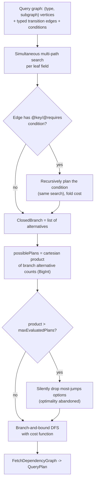
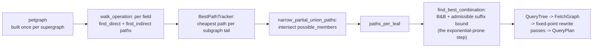
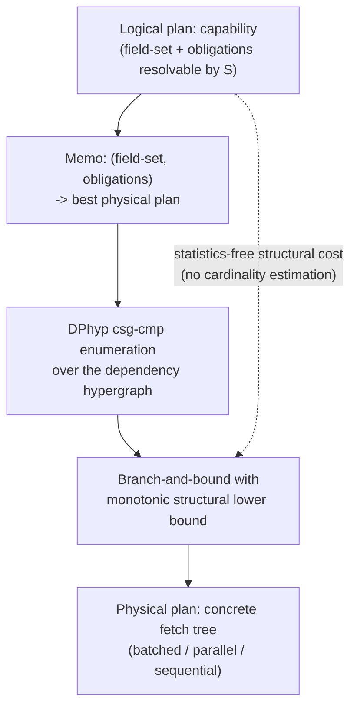
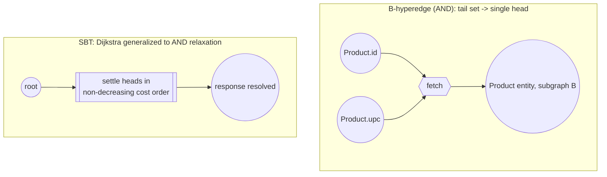
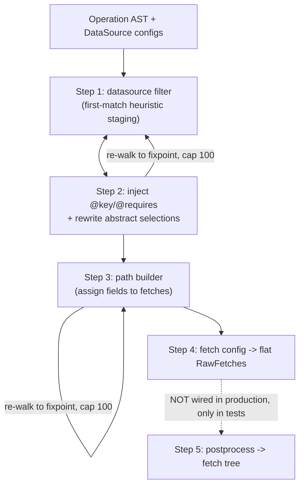
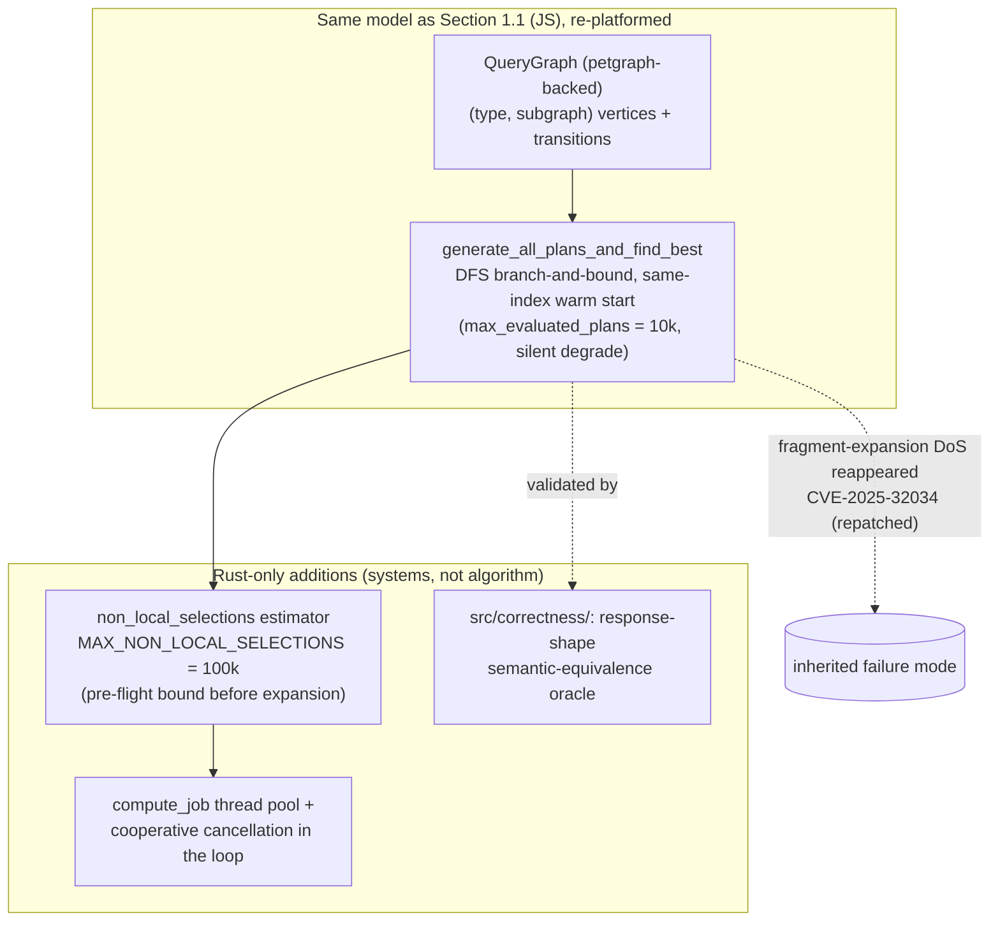

# Research Synthesis

This document distills six reviewed research notes (`research-notes/apollo.md`,
`research-notes/apollo-router-rust.md`, `research-notes/hive-router.md`,
`research-notes/db-optimizers.md`, `research-notes/hypergraph-theory.md`,
`research-notes/current-planner-postmortem.md`)
into numbered, citable design decisions for planner-v2. It is the input contract for
`FORMAL_SPEC.md`: every design decision in the formal spec must trace to a numbered
Lesson (L1, L2, ...) below, and every bolded term is defined in `GLOSSARY.md`.

The centerpiece is a single structural fact -- the *tractability boundary* -- that
organizes everything else:

> Planning *one* GraphQL operation as a minimum-cost **B-hyperpath** over a
> **directed hypergraph**, under a **superior value function**, is a
> **polynomial time** problem solved exactly by the **Shortest B-Tree** procedure.
> Jointly optimizing *fetch sharing across sibling branches or the whole operation*
> (deduplicating identical subgraph calls) is a multi-terminal **hyperpath cover** /
> **Directed Steiner Tree** problem, which is **NP-hard**.

Every prior-art system's worst-case failure lives on the NP-hard side of that line, and
every one of them crosses it silently. planner-v2's thesis is to claim exact
**optimality** only on the polynomial side, and to treat the NP-hard side as an
explicitly bounded, explicitly signalled, approximate concern.

---

## 1. Landscape

### 1.1 Apollo Federation v2 query planner

*Source: `research-notes/apollo.md`.*

Apollo models the supergraph as a directed multigraph of `(GraphQL type, subgraph)`
vertices joined by typed *transition* edges (`FieldCollection`, `DownCast`,
`KeyResolution`, `RootTypeResolution`, `SubgraphEnteringTransition`,
`InterfaceObjectFakeDownCast`), each optionally guarded by a `conditions` selection set.
`@key`/`@requires` are edge *conditions* solved by a *recursive* application of the
same path search -- an elegant, reusable idea. `@provides` is a build-time structural
change (vertex duplication). Planning is simultaneous multi-path search: for each leaf
field the planner explores all paths in lockstep, closes each query branch into a list
of alternatives, and the number of whole plans is the *cartesian product* of the
per-branch alternative counts.

Plan selection uses an explicit hand-tuned **cost function** (`fetchCost = 1000` per
fetch, `pipeliningCost = 100x` per sequential stage, depth-weighted selection cost),
optimized by **branch and bound** with a same-index warm start. The exponential
cartesian product is bounded by three independent guards: `maxEvaluatedPlans`
(default 10,000, *silently* drops options and abandons optimality), `pathsLimit`
(hard abort), and `MAX_RECURSIVE_SELECTIONS = 10,000,000` (fragment-bomb guard).
Abstract types are handled by **type explosion** -- one `DownCast` branch per
implementing type -- which is the model's primary combinatorial-growth vector.

Documented failures cluster on the NP-hard side: an integer-overflow pruning failure
causing infinite loop / OOM (GHSA-fmj9-77q8-g6c4, fixed by moving plan counts to
BigInt), a fragment-reuse DoS (CVE-2025-32031), and the fact that exceeding
`maxEvaluatedPlans` degrades to a valid-but-non-optimal plan with no default signal.

### 1.2 The Guild's Hive Router query planner

*Source: `research-notes/hive-router.md`.*

Hive Router (Rust) uses a structurally near-identical directed multigraph
(`FieldMove`, `EntityMove`, `AbstractMove`, `ReentryMove`, `Selfie`,
`InterfaceObjectTypeMove`, `SubgraphEntrypoint`; edge cost 1 for a field move, 1000 for
an entity/abstract move plus the recursively computed cost of any `@key`/`@requires`
selection). Two innovations stand out. First, union-member visibility is materialized as
first-class *graph nodes* (`UnionMembers` carrying a `possible_members` list) so that
narrowing is a graph operation, not side-channel bookkeeping; `narrow_partial_union_paths`
intersects member sets across live candidate subgraphs to fix a partial-union bug (#1098).
Second, and most relevant here, the design is explicitly *two-tier*: cheap per-field
local best-path search (`BestPathTracker`, keep the cheapest path per subgraph tail)
feeds a separate global cross-leaf branch and bound (`planner/best.rs`) with a
*precomputed admissible suffix lower bound* (`min_remaining_costs`), a greedy seed, and
lazy candidate costing.

The critical first-party admission: the module doc says the previous algorithm "would be
exponentially slow (we were there...)", and PR #430 replaced that naive product-of-alternatives
enumeration -- direct evidence that the cross-branch combination step is where blowup lives.
Their guards (`RequirementCycleChecker`, a fragment-expansion stack after a stack-overflow
in #1230/#1244, and 2-second wall-clock smoke tests) are per-site cycle guards, not a
complexity proof. The 100%-federation-audit claim is self-authored, so it is a useful
*regression corpus*, not independent verification.

### 1.3 Database query optimizers (System R, Cascades, DPhyp)

*Source: `research-notes/db-optimizers.md`.*

Forty years of relational optimization map cleanly onto federation planning, with one
domain gift. System R's **dynamic programming** over join subsets is provably
cost-optimal *for the stated cost model*; its "interesting orders" idea generalizes to
"interesting **resolution obligation**s" (already-resolved key fields carried forward
instead of re-fetched). Volcano/Cascades contributes the split between a **logical plan** (what a plan
computes) and a **physical plan** (how it executes), plus the Cascades memo -- a DAG of
equivalence groups that guarantees each shared subexpression is optimized once -- searched
by branch and bound with a cost upper bound. **DPhyp** (Moerkotte & Neumann 2008), building on DPccp,
generalizes System R's DP to arbitrary hypergraphs by enumerating connected-subgraph /
connected-complement (csg-cmp) pairs; because planner-v2 is *already* a directed
hypergraph, DPhyp is close to the literal enumeration algorithm to reuse, and it is
output-sensitive on the (typically sparse) dependency graph rather than the full powerset.
PostgreSQL (exhaustive DP below `geqo_threshold = 12`, genetic fallback above) and MySQL
(greedy, later a DPhyp hypergraph optimizer) are the industry's cautionary trajectory:
both bail from exhaustiveness at scale, and MySQL's own rewrite converged on exactly the
hypergraph-DP model planner-v2 starts from.

The domain gift comes from Leis et al., *How Good Are Query Optimizers, Really?* (VLDB
2015): **cardinality estimation** error compounds multiplicatively with join depth and is
the *dominant* real-world source of bad plans -- 10x-1000x regressions even with a perfect
cost model and complete search. Federation planning has *no row cardinalities to estimate*:
fetch count, waterfall depth, and fan-out are exact and countable at plan time. Keeping the
cost inputs structural and statistics-free structurally removes the single largest failure
class in the entire DB-optimizer literature.

### 1.4 Directed-hypergraph theory (Gallo et al., SBT)

*Source: `research-notes/hypergraph-theory.md`.*

This note supplies the formal spine. A **B-hyperedge** ("AND" arc) has many tail nodes
and a single head: "all of these prerequisites together produce this one outcome" --
exactly the shape of "given these resolved key/argument nodes, this subgraph fetch
produces this field-set." A single operation's plan is therefore a B-hyperpath from
the root node-set to the "response fully resolved" node, and node reachability in a
B-hypergraph is *literally* forward-chaining over a set of **Horn clause**s (body = tail,
head = the derived atom); "this plan is valid" is "the target atom is in the minimal
model," and "this is the cheapest valid plan" is "this is the minimum-cost derivation."

Gallo, Longo, Nguyen & Pallottino's Shortest B-Tree procedure is Dijkstra's
algorithm generalized from single-predecessor to AND relaxation, and it is
polynomial time -- *provided* the cost-combination rule is a superior value function
(monotone, order-preserving, over non-negative weights; both `sum` and `max` qualify).
**AND/OR graph** search (AO*, Martelli-Montanari) with an **admissible heuristic**
transfers directly, giving cost-informed pruning that keeps the optimality proof.

The note also draws the hard boundary precisely. F-arcs (OR fan-out) make shortest
hyperpath NP-hard even when acyclic, so "one fetch produces several alternatives as one
unit" must stay decomposed into independent B-hyperedges. Non-superior cost functions
break SBT's correctness, not merely its speed. The Martelli-Montanari *additive AND/OR
graph* caveat is a subtle correctness trap: the cost of a subproblem shared by multiple
AND-branches must be counted once on the **folded DAG**, never once-per-occurrence on
an unfolded tree. And covering multiple targets while sharing hyperedges is
Directed-Steiner-hard.

### 1.5 Current graphql-go-tools planner (postmortem)

*Source: `research-notes/current-planner-postmortem.md`.*

The system being replaced represents the plan as the operation AST mutated in place plus
side-tables, driven by four stage-specific visitors, then a disconnected postprocess step
turns a flat fetch list into an executable **fetch tree**. There is *no* cost-based
**search space** anywhere: both major decisions -- which datasource resolves a field, and
which fetch a field lands on -- are first-match, order-of-code-is-priority heuristic
staging with no comparison between candidates and no backtracking. Two structurally
identical "re-walk the whole document until **fixpoint**, give up after 100 iterations"
loops drive the pipeline, neither incremental, neither with a convergence proof (evidenced
by two near-duplicate, non-diagnostic `i > 100` failure guards). Abstract-type coverage is
a *decoupled-systems* hazard: the per-datasource selection rewriter silently drops
fragments for members its own upstream schema can't serve, and correctness depends entirely
on an independently-computed suggestion tree having scheduled some *other* datasource for
the dropped member -- the two systems share no invariant and must simply agree.

Four things are genuinely solid and worth carrying forward: the `FederationMetaData` /
`DataSourceMetadata` input contract (keys/requires/provides, `resolvable:false`, entity
interfaces, interface objects -- nearly the whole Fed v2 directive surface); the
output-layering split (flat `RawFetches` "what to fetch" separated from a postprocess "how
to schedule it" pass); the `datasourcetesting` permutation-testing harness that runs a
plan across every datasource ordering; and concurrent per-datasource collection with a
single-threaded merge.

### 1.6 Apollo Router's native Rust planner (`apollo-federation` crate)

*Source: `research-notes/apollo-router-rust.md`.*

The Rust `apollo-federation` crate is a *line-for-line port* of the JS model in Section 1.1,
not a redesign: same `(type, subgraph)` query graph, same six transition kinds, same
`GraphPath`/`PathTree` search, the same `generate_all_plans_and_find_best` branch and
bound with the identical same-index warm start, and the same `max_evaluated_plans`
(default 10,000) silent degrade cap. Roughly 90 inline `// PORT_NOTE:` comments document
each deliberate deviation -- a data-structure substitution (`petgraph`), an ownership-driven
two-level stack, a struct-shaped condition cache -- but *no algorithmic change*. Apollo's
own framing ("Federation Goes Full Rust") is about eliminating a two-language maintenance
burden and Deno/V8 overhead; the wins are systems-engineering wins (published: 10x median
planning-latency, 2.9x CPU, 2.2x memory), not a smarter search. Complexity and guarantees
are unchanged from Section 1.1: still worst-case exponential, still no polynomial guarantee.

Two things here are lesson-grade. First, the *same* exponential-fragment-expansion
vulnerability class that was fixed in JS (GHSA-p2q6-pwh5-m6jr) independently *reappeared*
in the Rust port and shipped as a network-triggerable DoS (CVE-2025-32034 /
GHSA-75m2-jhh5-j5g2, fixed 1.61.2 / 2.1.1) -- porting an unchanged model inherits its
failure modes (feeds L16). Second, the *methodology*: a staged rollout (opt-in ->
`both_best_effort` shadow-compare as the silent default over ~630M live operations for four
months -> default flip -> legacy removal) backed by a from-scratch `src/correctness/`
module that computes a structural *response shape* for both an operation and a generated
plan and asserts semantic equivalence / sound **refinement** -- a semantic oracle, not a
golden-file plan diff (feeds L17). The port also added a cheaper *pre-flight* estimator
(`MAX_NON_LOCAL_SELECTIONS = 100_000`) that bounds work before expansion, and threaded
cooperative cancellation into the search loop itself -- but it carried the silent
`max_evaluated_plans` degrade behavior over unchanged, and still gates one correctness
workaround behind a scary opt-in flag (`type_conditioned_fetching`).

---

## 2. Comparative table

| System | Model | Search algorithm | Optimality guarantee | Complexity | Principal failure modes |
|---|---|---|---|---|---|
| Apollo Fed v2 (`apollo.md`) | Directed multigraph of `(type, subgraph)` vertices; conditions as recursively-solved edges; abstract types via type explosion | Simultaneous multi-path search -> cartesian product of branch alternatives -> branch and bound with warm start | None guaranteed; abandons optimality once `maxEvaluatedPlans` (10k) exceeded | Exponential in ambiguous multi-subgraph fields; three independent hard caps | Silent non-optimal cutoff; BigInt-overflow infinite-loop/OOM (GHSA-fmj9); fragment-reuse DoS (CVE-2025-32031); interface/union correctness bugs |
| Apollo Router native Rust (`apollo-router-rust.md`) | Line-for-line port of the JS model (Section 1.1); petgraph-backed, ~90 PORT_NOTE deviations, no algorithmic change | Same simultaneous multi-path search + branch and bound; adds a pre-flight non-local-selections estimator and cooperative cancellation | Same as JS -- none guaranteed; silent `max_evaluated_plans` degrade carried over unchanged | Same worst-case exponential; systems wins only (10x planning latency, 2.9x CPU, 2.2x memory) | Fragment-expansion DoS *reappeared* in Rust (CVE-2025-32034); `@override`+interface regression shipped despite 630M-op shadow validation; correctness workaround parked behind a flag |
| Hive Router (`hive-router.md`) | Same shape, Rust; union members as first-class nodes | Two-tier: local per-field best-path + global cross-leaf branch and bound with admissible suffix lower bound | None proven; sound (admissible) pruning bounds practical case only | Prior version admitted exponential; current B&B worst-case still exponential in divergent leaves | Prior naive exponential search (PR #430); partial-union member stripping (#1098); cyclic-fragment stack overflow (#1230); no complexity bound on combination step |
| DB optimizers (`db-optimizers.md`) | Join graph / hypergraph; logical vs physical; memo of equivalence groups | System R DP; Cascades top-down B&B; DPhyp csg-cmp enumeration; genetic/greedy fallbacks at scale | Provably optimal *for the stated cost model* (DP/memo); fallbacks give up the proof | DP is O(n*2^n)/O(3^n); DPhyp output-sensitive on sparse graphs | Cardinality-estimation error dominates real-world regressions (10x-1000x); left-deep-only misses parallel plans; genetic fallback is non-deterministic and unproven |
| Directed-hypergraph theory (`hypergraph-theory.md`) | B-hypergraph; B-hyperedge = Horn clause; plan = B-hyperpath = min-cost derivation | Shortest B-Tree (Dijkstra generalized to AND relaxation); AO* with admissible heuristic | Provably optimal for a single obligation under a superior value function | Polynomial (SBT) per obligation; F-arcs / multi-target sharing are NP-hard | Non-superior cost silently breaks correctness; tree-sum double-counts shared subpaths (must fold DAG); cross-branch sharing is Directed-Steiner-hard |
| Current planner (`current-planner-postmortem.md`) | Operation AST mutated in place + side-tables; per-datasource capability catalogue | No search; first-match heuristic staging + two fixed-point re-walk loops | None; not even plan-stability across input orderings | Polynomial per stage but constants compound across <=100-iteration loops | No cost function; non-diagnostic non-convergence; decoupled abstract-type coverage with no shared invariant; duplicated hand-synced logic |

---

## 3. Lessons for planner-v2

Each lesson is stated as *observation -> consequence for our design*. The consequence is
written to be citable by a specific `FORMAL_SPEC.md` definition or invariant.

**L1 -- A single operation's plan is a minimum-cost B-hyperpath.**
Theory (`hypergraph-theory.md`) shows "resolve field F given prerequisite key/argument
data" is AND-semantics: a B-hyperedge whose tail is the prerequisites and whose single
head is the newly-resolved node. *Consequence:* `FORMAL_SPEC.md` defines a valid plan as a
B-hyperpath from the root node-set to the "response resolved" node, and defines plan
validity as "target node is in the minimal model of the fetch-clause Horn clause
theory." This gives soundness and completeness proofs by well-founded induction on
derivation height rather than by hand.

**L2 -- The tractability boundary is the load-bearing scoping decision.**
Single-obligation B-hyperpath search under a superior value function is polynomial (SBT);
joint cross-branch fetch sharing is a multi-terminal hyperpath cover / **Directed Steiner
Tree** problem, NP-hard and only quasi-polynomially approximable
(`hypergraph-theory.md`). Every prior system's worst case sits on the NP-hard side and
crosses it silently: Apollo's `maxEvaluatedPlans` cartesian-product cutoff and its
plan-count-overflow CVE (GHSA-fmj9-77q8-g6c4, the `possiblePlans` product overflowing and
disabling pruning), and Hive Router's admitted prior exponential combination step, are all
the *cross-branch sharing* problem in disguise (`apollo.md`, `hive-router.md`). (Apollo's
other planning DoS -- fragment-reuse expansion, CVE-2025-32031 -- is a distinct input-blowup
class; see L16 for how it recurred across the Rust port.) *Consequence:*
`FORMAL_SPEC.md` claims exact optimality *only per resolution obligation*, and models
cross-branch fetch merging as a *separate, explicitly bounded and explicitly signalled*
pass with a stated approximation guarantee -- never as an unqualified "the planner finds
the jointly optimal shared plan."

**L3 -- The cost function must be a superior value function by construction.**
SBT's correctness (not just its speed) requires a monotone, order-preserving combination
rule over non-negative weights (`hypergraph-theory.md`); a "real wall-clock latency with
connection pooling" cost silently violates this. *Consequence:* the spec declares up front
whether the planner optimizes `sum`-cost (total resource / round-trips) or `max`-cost
(critical-path latency under parallelism), both of which are provably superior, and states
SBT-applicability as a precondition invariant that the cost function must be shown to
satisfy -- no ad-hoc cost may be introduced that breaks monotonicity.

**L4 -- Cost must be accounted on the folded DAG, counted once.**
The Martelli-Montanari additive-AND/OR-graph caveat: two sibling fields whose plans share
an upstream fetch must count that fetch's cost once, not once per branch; naive
tree-sum over the unfolded structure silently over-counts and picks suboptimal plans
(`hypergraph-theory.md`). *Consequence:* the spec defines B-hyperpath weight over the
folded DAG with **memoization** per node (a Cascades-style
`(field-set, obligations) -> best sub-plan` memo table), and states "each shared sub-hyperpath
contributes its weight once" as an explicit invariant of the weight definition.

**L5 -- Use DPhyp-style csg-cmp enumeration as the concrete search core.**
Since the model is already a directed hypergraph, DPhyp (over DPccp) is close to the
literal enumeration algorithm, output-sensitive on the sparse dependency graph rather than
the full powerset (`db-optimizers.md`). *Consequence:* the spec names connected-subgraph /
connected-complement enumeration over the dependency hypergraph as the enumeration
strategy backing the dynamic programming / memo core, giving completeness for free
instead of a bespoke scheme.

**L6 -- Conditions are recursively-solved sub-searches, designed for arbitrary depth.**
Apollo's cleanest idea is modeling `@key`/`@requires` as edge conditions solved by the
*same* search (`apollo.md`); its worst rework was assuming require-chains are rare
(`apollo.md` changelog). *Consequence:* in the hypergraph, a B-hyperedge is traversable
iff a sub-B-hyperpath search for its condition succeeds; the spec designs for arbitrarily
deep condition-of-condition dependencies from the start and requires an explicit cycle /
re-entrancy guard (DAG-acyclicity of the obligation-satisfaction relation), mirroring
Hive's per-site `RequirementCycleChecker` (`hive-router.md`) rather than one global
recursion cap.

**L7 -- Never degrade silently, and never trust native-width counts.**
Apollo returns a valid-but-non-optimal plan with no default signal past `maxEvaluatedPlans`,
and its `Number.MAX_VALUE` overflow turned a pruning check into an infinite loop
(`apollo.md`). *Consequence:* whenever planner-v2 abandons the exact per-obligation search
for a bounded approximation (the L2 cross-branch pass, or any scale fallback), it MUST
surface a metric/log signal, even if the default is still to degrade gracefully; and any
count of candidate plans/paths uses an overflow-safe representation from day one.

**L8 -- Abstract types get a first-class "resolve-as-one-unit" hyperedge, not default type explosion.**
Apollo expands one `DownCast` branch per implementing type and prunes by cost second,
making wide interfaces/unions its main exponential driver (`apollo.md`); the current
planner's abstract-coverage bug is two decoupled systems silently agreeing on member
coverage (`current-planner-postmortem.md`). *Consequence:* the spec represents "some
subgraph resolves this abstract-type field directly" as a single first-class alternative
B-hyperedge (avoiding the exponential branch factor in the common case), and makes
per-member coverage a *single source of truth* consumed by both selection and rewriting
-- following Hive's "union members as graph data, not side-state" pattern
(`hive-router.md`) -- rather than two views that must agree. Type explosion remains a
last-resort alternative, not the default expansion.

**L9 -- Separate local per-obligation search from global cross-branch combination.**
Both Hive Router and Cascades split cheap bounded-fan-out local search from the expensive
combination step, giving two distinct, independently-testable complexity profiles
(`hive-router.md`, `db-optimizers.md`). *Consequence:* the spec defines two layers -- a
per-obligation SBT/AO* search (polynomial, exact, L2's safe side) and a cross-branch
combination pass (bounded/approximate, L2's NP-hard side) -- with distinct correctness
claims, so each half is boundable and testable on its own.

**L10 -- Prune with an admissible lower bound; keep the optimality proof.**
AO* / admissible-heuristic search and Cascades/Hive branch and bound with a
monotonic structural lower bound cut work without losing the optimality guarantee
(`hypergraph-theory.md`, `db-optimizers.md`, `hive-router.md`). *Consequence:* the spec
permits **dominance pruning** and a precomputed admissible suffix lower bound (e.g. "cost >=
number of distinct subgraphs still to touch") in the search, and `PROOFS.md` must show the
heuristic is admissible so the pruning is proven sound, not merely empirical.

**L11 -- Keep cost inputs structural and statistics-free.**
Leis et al. show cardinality-estimation error is the dominant DB-optimizer failure, and
federation has no cardinalities to estimate (`db-optimizers.md`). *Consequence:* the cost
function is defined only over quantities exact at plan time (fetch count, waterfall depth,
distinct subgraphs, redundant re-fetches, batching opportunities); the spec explicitly
forbids any predicted/estimated quantity (e.g. moving-average subgraph latency), because
introducing one re-imports the entire cardinality-estimation failure class the domain
otherwise avoids for free.

**L12 -- Adopt the logical/physical split and interesting-obligations state.**
Cascades' logical-plan vs physical-plan separation makes new fetch strategies
(batched, entity-interface, subscription) additive implementation rules that don't touch
the search core or invalidate the optimality argument; System R's "interesting orders"
becomes "interesting obligations" -- already-resolved key/representation fields carried
forward (`db-optimizers.md`). *Consequence:* the memo state is keyed on
`(resolved field-set, satisfied resolution obligations)`, and physical fetch-tree shaping
(parallel/serial/batch) is a **lowering** step separated from the logical capability search,
preserving the existing `RawFetches -> postprocess` layering (L14).

**L13 -- Replace fixed-point re-walks with a worklist; prove termination; diagnose failure.**
The current planner's two "re-walk the whole document, cap at 100" loops are its single
biggest structural liability -- non-incremental, no convergence proof, non-diagnostic
failure (`current-planner-postmortem.md`); Cascades warns the rewrite relation must be
terminating/confluent (`db-optimizers.md`). *Consequence:* the spec uses a worklist /
dependency-resolution algorithm that revisits only the subtree affected by a newly
discovered obligation, proves termination from DAG-acyclicity of the obligation relation
(not an iteration cap), and requires failure paths to name the specific capability/coverage
gap that caused non-convergence -- a prerequisite for composition-time diagnostics.

**L14 -- Keep the four things the current planner already gets right.**
The postmortem identifies four proven components worth carrying forward unchanged in
intent (`current-planner-postmortem.md`). *Consequence:* planner-v2 reuses, and the spec
references as given, (a) the `FederationMetaData` / `DataSourceMetadata`
input contract (it already covers nearly the whole Fed v2 directive surface -- reuse as the
capability catalogue feeding the hypergraph build); (b) the output layering -- flat
`RawFetches` "what to fetch" separated from a `postprocess` "how to schedule it" pass (keep
planning decisions decoupled from scheduling); (c) the `datasourcetesting` permutation
harness (extend it to field/fragment orderings, since order-dependence is this codebase's
recurring failure signature); (d) concurrent per-datasource collection with single-threaded
merge -- but enforce the "don't mutate shared state mid-walk" invariant *structurally* (each
worker returns its own result) rather than by comment. Additionally, adopt the public
`federation-gateway-audit` corpus as a regression suite -- the test *cases*, not the
self-authored *score* (`hive-router.md`).

**L15 -- Any scale fallback must carry a provable approximation bound.**
PostgreSQL/MySQL abandon the optimality proof entirely at their thresholds, and GEQO is
additionally non-deterministic run-to-run -- user-hostile for a cached plan
(`db-optimizers.md`). *Consequence:* if planner-v2 needs an exhaustiveness cutover for
pathological supergraph sizes, the fallback must degrade from "provably optimal" to
"provably within factor K of optimal" (a stated bound), never to "no guarantee," and must
remain deterministic across cache misses. This is the same requirement as L7's no-silent-
degradation applied to scale rather than to cross-branch sharing.

**L16 -- Re-implementing an unchanged model inherits its failure modes; the model must change, not just the code.**
Apollo's Rust rewrite is a faithful port of the JS planner (Section 1.6), and the exponential-
fragment-expansion vulnerability that had already been patched in JS *independently
reappeared* in the Rust port and shipped as CVE-2025-32034 -- the same failure class,
because the same model was re-implemented (`apollo-router-rust.md`). *Consequence:*
planner-v2's value is in *changing the model* (per-obligation exact B-hyperpath search
with an explicit tractability boundary, L1/L2), not in re-coding the existing multi-path /
cartesian-product search in a faster language; a rewrite that preserves the model would
inherit the very blowup vectors L2 identifies. This lesson also mandates a full re-audit
against every previously-published planner CVE/advisory as an explicit acceptance
criterion, since a new implementation does not by itself close an old vulnerability class.

**L17 -- Adopt a semantic-equivalence oracle and a shadow-compare rollout for the old-vs-new transition.**
Apollo validated its planner swap with a staged rollout (opt-in -> silent shadow-compare
default over ~630M live operations for four months -> default flip -> legacy removal) *and*
a from-scratch `src/correctness/` module that compares the structural refinement
relationship between an operation's response shape and a generated plan's -- a semantic
oracle, strictly stronger than diffing plan text, and it still caught a tail regression
(`@override`+interfaces) that large-scale shadow traffic missed (`apollo-router-rust.md`).
*Consequence:* planner-v2's differential harness (extending the L14 permutation harness)
should assert *semantic response-shape equivalence / sound refinement* between the current
planner and planner-v2, not snapshot plan-diffs; and the rollout plan should be
shadow-compare-in-production before any default flip. **Differential testing** over
observed traffic is necessary but not sufficient -- pair it with the oracle to cover the
directive/type-system matrix the tail of real traffic never exercises.

**L18 -- Stay inside the B-hypergraph class: never encode OR-fan-out as a multi-head hyperedge.**
Shortest-hyperpath search is NP-hard in F-hypergraphs even when acyclic (Gil-Pons, Ward &
Miller 2023), despite the **F-hyperedge** being the formal transpose of the B-hyperedge --
the polynomial guarantee on L2's safe side belongs to the B-hyperedge-with-superior-weights
sub-family *alone*, and adjacent-sounding hypergraph problems (min hypercut, hyperflow, SCC
variants) are independently NP-hard (`hypergraph-theory.md`). *Consequence:*
`FORMAL_SPEC.md`'s edge taxonomy carries a model-definition invariant: every hyperedge has
exactly one head node. A fetch that produces several usable results ("one call yields
several downstream-choosable outcomes") is decomposed into one independent B-hyperedge per
produced node -- never encoded as a single multi-head construct with joint cost. And
tractability is re-derived per problem against the specific theorem, never assumed by
analogy from "it's a hypergraph problem."

**L19 -- Bound work *before* expansion with a cheap pre-flight estimate, layered over in-search guards.**
Apollo's JS-era guards fire during or after the expensive expansion; the Rust port added
`MAX_NON_LOCAL_SELECTIONS = 100,000` -- a pre-flight estimator that walks the *query*,
estimates the worst-case selection count reachable via indirect/multi-subgraph options,
and aborts before any path-advance work starts (`apollo-router-rust.md`) -- as a fourth,
cheaper layer on top of the existing independent guards (`apollo.md`). *Consequence:*
planner-v2's hard cap on search-state size is two-layer by design: a cheap, structural
pre-search estimate that rejects pathological operations before the search allocates
anything, plus an in-search counter as the backstop -- and, per L7, tripping either layer
surfaces an explicit error/metric, never a silent degrade.

---

## 4. Open questions carried into the formal spec

1. **Which superior value function?** `sum`-cost (minimize total round-trips / resource
   use) and `max`-cost (minimize critical-path latency under parallel fetches) are both
   superior (L3) but yield different optimal plans. Does `FORMAL_SPEC.md` fix one, or
   parameterize SBT over the value function and prove applicability once for a declared
   family? (`hypergraph-theory.md` Section weighting.)

2. **What exactly is the cross-branch sharing pass?** L2 leaves two admissible options
   open: (a) restrict "sharing" to a cheap, provably-correct *syntactic* post-pass that
   merges textually-identical fetches over the already-computed hypertree (polynomial, no
   search); or (b) run a real approximate multi-terminal search with a stated
   quasi-polynomial Directed-Steiner bound. Which does M0 commit to, and what signal
   (L7) accompanies it?

3. **Is a scale cutover needed at all for M0?** DPhyp is output-sensitive and may be
   tractable on realistic sparse supergraphs without any GEQO-style fallback (L5, L15).
   Does the spec define a threshold and a bounded fallback now, or defer it with a
   measured trigger?

4. **How is `@requires` argument-conflict co-resolution modeled?** The current planner
   treats it as a late `continue` with no fallback (`current-planner-postmortem.md`).
   Should "can these two requirements be co-resolved in one `_entities` fetch" be a
   modeled edge property / weight in the search from the start (L6), and how does that
   interact with the folded-DAG cost accounting (L4)?

5. **Single-source-of-truth representation for abstract-type member coverage.** L8 mandates
   one authority consumed by both selection and rewriting; the exact data structure (Hive's
   `possible_members`-on-node vs a separate coverage lattice) is unresolved.

6. **Where do `@defer`, subscriptions, and mutation sequencing sit in the hyperpath model?**
   These are physical/lowering concerns (L12) in principle, but the spec must state whether
   they constrain the logical B-hyperpath search or are purely post-search lowering.

7. **Is incremental re-planning in scope?** Dynamic-maintenance results for shortest
   B-hyperpaths exist (`hypergraph-theory.md`), enabling re-planning after a single
   subgraph's schema/weight change without full recomputation. Is this M0, or explicitly
   deferred?
