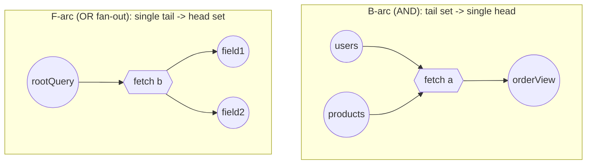

# Directed Hypergraph Algorithms and Complexity

## Summary (<=10 bullets)

- Gallo, Longo, Nguyen & Pallottino (GLNP), *Directed Hypergraphs and Applications*, Discrete Applied Mathematics 42 (1993) 177-201, is the foundational reference: it defines B-arcs (many tails -> one head, "AND" semantics), F-arcs (one tail -> many heads), hyperpaths, and hyperconnection, and gives the **SBT** (Shortest B-Tree) procedure.
- **Shortest B-hyperpath from a single source to a single target (or to all nodes) is polynomial** -- SBT is a Dijkstra-style generalized-label-setting algorithm, correct and efficient whenever the hyperarc cost/combination rule is an "additive" / "superior" (monotone, order-preserving) value function over non-negative weights.
- **Shortest hyperpaths in F-hypergraphs are NP-hard even when acyclic** (Gil-Pons, Ward & Miller 2023, arXiv:2201.04799) -- a structural asymmetry with B-hypergraphs that at first looks surprising given B/F are formally dual.
- B-hyperpath search is **formally the same problem** as AND/OR graph search (Nilsson's AO\*, Martelli & Montanari's "additive AND/OR graphs," IJCAI 1973), as SLD-resolution / forward-chaining over Horn clauses, and as computing the **minimal model of a propositional Horn theory** -- a B-hyperarc is exactly a Horn clause (body = tail, head = the single derived atom).
- Admissible-heuristic search (A\*/AO\*) transfers to hyperpaths: with an admissible (never-overestimating) heuristic on nodes, best-first B-hyperpath search returns an optimal solution graph, giving a principled way to prune the SBT search instead of expanding it exhaustively.
- **Dynamic maintenance** of shortest B-hyperpaths under weight increases / arc deletions is polynomial and incremental (Ausiello, Italiano & Nanni, TCS 72 (1990) 97-117; Ausiello, Franciosa & Frigioni, J. Discrete Algorithms 3(1) (2005) 27-46) -- this is the same machinery as incrementally maintaining a Horn-SAT minimal model as clauses are removed/weakened.
- **Non-additive costs are where things break**: Martelli & Montanari's own definition of an *additive* AND/OR graph requires that the cost of a subproblem shared by multiple AND-branches be **counted once, not once per occurrence** -- folding a DAG of shared sub-hyperpaths into a tree cost model is not free, and getting it wrong silently produces wrong (double-counted) costs, not just slow ones.
- **Covering multiple targets with a single minimum-cost hyperstructure (a "hypernetwork"/multi-terminal hyperpath) is Steiner-flavored and NP-hard**, inheriting Directed Steiner Tree's hardness of approximation (no $O(\log^{2-\varepsilon} n)$-approx unless $NP \subseteq ZTIME(n^{\mathrm{polylog}\,n})$; best known is a quasi-polynomial $O(\log^2 k / \log\log k)$-approximation, tight per Ghuge & Nagarajan 2022 and Grandoni-Laekhanukit-Li 2019).
- General directed-hypergraph problems that look adjacent to shortest-hyperpath -- minimum hypercut, certain hyperflow/hyperconnectivity and strongly-connected-component variants -- are also NP-hard or #P-hard in general, so "it's a hypergraph problem" is not itself evidence of tractability; only the *B-hyperpath-with-superior-weight* sub-family is safely polynomial.
- **Verdict for federation query planning**: a *single* GraphQL operation's plan (one root selection set, resolved by AND-composing subgraph fetches that each require certain prerequisite key/variable data) is naturally a **shortest B-hyperpath problem** and lands in the tractable SBT class *if* the cost function is additive/superior and fetches are modeled as a hypertree. Jointly optimizing fetch **sharing/batching across sibling fields or across a whole operation** (deduplicating identical subgraph calls) turns it into a **multi-terminal hypernetwork / Steiner problem**, which is NP-hard in general -- planner-v2 should treat this as "exact-optimal per hypertree, heuristic/approximate for cross-branch sharing," and say so explicitly in any correctness proof rather than silently assuming polynomial joint optimality.

## The model (how this theory represents the planning problem)

### Nodes, hyperarcs, hyperpaths

A **directed hypergraph** is $H = (N, A)$ where $N$ is a finite node set and each hyperarc $a \in A$ has a tail set $T(a) \subseteq N$ and a head set $H(a) \subseteq N$ (GLNP Section 2). Two restricted, computationally important sub-classes:

- **B-arc** ("Backward"/AND-arc): $|H(a)| = 1$, $|T(a)| \geq 1$. Reads as "all of $T(a)$ together produce the single node $h(a)$." A hypergraph whose arcs are all B-arcs is a **B-hypergraph**.
- **F-arc** ("Forward"/OR-fan-out arc): $|T(a)| = 1$, $|H(a)| \geq 1$. Reads as "the single node $t(a)$ produces every node in $H(a)$." A hypergraph whose arcs are all F-arcs is an **F-hypergraph**.

A **B-hyperpath** from source set $S$ to target $t$ is (recursively) a minimal sub-hypergraph of B-arcs such that every node in it is either in $S$ or is the head of some B-arc whose entire tail is already covered, and $t$ is reachable this way -- i.e. it is an **AND-tree** (in general a DAG when sub-solutions are shared) rooted upward from $S$ to $t$. This is precisely a **derivation tree / proof tree**: node reachability in a B-hypergraph is exactly forward-chaining reachability in a set of Horn clauses `tail1  AND  tail2  AND  ... -> head`, and "$t$ is hyperconnected to $S$" <=> "$t$ is in the minimal model of the Horn theory whose facts are $S$" <=> "$t$ is SLD-derivable from the clause set with facts $S$." (GLNP Section 3; see also Ausiello & Laura's survey below, and the Horn-formula literature, e.g. "Directed hypergraphs and Horn minimization," *Information Processing Letters*, 2017.)

For federation planning the B-arc reading is the natural one: a subgraph fetch is "given these prerequisite key/variable nodes (already-resolved data from other subgraphs), produce this newly-resolved node (a field or set of fields)." A query plan for one operation is then a B-hyperpath (an AND-tree/DAG of fetches) from the empty/root node-set to the node representing "the full response is resolved."

### Weighting / value functions

GLNP generalize hyperpath *cost* beyond simple edge-weight summation via a **value function** $w$ associated with each hyperarc that combines the costs of the tail nodes into the cost of the head node, e.g.:

- **Sum**: $\pi(h(a)) = w(a) + \sum_{n \in T(a)} \pi(n)$ -- total resource cost (e.g. total bytes fetched, total number of round-trips if serialized).
- **Max/rank**: $\pi(h(a)) = w(a) + \max_{n \in T(a)} \pi(n)$ -- critical-path/latency cost under full parallelism (a fetch's readiness time is gated by its *slowest* prerequisite, not their sum).

GLNP's key technical requirement for SBT to be correct and polynomial is that $w$ be an **additive (superior) function**: monotone non-decreasing in each argument, with $w(a) \geq w(a')$ whenever tail costs only increase -- this is exactly the generalized-triangle-inequality precondition Dijkstra's algorithm needs, lifted to hyperarcs. Sum and max both satisfy this; arbitrary non-monotone combinators do not, and SBT is not guaranteed correct (or polynomial) for them.

## The algorithm (search/optimization procedure, complexity, guarantees)

### SBT (Shortest B-Tree)

SBT (GLNP Section 4) is Dijkstra generalized from single-predecessor relaxation to hyperarc (multi-predecessor / AND) relaxation:

1. Maintain a tentative distance $\pi(n)$ for every node, initialized to $0$ for $n \in S$ and $\infty$ otherwise.
2. Maintain a priority structure over hyperarcs "ready to fire" -- a B-arc $a$ becomes *scanned* once **every** node in $T(a)$ has a finalized (settled) distance.
3. Repeatedly extract the ready hyperarc/node with minimum $w(a) \oplus \{\pi(n) : n \in T(a)\}$ (via the value function, e.g. $+$ or $\max$), settle its head node's distance, and mark new hyperarcs ready as their last outstanding tail node settles.

**Complexity.** With $\mathrm{size}(H) = \sum_{a \in A} |T(a)|$, reachability (unweighted "which nodes are hyperconnected to $S$") is solvable in $O(\mathrm{size}(H))$ -- linear, because each hyperarc's tail-count-down is decremented once per tail node total. Weighted SBT with a priority queue is Dijkstra-shaped: $O(\mathrm{size}(H) + |N|\log|N|)$ with a Fibonacci heap, $O(\mathrm{size}(H)\log|N|)$ with a binary heap -- polynomial, for any additive/superior value function and non-negative weights (GLNP Thm. 4.1 region; restated cleanly in Ausiello & Laura, *Directed hypergraphs: Introduction and fundamental algorithms -- a survey*, TCS 658 (2017) 293-306).

**What SBT does *not* solve in polynomial time:**
- **Shortest hyperpath in a general (mixed B/F) or pure F-hypergraph.** Gil-Pons, Ward & Miller (arXiv:2201.04799, 2023) prove that finding a shortest $(s,d)$-hypernetwork in an **acyclic** F-hypergraph is NP-hard, even though the same problem restricted to acyclic B-hypergraphs is linear-time -- an asymmetry between the two dual-looking arc types (their paper explicitly calls out this asymmetry as counter-intuitive, since B- and F-hypergraphs are formal transposes of one another).
- **General (non-superior) value functions.** If the cost-combination rule is not monotone/additive, SBT's greedy settle-in-non-decreasing-order argument fails, and no polynomial general algorithm is known; optimization typically becomes a search over exponentially many candidate sub-hypergraphs.
- **K-shortest / all-hyperpaths enumeration.** Enumerating all $s$-$t$ hyperpaths in a B-hypergraph is possible with **polynomial delay** by backtracking (i.e., each successive hyperpath is produced in poly time, but the total count can be exponential in $|N|$), and Nielsen, Andersen & Pretolani give a re-optimization-based algorithm for the K-shortest-hyperpaths problem (*Finding the K shortest hyperpaths*, Computers & OR, and *...using reoptimization*, 2005) that is efficient per-hyperpath but whose total work still scales with K.

### AND/OR graph search and admissible heuristics

A B-hypergraph *is* an AND/OR graph: OR-nodes correspond to alternative hyperarcs producing the same head, AND-nodes correspond to a hyperarc's tail set that must all be resolved. Nilsson's **AO\*** (Nilsson 1980) and Martelli & Montanari's earlier **admissibility theory for AND/OR graphs** (IJCAI 1973; TCS 24 (1983) 207-219) show:

- AO\* alternates a top-down "grow the most promising partial solution graph" step with a bottom-up "revise costs along the graph" step, and -- given an **admissible heuristic** $h$ (never overestimates true remaining cost) -- returns a **provably optimal** solution graph, exactly as A\* does for ordinary graphs. This gives planner-v2 a direct route to a *cost-informed* SBT variant (a "hyperpath A\*") rather than exhaustive Dijkstra-style expansion: use a lower bound on remaining fetch cost per unresolved node to prune the priority queue.
- Martelli & Montanari define an **additive AND/OR graph** as an acyclic AND/OR graph "which can be considered as a folded AND/OR tree" where **the cost of a subproblem shared by multiple branches is added to the total cost as many times as it occurs syntactically in the unfolded tree, but is only ever computed once.** This is the formal statement of exactly the shared-sub-hyperpath cost-accounting subtlety flagged in "Where it breaks" below.

### Dynamic maintenance

Ausiello, Italiano & Nanni (TCS 72 (1990) 97-117) give algorithms for maintaining shortest B-hyperpaths as hyperarc weights increase or hyperarcs are deleted, in time comparable to a single SBT run amortized over a sequence of updates -- semi-dynamic (one-directional: increase-only or decrease-only) maintenance is polynomial; fully dynamic (arbitrary interleavings of increase/decrease) is harder and is treated by Ausiello, Franciosa & Frigioni (*Partially dynamic maintenance of minimum weight hyperpaths*, J. Discrete Algorithms 3(1) (2005) 27-46) and by Frigioni et al. on "decremental maintenance of reachability in hypergraphs and minimum models of Horn formulae" -- again the Horn-SAT correspondence: incrementally maintaining a shortest B-hyperpath tree is the same problem as incrementally maintaining the minimal model of a weighted Horn theory as clauses are added/weakened/removed. This is directly relevant to re-planning after a subgraph schema change without recomputing the whole plan from scratch.

## What it gets right

- The B-arc/AND-tree model is an exact structural match for query planning: "resolve field F" legitimately requires *all* of several prerequisite fetches (parent key, argument values, sibling data via `@requires`), not just one -- this is AND-semantics, not a simple shortest-path edge, and GLNP give it a first-class, well-studied representation instead of forcing an artificial graph encoding (e.g., product-of-choices blow-up).
- SBT is a genuine, tight generalization of Dijkstra: same complexity class, same greedy-settle correctness argument, well-understood preconditions (non-negative weights, additive/superior value function). Reusing it means planner-v2 inherits 30+ years of correctness proofs instead of inventing new ones.
- The Horn-clause / SLD-resolution / minimal-model equivalence is a genuine gift for proof engineering: "this plan is valid" (all dependencies satisfied) is literally "this atom is in the minimal model," a decidable, well-understood, and mechanically checkable property, and "this is the *cheapest* valid plan" is literally "this is the min-cost proof/derivation" -- both have decades of automated-reasoning tooling and metatheory to borrow proof techniques from.
- AO\*/admissible-heuristic theory transfers cleanly, giving a principled way to add A\*-style pruning to the planner (heuristic lower bounds on remaining fetch cost) while retaining an optimality *proof*, not just an empirical claim.
- Dynamic-maintenance results mean incremental re-planning (schema evolves, one subgraph's weight/latency profile changes) is not necessarily "re-run the whole planner" -- there is a known polynomial incremental-update story to build on, at least for monotone weight changes.

## Where it breaks (documented failure modes, exponential cases, bugs)

- **F-arcs / OR-fanout make it NP-hard, even acyclic.** If planner-v2 ever needs "one fetch call can, as a single unit, produce several alternative downstream resolutions and I must choose which" as a *first-class hyperarc* rather than modeling it as several separate B-arcs, it has left the tractable class: shortest-hyperpath in acyclic F-hypergraphs is NP-hard (Gil-Pons, Ward & Miller 2023). Any planner-v2 formalism must keep the "produces multiple things" case decomposed into independent B-arcs/nodes, not encoded as a single multi-head hyperarc with joint cost.
- **Non-additive/non-superior cost functions silently invalidate SBT's correctness, not just its speed.** If planner-v2's real cost model is something like "true wall-clock latency accounting for connection pooling and cross-fetch batching" -- which is not simply sum or max of independent hyperarc costs -- the SBT greedy-settle argument no longer applies, and there is no known polynomial exact algorithm; this must be flagged explicitly wherever a proof assumes "the cost function is additive."
- **Shared-subhyperpath cost accounting (the Martelli-Montanari "additive AND/OR graph" caveat).** The naive move of summing costs down a hyperpath **tree** double-counts (or worse, silently over/under-counts) any node reachable via more than one AND-branch -- e.g. two sibling fields whose fetch plans both depend on the same upstream fetch. Correct accounting requires computing on the **folded DAG** (count each shared sub-hyperpath's cost once), which is exactly the same subtlety that makes deduplicated/batched fetch planning hard (see below) -- treating the search space as a tree when it is actually a DAG with reconvergent nodes is a classic source of both correctness bugs (over-counted cost, suboptimal plan choice) and performance bugs (re-expanding an already-solved subproblem).
- **Multi-target hypernetwork/cover problems are NP-hard and only polylog-approximable.** Minimizing total cost to jointly satisfy several target nodes at once while *sharing* hyperarcs where beneficial (i.e. batch/deduplicate identical subgraph calls across multiple leaf fields or across sibling branches of the operation) is structurally a **Directed Steiner Tree / Group Steiner Tree** problem lifted onto hyperarcs: NP-hard, with no $O(\log^{2-\varepsilon} n)$-approximation possible unless $NP \subseteq ZTIME(n^{\mathrm{polylog}\, n})$ (Halperin-Krauthgamer-style hardness for Group Steiner Tree, which lower-bounds DST), and the best known algorithm achieves a **quasi-polynomial** $O(\log^2 k/\log\log k)$-approximation, shown tight by Ghuge & Nagarajan (2022) building on Grandoni, Laekhanukit & Li (2019) and Rothvoss's earlier $O(\log^3 h)$ quasi-poly bound. There is no known polynomial-time algorithm here, exact or approximate to a good factor.
- **Cycles + non-monotone weights.** SBT's clean Dijkstra-style proof relies on non-negative weights so nodes can be permanently settled once extracted; if weights can be negative or the combination rule isn't monotone, correctness requires relabeling (Bellman-Ford-style) and the tractability guarantees weaken or vanish. Related hypergraph problems adjacent to shortest-hyperpath -- minimum hypercut, several hyperflow/hyperconnectivity formulations, and some strongly-connected-component variants -- are independently known to be NP-hard or worse in general directed hypergraphs, so tractability must be re-derived per problem, never assumed by analogy.
- **Enumeration blow-up.** Even where per-hyperpath work is polynomial (B-hypergraph enumeration has polynomial delay), the *number* of hyperpaths (or of K-shortest hyperpaths) can be exponential in $|N|$; any planner-v2 design that needs "all valid plans" rather than "the best plan" must bound K explicitly or it inherits this blow-up.

## What planner-v2 should steal / avoid

**Steal:**
- Model a single operation's plan search as a **shortest B-hyperpath problem**: nodes = "resolved data states" (a field/entity/key having been fetched), B-arcs = subgraph fetches with their prerequisite tail sets (parent keys, `@requires` inputs, arguments) and a single head (the newly resolved node/field-set). This reuses SBT directly and its complexity/correctness guarantees come for free.
- Use the **Horn-clause / minimal-model equivalence** as the basis for correctness proofs: state "plan validity" as "target node is in the minimal model of the fetch-clause theory," and "plan optimality" as "this is a minimum-cost derivation" -- both have existing proof machinery (soundness/completeness of forward chaining, well-founded induction on derivation height) that can be cited/reused rather than reinvented.
- Adopt an **additive/superior cost function by construction** (declare up front whether the planner optimizes sum-cost, e.g. total request count/bytes, or max/rank-cost, e.g. critical-path latency under parallel execution) and prove SBT-applicability from that declaration, rather than letting an ad hoc cost model creep in that quietly violates monotonicity.
- Borrow **AO\*/admissible-heuristic pruning** to keep planning fast without losing the optimality proof -- a lower bound like "cost >= number of distinct subgraphs still needed to touch" is cheap and admissible.
- Borrow the **dynamic-maintenance** results (Ausiello-Italiano-Nanni; Ausiello-Franciosa-Frigioni) as the template for incremental re-planning when only one subgraph's cost/availability changes, instead of always recomputing from scratch.

**Avoid:**
- Do **not** silently promote joint cross-branch fetch deduplication/batching to "the planner always finds the jointly optimal shared plan" -- that is the NP-hard, only-quasi-poly-approximable multi-terminal hypernetwork problem. Either (a) restrict "sharing" to a cheap, provably-correct post-pass over an already-computed hypertree (e.g. merge textually-identical fetches -- a polynomial, purely syntactic operation, not a search over sharing structures), or (b) explicitly document the joint-optimization step as heuristic/approximate and state which approximation guarantee (if any) it carries.
- Do **not** encode "a fetch produces several usable results as one hyperarc with joint downstream choice" as an F-arc-flavored construct if avoidable -- decompose into independent B-arcs per resulting node instead, to stay inside the tractable B-hypergraph class rather than accidentally reconstructing NP-hard F-hypergraph shortest-path.
- Do **not** compute plan cost by naively summing over an unfolded tree traversal when the underlying structure is a DAG with shared sub-hyperpaths -- this is the Martelli-Montanari additive-AND/OR-graph pitfall; fold and memoize per node, not per path.
- Do **not** assume that because a related quantity ("how many plans exist," "what's the min cut between two subgraphs," "is this reachable under weight change") sounds like "just another hypergraph query," it inherits SBT's polynomial bound -- check the specific problem against the specific theorem (SCC, hypercut, and general-value-function variants are separately, and often independently, NP-hard).

## Sources (URLs, papers, file paths with line refs)

- G. Gallo, G. Longo, S. Nguyen, S. Pallottino, "Directed Hypergraphs and Applications," *Discrete Applied Mathematics* 42 (1993) 177-201. Overview: https://www.semanticscholar.org/paper/Directed-Hypergraphs-and-Applications-Gallo-Longo/158b6f53220b212027c3ffcea56d062d61f9ffd5
- G. Ausiello, L. Laura, "Directed hypergraphs: Introduction and fundamental algorithms -- a survey," *Theoretical Computer Science* 658 (2017) 293-306. https://www.sciencedirect.com/science/article/pii/S0304397516002097
- G. Ausiello, G.F. Italiano, U. Nanni, "Dynamic maintenance of directed hypergraphs," *Theoretical Computer Science* 72 (1990) 97-117 (dynamic SBT / minimal-model maintenance).
- G. Ausiello, P.G. Franciosa, D. Frigioni, "Partially dynamic maintenance of minimum weight hyperpaths," *Journal of Discrete Algorithms* 3(1) (2005) 27-46.
- "Decremental maintenance of reachability in hypergraphs and minimum models of Horn formulae" -- https://link.springer.com/chapter/10.1007/3-540-63890-3_14
- R. Gil-Pons, M. Ward, L. Miller, "Finding $(s,d)$-Hypernetworks in F-Hypergraphs is NP-Hard," arXiv:2201.04799 (2022); *Information Processing Letters*, 2023, https://www.sciencedirect.com/science/article/abs/pii/S0020019023000765 -- abstract: NP-hard for acyclic F-hypergraphs vs. linear-time for acyclic B-hypergraphs.
- L.R. Nielsen, D. Pretolani, "A remark on the definition of a B-hyperpath" (correction to GLNP's B-path definition), 2001; L.R. Nielsen, K.A. Andersen, D. Pretolani, "Finding the K shortest hyperpaths," *Computers & Operations Research*, and "Finding the K shortest hyperpaths using reoptimization," https://www.sciencedirect.com/science/article/abs/pii/S0167637705000519 ; PDF: https://www.research.relund.dk/publications/pdf/relund05.pdf
- S. Krieger, J. Kececioglu, "Shortest Hyperpaths in Directed Hypergraphs for Reaction Pathway Inference," *Journal of Computational Biology* (2023), https://journals.sagepub.com/doi/full/10.1089/cmb.2023.0242 ; and "Heuristic shortest hyperpaths in cell signaling hypergraphs," *Algorithms for Molecular Biology*, https://pmc.ncbi.nlm.nih.gov/articles/PMC9134692/
- N.J. Nilsson, *Principles of Artificial Intelligence* (1980) -- AO\* algorithm.
- A. Martelli, U. Montanari, "Additive AND/OR Graphs," *Proc. IJCAI* (1973) 1-11, https://www.ijcai.org/Proceedings/73/Papers/001.pdf ; and admissibility follow-up in *Theoretical Computer Science* 24 (1983) 207-219, https://www.sciencedirect.com/science/article/pii/0304397583900506
- "Admissibility of AO\* when heuristics overestimate," *Artificial Intelligence* (1987), https://www.sciencedirect.com/science/article/abs/pii/0004370287900051
- E. Boros et al., "Directed hypergraphs and Horn minimization," *Information Processing Letters* (2017), https://www.sciencedirect.com/science/article/abs/pii/S0020019017301424 (Horn formula <=> directed hypergraph; satisfiability <=> absence of a T->F hyperpath).
- Directed Steiner Tree hardness/approximation: M. Charikar et al., "Approximation algorithms for directed Steiner problems," 1999 ($O(\log^2 k)$-ish bounds lineage); T. Grandoni, B. Laekhanukit, S. Li, "$O(\log^2 k/\log\log k)$-approximation algorithm for directed Steiner tree: a tight quasi-polynomial-time algorithm," 2019, https://arxiv.org/pdf/1811.03020 ; R. Ghuge, V. Nagarajan, matching tight quasi-poly bound (2022), https://epubs.siam.org/doi/10.1137/20M1312988 ; Group Steiner Tree hardness (Halperin-Krauthgamer) transferred to DST.
- "On the complexity of strongly connected components in directed hypergraphs," https://arxiv.org/pdf/1112.1444 (adjacent NP-hardness results for hypergraph reachability structure problems).
- "Dynamic Shortest Path Algorithms for Hypergraphs," https://arxiv.org/pdf/1202.0082
